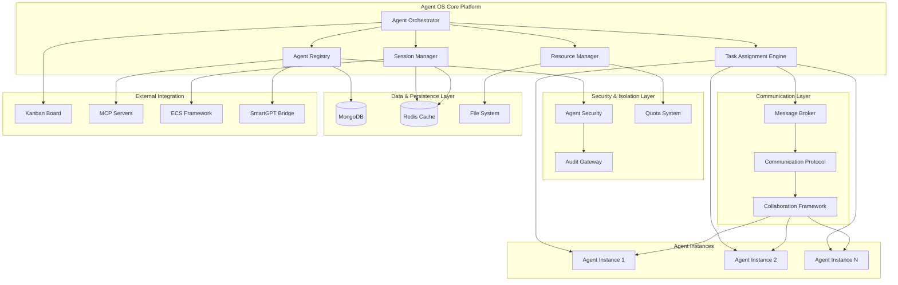
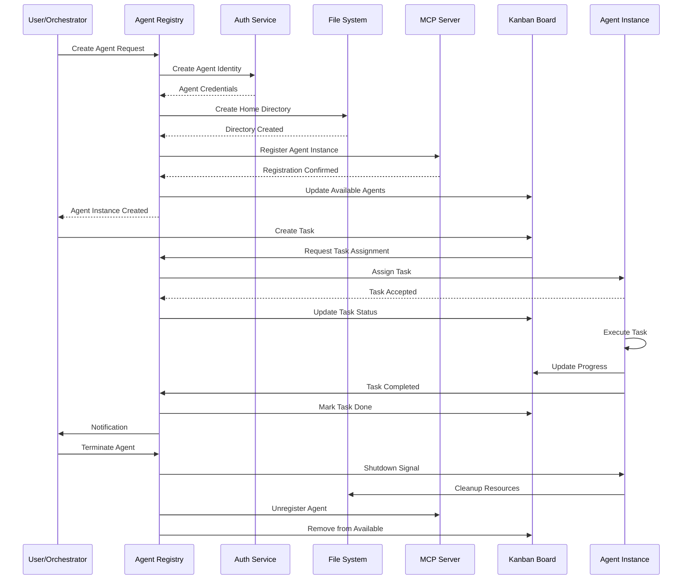
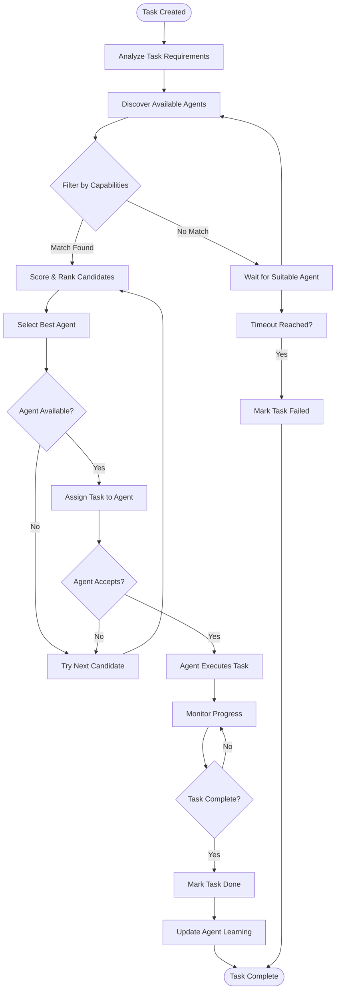
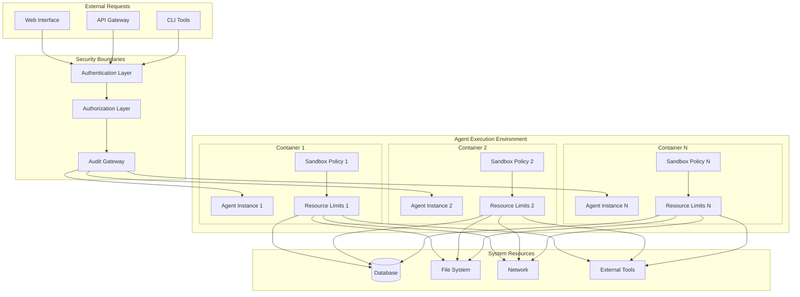
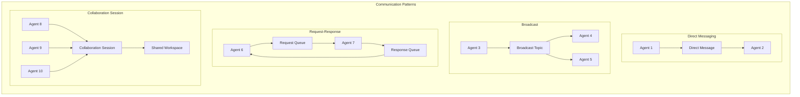
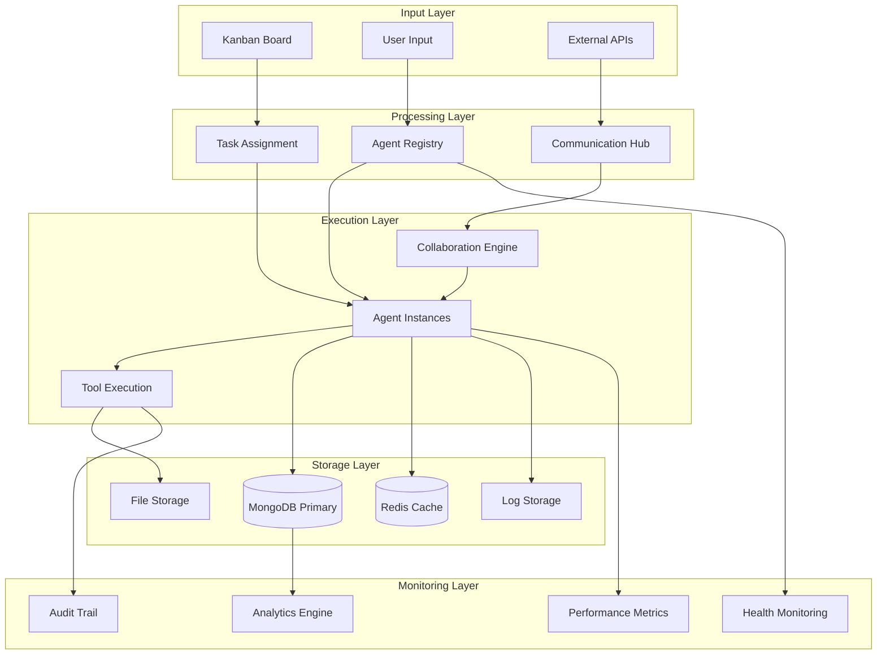
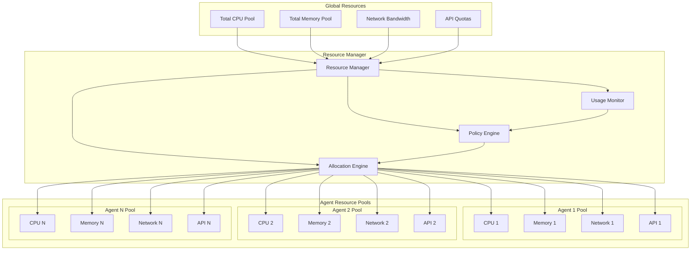
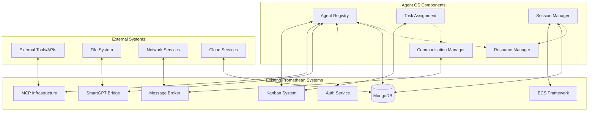

# Agent OS Architectural Diagrams

## 1. High-Level System Architecture

## 2. Agent Instance Lifecycle

## 3. Task Assignment Workflow

## 4. Security Architecture

## 5. Communication Patterns

## 6. Data Flow Architecture

## 7. Resource Management Model

## 8. Integration Points Map

These diagrams provide a comprehensive visual representation of the Agent OS architecture, covering system integration, security, communication patterns, resource management, and the complete agent lifecycle.