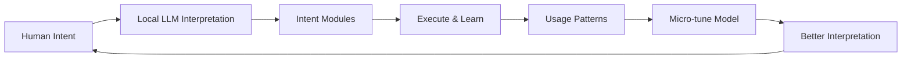

# 🚀 Promethean OS Manifesto

> _"The first truly AI-driven operating system for humans with significant, meaningful, intentionally designed AI integrations."_

## 🧠 The Vision

Promethean is not another cloud service for AI agents. It is not a web application that needs protection from users attacking themselves.

**Promethean is a personal operating system** - a daily driver for humans augmented by local AI models that learn and adapt to their unique patterns and needs.

## 🎯 Core Principles

### 1. Owner Sovereignty

- The user owns their system completely
- They can `rm -rf /` if they want to - it's their computer
- We warn, we don't block
- We ask for confirmation, we don't assume malicious intent
- The system serves the human, not the other way around

### 2. AI as Intent Compiler

- Natural language and DSL inputs → LLM interpretation → Optimized bytecode
- Configuration becomes more efficient over time through usage patterns
- Personal models get micro-tuned to individual human operators
- "Good enough" solutions get compiled and reused, "perfect" is the enemy

### 3. Learn Once, Solve Forever

- No problem should be solved twice
- Solutions that work get compiled into reusable components
- Failed attempts become learning data, not failures
- The system remembers what works for each specific human

### 4. Contextual Security, Not Security Theater

- Distinguish between legitimate system administration and actual threats
- AI evaluates security in context of user patterns and intent
- Rules emerge from interaction, not from imaginary attack scenarios
- Protect users from others, not from themselves

### 5. The Hacker Ethos

> The world is full of fascinating problems waiting to be solved. No problem should ever have to be solved twice.

We use AI not to generate disposable solutions, but to solve hard problems once and reuse their solutions as often as possible.

## 🏗️ System Architecture

### Modular Intent

Every component is a **module of intent** that an agent can choose to read based on context:

```typescript
// Each module serves a specific purpose
interface IntentModule {
  purpose: string; // What problem this solves
  context: ContextScope[]; // When this is relevant
  dependencies: ModuleRef[]; // What other modules it needs
  examples: UsagePattern[]; // How humans typically use this
}
```

### Agent-Driven Workflow

Agents don't navigate file systems - they **select intent modules**:

1. **Read Context** - What is the human trying to accomplish?
2. **Select Modules** - Which intent modules apply?
3. **Execute Intent** - Combine modules to achieve the goal
4. **Learn Patterns** - What worked for this human's specific style?
5. **Optimize Solutions** - Compile successful patterns into reusable components

### Natural Language Configuration

The system should be configurable through:

- **Nearly natural language** - "Make the file server faster and more secure"
- **Optimized DSL** - Lisp-like syntax that compiles to efficient bytecode
- **Text documents** - LLM interprets and gradually compiles to optimized forms

### Personal AI Evolution

- **Local models** get tuned to individual human patterns
- **Usage data** drives micro-optimizations (1 parameter at a time)
- **Success patterns** become compiled components
- **Failed attempts** improve future recommendations

## 🔧 Implementation Philosophy

### Break Down Hard Problems

Use existing devops tools to break complex challenges into thousands of micro-problems:

```typescript
// Complex problem → Many small, solvable pieces
const decompose = (problem: HardProblem): MicroProblem[] => {
  return ai.breakIntoSmallestSolvablePieces(problem, {
    model: 'error/qwen3:4b-instruct-100k',
    maxComplexity: 3, // Each piece should be trivial for small model
    context: userPatterns,
  });
};
```

### Continuous Learning Loop



## 🛡️ Security Philosophy

### Contextual Security Evaluation

Instead of hardcoded rules, use AI to evaluate context:

```typescript
interface SecurityContext {
  userPatterns: UsagePattern[]; // How this human typically works
  currentSession: SessionContext; // What are they doing right now
  systemState: SystemState; // Current system configuration
  environmentFactors: EnvFactor[]; // Network, location, etc.
}

const evaluateSecurity = async (
  action: ProposedAction,
  context: SecurityContext,
): Promise<SecurityDecision> => {
  const evaluation = await localLLM.evaluate({
    prompt: `Given this user's patterns and current context, is this action:
    1. A legitimate system administration task?
    2. A potential security risk to others?
    3. Something that should be warned about?
    4. Something that should be blocked?
    
    Remember: This is a personal OS, not a multi-user system.`,
    model: 'error/qwen3:4b-instruct-100k',
  });

  return {
    decision: evaluation.recommendation, // allow | warn | confirm | block
    reasoning: evaluation.explanation,
    confidence: evaluation.certainty,
  };
};
```

### Adaptive Rule Generation

Security rules emerge from interaction:

1. **Initial AI Evaluation** - Model makes educated guess based on patterns
2. **User Feedback Loop** - Human confirms or corrects the decision
3. **Pattern Recognition** - System learns user's legitimate behaviors
4. **Rule Solidification** - Repeated patterns become deterministic rules
5. **Continuous Refinement** - Rules adapt as user behavior evolves

## 🎭 Human-AI Collaboration

### The Human Role

- **Strategic Decisions** - What should we build? What problems matter?
- **Creative Problem Solving** - Novel approaches the AI wouldn't consider
- **Quality Control** - Review AI output, catch subtle mistakes
- **Final Authority** - Accept or reject AI recommendations

### The AI Role

- **Implementation Partner** - Turn human intent into working code
- **Pattern Recognition** - Identify successful approaches across sessions
- **Optimization Engine** - Make good solutions faster and more efficient
- **Documentation Assistant** - Remember what was built and why

### Trust but Verify

- **Trust the human** - Assume good intent unless proven otherwise
- **Verify the implementation** - Test, validate, catch mistakes
- **Learn from corrections** - Update patterns based on human feedback
- **Maintain humility** - AI suggests, human decides

## 🌐 The Ecosystem

### Open by Default

- **Local models preferred** - Privacy, personalization, offline capability
- **Cloud models optional** - Use when local models insufficient
- **User controls data** - What leaves the system is user's choice
- **Interoperable protocols** - Standard APIs for model communication

### Extensible by Design

- **Intent modules** can be added by anyone
- **Security patterns** adapt to new use cases
- **Model support** expands as better local models emerge
- **Community contributions** improve everyone's experience

## 📋 Success Metrics

### For the Human

- **Problems solved** - Real issues eliminated, not features shipped
- **Time saved** - Automation reduces manual work
- **Learning retained** - Solutions get reused, not reinvented
- **Mastery achieved** - System becomes extension of their thinking

### For the System

- **Intent recognition accuracy** - How well does it understand human goals?
- **Solution quality** - Do implementations work reliably?
- **Adaptation speed** - How quickly does it learn new patterns?
- **Resource efficiency** - Optimal use of compute and storage

## 🚀 The Promise

Promethean is not about replacing humans with AI. It's about **augmenting human capability** while maintaining human agency and control.

We are building:

- **A personal operating system** that knows its user
- **An intent-driven architecture** that adapts to individual needs
- **A learning partnership** between human and AI
- **A sustainable approach** to solving hard problems

The goal is not artificial general intelligence, but **artificial intelligence that serves human intelligence** - making each human more capable, not replacing them.

---

> _"We solve problems once and reuse their solutions forever, adapting them to each human's unique patterns while maintaining their complete freedom and control."_
