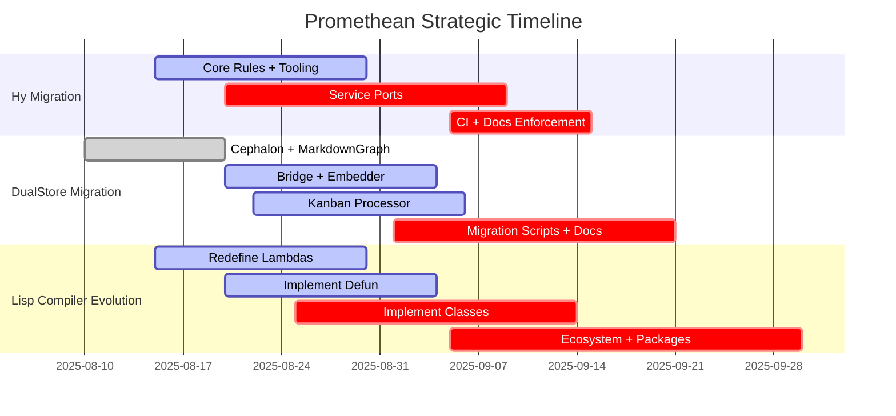

# Promethean Framework

[[LICENSE.txt]]

This project is licensed under the [[LICENSE.txt|GNU GPL v3]].

This repository contains a modular multi‑agent architecture. To start shared infrastructure like speech services, run pm2 with the root configuration:

```bash
pm2 start system/daemons/ecosystem.config.js
```

When adding or removing services under `system/daemons/services/<daemon>/ecosystem.config.js`, regenerate the consolidated configuration:

```bash
pnpm gen:ecosystem
```

Then start individual agents using their own ecosystem file. For Duck you would
run:

```bash
pm2 start agents/duck/ecosystem.config.js
```

Choose the config inside `agents/<agent>/` for other agents.

## Development workflow

Run all package development scripts without Docker:

```bash
pnpm dev:all
```

For a full-stack environment using containers:

```bash
docker compose up
```

Set `AGENT_NAME` in your environment before launching agent services to isolate collections and data.
Promethean is a modular cognitive architecture for building embodied AI agents. It breaks the system
into small services that handle speech-to-text, text-to-speech, memory, and higher level reasoning.
📖 For a high-level overview, see [[docs/design/overview|Vision Overview]].
📊 For architecture roadmaps and visualizations, see [[docs/architecture/index|docs/architecture/index.md]].
📦 Data migration conventions and runbooks live under [[docs/data/contracts/readme|docs/data]].
🧰 Need a new workspace package? Follow the [[new-package|Nx package workflow]] for presets, directory layout, and follow-up tasks.

### Development conventions

- Prefer immutable data; avoid in-place object mutation.
- Use key-value caches like `@promethean/level-cache` instead of JSON files for intermediate data.

## Kanban automation

All board maintenance flows now run through `@promethean/kanban-cli`:

- `pnpm kanban pull` keeps `docs/agile/boards/kanban.md` in sync with task
  frontmatter.
- `pnpm kanban push` projects kanban columns back to task files.
- `pnpm kanban sync` runs both directions and reports conflicts.
- `pnpm tsx packages/kanban/src/scripts/wip-sheriff.ts --write` audits WIP
  limits when you need the old “WIP sheriff” tooling.

Run `pnpm kanban --help` for the full list of subcommands.

## Automation pipelines

Automation flows live in [[pipelines.json|`pipelines.json`]]. The table below
documents what each pipeline assembles and how the steps cooperate so operators
know which caches, models, and outputs are involved when a run is triggered.

### `symdocs`
- **Purpose:** Generate symbol-aware package documentation and dependency graphs.
- **Steps:**
  1. `symdocs-scan` indexes package sources into `.cache/symdocs.level` using
     `scripts/piper-symdocs.mjs`.
  2. `symdocs-docs` calls the same module with the `docs` export (model
     `qwen3:4b`) to enrich the cache.
  3. `symdocs-write` materialises module docs under `docs/packages`.
  4. `symdocs-graph` emits package README files and graphs from the indexed
     sources.【F:pipelines.json†L3-L67】

### `simtasks`
- **Purpose:** Produce task backlogs from code structure analysis.
- **Steps:**
  1. `simtasks-scan` records exported functions per package.
  2. `simtasks-embed` and `simtasks-cluster` embed and group functions using
     Ollama hosted `nomic-embed-text:latest`.
  3. `simtasks-plan` drafts plans with `qwen3:4b`.
  4. `simtasks-write` writes Markdown tasks into `docs/agile/tasks`.
     【F:pipelines.json†L71-L171】

### `codemods`
- **Purpose:** Generate, dry-run, and verify automated codemod transforms.
- **Steps:**
  1. `mods-simtasks` ensures the `simtasks` caches exist, invoking that pipeline
     if needed.
  2. `mods-spec` derives codemod specifications from the caches.
  3. `mods-generate` writes transform stubs, `mods-dry-run` previews their
     effects, and `mods-apply` executes approved transforms.
  4. `mods-verify` runs repository tests and captures verification reports.
     【F:pipelines.json†L175-L242】

### `semver-guard`
- **Purpose:** Detect API changes and prepare release guidance.
- **Steps:**
  1. `sv-snapshot` captures current package signatures.
  2. `sv-diff` and `sv-plan` compute differences and summarise impacts with
     `qwen3:4b`.
  3. `sv-write` writes follow-up tasks, and `sv-pr` prepares dependency update
     metadata for PR automation.【F:pipelines.json†L246-L341】

### `board-review`
- **Purpose:** Audit task hygiene against the documented agile process.
- **Steps:**
  1. `br-fm` normalises task frontmatter defaults.
  2. `br-prompts` extracts review prompts from `docs/agile/Process.md` while
     `br-index` embeds repository context via `nomic-embed-text:latest`.
  3. `br-match` associates tasks with context, `br-eval` scores them with
     `qwen3:4b`, and `br-report` emits review reports.【F:pipelines.json†L345-L470】

### `sonar`
- **Purpose:** Pull SonarQube issues and turn them into actionable tasks.
- **Steps:**
  1. `sonar-scan` runs `sonar-scanner` with the configured project key.
  2. `sonar-fetch` downloads the issue payload into `.cache/sonar/issues`.
  3. `sonar-plan` clusters issues with `qwen3:4b`, and `sonar-write` exports
     grouped tasks under `docs/agile/tasks/sonar`.【F:pipelines.json†L474-L528】

### `readmes`
- **Purpose:** Keep package README files fresh.
- **Steps:**
  1. `rm-scan` inventories package manifests into `.cache/readmes`.
  2. `rm-outline` drafts outlines with `qwen3:4b`.
  3. `rm-write` emits README updates and `rm-verify` logs QA reports to
     `docs/agile/reports/readmes`.【F:pipelines.json†L532-L592】

### `buildfix`
- **Purpose:** Iterate on build failures until the workspace compiles.
- **Steps:**
  1. `bf-build` builds the `@promethean/buildfix` package.
  2. `bf-errors` captures TypeScript diagnostics for the workspace.
  3. `bf-iterate` uses `qwen3:4b` to propose fixes with guarded git operations.
  4. `bf-report` summarises attempts in `docs/agile/reports/buildfix`.
     【F:pipelines.json†L596-L648】

### `test-gap`
- **Purpose:** Identify code without automated test coverage and plan remedies.
- **Steps:**
  1. `tg-exports` maps exported symbols; `tg-tests` runs the full workspace test
     suite with coverage.
  2. `tg-coverage` and `tg-map` combine exports and coverage into gap data.
  3. `tg-gate` enforces thresholds, `tg-cookbook` links docs, `tg-plan` drafts
     remediation plans with `qwen3:4b`, and `tg-write` plus `tg-report` publish
     tasks and reports.【F:pipelines.json†L653-L742】

### `docops`
- **Purpose:** Maintain the curated `docs/unique` knowledge base.
- **Steps:**
  1. `doc-fm` standardises frontmatter using `qwen3:4b`.
  2. `doc-index` and `doc-similarity` embed documents via
     `nomic-embed-text:latest`.
  3. `doc-related`, `doc-footer`, and `doc-rename` manage cross-links, footers,
     and filenames.【F:pipelines.json†L745-L855】

### `eslint-tasks`
- **Purpose:** Turn ESLint findings into follow-up tasks.
- **Steps:**
  1. `eslint-report` generates `.cache/eslint/report.json` with
     `pnpm exec eslint`.
  2. `eslint-tasks` converts the report into Markdown tasks inside
     `docs/agile/tasks`.【F:pipelines.json†L858-L886】

### Nx workspace

Build tooling is managed with [Nx](https://nx.dev). See [[nx-workspace|docs/nx-workspace.md]] for common commands.

### Broker Heartbeat

`BrokerClient` sends periodic heartbeats to keep connections alive. Configure the interval in milliseconds with the `BROKER_HEARTBEAT_MS` environment variable (default `30000`).

## 📊 Project Evolution Master Graph

````mermaid

graph TD

    KanbanBoard[[docs/agile/boards/kanban.md]] --> HyMigration[[docs/architecture/hy-migration-graph.md]]

    KanbanBoard --> DualStoreMigration[[docs/architecture/persistence-migration-graph.md]]

    KanbanBoard --> CompilerEvolution[[docs/architecture/compiler-evolution-graph.md]]


    HyMigration --> HyChecklist[[docs/reports/hy-migration-checklist.md]]

## 🗓️ Project Evolution Timeline




#### Quick Setup

```bash
git clone https://github.com/PrometheanAI/promethean.git
cd promethean

# Enable pnpm 9 via Corepack (required by the repo)
corepack enable && corepack prepare pnpm@9 --activate

# Install dependencies and launch all package dev servers
pnpm install
pnpm dev:all
```

### Node (pnpm required)

Use pnpm for all JavaScript/TypeScript packages. npm is intentionally blocked in this repo and will fail with a preinstall guard (EACCES/permission errors are common with npm here).

```bash
# Ensure pnpm is available (Corepack)
corepack enable && corepack prepare pnpm@latest --activate

# Install workspace deps
pnpm install
```

Install PM2 globally (pnpm only):

```bash
pnpm add -g pm2

Note: The repository sets `"packageManager": "pnpm@9"` and a `preinstall` script that exits when not using pnpm. If `npm install` is attempted, it will fail with a clear error message and instructions to enable Corepack and rerun with pnpm.
```

The service management targets `make start`, `make start-tts` and
`make start-stt` require PM2. You can install it globally as shown above or add
it as a project dependency.

### Linting

Use `pnpm lint:diff` during development to run ESLint only on files changed relative to `origin/main`. This is much faster than `pnpm lint`, which scans the entire repository. Reserve `pnpm lint` for CI or when a full repo check is required.

### Testing (JS/TS)

Run JavaScript/TypeScript tests with AVA, split by type:

- Unit tests: `pnpm run test:unit`
- Integration tests: `pnpm run test:integration`
- E2E tests: `pnpm run:e2e` (alias for `test:e2e`)

Conventions used to classify tests:
- Unit: all tests excluding files or directories containing `integration`, `e2e`, or `system`.
- Integration: tests with filenames containing `.integration.` or under an `integration/` directory.
- E2E: tests with filenames containing `.e2e.` or under `e2e/` or `system/` directories.

TypeScript packages are built first (`pnpm -r run build`) so tests can execute from `dist/`.
Packages using Node’s built-in test runner (e.g., `auth-service`) expose `test:unit` locally and are not run by AVA.

### MongoDB

Some services (for example `heartbeat`) require a running MongoDB instance.

## Environment Variables

The framework relies on several environment variables for configuration. See
[[environment-variables.md|docs/environment-variables.md]] for details on
all available settings.

## Obsidian Vault

This repository doubles as an Obsidian vault. If you would like to view the
documentation inside Obsidian, copy the baseline configuration provided in
`vault-config/.obsidian/` to `docs/.obsidian/` directory:

```bash
cp -r docs/vault-config/.obsidian docs/.obsidian
```

This enables the Kanban plugin for task tracking so `docs/agile/boards/kanban.md`
renders as a board. Open the repository folder in Obsidian after copying the
configuration. Feel free to customize the settings or install additional
plugins locally. See `vault-config/README.md` for more details.
To push tasks from the board to GitHub Projects, see `docs/board_sync.md` and the
`github_board_sync.py` script.

## Pre-commit Setup

Documentation uses `[[wikilinks.md]]` inside the vault. We refinforce this using precommit hooks. It breaks the markdown on github, but they are so much simpler to manage. A wiki will be published from the notes in due time.

Install the hook with:

```bash
pip install pre-commit
pre-commit install
```

This ensures all modified markdown files are converted during `git commit`.

## License

Promethean Framework is released under the [GNU General Public License v3](LICENSE.txt).
