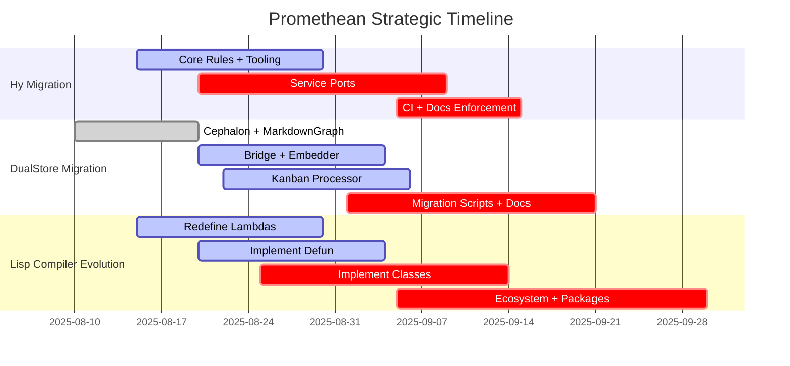

# Promethean Framework

[[LICENSE.txt]]

This project is licensed under the [[LICENSE.txt|GNU GPL v3]].

This repository contains a modular multi‑agent architecture. To start shared infrastructure like speech services, run pm2 with the root configuration:

```bash
pm2 start system/daemons/ecosystem.config.js
```

When adding or removing services under `system/daemons/services/<daemon>/ecosystem.config.js`, regenerate the consolidated configuration:

```bash
pnpm gen:ecosystem
```

Then start individual agents using their own ecosystem file. For Duck you would
run:

```bash
pm2 start agents/duck/ecosystem.config.js
```

Choose the config inside `agents/<agent>/` for other agents.

## Development workflow

Run all package development scripts without Docker:

```bash
pnpm dev:all
```

For a full-stack environment using containers:

```bash
docker compose up
```

Set `AGENT_NAME` in your environment before launching agent services to isolate collections and data.
Promethean is a modular cognitive architecture for building embodied AI agents. It breaks the system
into small services that handle speech-to-text, text-to-speech, memory, and higher level reasoning.
📖 For a high-level overview, see [[docs/design/overview|Vision Overview]].
📊 For architecture roadmaps and visualizations, see [[docs/architecture/index|docs/architecture/index.md]].
📦 Data migration conventions and runbooks live under [[docs/data/contracts/readme|docs/data]].
🧰 Need a new workspace package? Follow the [[new-package|Nx package workflow]] for presets, directory layout, and follow-up tasks.

### Development conventions

- Prefer immutable data; avoid in-place object mutation.
- Use key-value caches like `@promethean/level-cache` instead of JSON files for intermediate data.

## Kanban Task Management

The Promethean framework uses a comprehensive kanban system for task management and workflow tracking. The system is managed through the `@promethean/kanban` package.

### 🎯 Quick Start

**All kanban commands work from any directory in the repository** - the system automatically resolves paths correctly.

```bash
# Essential commands
pnpm kanban regenerate     # Generate board from task files
pnpm kanban search <query> # Search tasks by title or content
pnpm kanban count          # Show task counts by column
pnpm kanban update-status <uuid> <column> # Move task between columns

# Board synchronization
pnpm kanban sync          # Bidirectional sync with conflict reporting
pnpm kanban pull          # Sync board from task frontmatter
pnpm kanban push          # Project board columns back to tasks

# Full help
pnpm kanban --help        # Show all available subcommands
```

### 📋 Key Files & Locations

- **Task files**: `docs/agile/tasks/*.md` - Individual task definitions with frontmatter
- **Generated board**: `docs/agile/boards/generated.md` - Auto-generated kanban board
- **Configuration**: `promethean.kanban.json` - Kanban system configuration
- **Process guide**: `docs/agile/process.md` - Workflow and process documentation

### 🧭 Path Resolution & Configuration

- The CLI automatically walks up from your current directory until it finds a
  workspace marker (`pnpm-workspace.yaml` or `.git`). This repo root becomes the
  base for default paths, so you can run commands from any package or
  subfolder.
- Relative paths declared inside `promethean.kanban.json` are resolved from the
  directory that contains the config file, never from the shell location.
- Override behaviour remains unchanged:
  - CLI flags (for example `--board-file`, `--tasks-dir`) are resolved relative
    to the directory you run the command from.
  - Environment variables (`KANBAN_BOARD_FILE`, `KANBAN_TASKS_DIR`, etc.) are
    resolved relative to the detected repo root.
- To use an alternate config, pass `--config <path>` (relative to your current
  directory) or set `KANBAN_CONFIG`. The loader will still resolve all relative
  paths based on the config file's directory.

### 🔄 Common Workflows

1. **Find existing work**: `pnpm kanban search <keyword>`
2. **Start working**: `pnpm kanban update-status <uuid> in_progress`
3. **Complete work**: `pnpm kanban update-status <uuid> done`
4. **Regenerate board**: `pnpm kanban regenerate`

### 📊 Board Structure

The kanban board uses these standard columns (following FSM process defined in `docs/agile/process.md`):

**Brainstorm Lane (unbounded):**
- **icebox** 🧊 - Deferred/archived tasks at varying refinement levels, not actively committed to
- **incoming** 💭 - All new tasks enter here (initial state), awaiting triage

**Planning Lane (WIP limited):**
- **accepted** ✅ - Triage complete, ready for breakdown analysis
- **breakdown** 🧩 - Task being broken into small, testable slices with Fibonacci estimates
- **blocked** 🚧 - Explicit dependency on another task (bidirectional links required)

**Execution Lane (WIP limited):**
- **ready** 🛠 - Scoped, estimated (≤5), ready for execution queue (not priority-ordered)
- **todo** 🟢 - Prioritized in execution queue, ready to pull (WIP limited)
- **in_progress** 🟡 - Actively being worked on (WIP limited)
- **review** 🔍 - Coherent, reviewable change exists (WIP limited)
- **document** 📚 - Recording evidence and summaries (WIP limited)
- **done** ✅ - Complete with documentation/evidence

**Abandoned Lane:**
- **rejected** ❌ - Non-viable, may be moved to Ice Box

**Key Principles:**
- **Never edit board files directly** - tasks drive board generation
- **Use `pnpm kanban regenerate`** after any task changes
- **WIP limits are enforced** - transitions fail if target column is full
- **Incoming → Ready** requires task breakdown and Fibonacci estimation (≤5 for implementation)

### 🤖 For AI Agents and Claude

The kanban system is designed to work seamlessly with AI assistants:

- **No directory navigation needed** - commands work from anywhere in the repo
- **Automatic path resolution** - the system finds the correct config and files
- **Conflict-aware syncing** - bidirectional sync with conflict reporting
- **Task search capabilities** - find existing work before creating new tasks

See `CLAUDE.md` and `AGENTS.md` for detailed AI-specific usage guidelines.

### ⚙️ Advanced Usage

For legacy workflows and advanced operations:
- `pnpm tsx packages/kanban/src/scripts/wip-sheriff.ts --write` - Audit WIP limits (legacy tooling)
- Individual task operations via `pnpm kanban --help` for complete subcommand listing

The kanban system integrates with the broader development workflow and follows the process defined in `docs/agile/process.md`.

## Automation pipelines

Automation flows live in [[pipelines.json|`pipelines.json`]]. The table below
documents what each pipeline assembles and how the steps cooperate so operators
know which caches, models, and outputs are involved when a run is triggered.

### `symdocs`
- **Purpose:** Generate symbol-aware package documentation and dependency graphs.
- **Steps:**
  1. `symdocs-scan` indexes package sources into `.cache/symdocs.level` using
     `scripts/piper-symdocs.mjs`.
  2. `symdocs-docs` calls the same module with the `docs` export (model
     `qwen3:4b`) to enrich the cache.
  3. `symdocs-write` materialises module docs under `docs/packages`.
  4. `symdocs-graph` emits package README files and graphs from the indexed
     sources.【F:pipelines.json†L3-L67】

### `simtasks`
- **Purpose:** Produce task backlogs from code structure analysis.
- **Steps:**
  1. `simtasks-scan` records exported functions per package.
  2. `simtasks-embed` and `simtasks-cluster` embed and group functions using
     Ollama hosted `nomic-embed-text:latest`.
  3. `simtasks-plan` drafts plans with `qwen3:4b`.
  4. `simtasks-write` writes Markdown tasks into `docs/agile/tasks`.
     【F:pipelines.json†L71-L171】

### `codemods`
- **Purpose:** Generate, dry-run, and verify automated codemod transforms.
- **Steps:**
  1. `mods-simtasks` ensures the `simtasks` caches exist, invoking that pipeline
     if needed.
  2. `mods-spec` derives codemod specifications from the caches.
  3. `mods-generate` writes transform stubs, `mods-dry-run` previews their
     effects, and `mods-apply` executes approved transforms.
  4. `mods-verify` runs repository tests and captures verification reports.
     【F:pipelines.json†L175-L242】

### `semver-guard`
- **Purpose:** Detect API changes and prepare release guidance.
- **Steps:**
  1. `sv-snapshot` captures current package signatures.
  2. `sv-diff` and `sv-plan` compute differences and summarise impacts with
     `qwen3:4b`.
  3. `sv-write` writes follow-up tasks, and `sv-pr` prepares dependency update
     metadata for PR automation.【F:pipelines.json†L246-L341】

### `board-review`
- **Purpose:** Audit task hygiene against the documented agile process.
- **Steps:**
  1. `br-fm` normalises task frontmatter defaults.
  2. `br-prompts` extracts review prompts from `docs/agile/Process.md` while
     `br-index` embeds repository context via `nomic-embed-text:latest`.
  3. `br-match` associates tasks with context, `br-eval` scores them with
     `qwen3:4b`, and `br-report` emits review reports.【F:pipelines.json†L345-L470】

### `sonar`
- **Purpose:** Pull SonarQube issues and turn them into actionable tasks.
- **Steps:**
  1. `sonar-scan` runs `sonar-scanner` with the configured project key.
  2. `sonar-fetch` downloads the issue payload into `.cache/sonar/issues`.
  3. `sonar-plan` clusters issues with `qwen3:4b`, and `sonar-write` exports
     grouped tasks under `docs/agile/tasks/sonar`.【F:pipelines.json†L474-L528】

### `readmes`
- **Purpose:** Keep package README files fresh.
- **Steps:**
  1. `rm-scan` inventories package manifests into `.cache/readmes`.
  2. `rm-outline` drafts outlines with `qwen3:4b`.
  3. `rm-write` emits README updates and `rm-verify` logs QA reports to
     `docs/agile/reports/readmes`.【F:pipelines.json†L532-L592】

### `buildfix`
- **Purpose:** Iterate on build failures until the workspace compiles.
- **Steps:**
  1. `bf-build` builds the `@promethean/buildfix` package.
  2. `bf-errors` captures TypeScript diagnostics for the workspace.
  3. `bf-iterate` uses `qwen3:4b` to propose fixes with guarded git operations.
  4. `bf-report` summarises attempts in `docs/agile/reports/buildfix`.
     【F:pipelines.json†L596-L648】

### `test-gap`
- **Purpose:** Identify code without automated test coverage and plan remedies.
- **Steps:**
  1. `tg-exports` maps exported symbols; `tg-tests` runs the full workspace test
     suite with coverage.
  2. `tg-coverage` and `tg-map` combine exports and coverage into gap data.
  3. `tg-gate` enforces thresholds, `tg-cookbook` links docs, `tg-plan` drafts
     remediation plans with `qwen3:4b`, and `tg-write` plus `tg-report` publish
     tasks and reports.【F:pipelines.json†L653-L742】

### `docops`
- **Purpose:** Maintain the curated `docs/unique` knowledge base.
- **Steps:**
  1. `doc-fm` standardises frontmatter using `qwen3:4b`.
  2. `doc-index` and `doc-similarity` embed documents via
     `nomic-embed-text:latest`.
  3. `doc-related`, `doc-footer`, and `doc-rename` manage cross-links, footers,
     and filenames.【F:pipelines.json†L745-L855】

### `eslint-tasks`
- **Purpose:** Turn ESLint findings into follow-up tasks.
- **Steps:**
  1. `eslint-report` generates `.cache/eslint/report.json` with
     `pnpm exec eslint`.
  2. `eslint-tasks` converts the report into Markdown tasks inside
     `docs/agile/tasks`.【F:pipelines.json†L858-L886】

### Nx workspace

Build tooling is managed with [Nx](https://nx.dev). See [[nx-workspace|docs/nx-workspace.md]] for common commands.

### Broker Heartbeat

`BrokerClient` sends periodic heartbeats to keep connections alive. Configure the interval in milliseconds with the `BROKER_HEARTBEAT_MS` environment variable (default `30000`).

## 📊 Project Evolution Master Graph

````mermaid

graph TD

    KanbanBoard[[docs/agile/boards/kanban.md]] --> HyMigration[[docs/architecture/hy-migration-graph.md]]

    KanbanBoard --> DualStoreMigration[[docs/architecture/persistence-migration-graph.md]]

    KanbanBoard --> CompilerEvolution[[docs/architecture/compiler-evolution-graph.md]]


    HyMigration --> HyChecklist[[docs/reports/hy-migration-checklist.md]]

## 🗓️ Project Evolution Timeline




#### Quick Setup

```bash
git clone https://github.com/PrometheanAI/promethean.git
cd promethean

# Enable pnpm 9 via Corepack (required by the repo)
corepack enable && corepack prepare pnpm@9 --activate

# Install dependencies and launch all package dev servers
pnpm install
pnpm dev:all
```

### Node (pnpm required)

Use pnpm for all JavaScript/TypeScript packages. npm is intentionally blocked in this repo and will fail with a preinstall guard (EACCES/permission errors are common with npm here).

```bash
# Ensure pnpm is available (Corepack)
corepack enable && corepack prepare pnpm@latest --activate

# Install workspace deps
pnpm install
```

Install PM2 globally (pnpm only):

```bash
pnpm add -g pm2

Note: The repository sets `"packageManager": "pnpm@9"` and a `preinstall` script that exits when not using pnpm. If `npm install` is attempted, it will fail with a clear error message and instructions to enable Corepack and rerun with pnpm.
```

The service management targets `make start`, `make start-tts` and
`make start-stt` require PM2. You can install it globally as shown above or add
it as a project dependency.

### Linting

Use `pnpm lint:diff` during development to run ESLint only on files changed relative to `origin/main`. This is much faster than `pnpm lint`, which scans the entire repository. Reserve `pnpm lint` for CI or when a full repo check is required.

### Testing (JS/TS)

Run JavaScript/TypeScript tests with AVA, split by type:

- Unit tests: `pnpm run test:unit`
- Integration tests: `pnpm run test:integration`
- E2E tests: `pnpm run:e2e` (alias for `test:e2e`)

Conventions used to classify tests:
- Unit: all tests excluding files or directories containing `integration`, `e2e`, or `system`.
- Integration: tests with filenames containing `.integration.` or under an `integration/` directory.
- E2E: tests with filenames containing `.e2e.` or under `e2e/` or `system/` directories.

TypeScript packages are built first (`pnpm -r run build`) so tests can execute from `dist/`.
Packages using Node’s built-in test runner (e.g., `auth-service`) expose `test:unit` locally and are not run by AVA.

### MongoDB

Some services (for example `heartbeat`) require a running MongoDB instance.

## Environment Variables

The framework relies on several environment variables for configuration. See
[[environment-variables.md|docs/environment-variables.md]] for details on
all available settings.

## Obsidian Vault

This repository doubles as an Obsidian vault. If you would like to view the
documentation inside Obsidian, copy the baseline configuration provided in
`vault-config/.obsidian/` to `docs/.obsidian/` directory:

```bash
cp -r docs/vault-config/.obsidian docs/.obsidian
```

This enables the Kanban plugin for task tracking so `docs/agile/boards/kanban.md`
renders as a board. Open the repository folder in Obsidian after copying the
configuration. Feel free to customize the settings or install additional
plugins locally. See `vault-config/README.md` for more details.
To push tasks from the board to GitHub Projects, see `docs/board_sync.md` and the
`github_board_sync.py` script.

## Pre-commit Setup

Documentation uses `[[wikilinks.md]]` inside the vault. We refinforce this using precommit hooks. It breaks the markdown on github, but they are so much simpler to manage. A wiki will be published from the notes in due time.

Install the hook with:

```bash
pip install pre-commit
pre-commit install
```

This ensures all modified markdown files are converted during `git commit`.

## License

Promethean Framework is released under the [GNU General Public License v3](LICENSE.txt).


---

## Automation Docs

- [Lint → Kanban Workflow](docs/automation/lint-taskgen.md): convert ESLint errors into Kanban tasks, sync with in-repo board.
## 📦 Workspace Package Catalog

Every workspace package ships with its own README. Use the catalog below to
discover what each tool does, how it fits into the platform, and where to find
usage notes or follow-up work.

<!-- PACKAGE_CATALOG_START -->
| Package | Summary | Usage | README |
| --- | --- | --- | --- |
| @promethean/agent | (coming soon) | Usage details coming soon in package README. | [README](packages/agent/README.md) |
| @promethean/agent-ecs | (coming soon) | Usage details coming soon in package README. | [README](packages/agent-ecs/README.md) |
| @promethean/alias-rewrite | Deprecated: use @promethean/naming instead | Usage details pending in package README. | [README](packages/alias-rewrite/README.md) |
| @promethean/auth-service | Auth Service | Usage details coming soon in package README. | [README](packages/auth-service/README.md) |
| @promethean/boardrev | (coming soon) | Usage details coming soon in package README. | [README](packages/boardrev/README.md) |
| Message Broker Service (Node.js) | Simple WebSocket-based pub/sub broker. Services connect and exchange messages through | Usage details coming soon in package README. | [README](packages/broker/README.md) |
| Buildfix | Buildfix automates fixing TypeScript build errors. | Build the package first, then run commands individually: Or run the full pipeline with [piper](https://github.com/promethean-framework/piper): | [README](packages/buildfix/README.md) |
| @promethean/cephalon | A proof-of-concept basic bot using @discordjs/voice | Usage details pending in package README. | [README](packages/cephalon/README.md) |
| @promethean/changefeed | (coming soon) | Usage details coming soon in package README. | [README](packages/changefeed/README.md) |
| @promethean/cli | (coming soon) | Usage details coming soon in package README. | [README](packages/cli/README.md) |
| clj-hacks | Utilities for experimenting with Emacs Lisp parsing using the Tree-sitter | Usage details pending in package README. | [README](packages/clj-hacks/README.md) |
| @promethean/codemods | (coming soon) | Usage details coming soon in package README. | [README](packages/codemods/README.md) |
| @promethean/codepack | (coming soon) | Usage details coming soon in package README. | [README](packages/codepack/README.md) |
| @promethean/compaction | (coming soon) | Usage details coming soon in package README. | [README](packages/compaction/README.md) |
| @promethean/compiler | (coming soon) | Usage details coming soon in package README. | [README](packages/compiler/README.md) |
| @promethean/contracts | (coming soon) | Usage details coming soon in package README. | [README](packages/contracts/README.md) |
| @promethean/cookbookflow | (coming soon) | Usage details coming soon in package README. | [README](packages/cookbookflow/README.md) |
| @promethean/dev | (coming soon) | Usage details coming soon in package README. | [README](packages/dev/README.md) |
| @promethean/discord | (coming soon) | Usage details coming soon in package README. | [README](packages/discord/README.md) |
| @promethean/dlq | (coming soon) | Usage details coming soon in package README. | [README](packages/dlq/README.md) |
| @promethean/docops | DocOps is a modular documentation pipeline that parses, embeds, queries, relates, and renders Markdown documents. It exposes pure JS/TS functions, a small dev server with a Web UI… | Usage details coming soon in package README. | [README](packages/docops/README.md) |
| @promethean/ds | (coming soon) | Usage details coming soon in package README. | [README](packages/ds/README.md) |
| duck-tools smoke CLI | Simple smoke test for blob framing: reads a file, chunks to 1 MiB, computes sha256, prints stats. | **Output** (example): | [README](packages/duck-tools/README.md) |
| @promethean/duck-web | A minimal browser UI for talking to Duck without Discord. Uses WebRTC to stream microphone audio to ENSO via the `enso-browser-gateway`, and receives replies back as text (with op… | Usage details pending in package README. | [README](packages/duck-web/README.md) |
| @promethean/effects | (coming soon) | Usage details coming soon in package README. | [README](packages/effects/README.md) |
| eidolon-field | Runs an 8-dimensional vector field on a constant tick and persists each | Usage details pending in package README. | [README](packages/eidolon-field/README.md) |
| @promethean/embedding | (coming soon) | Usage details coming soon in package README. | [README](packages/embedding/README.md) |
| ENSO Protocol Reference Implementation | A reference implementation of the Promethean ENSO context protocol described in | Usage details pending in package README. | [README](packages/enso-protocol/README.md) |
| @promethean/event | (coming soon) | Usage details coming soon in package README. | [README](packages/event/README.md) |
| @promethean/examples | (coming soon) | Usage details coming soon in package README. | [README](packages/examples/README.md) |
| @promethean/file-indexer | `@promethean/file-indexer` provides a high-level wrapper around | Usage details pending in package README. | [README](packages/file-indexer/README.md) |
| File Watcher Service | This service monitors the local kanban board and task files, and now also | Usage details coming soon in package README. | [README](packages/file-watcher/README.md) |
| Frontend Service | Serves compiled frontend assets from Promethean packages under a single Fastify instance. | This will start a server on port `4500`. Each package that contains a `dist/frontend` or `static` directory is mounted under a path matching the package name. Example: `http://loc… | [README](packages/frontend-service/README.md) |
| @promethean/fs | (coming soon) | Usage details coming soon in package README. | [README](packages/fs/README.md) |
| Health Service | **Path**: `services/js/health/index.js` | Usage details pending in package README. | [README](packages/health/README.md) |
| Heartbeat Service (Node.js) | Tracks process heartbeats published on the message broker and terminates those that fail to report within a timeout. | Usage details pending in package README. | [README](packages/heartbeat/README.md) |
| @promethean/http | (coming soon) | Usage details coming soon in package README. | [README](packages/http/README.md) |
| @promethean/image-link-generator | (coming soon) | Usage details coming soon in package README. | [README](packages/image-link-generator/README.md) |
| @promethean/intention | (coming soon) | Usage details coming soon in package README. | [README](packages/intention/README.md) |
| @promethean/kanban-cli | This package bundles every automation entry point for the workspace kanban | Usage details pending in package README. | [README](packages/kanban/README.md) |
| Kanban Processor | Subscribes to file watcher events and keeps the kanban board and task files in sync. | Usage details coming soon in package README. | [README](packages/kanban-processor/README.md) |
| @promethean/legacy | (coming soon) | Usage details coming soon in package README. | [README](packages/legacy/README.md) |
| packages/level-cache/README.md | A tiny, embedded, **functional-style** cache on top of `level`: | Usage details coming soon in package README. | [README](packages/level-cache/README.md) |
| LLM Service | This service exposes HTTP and WebSocket endpoints for text generation through pluggable drivers. | Start the service with `./run.sh`, a symlink to the shared `services/ts/run.sh` script (requires `pnpm`; the script prints setup instructions if the package manager is missing): P… | [README](packages/llm/README.md) |
| @promethean/markdown | (coming soon) | Usage details coming soon in package README. | [README](packages/markdown/README.md) |
| @promethean/markdown-graph | (coming soon) | Usage details coming soon in package README. | [README](packages/markdown-graph/README.md) |
| @promethean/mcp | Single MCP server module with composable, pure tools. ESM-only, Fastify HTTP transport + stdio. | Usage details pending in package README. | [README](packages/mcp/README.md) |
| @promethean/migrations | (coming soon) | Usage details coming soon in package README. | [README](packages/migrations/README.md) |
| Promethean Model Server (single-process, per-device executors) | One FastAPI server with a device-aware router and per-device executors (NVIDIA / Intel iGPU / Intel NPU / CPU). | Usage details pending in package README. | [README](packages/model-server/README.md) |
| @promethean/monitoring | (coming soon) | Usage details coming soon in package README. | [README](packages/monitoring/README.md) |
| @promethean/naming | (coming soon) | Usage details coming soon in package README. | [README](packages/naming/README.md) |
| @promethean/openai-server | A Fastify-based web server that exposes an OpenAI-compatible chat completions API. | Usage details pending in package README. | [README](packages/openai-server/README.md) |
| @promethean/parity | (coming soon) | Usage details coming soon in package README. | [README](packages/parity/README.md) |
| @promethean/persistence | (coming soon) | Usage details coming soon in package README. | [README](packages/persistence/README.md) |
| @promethean/piper | Piper is a lightweight pipeline runner. It reads a `pipelines.json` file and executes the steps it defines. | Usage details coming soon in package README. | [README](packages/piper/README.md) |
| @promethean/platform | (coming soon) | Usage details coming soon in package README. | [README](packages/platform/README.md) |
| @promethean/pm2-helpers | (coming soon) | Usage details coming soon in package README. | [README](packages/pm2-helpers/README.md) |
| @promethean/projectors | (coming soon) | Usage details coming soon in package README. | [README](packages/projectors/README.md) |
| Promethean CLI | The Promethean CLI provides a thin wrapper around the workspace's `pnpm` scripts. | After installing dependencies run the build once so the distributable script is available: Once built you can execute the CLI via the repo-level binaries: The `--help` flag lists … | [README](packages/promethean-cli/README.md) |
| @promethean/providers | (coming soon) | Usage details coming soon in package README. | [README](packages/providers/README.md) |
| @promethean/readmeflow | (coming soon) | Usage details coming soon in package README. | [README](packages/readmeflow/README.md) |
| @promethean/report-forge | Create terse, actionable Markdown reports from GitHub issues using a **local LLM** (Ollama by default). | Usage details pending in package README. | [README](packages/report-forge/README.md) |
| @promethean/schema | (coming soon) | Usage details coming soon in package README. | [README](packages/schema/README.md) |
| @promethean/security | (coming soon) | Usage details coming soon in package README. | [README](packages/security/README.md) |
| @promethean/semverguard | (coming soon) | Usage details coming soon in package README. | [README](packages/semverguard/README.md) |
| @promethean/simtasks | (coming soon) | Usage details coming soon in package README. | [README](packages/simtask/README.md) |
| Promethean SmartGPT Bridge — Full | One service, one `/openapi.json`, many powers: | Usage details pending in package README. | [README](packages/smartgpt-bridge/README.md) |
| @promethean/snapshots | (coming soon) | Usage details coming soon in package README. | [README](packages/snapshots/README.md) |
| @promethean/sonarflow | (coming soon) | Usage details coming soon in package README. | [README](packages/sonarflow/README.md) |
| @promethean/stream | (coming soon) | Usage details coming soon in package README. | [README](packages/stream/README.md) |
| @promethean/symdocs | (coming soon) | Usage details coming soon in package README. | [README](packages/symdocs/README.md) |
| @promethean/test-utils | Test Utilities | Usage details coming soon in package README. | [README](packages/test-utils/README.md) |
| @promethean/testgap | (coming soon) | Usage details coming soon in package README. | [README](packages/testgap/README.md) |
| @promethean/tests | (coming soon) | Usage details coming soon in package README. | [README](packages/tests/README.md) |
| @promethean/timetravel | (coming soon) | Usage details coming soon in package README. | [README](packages/timetravel/README.md) |
| @promethean/ui-components | Design tokens and reusable Web Components for Promethean front-ends. | Usage details pending in package README. | [README](packages/ui-components/README.md) |
| @promethean/utils | (coming soon) | Usage details coming soon in package README. | [README](packages/utils/README.md) |
| Vision Service | Express-based service for capturing screenshots. It exposes a `/capture` HTTP | Install dependencies and start the service (pnpm required): #hashtags: #vision #service #promethean | [README](packages/vision/README.md) |
| Voice Service | Handles Discord voice connections, recording/transcription via the STT service and playback through the TTS service. | Usage details coming soon in package README. | [README](packages/voice/README.md) |
| @promethean/web-utils | (coming soon) | Usage details coming soon in package README. | [README](packages/web-utils/README.md) |
| Webcrawler Service | Polite Markdown-saving web crawler that respects `robots.txt` and persists fetched pages as Markdown files in a configurable output directory. | Usage details pending in package README. | [README](packages/webcrawler-service/README.md) |
| @promethean/worker | (coming soon) | Usage details coming soon in package README. | [README](packages/worker/README.md) |
| @promethean/ws | (coming soon) | Usage details coming soon in package README. | [README](packages/ws/README.md) |
<!-- PACKAGE_CATALOG_END -->
