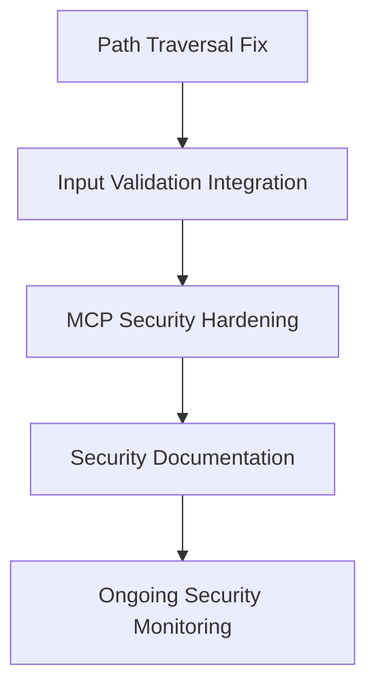

# P0 Security Task Breakdown Analysis

## 🚨 Executive Summary

This document provides comprehensive breakdowns for all P0 security tasks in the Promethean Framework repository. Each task has been analyzed for dependencies, risk factors, and implementation requirements.

## 📋 Current P0 Security Tasks

### 1. MCP Security Hardening & Validation (d794213f)
**Status**: Ready for breakdown  
**Priority**: Critical  
**Risk Level**: High - Multiple attack vectors

### 2. Comprehensive Input Validation for File Paths (f44bbb50)
**Status**: In Progress - Needs integration  
**Priority**: Critical  
**Risk Level**: High - Path traversal vulnerabilities

### 3. Critical Path Traversal Vulnerability (3c6a52c7)
**Status**: In Progress - Critical process violation  
**Priority**: Critical  
**Risk Level**: Critical - Active vulnerability

### 4. Complete breakdown for P0 security tasks (b6c5f483)
**Status**: In Progress (Current task)  
**Priority**: Critical  
**Risk Level**: Medium - Meta task

---

## 🔍 Detailed Task Analysis

### Task 1: MCP Security Hardening & Validation

#### Current State
- Comprehensive security framework designed
- 4-phase implementation plan outlined
- Clear acceptance criteria defined
- Ready for detailed subtask creation

#### Dependencies
- MCP-Kanban Bridge API (must be created first)
- Security framework integration
- Testing infrastructure

#### Risk Assessment
- **Impact**: Multiple MCP endpoints vulnerable
- **Attack Surface**: Input validation, rate limiting, file operations
- **Exploitability**: High without proper hardening

#### Recommended Subtasks
1. **Security Audit & Planning** (2 hours)
2. **Input Validation Implementation** (3 hours)
3. **Rate Limiting & Abuse Prevention** (2 hours)
4. **Security Middleware Implementation** (2 hours)
5. **Audit Logging Framework** (2 hours)
6. **Security Testing Suite** (3 hours)
7. **Deployment & Monitoring** (2 hours)

lastCommitSha: "deec21fe4553bb49020b6aa2bdfee1b89110f15d"
commitHistory: 
  - sha: "deec21fe4553bb49020b6aa2bdfee1b89110f15d"
    timestamp: "2025-10-19T16:27:40.282Z"
    action: "Bulk commit tracking initialization"
---

### Task 2: Comprehensive Input Validation for File Paths

#### Current State
- Security framework implemented but not integrated
- Process violation identified - validation exists but unused
- High-quality code but missing service integration

#### Dependencies
- Integration with indexer-service
- Connection to actual service endpoints
- End-to-end testing

#### Risk Assessment
- **Impact**: Validation logic present but bypassed
- **Attack Surface**: File path operations across services
- **Exploitability**: Medium - framework exists but not connected

#### Critical Issues
- Validation logic is unreachable in current code flow
- Array inputs completely bypass validation
- No integration tests for framework usage

#### Recommended Subtasks
1. **Integration Analysis** (1 hour)
2. **Service Integration** (3 hours)
3. **Array Input Validation** (2 hours)
4. **Integration Testing** (2 hours)
5. **End-to-End Security Validation** (2 hours)

---

### Task 3: Critical Path Traversal Vulnerability

#### Current State
- **CRITICAL PROCESS VIOLATION**
- Vulnerability still active and exploitable
- Validation logic unreachable due to early return
- Array inputs completely bypass validation

#### Dependencies
- Immediate security fix required
- Code flow restructuring
- Comprehensive security testing

#### Risk Assessment
- **Impact**: Active directory traversal vulnerability
- **Attack Surface**: indexer-service file operations
- **Exploitability**: Critical - vulnerability is live

#### Critical Issues
- Path traversal validation logic is unreachable
- Early return prevents security checks
- Array inputs bypass all validation
- This represents a critical security compliance failure

#### Recommended Subtasks
1. **URGENT: Code Flow Analysis** (30 minutes)
2. **URGENT: Validation Logic Restructuring** (1 hour)
3. **URGENT: Array Input Validation** (1 hour)
4. **URGENT: Security Testing** (1 hour)
5. **Security Review & Documentation** (30 minutes)

---

## 🎯 Implementation Priority Matrix

### Immediate (Critical - Fix Now)
1. **Path Traversal Vulnerability Fix** - Active exploit
2. **Input Validation Integration** - Framework exists but unused

### High Priority (This Sprint)
3. **MCP Security Hardening** - Comprehensive security implementation

### Medium Priority (Planning)
4. **Security Task Breakdown** - Meta task completion

---

## 🔄 Task Dependencies

---

## 📊 Resource Allocation Recommendations

### Security Specialists
- **Primary**: Security-focused agents for vulnerability fixes
- **Support**: Code review agents for validation
- **Testing**: Security testing specialists

### Time Allocation
- **Critical Fixes**: 4-6 hours immediate
- **Comprehensive Security**: 12-16 hours this sprint
- **Documentation & Monitoring**: 4-6 hours

### Risk Mitigation
- **Immediate**: Patch active vulnerabilities
- **Short-term**: Implement comprehensive security framework
- **Long-term**: Establish security monitoring and processes

---

## 🛡️ Security Best Practices Integration

### Code Review Requirements
- All security changes require dual review
- Automated security testing mandatory
- Vulnerability scanning before deployment

### Testing Requirements
- Security test coverage > 90%
- Penetration testing for all endpoints
- Regression testing for security fixes

### Documentation Requirements
- Security architecture documentation
- Incident response procedures
- Security monitoring guidelines

---

## 📈 Success Metrics

### Technical Metrics
- Zero critical security vulnerabilities
- 100% input validation coverage
- Comprehensive audit logging
- Security test coverage > 90%

### Process Metrics
- Security review completion rate
- Vulnerability remediation time < 24 hours
- Security documentation completeness
- Team security training completion

---

## 🚀 Next Steps

1. **Immediate Action**: Fix path traversal vulnerability
2. **Integration**: Connect existing validation framework
3. **Implementation**: Deploy comprehensive MCP security
4. **Monitoring**: Establish ongoing security processes
5. **Documentation**: Complete security documentation

---

**Analysis Date**: October 15, 2025  
**Status**: Ready for implementation  
**Priority**: CRITICAL - Immediate action required