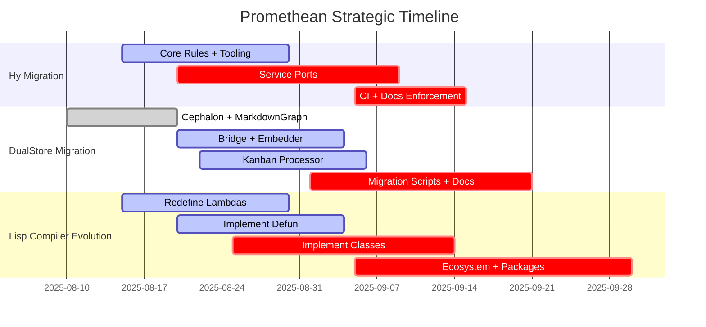

# 🗓️ Project Evolution Timeline

A high-level timeline of Promethean’s three major initiatives: **Hy Migration**, **DualStore Migration**, and **Lisp Compiler Evolution**.

---

## 📊 Timeline View

---

## 📝 Notes
- **Hy Migration**: rules + service ports must finish before Python ban is enforced.
- **DualStore**: Cephalon done, Bridge/Embedder/Kanban in progress, scripts last.
- **Compiler**: lambdas + defun unlock classes, which unlock ecosystem/packages.

---

> 🌍 Use this file in Obsidian for a timeline view of Promethean’s evolution roadmap.