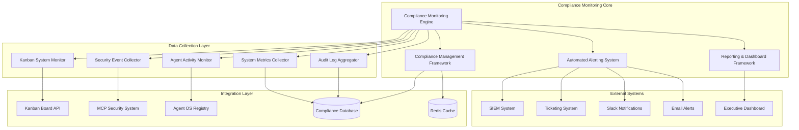
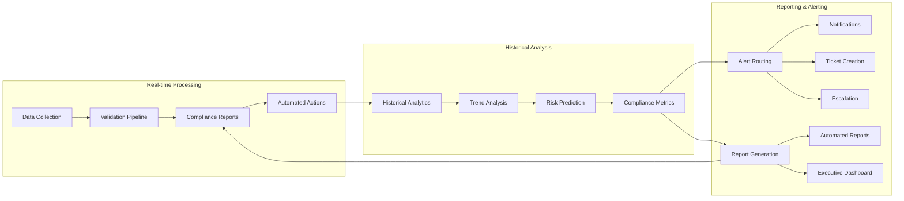
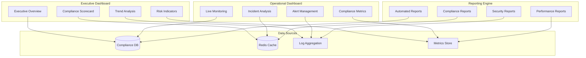
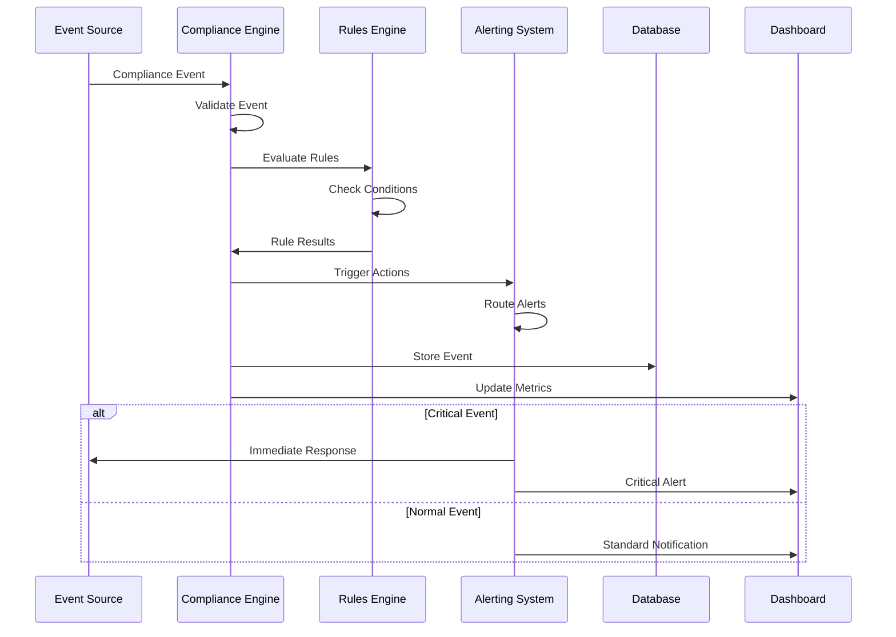
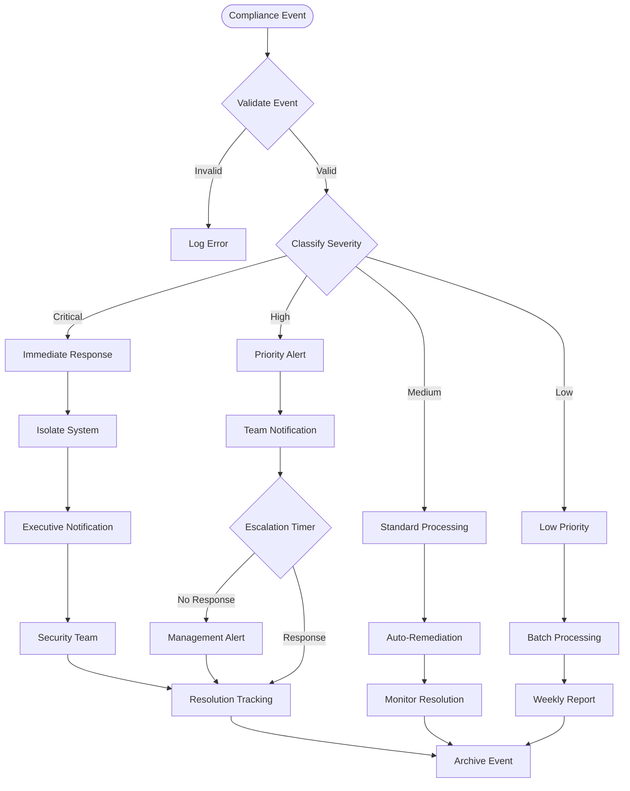
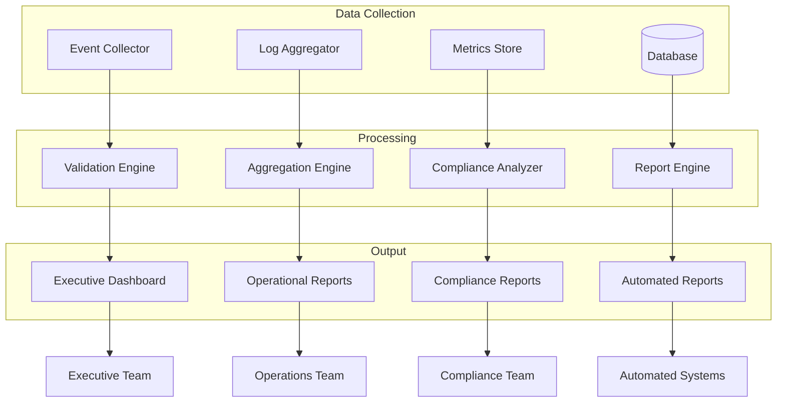

# Automated Compliance Monitoring Architecture

## Executive Summary

This document presents a comprehensive automated compliance monitoring architecture designed to provide real-time compliance monitoring, automated alerting, and integrated reporting for the Promethean Agent OS ecosystem. The architecture leverages existing infrastructure while addressing critical gaps identified in current security and compliance monitoring capabilities.

**Target Implementation**: Q4 2025  
**Architecture Priority**: P0 - Critical Infrastructure  
**Compliance Frameworks**: SOC 2 Type II, ISO 27001, GDPR, OWASP Top 10  

---

## 1. System Architecture Overview

### 1.1 High-Level Architecture



### 1.2 Component Relationships



---

## 2. Core Component Specifications

### 2.1 Compliance Monitoring Engine (CME)

#### Purpose
Real-time monitoring and analysis of compliance events across all system components.

#### Technology Stack
- **Runtime**: Node.js with TypeScript
- **Processing**: Event-driven architecture with Redis streams
- **Storage**: MongoDB for compliance data, Redis for caching
- **Validation**: Zod schemas for rule validation

#### Core Interfaces

```typescript
interface ComplianceEvent {
  eventId: string;
  timestamp: Date;
  source: ComplianceSource;
  eventType: ComplianceEventType;
  severity: ComplianceSeverity;
  data: ComplianceEventData;
  metadata: EventMetadata;
}

interface ComplianceRule {
  ruleId: string;
  name: string;
  description: string;
  framework: ComplianceFramework;
  category: ComplianceCategory;
  conditions: RuleCondition[];
  actions: RuleAction[];
  enabled: boolean;
  priority: RulePriority;
}

interface ComplianceSource {
  systemId: string;
  componentName: string;
  version: string;
  environment: 'development' | 'staging' | 'production';
}

enum ComplianceEventType {
  KANBAN_VIOLATION = 'kanban_violation',
  SECURITY_BREACH = 'security_breach',
  PROCESS_DEVIATION = 'process_deviation',
  AUTHORIZATION_FAILURE = 'authorization_failure',
  DATA_ACCESS_VIOLATION = 'data_access_violation',
  COMPLIANCE_DRIFT = 'compliance_drift',
  POLICY_VIOLATION = 'policy_violation'
}

enum ComplianceSeverity {
  CRITICAL = 'critical',
  HIGH = 'high',
  MEDIUM = 'medium',
  LOW = 'low',
  INFO = 'info'
}
```

#### Implementation Architecture

```typescript
export class ComplianceMonitoringEngine {
  private eventProcessors: Map<ComplianceEventType, EventProcessor>;
  private ruleEngine: ComplianceRuleEngine;
  private alertManager: AlertManager;
  private dataStore: ComplianceDataStore;
  private metricsCollector: MetricsCollector;

  constructor(config: ComplianceEngineConfig) {
    this.initializeProcessors();
    this.ruleEngine = new ComplianceRuleEngine(config.rules);
    this.alertManager = new AlertManager(config.alerting);
    this.dataStore = new ComplianceDataStore(config.database);
    this.metricsCollector = new MetricsCollector();
  }

  async processEvent(event: ComplianceEvent): Promise<ProcessingResult> {
    const startTime = Date.now();
    
    try {
      // Validate event structure
      const validatedEvent = await this.validateEvent(event);
      
      // Process event through appropriate processor
      const processor = this.eventProcessors.get(event.eventType);
      if (!processor) {
        throw new Error(`No processor found for event type: ${event.eventType}`);
      }
      
      const processedEvent = await processor.process(validatedEvent);
      
      // Evaluate against compliance rules
      const ruleResults = await this.ruleEngine.evaluate(processedEvent);
      
      // Execute automated actions
      const actionResults = await this.executeActions(ruleResults);
      
      // Store event and results
      await this.dataStore.storeEvent({
        event: processedEvent,
        ruleResults,
        actionResults,
        processingTime: Date.now() - startTime
      });
      
      // Update metrics
      this.metricsCollector.recordEventProcessed(event.eventType, Date.now() - startTime);
      
      return {
        success: true,
        eventId: event.eventId,
        actionsTriggered: actionResults.length,
        processingTime: Date.now() - startTime
      };
    } catch (error) {
      await this.handleProcessingError(event, error);
      throw error;
    }
  }

  private async initializeProcessors(): Promise<void> {
    this.eventProcessors.set(ComplianceEventType.KANBAN_VIOLATION, new KanbanViolationProcessor());
    this.eventProcessors.set(ComplianceEventType.SECURITY_BREACH, new SecurityBreachProcessor());
    this.eventProcessors.set(ComplianceEventType.PROCESS_DEVIATION, new ProcessDeviationProcessor());
    this.eventProcessors.set(ComplianceEventType.AUTHORIZATION_FAILURE, new AuthFailureProcessor());
    this.eventProcessors.set(ComplianceEventType.DATA_ACCESS_VIOLATION, new DataAccessViolationProcessor());
    this.eventProcessors.set(ComplianceEventType.COMPLIANCE_DRIFT, new ComplianceDriftProcessor());
    this.eventProcessors.set(ComplianceEventType.POLICY_VIOLATION, new PolicyViolationProcessor());
  }
}
```

### 2.2 Automated Alerting System (AAS)

#### Purpose
Intelligent alerting with escalation, routing, and automated response capabilities.

#### Alert Classification Matrix

| Alert Type | Severity | Response Time | Escalation Path | Auto-Resolution |
|------------|-----------|---------------|------------------|------------------|
| Critical Security Breach | Critical | < 5 minutes | Security Team → Management | No |
| Kanban Process Violation | High | < 15 minutes | Process Team → Kanban Admin | Yes |
| Authorization Failure | High | < 10 minutes | Security Team → System Admin | Partial |
| Compliance Drift | Medium | < 1 hour | Compliance Team | Yes |
| Performance Degradation | Medium | < 30 minutes | Ops Team | Yes |
| Policy Violation | Low | < 4 hours | Relevant Team | Yes |

#### Alert Management Implementation

```typescript
export class AutomatedAlertingSystem {
  private alertRoutes: Map<AlertType, AlertRoute[]>;
  private escalationManager: EscalationManager;
  private notificationService: NotificationService;
  private ticketingIntegration: TicketingIntegration;

  async processAlert(alert: ComplianceAlert): Promise<AlertResult> {
    // Determine alert severity and routing
    const routing = await this.determineRouting(alert);
    
    // Check for duplicate alerts
    if (await this.isDuplicate(alert)) {
      return { action: 'deduplicated', alertId: alert.id };
    }
    
    // Execute immediate actions
    const immediateActions = await this.executeImmediateActions(alert);
    
    // Route to appropriate channels
    const routingResults = await this.routeAlert(alert, routing);
    
    // Set up escalation if needed
    const escalation = await this.setupEscalation(alert, routing);
    
    // Create audit trail
    await this.createAlertAuditTrail(alert, {
      routing,
      immediateActions,
      routingResults,
      escalation
    });
    
    return {
      action: 'processed',
      alertId: alert.id,
      routesTriggered: routingResults.length,
      escalationScheduled: escalation !== null
    };
  }

  private async determineRouting(alert: ComplianceAlert): Promise<AlertRouting> {
    const routes = this.alertRoutes.get(alert.type) || [];
    
    // Apply business rules for routing
    const filteredRoutes = routes.filter(route => 
      this.matchesCriteria(alert, route.criteria)
    );
    
    // Sort by priority
    filteredRoutes.sort((a, b) => b.priority - a.priority);
    
    return {
      primary: filteredRoutes[0] || null,
      secondary: filteredRoutes.slice(1),
      escalation: this.getEscalationPath(alert)
    };
  }

  private async executeImmediateActions(alert: ComplianceAlert): Promise<ActionResult[]> {
    const actions: ActionResult[] = [];
    
    // Auto-remediation for known issues
    if (alert.autoRemediationAvailable) {
      try {
        const remediation = await this.autoRemediate(alert);
        actions.push(remediation);
      } catch (error) {
        // Log remediation failure
        await this.logRemediationFailure(alert, error);
      }
    }
    
    // Isolation for critical security events
    if (alert.severity === ComplianceSeverity.CRITICAL && alert.type.includes('security')) {
      const isolation = await this.isolateAffectedSystem(alert);
      actions.push(isolation);
    }
    
    // Evidence preservation
    if (alert.requiresEvidencePreservation) {
      const preservation = await this.preserveEvidence(alert);
      actions.push(preservation);
    }
    
    return actions;
  }
}
```

### 2.3 Reporting & Dashboard Framework

#### Purpose
Comprehensive reporting, visualization, and executive dashboard for compliance metrics.

#### Dashboard Architecture



#### Key Metrics & KPIs

```typescript
interface ComplianceMetrics {
  // Overall Compliance Score
  overallScore: number;
  frameworkScores: {
    soc2: number;
    iso27001: number;
    gdpr: number;
    owasp: number;
  };
  
  // Incident Metrics
  incidentMetrics: {
    totalIncidents: number;
    criticalIncidents: number;
    averageResolutionTime: number;
    mttr: number; // Mean Time To Resolution
    mttd: number; // Mean Time To Detection
  };
  
  // Process Metrics
  processMetrics: {
    kanbanCompliance: number;
    securityEventRate: number;
    authorizationFailureRate: number;
    dataAccessViolationRate: number;
  };
  
  // Trend Metrics
  trendMetrics: {
    complianceTrend: 'improving' | 'stable' | 'degrading';
    riskTrend: 'increasing' | 'stable' | 'decreasing';
    performanceTrend: 'improving' | 'stable' | 'degrading';
  };
}
```

---

## 3. Integration Specifications

### 3.1 Kanban System Integration

#### Integration Points

1. **Real-time Task Monitoring**
   - Monitor task status changes
   - Validate transitions against FSM rules
   - Detect WIP limit violations
   - Track task aging and bottlenecks

2. **Process Compliance Validation**
   - Validate task creation against required fields
   - Monitor task assignment patterns
   - Detect unauthorized status changes
   - Track workflow violations

#### Implementation

```typescript
export class KanbanComplianceMonitor {
  private kanbanApi: KanbanApiClient;
  private complianceEngine: ComplianceMonitoringEngine;
  private fsmValidator: FSMValidator;

  async monitorTaskTransitions(): Promise<void> {
    // Subscribe to kanban events
    this.kanbanApi.subscribe('task.status.changed', async (event) => {
      await this.validateTaskTransition(event);
    });
    
    this.kanbanApi.subscribe('task.created', async (event) => {
      await this.validateTaskCreation(event);
    });
    
    this.kanbanApi.subscribe('task.assigned', async (event) => {
      await this.validateTaskAssignment(event);
    });
  }

  private async validateTaskTransition(event: TaskTransitionEvent): Promise<void> {
    const complianceEvent: ComplianceEvent = {
      eventId: generateEventId(),
      timestamp: new Date(),
      source: {
        systemId: 'kanban-system',
        componentName: 'task-workflow',
        version: '1.0.0',
        environment: 'production'
      },
      eventType: ComplianceEventType.KANBAN_VIOLATION,
      severity: ComplianceSeverity.MEDIUM,
      data: {
        taskId: event.taskId,
        oldStatus: event.oldStatus,
        newStatus: event.newStatus,
        transition: `${event.oldStatus}->${event.newStatus}`,
        agentId: event.agentId
      },
      metadata: {
        correlationId: event.correlationId,
        requestId: event.requestId
      }
    };

    // Validate against FSM rules
    const isValidTransition = await this.fsmValidator.validateTransition(
      event.oldStatus,
      event.newStatus
    );

    if (!isValidTransition.valid) {
      complianceEvent.severity = ComplianceSeverity.HIGH;
      complianceEvent.data.violationType = 'illegal_transition';
      complianceEvent.data.violationDetails = isValidTransition.error;
    }

    // Check WIP limits
    const wipCheck = await this.checkWIPLimits(event.newStatus);
    if (!wipCheck.withinLimits) {
      complianceEvent.severity = ComplianceSeverity.HIGH;
      complianceEvent.data.violationType = 'wip_limit_exceeded';
      complianceEvent.data.wipDetails = wipCheck;
    }

    await this.complianceEngine.processEvent(complianceEvent);
  }
}
```

### 3.2 Security System Integration

#### Integration Points

1. **Security Event Aggregation**
   - Collect security events from MCP system
   - Aggregate authentication failures
   - Monitor authorization violations
   - Track security policy violations

2. **Vulnerability Monitoring**
   - Integrate with security scanning tools
   - Monitor for new vulnerabilities
   - Track remediation progress
   - Validate security controls

#### Implementation

```typescript
export class SecurityComplianceMonitor {
  private mcpSecurity: McpSecuritySystem;
  private vulnerabilityScanner: VulnerabilityScanner;
  private complianceEngine: ComplianceMonitoringEngine;

  async initializeSecurityMonitoring(): Promise<void> {
    // Subscribe to MCP security events
    this.mcpSecurity.on('security.breach', this.handleSecurityBreach.bind(this));
    this.mcpSecurity.on('auth.failure', this.handleAuthFailure.bind(this));
    this.mcpSecurity.on('policy.violation', this.handlePolicyViolation.bind(this));
    
    // Schedule vulnerability scans
    setInterval(() => {
      this.performVulnerabilityScan();
    }, 24 * 60 * 60 * 1000); // Daily
  }

  private async handleSecurityBreach(event: SecurityBreachEvent): Promise<void> {
    const complianceEvent: ComplianceEvent = {
      eventId: generateEventId(),
      timestamp: new Date(),
      source: {
        systemId: 'mcp-security',
        componentName: 'security-monitor',
        version: '1.0.0',
        environment: 'production'
      },
      eventType: ComplianceEventType.SECURITY_BREACH,
      severity: this.mapSecuritySeverity(event.severity),
      data: {
        breachType: event.type,
        affectedSystem: event.system,
        attackerInfo: event.attacker,
        impact: event.impact,
        evidence: event.evidence
      },
      metadata: {
        correlationId: event.correlationId,
        detectionMethod: event.detectionMethod
      }
    };

    await this.complianceEngine.processEvent(complianceEvent);
  }

  private async performVulnerabilityScan(): Promise<void> {
    const scanResults = await this.vulnerabilityScanner.scanAllSystems();
    
    for (const vulnerability of scanResults) {
      if (vulnerability.severity === 'critical' || vulnerability.severity === 'high') {
        const complianceEvent: ComplianceEvent = {
          eventId: generateEventId(),
          timestamp: new Date(),
          source: {
            systemId: 'vulnerability-scanner',
            componentName: 'security-monitor',
            version: '1.0.0',
            environment: 'production'
          },
          eventType: ComplianceEventType.SECURITY_BREACH,
          severity: vulnerability.severity === 'critical' ? 
            ComplianceSeverity.CRITICAL : ComplianceSeverity.HIGH,
          data: {
            vulnerabilityType: 'security_vulnerability',
            cveId: vulnerability.cveId,
            affectedSystem: vulnerability.system,
            severity: vulnerability.severity,
            cvssScore: vulnerability.cvssScore,
            remediationStatus: vulnerability.remediationStatus
          },
          metadata: {
            scanId: scanResults.scanId,
            scannerVersion: vulnerability.scannerVersion
          }
        };

        await this.complianceEngine.processEvent(complianceEvent);
      }
    }
  }
}
```

### 3.3 Agent OS Integration

#### Integration Points

1. **Agent Activity Monitoring**
   - Monitor agent lifecycle events
   - Track resource usage patterns
   - Validate agent permissions
   - Monitor inter-agent communications

2. **Resource Compliance**
   - Monitor resource allocation
   - Track quota violations
   - Validate sandbox compliance
   - Monitor performance metrics

#### Implementation

```typescript
export class AgentOSComplianceMonitor {
  private agentRegistry: AgentRegistry;
  private resourceManager: ResourceManager;
  private complianceEngine: ComplianceMonitoringEngine;

  async initializeAgentMonitoring(): Promise<void> {
    // Monitor agent lifecycle
    this.agentRegistry.on('agent.created', this.handleAgentCreated.bind(this));
    this.agentRegistry.on('agent.terminated', this.handleAgentTerminated.bind(this));
    this.agentRegistry.on('agent.status.changed', this.handleAgentStatusChanged.bind(this));
    
    // Monitor resource usage
    this.resourceManager.on('quota.exceeded', this.handleQuotaExceeded.bind(this));
    this.resourceManager.on('resource.violation', this.handleResourceViolation.bind(this));
  }

  private async handleAgentCreated(event: AgentCreatedEvent): Promise<void> {
    // Validate agent configuration against compliance requirements
    const complianceCheck = await this.validateAgentConfiguration(event.agentConfig);
    
    if (!complianceCheck.compliant) {
      const complianceEvent: ComplianceEvent = {
        eventId: generateEventId(),
        timestamp: new Date(),
        source: {
          systemId: 'agent-os',
          componentName: 'agent-registry',
          version: '1.0.0',
          environment: 'production'
        },
        eventType: ComplianceEventType.POLICY_VIOLATION,
        severity: ComplianceSeverity.HIGH,
        data: {
          violationType: 'agent_configuration_compliance',
          agentId: event.agentId,
          agentType: event.agentType,
          violations: complianceCheck.violations,
          configuration: event.agentConfig
        },
        metadata: {
          correlationId: event.correlationId
        }
      };

      await this.complianceEngine.processEvent(complianceEvent);
    }
  }

  private async validateAgentConfiguration(config: AgentConfiguration): Promise<ComplianceCheck> {
    const violations: string[] = [];
    
    // Check security configuration
    if (!config.security || !config.security.sandboxEnabled) {
      violations.push('Agent must have sandbox enabled');
    }
    
    // Check resource limits
    if (config.resources && config.resources.cpu > 4) {
      violations.push('Agent CPU limit exceeds maximum allowed');
    }
    
    // Check permissions
    if (config.permissions && config.permissions.includes('system.admin')) {
      violations.push('Agent should not have system admin permissions');
    }
    
    return {
      compliant: violations.length === 0,
      violations
    };
  }
}
```

---

## 4. Data Flow Diagrams

### 4.1 Event Processing Flow



### 4.2 Alert Escalation Flow



### 4.3 Compliance Reporting Flow



---

## 5. API Contracts

### 5.1 Compliance Monitoring API

#### Base URL
```
https://api.promethean.ai/compliance/v1
```

#### Authentication
```http
Authorization: Bearer <jwt_token>
X-API-Key: <api_key>
```

#### Core Endpoints

##### Submit Compliance Event
```http
POST /events
Content-Type: application/json

{
  "eventId": "evt_123456789",
  "timestamp": "2025-10-22T10:30:00Z",
  "source": {
    "systemId": "kanban-system",
    "componentName": "task-workflow",
    "version": "1.0.0",
    "environment": "production"
  },
  "eventType": "kanban_violation",
  "severity": "high",
  "data": {
    "taskId": "task_abc123",
    "violationType": "illegal_transition",
    "oldStatus": "todo",
    "newStatus": "done"
  },
  "metadata": {
    "correlationId": "corr_xyz789",
    "requestId": "req_def456"
  }
}
```

**Response:**
```json
{
  "success": true,
  "eventId": "evt_123456789",
  "processedAt": "2025-10-22T10:30:05Z",
  "actionsTriggered": 2,
  "processingTime": 1250,
  "ruleResults": [
    {
      "ruleId": "kanban_illegal_transition",
      "matched": true,
      "severity": "high",
      "actions": ["alert", "ticket_creation"]
    }
  ]
}
```

##### Get Compliance Metrics
```http
GET /metrics?period=24h&framework=soc2&includeTrends=true
```

**Response:**
```json
{
  "success": true,
  "data": {
    "period": "24h",
    "overallScore": 94.2,
    "frameworkScores": {
      "soc2": 96.1,
      "iso27001": 92.8,
      "gdpr": 95.5,
      "owasp": 92.4
    },
    "incidentMetrics": {
      "totalIncidents": 12,
      "criticalIncidents": 1,
      "averageResolutionTime": 1800000,
      "mttr": 1620000,
      "mttd": 240000
    },
    "trends": {
      "complianceTrend": "improving",
      "riskTrend": "decreasing",
      "performanceTrend": "stable"
    }
  }
}
```

##### Create Compliance Rule
```http
POST /rules
Content-Type: application/json

{
  "name": "Kanban WIP Limit Violation",
  "description": "Detect when WIP limits are exceeded in kanban columns",
  "framework": "internal_process",
  "category": "process_compliance",
  "conditions": [
    {
      "field": "eventType",
      "operator": "equals",
      "value": "kanban_violation"
    },
    {
      "field": "data.violationType",
      "operator": "equals",
      "value": "wip_limit_exceeded"
    }
  ],
  "actions": [
    {
      "type": "alert",
      "config": {
        "severity": "high",
        "channels": ["slack", "email"],
        "recipients": ["kanban-admins@promethean.ai"]
      }
    },
    {
      "type": "ticket",
      "config": {
        "title": "Kanban WIP Limit Violation",
        "priority": "high",
        "assignee": "kanban-team"
      }
    }
  ],
  "enabled": true,
  "priority": 1
}
```

### 5.2 Alerting API

#### Alert Management Endpoints

##### Get Active Alerts
```http
GET /alerts?status=active&severity=high&limit=50&offset=0
```

##### Acknowledge Alert
```http
POST /alerts/{alertId}/acknowledge
Content-Type: application/json

{
  "acknowledgedBy": "user_123",
  "comment": "Investigating the issue",
  "estimatedResolution": "2025-10-22T14:00:00Z"
}
```

##### Resolve Alert
```http
POST /alerts/{alertId}/resolve
Content-Type: application/json

{
  "resolvedBy": "user_123",
  "resolution": "Fixed the WIP limit violation by moving tasks to breakdown",
  "preventiveActions": [
    "Added monitoring for WIP limit approach",
    "Updated kanban process documentation"
  ]
}
```

### 5.3 Reporting API

#### Report Generation Endpoints

##### Generate Compliance Report
```http
POST /reports/generate
Content-Type: application/json

{
  "type": "compliance_summary",
  "period": {
    "start": "2025-10-01T00:00:00Z",
    "end": "2025-10-31T23:59:59Z"
  },
  "frameworks": ["soc2", "iso27001", "gdpr"],
  "format": "pdf",
  "recipients": ["compliance-team@promethean.ai"],
  "schedule": {
    "frequency": "monthly",
    "dayOfMonth": 1
  }
}
```

##### Get Report Status
```http
GET /reports/{reportId}/status
```

**Response:**
```json
{
  "success": true,
  "data": {
    "reportId": "rpt_abc123",
    "status": "completed",
    "generatedAt": "2025-10-22T11:00:00Z",
    "downloadUrl": "https://api.promethean.ai/reports/rpt_abc123/download",
    "size": 2048576,
    "format": "pdf"
  }
}
```

---

## 6. Technology Stack Recommendations

### 6.1 Core Infrastructure

| Component | Technology | Rationale |
|-----------|-------------|-----------|
| **Runtime** | Node.js 18+ | TypeScript support, ecosystem compatibility |
| **Database** | MongoDB 6.0+ | Document storage for complex compliance events |
| **Cache** | Redis 7.0+ | Real-time data, pub/sub, session storage |
| **Message Queue** | Redis Streams | Lightweight, reliable event processing |
| **API Gateway** | Express.js + Helmet | Security headers, rate limiting |
| **Monitoring** | Prometheus + Grafana | Metrics collection and visualization |

### 6.2 Security & Compliance

| Component | Technology | Rationale |
|-----------|-------------|-----------|
| **Authentication** | JWT + OAuth 2.0 | Industry standard, scalable |
| **Authorization** | RBAC with ABAC | Fine-grained access control |
| **Encryption** | AES-256 + TLS 1.3 | Strong encryption standards |
| **Audit Logging** | Immutable append-only logs | Tamper-evident audit trail |
| **Vulnerability Scanning** | OWASP ZAP + Snyk | Comprehensive security scanning |

### 6.3 Development & Operations

| Component | Technology | Rationale |
|-----------|-------------|-----------|
| **Language** | TypeScript | Type safety, better development experience |
| **Testing** | AVA + Supertest | Existing project standards |
| **CI/CD** | GitHub Actions | Integration with existing workflows |
| **Containerization** | Docker + Kubernetes | Scalability, orchestration |
| **Infrastructure as Code** | Terraform | Reproducible infrastructure |

### 6.4 Monitoring & Observability

| Component | Technology | Rationale |
|-----------|-------------|-----------|
| **Metrics** | Prometheus + Grafana | Industry standard monitoring |
| **Logging** | Winston + ELK Stack | Structured logging, search capabilities |
| **Tracing** | OpenTelemetry | Distributed tracing |
| **Error Tracking** | Sentry | Real-time error monitoring |
| **Health Checks** | Custom health endpoints | Service reliability monitoring |

---

## 7. Implementation Roadmap

### Phase 1: Foundation (Weeks 1-4)

#### Week 1-2: Core Infrastructure
- [ ] Set up development environment
- [ ] Implement basic compliance event schema
- [ ] Create compliance monitoring engine core
- [ ] Set up database schema and connections
- [ ] Implement basic event validation

#### Week 3-4: Integration Layer
- [ ] Implement kanban system integration
- [ ] Create security system connectors
- [ ] Set up basic agent OS monitoring
- [ ] Implement event processing pipeline
- [ ] Create basic alerting framework

### Phase 2: Advanced Features (Weeks 5-8)

#### Week 5-6: Rules Engine & Automation
- [ ] Implement comprehensive rules engine
- [ ] Create automated response system
- [ ] Implement escalation workflows
- [ ] Add auto-remediation capabilities
- [ ] Create alert routing system

#### Week 7-8: Reporting & Dashboards
- [ ] Implement reporting engine
- [ ] Create executive dashboard
- [ ] Build operational monitoring interface
- [ ] Add compliance metrics calculation
- [ ] Implement trend analysis

### Phase 3: Production Readiness (Weeks 9-12)

#### Week 9-10: Security & Performance
- [ ] Implement comprehensive security controls
- [ ] Add performance optimization
- [ ] Create comprehensive test suite
- [ ] Implement disaster recovery procedures
- [ ] Add monitoring and alerting for the system itself

#### Week 11-12: Deployment & Documentation
- [ ] Deploy to staging environment
- [ ] Conduct comprehensive testing
- [ ] Deploy to production
- [ ] Create user documentation
- [ ] Train operations team

### Phase 4: Optimization (Weeks 13-16)

#### Week 13-14: Advanced Analytics
- [ ] Implement machine learning for anomaly detection
- [ ] Add predictive compliance analytics
- [ ] Create advanced reporting features
- [ ] Implement compliance score prediction

#### Week 15-16: Integration & Enhancement
- [ ] Integrate with external compliance systems
- [ ] Add advanced workflow automation
- [ ] Implement mobile alerting
- [ ] Create compliance API for external systems

---

## 8. Success Metrics & KPIs

### 8.1 System Performance Metrics

| Metric | Target | Measurement |
|--------|--------|-------------|
| **Event Processing Latency** | < 100ms (P95) | Time from event receipt to processing completion |
| **Alert Response Time** | < 5 minutes (Critical) | Time from event detection to alert notification |
| **System Availability** | 99.9% | Uptime of compliance monitoring system |
| **False Positive Rate** | < 2% | Percentage of alerts that are false positives |
| **Throughput** | 10,000 events/second | Maximum event processing capacity |

### 8.2 Compliance Effectiveness Metrics

| Metric | Target | Measurement |
|--------|--------|-------------|
| **Compliance Score** | > 95% | Overall compliance across all frameworks |
| **Incident Detection Rate** | > 98% | Percentage of compliance incidents detected |
| **Mean Time To Detection (MTTD)** | < 5 minutes | Average time to detect compliance violations |
| **Mean Time To Resolution (MTTR)** | < 2 hours | Average time to resolve compliance issues |
| **Recurrence Rate** | < 5% | Percentage of resolved issues that recur |

### 8.3 Business Impact Metrics

| Metric | Target | Measurement |
|--------|--------|-------------|
| **Risk Reduction** | 80% reduction in high-risk compliance gaps | Reduction in identified compliance risks |
| **Operational Efficiency** | 50% reduction in manual compliance work | Time saved through automation |
| **Audit Readiness** | 100% audit readiness | Ability to pass compliance audits |
| **Cost Savings** | 30% reduction in compliance costs | Reduced manual effort and penalty avoidance |
| **Stakeholder Satisfaction** | > 90% satisfaction | User satisfaction with compliance system |

---

## 9. Security Considerations

### 9.1 Data Protection

#### Encryption Requirements
- **Data at Rest**: AES-256 encryption for all stored compliance data
- **Data in Transit**: TLS 1.3 for all API communications
- **Key Management**: Hardware security modules (HSM) for encryption keys
- **Data Classification**: Automatic classification and handling based on sensitivity

#### Access Control
- **Authentication**: Multi-factor authentication for all administrative access
- **Authorization**: Role-based access control with least privilege principle
- **Audit Trails**: Comprehensive logging of all access and modifications
- **Session Management**: Secure session handling with automatic timeout

### 9.2 System Security

#### Application Security
- **Input Validation**: Comprehensive validation of all inputs using Zod schemas
- **Output Encoding**: Proper encoding to prevent injection attacks
- **Error Handling**: Secure error handling without information disclosure
- **Security Headers**: Implementation of all recommended security headers

#### Infrastructure Security
- **Network Security**: Network segmentation and firewall rules
- **Container Security**: Secure container configurations and runtime protection
- **Secrets Management**: Centralized secrets management with rotation
- **Vulnerability Management**: Regular scanning and patching

### 9.3 Compliance Framework Support

#### SOC 2 Type II
- **Security**: Implementation of security controls and monitoring
- **Availability**: High availability and disaster recovery capabilities
- **Processing Integrity**: Data validation and processing controls
- **Confidentiality**: Data protection and access controls
- **Privacy**: Personal data handling and privacy controls

#### ISO 27001
- **Information Security Policies**: Comprehensive security policy framework
- **Risk Management**: Systematic risk assessment and treatment
- **Asset Management**: Identification and protection of information assets
- **Access Control**: Controlled access to information systems
- **Operations Security**: Secure operations and change management

#### GDPR
- **Lawful Processing**: Legal basis for all data processing
- **Data Minimization**: Collection and processing of necessary data only
- **Subject Rights**: Support for data subject rights requests
- **Breach Notification**: Procedures for security breach notification
- **Data Protection**: Technical and organizational measures for data protection

---

## 10. Conclusion

The automated compliance monitoring architecture presented in this document provides a comprehensive solution for real-time compliance monitoring, automated alerting, and integrated reporting across the Promethean Agent OS ecosystem. By leveraging existing infrastructure and addressing identified gaps, this system will significantly improve compliance posture while reducing manual effort and operational costs.

### Key Benefits

1. **Real-time Compliance Monitoring**: Immediate detection and response to compliance violations
2. **Automated Alerting**: Intelligent alert routing with escalation and auto-remediation
3. **Comprehensive Reporting**: Executive dashboards and detailed compliance reports
4. **Multi-Framework Support**: Support for SOC 2, ISO 27001, GDPR, and OWASP
5. **Scalable Architecture**: Designed to handle growth in complexity and volume

### Success Factors

- **Integration with Existing Systems**: Leverages current kanban, security, and agent OS infrastructure
- **Automation-First Approach**: Reduces manual effort and improves response times
- **Comprehensive Coverage**: Addresses all major compliance domains and frameworks
- **Future-Proof Design**: Extensible architecture for evolving compliance requirements

This architecture positions Promethean for continued growth while maintaining strong compliance and security posture in an increasingly complex regulatory environment.

---

**Document Version**: 1.0  
**Last Updated**: October 22, 2025  
**Next Review**: January 22, 2026  
**Architecture Team**: compliance-architecture@promethean.ai