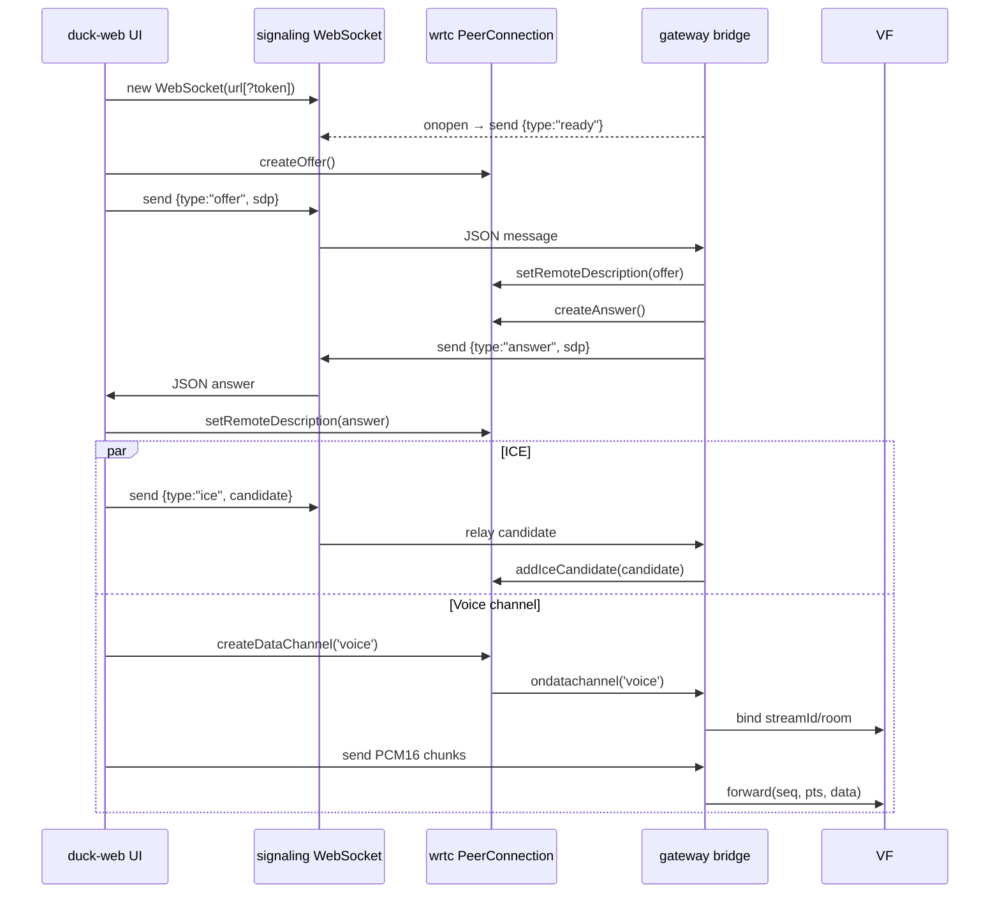
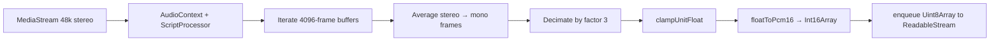
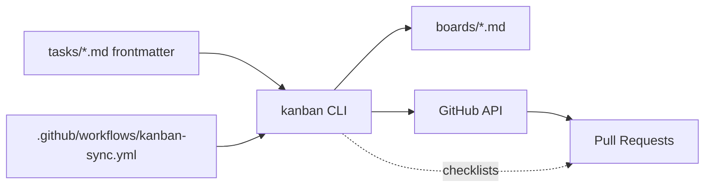

# Duck Revival — System Diagrams

## 1) Architecture (high level)
```mermaid
flowchart LR
  subgraph Browser[duck-web]
    MIC[Mic capture (MediaStream)]
    DSP[ScriptProcessor 48k → 16k mono]
    PCM[duck-audio float→PCM16]
    VOICE[RTCDataChannel 'voice']
    EVENTS[RTCDataChannel 'events']
    SIGNAL[WebSocket signaling]
    AUDIO[RTCDataChannel 'audio' (optional playback)]
  end
  subgraph Gateway[enso-browser-gateway]
    WS[Signaling WS (token?)]
    PC[wrtc RTCPeerConnection]
    VF[Voice Forwarder (seq/pts)]
    ENSO[EnsoClient voice/text]
  end
  subgraph Cephalon[cephalon/enso]
    ROOM[voice room + timeline]
  end

  MIC --> DSP --> PCM --> VOICE
  SIGNAL --> WS --> PC
  VOICE --> PC
  PC --> VF --> ENSO --> ROOM
  ENSO -->|content.post| EVENTS
  PC --> AUDIO
```

## 2) Signaling + media negotiation (sequence)


## 3) Audio capture + downsampling


## 4) Process-as-code pipeline

