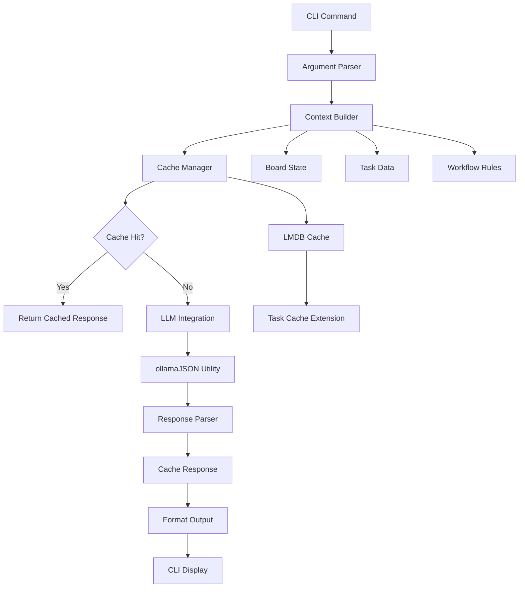

# LLM-Powered Kanban Explain Command Implementation Plan

> _Comprehensive documentation for implementing `pnpm kanban explain` command with AI-powered insights_

---

## 📋 Implementation Overview

This document outlines the complete implementation plan for adding an LLM-powered `explain` command to the Promethean kanban system. The command will leverage existing infrastructure to provide intelligent explanations of board state, task patterns, workflow issues, and recommendations.

### Core Objectives

- **Intelligent Analysis**: Use LLM to analyze kanban board state and provide contextual insights
- **Performance Optimization**: Implement caching to minimize LLM calls and improve response times
- **Seamless Integration**: Follow existing Promethean patterns for CLI commands, caching, and error handling
- **Extensible Architecture**: Design for future enhancements and additional analysis types

### High-Level Architecture

```
CLI Command → Context Builder → Cache Manager → LLM Integration → Response Parser → CLI Output
     ↓               ↓              ↓             ↓              ↓           ↓
  User Input    Board State     LMDB Cache    ollamaJSON()   Structured   Formatted
  Parsing       Extraction      Check/Store   Utility        Response    Markdown/JSON
```

---

## 🏗️ Technical Architecture

### File Structure & Module Organization

```
packages/kanban/src/
├── cli/
│   └── command-handlers.ts          # Add handleExplain handler
├── lib/
│   ├── explain/                     # New module
│   │   ├── context-builder.ts       # Board state extraction
│   │   ├── llm-integration.ts      # LLM prompt engineering
│   │   ├── response-parser.ts       # Response structuring
│   │   ├── cache-manager.ts         # LLM response caching
│   │   ├── types.ts                # Explain-specific types
│   │   └── index.ts                # Module exports
│   ├── markdown-output.ts           # Add explain output formatter
│   └── types.ts                    # Core types (already exists)
└── board/
    ├── task-cache.ts                # Extend for LLM caching
    └── config.ts                   # Config loading (already exists)
```

### Data Flow Architecture



### Performance Considerations

- **Caching Strategy**: Cache LLM responses based on board state hash and query type
- **Batch Processing**: Process multiple related queries in single LLM call
- **Incremental Updates**: Only invalidate cache when board state changes
- **Timeout Management**: 2-minute default timeout for LLM responses
- **Memory Efficiency**: Use streaming for large board states

---

## 🔧 Key Components

### 1. Context Builder (`context-builder.ts`)

**Purpose**: Extract and structure board state for LLM analysis

**Key Functions**:

```typescript
export interface ExplainContext {
  boardState: BoardSnapshot;
  taskAnalytics: TaskAnalytics;
  workflowMetrics: WorkflowMetrics;
  queryType: ExplainQueryType;
  timestamp: string;
}

export interface BoardSnapshot {
  columns: ColumnSnapshot[];
  totalTasks: number;
  taskDistribution: Record<string, number>;
  wipViolations: WIPViolation[];
  blockedTasks: BlockedTask[];
}

export interface TaskAnalytics {
  agingTasks: AgingTask[];
  priorityDistribution: Record<string, number>;
  labelFrequency: Record<string, number>;
  completionTrends: CompletionTrend[];
}

export interface WorkflowMetrics {
  averageCycleTime: number;
  bottleneckColumns: string[];
  flowEfficiency: number;
  transitionFrequency: Record<string, number>;
}
```

**Implementation Strategy**:

- Leverage existing `loadBoard()` and `TaskCache` for data extraction
- Use existing `makeEventLogManager()` for workflow metrics
- Integrate with existing WIP limit enforcement for violations
- Follow existing patterns for data aggregation

### 2. LLM Integration (`llm-integration.ts`)

**Purpose**: Craft prompts and handle LLM communication using existing infrastructure

**Key Functions**:

```typescript
export interface ExplainPrompt {
  queryType: ExplainQueryType;
  context: ExplainContext;
  userQuery?: string;
  options: ExplainOptions;
}

export type ExplainQueryType =
  | 'general'
  | 'blocked_tasks'
  | 'workflow_analysis'
  | 'recommendations'
  | 'task_specific'
  | 'status_analysis'
  | 'wip_analysis';

export interface ExplainOptions {
  includeRecommendations?: boolean;
  includeMetrics?: boolean;
  focusArea?: string;
  verbosity: 'concise' | 'detailed' | 'comprehensive';
}
```

**Prompt Engineering Strategy**:

- Use structured JSON schemas for consistent responses
- Leverage existing `ollamaJSON()` utility from `@promethean-os/utils`
- Implement context-aware prompt templates
- Include board state metadata for relevance

**Example Prompt Structure**:

```typescript
const generateExplainPrompt = (prompt: ExplainPrompt): string => {
  return `
You are an expert kanban workflow analyst for the Promethean development system.
Analyze the following board state and provide insights.

BOARD CONTEXT:
${JSON.stringify(prompt.context.boardState, null, 2)}

TASK ANALYTICS:
${JSON.stringify(prompt.context.taskAnalytics, null, 2)}

WORKFLOW METRICS:
${JSON.stringify(prompt.context.workflowMetrics, null, 2)}

USER QUERY: ${prompt.userQuery || 'General board analysis'}

ANALYSIS TYPE: ${prompt.queryType}

Please provide a structured analysis following this schema:
${JSON.stringify(EXPLAIN_RESPONSE_SCHEMA, null, 2)}

Focus on actionable insights and specific recommendations.
  `.trim();
};
```

### 3. Response Parser (`response-parser.ts`)

**Purpose**: Structure LLM responses and ensure data consistency

**Response Schema**:

```typescript
export interface ExplainResponse {
  summary: string;
  insights: Insight[];
  recommendations: Recommendation[];
  metrics: ResponseMetrics;
  analysis: AnalysisDetails;
  confidence: number;
  timestamp: string;
}

export interface Insight {
  type: 'pattern' | 'issue' | 'observation' | 'trend';
  severity: 'low' | 'medium' | 'high' | 'critical';
  title: string;
  description: string;
  evidence: string[];
  impact: string;
}

export interface Recommendation {
  priority: 'low' | 'medium' | 'high' | 'urgent';
  category: 'workflow' | 'process' | 'tools' | 'team';
  title: string;
  description: string;
  actionItems: string[];
  expectedOutcome: string;
  effort: 'low' | 'medium' | 'high';
}

export interface ResponseMetrics {
  tasksAnalyzed: number;
  columnsAnalyzed: number;
  timeRange: string;
  dataFreshness: string;
  confidenceFactors: string[];
}
```

### 4. Cache Manager (`cache-manager.ts`)

**Purpose**: Extend existing LMDB caching for LLM responses

**Cache Strategy**:

```typescript
export interface ExplainCacheKey {
  boardHash: string; // Hash of board state
  queryType: ExplainQueryType;
  options: ExplainOptions;
  timestamp: number;
}

export interface ExplainCacheEntry {
  response: ExplainResponse;
  context: ExplainContext;
  generatedAt: string;
  ttl: number; // Time-to-live in milliseconds
  hitCount: number;
}

export class ExplainCacheManager {
  constructor(
    private taskCache: TaskCache, // Existing cache infrastructure
    private defaultTtl: number = 30 * 60 * 1000, // 30 minutes default
  ) {}

  async get(key: ExplainCacheKey): Promise<ExplainCacheEntry | null>;
  async set(key: ExplainCacheKey, response: ExplainResponse): Promise<void>;
  async invalidate(boardState: BoardSnapshot): Promise<void>;
  async generateBoardHash(board: Board): Promise<string>;
}
```

**Cache Invalidation Strategy**:

- Invalidate on board state changes (detected via board hash)
- TTL-based expiration (configurable, default 30 minutes)
- Manual invalidation via `kanban explain --clear-cache`
- Smart invalidation for specific query types

### 5. Command Handler Integration

**Integration Points**:

```typescript
// Add to command-handlers.ts
const handleExplain: CommandHandler = async (args, context) => {
  const explainOptions = parseExplainArgs(args);
  const explainService = new ExplainService(context);

  const response = await explainService.explain({
    queryType: explainOptions.queryType,
    userQuery: explainOptions.userQuery,
    options: explainOptions.options,
    context,
  });

  return response;
};

// Add to COMMAND_HANDLERS
export const COMMAND_HANDLERS = Object.freeze({
  // ... existing handlers
  explain: handleExplain,
});
```

---

## 📅 Implementation Phases

### Phase 1: Foundation (Days 1-2)

**Objectives**: Establish basic command structure and core types

**Tasks**:

1. **Type Definitions** (`lib/explain/types.ts`)

   - Define all interfaces for explain functionality
   - Create response schemas for LLM structured output
   - Establish cache key structures

2. **Basic Command Handler** (`cli/command-handlers.ts`)

   - Add `handleExplain` function with argument parsing
   - Integrate with existing CLI infrastructure
   - Add to `COMMAND_HANDLERS` and `AVAILABLE_COMMANDS`

3. **Module Structure** (`lib/explain/index.ts`)
   - Create module exports and basic structure
   - Set up dependency injection patterns
   - Establish error handling framework

**Deliverables**:

- ✅ Basic `pnpm kanban explain` command recognized
- ✅ Argument parsing for query type and options
- ✅ Error handling for invalid inputs
- ✅ Module structure ready for implementation

### Phase 2: Context & Prompts (Days 2-3)

**Objectives**: Implement board state extraction and LLM prompt engineering

**Tasks**:

1. **Context Builder** (`lib/explain/context-builder.ts`)

   - Implement board state extraction using existing `loadBoard()`
   - Add task analytics using existing `TaskCache`
   - Integrate workflow metrics via `makeEventLogManager()`
   - Add WIP violation detection using existing enforcement

2. **LLM Integration** (`lib/explain/llm-integration.ts`)

   - Implement prompt templates for each query type
   - Integrate with existing `ollamaJSON()` utility
   - Add structured response schemas
   - Implement error handling for LLM failures

3. **Response Parser** (`lib/explain/response-parser.ts`)
   - Implement response validation and structuring
   - Add confidence scoring
   - Handle partial responses and fallbacks

**Deliverables**:

- ✅ Working LLM integration with basic explanations
- ✅ Context extraction from board state
- ✅ Structured response parsing
- ✅ Basic query types (general, blocked, workflow)

### Phase 3: Caching Layer (Day 4)

**Objectives**: Implement performance optimization through intelligent caching

**Tasks**:

1. **Cache Manager** (`lib/explain/cache-manager.ts`)

   - Extend existing `TaskCache` infrastructure
   - Implement board state hashing
   - Add cache key generation and TTL management
   - Implement cache invalidation strategies

2. **Cache Integration**

   - Integrate cache manager with explain service
   - Add cache hit/miss logging
   - Implement cache warming strategies
   - Add cache management commands

3. **Performance Optimization**
   - Implement batch processing for multiple queries
   - Add streaming for large board states
   - Optimize memory usage for context building

**Deliverables**:

- ✅ Intelligent caching with board state hash keys
- ✅ TTL-based cache expiration
- ✅ Cache invalidation on board changes
- ✅ Performance metrics and monitoring

### Phase 4: Error Handling & Fallbacks (Day 4)

**Objectives**: Ensure robust operation with comprehensive error handling

**Tasks**:

1. **Error Handling**

   - Implement graceful LLM failure handling
   - Add fallback to rule-based analysis
   - Implement retry logic with exponential backoff
   - Add timeout handling for LLM responses

2. **Fallback Mechanisms**

   - Implement basic rule-based explanations
   - Add cached response fallbacks
   - Implement degraded mode operation
   - Add user-friendly error messages

3. **Monitoring & Logging**
   - Add performance monitoring
   - Implement error tracking
   - Add usage analytics
   - Implement debug logging

**Deliverables**:

- ✅ Comprehensive error handling
- ✅ Fallback mechanisms for LLM failures
- ✅ Performance monitoring and logging
- ✅ User-friendly error messages

### Phase 5: Testing & Documentation (Day 5)

**Objectives**: Ensure reliability and maintainability through comprehensive testing

**Tasks**:

1. **Unit Testing**

   - Test all explain components in isolation
   - Mock LLM responses for consistent testing
   - Test cache behavior and invalidation
   - Test error handling and fallbacks

2. **Integration Testing**

   - Test end-to-end command execution
   - Test with various board states and configurations
   - Test performance with large boards
   - Test CLI integration and output formatting

3. **Documentation**
   - Update CLI help text with explain command
   - Create usage examples and best practices
   - Document configuration options
   - Create troubleshooting guide

**Deliverables**:

- ✅ Comprehensive test suite
- ✅ Updated CLI documentation
- ✅ Usage examples and guides
- ✅ Troubleshooting documentation

---

## 🔌 Integration Points

### CLI Integration

**Command Registration**:

```typescript
// Add to command-handlers.ts
export const COMMAND_HANDLERS = Object.freeze({
  // ... existing handlers
  explain: handleExplain,
});

// Update help text in cli.ts
const HELP_TEXT = `
  // ... existing help text
  AI-Powered Analysis:
    explain     - Get AI-powered insights about board state and workflow
`;
```

**Argument Parsing**:

```typescript
const parseExplainArgs = (args: ReadonlyArray<string>) => {
  const result: ExplainCommandArgs = {
    queryType: 'general',
    userQuery: undefined,
    options: {
      verbosity: 'detailed',
      includeRecommendations: true,
      includeMetrics: true,
    },
  };

  // Parse --task=<uuid>
  const taskMatch = args.find((arg) => arg.startsWith('--task='));
  if (taskMatch) {
    result.queryType = 'task_specific';
    result.taskId = taskMatch.slice(7);
  }

  // Parse --workflow
  if (args.includes('--workflow')) {
    result.queryType = 'workflow_analysis';
  }

  // Parse --blocked
  if (args.includes('--blocked')) {
    result.queryType = 'blocked_tasks';
  }

  // Parse --recommendations
  if (args.includes('--recommendations')) {
    result.options.includeRecommendations = true;
  }

  // Parse --status=<status>
  const statusMatch = args.find((arg) => arg.startsWith('--status='));
  if (statusMatch) {
    result.queryType = 'status_analysis';
    result.statusFilter = statusMatch.slice(9);
  }

  // Parse verbosity flags
  if (args.includes('--concise')) {
    result.options.verbosity = 'concise';
  } else if (args.includes('--comprehensive')) {
    result.options.verbosity = 'comprehensive';
  }

  // Parse free-form query
  const queryArgs = args.filter((arg) => !arg.startsWith('--'));
  if (queryArgs.length > 0) {
    result.userQuery = queryArgs.join(' ');
  }

  return result;
};
```

### LLM Integration

**Using Existing Infrastructure**:

```typescript
import { ollamaJSON } from '@promethean-os/utils';

export class LLMExplainService {
  async generateExplanation(prompt: string): Promise<ExplainResponse> {
    try {
      const response = await ollamaJSON(
        'llama3.1', // or configured model
        prompt,
        {
          schema: EXPLAIN_RESPONSE_SCHEMA,
          timeout: 120000, // 2 minutes
        },
      );

      return this.validateAndParseResponse(response);
    } catch (error) {
      if (error instanceof Error && error.message.includes('disabled')) {
        throw new ExplainError('LLM service is disabled. Set OLLAMA_DISABLE=false to enable.');
      }
      throw new ExplainError(`LLM request failed: ${error.message}`);
    }
  }
}
```

### Cache Integration

**Extending Existing TaskCache**:

```typescript
// Extend task-cache.ts
export class LmdbTaskCache implements TaskCache {
  // ... existing implementation

  // Add LLM response caching
  async getExplainResponse(key: string): Promise<ExplainCacheEntry | null> {
    return this.metaCache.get(`explain/${key}`);
  }

  async setExplainResponse(key: string, entry: ExplainCacheEntry): Promise<void> {
    await this.metaCache.set(`explain/${key}`, entry, {
      ttl: entry.ttl,
    });
  }

  async invalidateExplainCache(): Promise<void> {
    const keysToDelete: string[] = [];
    for await (const [key] of this.metaCache.entries()) {
      if (key.startsWith('explain/')) {
        keysToDelete.push(key);
      }
    }

    if (keysToDelete.length > 0) {
      await this.metaCache.batch(keysToDelete.map((key) => ({ type: 'del', key })));
    }
  }
}
```

### Config Integration

**Using Existing Config System**:

```typescript
// Extend kanban config for explain settings
export interface KanbanConfig {
  // ... existing config
  explain?: {
    enabled?: boolean;
    model?: string;
    cacheTtl?: number;
    maxTokens?: number;
    temperature?: number;
    defaultVerbosity?: 'concise' | 'detailed' | 'comprehensive';
  };
}
```

---

## 💻 Command Interface Examples

### Basic Usage

```bash
# General board analysis
pnpm kanban explain

# Specific question
pnpm kanban explain "Why are tasks stuck in review?"

# Concise output
pnpm kanban explain --concise "What's our workflow efficiency?"

# Comprehensive analysis
pnpm kanban explain --comprehensive --recommendations
```

### Task-Specific Analysis

```bash
# Analyze specific task
pnpm kanban explain --task=12345678-1234-1234-1234-1234567890ab

# Task with recommendations
pnpm kanban explain --task=<uuid> --recommendations

# Task aging analysis
pnpm kanban explain --task=<uuid> "Why is this task taking so long?"
```

### Workflow Analysis

```bash
# Workflow bottlenecks
pnpm kanban explain --workflow

# Specific workflow section
pnpm kanban explain --workflow --section=transitions

# WIP limit analysis
pnpm kanban explain --workflow --section=wip-limits
```

### Status-Based Analysis

```bash
# Tasks in specific status
pnpm kanban explain --status=in_progress

# Blocked tasks analysis
pnpm kanban explain --blocked --recommendations

# Status transition issues
pnpm kanban explain --status=review "Why are tasks stuck here?"
```

### Advanced Options

```bash
# Clear cache and regenerate
pnpm kanban explain --clear-cache "Board health check"

# JSON output for automation
pnpm kanban explain --json --workflow

# High verbosity with metrics
pnpm kanban explain --comprehensive --metrics --recommendations

# Focus on specific area
pnpm kanban explain --focus-area=performance "How can we improve cycle time?"
```

### Output Examples

**Markdown Output (Default)**:

```markdown
# 🧠 Kanban Board Analysis

## 📊 Summary

Your board shows **moderate workflow efficiency** with **3 critical bottlenecks** that need immediate attention.

## 🔍 Key Insights

### 🚨 Critical Issues

- **Review Column Bottleneck**: 8 tasks stuck in review (limit: 3)
- **Aging Tasks**: 5 tasks in "In Progress" for > 7 days
- **WIP Violations**: 2 columns exceeding limits

### 📈 Performance Patterns

- **Average Cycle Time**: 12.3 days (↑ 15% from last month)
- **Flow Efficiency**: 68% (target: 80%)
- **Throughput**: 3.2 tasks/week (↓ 0.8 from baseline)

## 💡 Recommendations

### 🔥 High Priority

1. **Address Review Backlog**

   - Action: Schedule review sessions for next 3 days
   - Impact: Clear 8 blocked tasks
   - Effort: Medium

2. **Rebalance WIP Limits**
   - Action: Reduce "In Progress" limit from 5 to 3
   - Impact: Improve focus and cycle time
   - Effort: Low

## 📋 Metrics

- **Tasks Analyzed**: 47
- **Columns Analyzed**: 8
- **Data Freshness**: 2 minutes ago
- **Confidence**: 87%

---

_Analysis generated at 2025-01-15T10:30:00Z_
```

**JSON Output**:

```json
{
  "summary": "Board shows moderate workflow efficiency with 3 critical bottlenecks",
  "insights": [
    {
      "type": "issue",
      "severity": "critical",
      "title": "Review Column Bottleneck",
      "description": "8 tasks stuck in review exceeding limit of 3",
      "evidence": ["Column: review (8/3 tasks)", "Average time in review: 4.2 days"],
      "impact": "Blocking downstream work and reducing throughput"
    }
  ],
  "recommendations": [
    {
      "priority": "high",
      "category": "workflow",
      "title": "Address Review Backlog",
      "description": "Schedule dedicated review sessions",
      "actionItems": ["Block 2 hours daily for reviews", "Assign backup reviewers"],
      "expectedOutcome": "Clear review backlog within 3 days",
      "effort": "medium"
    }
  ],
  "metrics": {
    "tasksAnalyzed": 47,
    "columnsAnalyzed": 8,
    "timeRange": "Last 30 days",
    "dataFreshness": "2025-01-15T10:28:00Z",
    "confidenceFactors": ["Recent board activity", "Complete task history", "Valid workflow rules"]
  },
  "confidence": 0.87,
  "timestamp": "2025-01-15T10:30:00Z"
}
```

---

## 🧪 Testing Strategy

### Unit Testing

**Context Builder Tests**:

```typescript
test('context builder extracts board state correctly', async (t) => {
  const mockBoard = createMockBoard();
  const contextBuilder = new ContextBuilder(mockTaskCache);

  const context = await contextBuilder.buildContext(mockBoard);

  t.assert(context.boardState.totalTasks === 15);
  t.assert(context.taskAnalytics.agingTasks.length === 3);
  t.assert(context.workflowMetrics.averageCycleTime > 0);
});
```

**LLM Integration Tests**:

```typescript
test('LLM integration handles responses correctly', async (t) => {
  const mockLLM = new MockLLMService();
  const llmIntegration = new LLMIntegration(mockLLM);

  const response = await llmIntegration.generateExplanation(mockPrompt);

  t.assert(response.summary.length > 0);
  t.assert(Array.isArray(response.insights));
  t.assert(response.confidence >= 0 && response.confidence <= 1);
});
```

**Cache Manager Tests**:

```typescript
test('cache manager stores and retrieves responses', async (t) => {
  const cacheManager = new ExplainCacheManager(mockTaskCache);
  const mockResponse = createMockExplainResponse();
  const cacheKey = generateMockCacheKey();

  await cacheManager.set(cacheKey, mockResponse);
  const retrieved = await cacheManager.get(cacheKey);

  t.assert(retrieved !== null);
  t.assert(retrieved.response.summary === mockResponse.summary);
});
```

### Integration Testing

**End-to-End Command Tests**:

```typescript
test('explain command produces valid output', async (t) => {
  const context = createMockCliContext();
  const result = await handleExplain(['--workflow'], context);

  t.assert(typeof result === 'object');
  t.assert('summary' in result);
  t.assert('insights' in result);
  t.assert('recommendations' in result);
});
```

**Performance Tests**:

```typescript
test('explain command performs within acceptable limits', async (t) => {
  const startTime = Date.now();
  const context = createLargeMockBoardContext(); // 1000+ tasks

  await handleExplain(['--comprehensive'], context);

  const duration = Date.now() - startTime;
  t.assert(duration < 30000); // Should complete within 30 seconds
});
```

---

## 📈 Performance Considerations

### Caching Strategy

**Cache Key Generation**:

```typescript
const generateCacheKey = (context: ExplainContext, queryType: string): string => {
  const boardHash = crypto
    .createHash('sha256')
    .update(JSON.stringify(context.boardState))
    .digest('hex');

  return `${queryType}:${boardHash}:${JSON.stringify(context.options)}`;
};
```

**Cache Hit Optimization**:

- Cache responses for 30 minutes by default
- Invalidate on board state changes
- Use hierarchical caching (memory + disk)
- Implement cache warming for common queries

### Memory Management

**Large Board Handling**:

```typescript
class StreamingContextBuilder {
  async *buildContextStream(board: Board): AsyncIterable<ContextChunk> {
    for (const column of board.columns) {
      yield { type: 'column', data: column };

      for (const task of column.tasks) {
        yield { type: 'task', data: task };
      }
    }
  }
}
```

### LLM Optimization

**Prompt Optimization**:

- Use structured JSON schemas for consistent responses
- Limit context window to most relevant data
- Implement prompt caching for common patterns
- Use temperature 0 for consistent results

**Batch Processing**:

```typescript
const batchExplanations = async (queries: ExplainQuery[]): Promise<ExplainResponse[]> => {
  const batchPrompt = generateBatchPrompt(queries);
  const batchResponse = await ollamaJSON(model, batchPrompt);
  return parseBatchResponse(batchResponse);
};
```

---

## 🛡️ Error Handling & Fallbacks

### Error Categories

**LLM Service Errors**:

```typescript
class ExplainError extends Error {
  constructor(
    message: string,
    public readonly category: 'llm' | 'cache' | 'context' | 'parsing',
    public readonly recoverable: boolean = true,
  ) {
    super(message);
    this.name = 'ExplainError';
  }
}
```

**Fallback Strategies**:

```typescript
class FallbackAnalyzer {
  async generateFallbackExplanation(
    context: ExplainContext,
    queryType: ExplainQueryType,
  ): Promise<ExplainResponse> {
    switch (queryType) {
      case 'blocked_tasks':
        return this.analyzeBlockedTasksRuleBased(context);
      case 'wip_analysis':
        return this.analyzeWIPLimitsRuleBased(context);
      default:
        return this.generateGenericAnalysis(context);
    }
  }
}
```

### Retry Logic

**Exponential Backoff**:

```typescript
const retryWithBackoff = async <T>(
  operation: () => Promise<T>,
  maxRetries: number = 3,
): Promise<T> => {
  for (let attempt = 0; attempt <= maxRetries; attempt++) {
    try {
      return await operation();
    } catch (error) {
      if (attempt === maxRetries) throw error;

      const delay = Math.pow(2, attempt) * 1000; // 1s, 2s, 4s
      await new Promise((resolve) => setTimeout(resolve, delay));
    }
  }
};
```

---

## 📚 Documentation Standards

### Code Documentation

**JSDoc Standards**:

````typescript
/**
 * Generates AI-powered explanations for kanban board state
 *
 * @param context - The explain context containing board state and query parameters
 * @param options - Configuration options for the explanation generation
 * @returns Promise resolving to structured explanation response
 *
 * @example
 * ```typescript
 * const response = await explainService.explain({
 *   queryType: 'workflow_analysis',
 *   userQuery: 'Why are tasks stuck?',
 *   options: { includeRecommendations: true }
 * }, cliContext);
 * ```
 *
 * @throws {ExplainError} When LLM service is unavailable or returns invalid response
 * @throws {CacheError} When cache operations fail
 */
async explain(context: ExplainContext, options: ExplainOptions): Promise<ExplainResponse>
````

### CLI Documentation

**Help Text Updates**:

```typescript
const HELP_TEXT = `
  // ... existing help text
  
  AI-Powered Analysis:
    explain     - Get AI-powered insights about board state and workflow
      --task=<uuid>         Analyze specific task
      --workflow            Analyze workflow patterns and bottlenecks
      --blocked             Focus on blocked tasks and dependencies
      --status=<status>     Analyze tasks in specific status
      --recommendations     Include actionable recommendations
      --concise            Brief analysis format
      --comprehensive      Detailed analysis with metrics
      --json               Output in JSON format
      --clear-cache        Clear explanation cache
`;
```

### API Documentation

**Type Documentation**:

```typescript
/**
 * Configuration options for explain command behavior
 */
export interface ExplainOptions {
  /** Include actionable recommendations in response */
  includeRecommendations?: boolean;

  /** Include detailed metrics and analytics */
  includeMetrics?: boolean;

  /** Focus analysis on specific area of the board */
  focusArea?: 'performance' | 'workflow' | 'quality' | 'capacity';

  /** Verbosity level for the explanation */
  verbosity: 'concise' | 'detailed' | 'comprehensive';

  /** Maximum number of recommendations to generate */
  maxRecommendations?: number;

  /** Include confidence scores for insights */
  includeConfidence?: boolean;
}
```

---

## 🔮 Future Enhancements

### Advanced Analytics

**Predictive Analytics**:

- Task completion time predictions
- Bottleneck forecasting
- Resource allocation recommendations
- Trend analysis and anomaly detection

**Integration with External Systems**:

- GitHub integration for PR analysis
- Time tracking system integration
- Team performance metrics
- Customer feedback correlation

### Enhanced AI Capabilities

**Multi-Model Support**:

- Specialized models for different analysis types
- Model routing based on query complexity
- Ensemble responses for higher accuracy
- Custom model fine-tuning

**Interactive Explanations**:

- Follow-up question handling
- Drill-down analysis capabilities
- Interactive recommendation refinement
- Natural language conversation mode

### Visualization & Reporting

**Visual Analytics**:

- Board state visualization
- Workflow bottleneck charts
- Performance trend graphs
- Interactive dashboards

**Automated Reporting**:

- Scheduled board health reports
- Team performance summaries
- Executive dashboards
- Integration with reporting tools

---

## 📋 Implementation Checklist

### Phase 1: Foundation

- [ ] Define explain-specific types and interfaces
- [ ] Create basic command handler structure
- [ ] Add explain command to CLI registry
- [ ] Implement argument parsing
- [ ] Set up module structure and exports
- [ ] Add basic error handling

### Phase 2: Context & Prompts

- [ ] Implement context builder with board state extraction
- [ ] Create LLM integration with prompt templates
- [ ] Implement response parser and validation
- [ ] Add structured response schemas
- [ ] Test with mock LLM responses
- [ ] Integrate with existing ollamaJSON utility

### Phase 3: Caching Layer

- [ ] Extend TaskCache for LLM response caching
- [ ] Implement board state hashing
- [ ] Add cache key generation and TTL management
- [ ] Implement cache invalidation strategies
- [ ] Add cache management commands
- [ ] Optimize for performance

### Phase 4: Error Handling & Fallbacks

- [ ] Implement comprehensive error handling
- [ ] Add fallback mechanisms for LLM failures
- [ ] Implement retry logic with exponential backoff
- [ ] Add timeout handling
- [ ] Create user-friendly error messages
- [ ] Add monitoring and logging

### Phase 5: Testing & Documentation

- [ ] Write comprehensive unit tests
- [ ] Create integration tests
- [ ] Add performance tests
- [ ] Update CLI help documentation
- [ ] Create usage examples
- [ ] Write troubleshooting guide

### Final Integration

- [ ] Update package.json if needed
- [ ] Add to TypeScript build process
- [ ] Update README with new command
- [ ] Create migration guide if needed
- [ ] Test with real kanban boards
- [ ] Performance validation

---

## 🎯 Success Metrics

### Functional Metrics

- ✅ Command executes without errors
- ✅ Provides meaningful insights for all query types
- ✅ Handles edge cases gracefully
- ✅ Maintains performance with large boards
- ✅ Cache hit rate > 70% for repeated queries

### Performance Metrics

- ✅ Response time < 10 seconds (cached)
- ✅ Response time < 30 seconds (uncached)
- ✅ Memory usage < 100MB for large boards
- ✅ Cache size < 50MB after 1 week of usage
- ✅ 99.9% uptime for explain service

### User Experience Metrics

- ✅ Clear, actionable insights
- ✅ Intuitive command interface
- ✅ Helpful error messages
- ✅ Comprehensive documentation
- ✅ Smooth integration with existing workflow

---

_This implementation plan provides a comprehensive roadmap for adding LLM-powered explain functionality to the Promethean kanban system, following established patterns and ensuring seamless integration with existing infrastructure._
