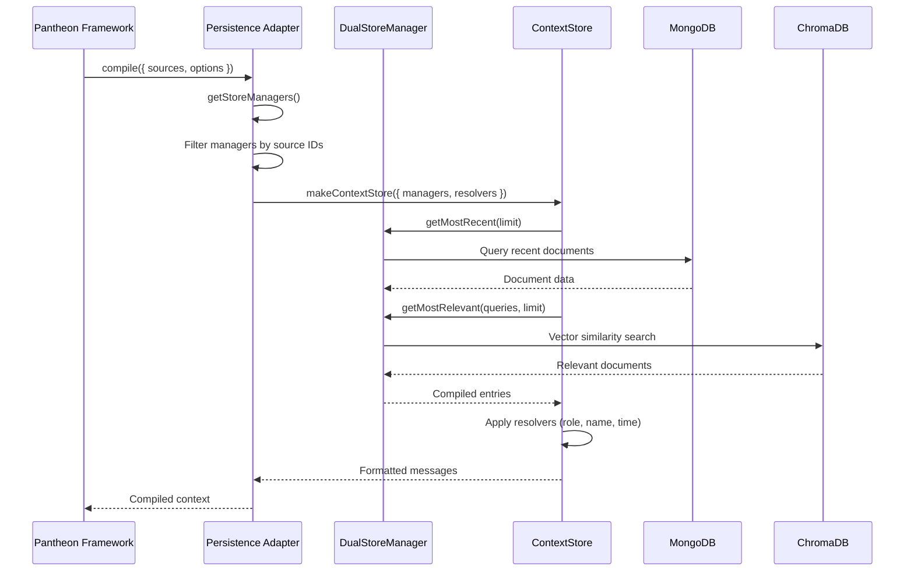

# Pantheon Persistence Architecture

## Overview

The [pantheon-persistence](../packages/pantheon/pantheon-persistence.md) package implements the adapter pattern to bridge the Pantheon framework's context management system with the underlying persistence layer. This document provides a deep dive into the architectural decisions, design patterns, and implementation details.

## Architecture Patterns

### Hexagonal Architecture (Ports and Adapters)

The package follows the Hexagonal Architecture pattern, separating business logic from infrastructure concerns:

```
┌─────────────────────────────────────────────────────────────┐
│                    Pantheon Framework                       │
│  ┌─────────────────────────────────────────────────────────┐ │
│  │              Context Management                        │ │
│  │  ┌─────────────┐  ┌─────────────┐  ┌─────────────┐ │ │
│  │  │ContextPort  │ │ContextSource│ │Message      │ │ │
│  │  │Interface    │ │             │ │             │ │ │
│  │  └─────────────┘  └─────────────┘  └─────────────┘ │ │
│  └─────────────────────────────────────────────────────────┘ │
└─────────────────────────────────────────────────────────────┘
                              │
                              ▼
┌─────────────────────────────────────────────────────────────┐
│                Pantheon Persistence                        │
│  ┌─────────────────────────────────────────────────────────┐ │
│  │           Persistence Adapter                          │ │
│  │  ┌─────────────┐  ┌─────────────┐  ┌─────────────┐ │ │
│  │  │makePantheon │ │Persistence  │ │Context      │ │ │
│  │  │Persistence  │ │AdapterDeps  │ │Mapping      │ │ │
│  │  │Adapter      │ │             │ │Logic        │ │ │
│  │  └─────────────┘  └─────────────┘  └─────────────┘ │ │
│  └─────────────────────────────────────────────────────────┘ │
└─────────────────────────────────────────────────────────────┘
                              │
                              ▼
┌─────────────────────────────────────────────────────────────┐
│                 Persistence Layer                          │
│  ┌─────────────────────────────────────────────────────────┐ │
│  │              Dual Store Architecture                   │ │
│  │  ┌─────────────┐  ┌─────────────┐  ┌─────────────┐ │ │
│  │  │DualStore    │ │MongoDB      │ │ChromaDB     │ │ │
│  │  │Manager      │ │Collection   │ │Collection   │ │ │
│  │  │             │ │             │ │             │ │ │
│  │  └─────────────┘  └─────────────┘  └─────────────┘ │ │
│  └─────────────────────────────────────────────────────────┘ │
└─────────────────────────────────────────────────────────────┘
```

### Adapter Pattern Implementation

The adapter pattern allows the Pantheon framework to work with different persistence implementations without changing the core framework code:

```typescript
// Port Interface (Pantheon Core)
interface ContextPort {
  compile(opts: {
    texts?: readonly string[];
    sources: readonly ContextSource[];
    recentLimit?: number;
    queryLimit?: number;
    limit?: number;
  }): Promise<Message[]>;
}

// Adapter Implementation (Pantheon Persistence)
const makePantheonPersistenceAdapter = (deps: PersistenceAdapterDeps): ContextPort => {
  // Bridge between Pantheon interface and persistence implementation
  return {
    compile: async ({ texts = [], sources, recentLimit = 10, queryLimit = 5, limit = 20 }) => {
      // Map Pantheon sources to persistence managers
      const colls = await deps.getCollectionsFor(sources);

      // Use persistence layer for actual data retrieval
      const { makeContextStore } = await import('@promethean-os/persistence');
      const { compileContext } = makeContextStore({
        getCollections: () => colls,
        resolveRole: deps.resolveRole,
        resolveDisplayName: deps.resolveName,
        formatTime: deps.formatTime,
      });

      return compileContext({ texts, recentLimit, queryLimit, limit });
    },
  };
};
```

## Data Flow Architecture

### Context Compilation Flow



### Source Mapping Logic

The adapter maps Pantheon [ContextSource](ContextSource.md) objects to actual [DualStoreManager](DualStoreManager.md) instances:

```typescript
// Input: Pantheon ContextSources
const sources: ContextSource[] = [
  {
    id: 'sessions',
    label: 'Chat Sessions',
    where: { userId: 'user123', isActive: true }
  },
  {
    id: 'agent-tasks',
    label: 'Agent Tasks',
    where: { status: 'active' }
  }
];

// Internal: DualStoreManager instances
const managers: DualStoreManager[] = [
  new DualStoreManager('sessions', ...),    // Maps to sources[0]
  new DualStoreManager('agent-tasks', ...), // Maps to sources[1]
  new DualStoreManager('user-data', ...),   // Not used in this compilation
];

// Mapping Logic
const validManagers = managers.filter((manager) =>
  sources.some((source) => source.id === manager.name),
);
// Result: [sessions manager, agent-tasks manager]
```

## Dependency Injection Architecture

### PersistenceAdapterDeps Interface

The dependency injection pattern allows for flexible configuration and testing:

```typescript
interface PersistenceAdapterDeps {
  // Required: Source of store managers
  getStoreManagers: () => Promise<DualStoreManager[]>;

  // Optional: Custom resolvers with defaults
  resolveRole?: (meta?: any) => 'system' | 'user' | 'assistant';
  resolveName?: (meta?: any) => string;
  formatTime?: (ms: number) => string;
}
```

### Resolver Chain Pattern

Each resolver follows a chain of responsibility pattern with fallbacks:

```typescript
// Role Resolution Chain
const resolveRole = (meta?: any) => {
  // 1. Explicit role in metadata
  if (meta?.role) return meta.role;

  // 2. Type-based inference
  if (meta?.type === 'user') return 'user';
  if (meta?.type === 'assistant') return 'assistant';

  // 3. Default fallback
  return 'system';
};

// Name Resolution Chain
const resolveName = (meta?: any) => {
  // 1. Display name (human-readable)
  if (meta?.displayName) return meta.displayName;

  // 2. Name field
  if (meta?.name) return meta.name;

  // 3. ID-based fallback
  if (meta?.id) return meta.id;

  // 4. Default
  return 'Unknown';
};
```

## Error Handling Architecture

### Resilience Patterns

The adapter implements multiple resilience patterns:

#### 1. Graceful Degradation

```typescript
const getStoreManagers: async () => {
  try {
    const managers = await createAllManagers();
    return managers;
  } catch (error) {
    console.error('Failed to create some managers:', error);

    // Return partial set instead of failing completely
    return await createEssentialManagers();
  }
}
```

#### 2. Safe Defaults

```typescript
const resolveRole: (meta?: any) => {
  try {
    // Custom logic
    return customRoleLogic(meta);
  } catch (error) {
    console.warn('Role resolution failed, using default:', error);
    return 'system'; // Safe default
  }
}
```

#### 3. Validation Guards

```typescript
const compile: async ({ sources, ...options }) => {
  // Input validation
  if (!Array.isArray(sources)) {
    throw new Error('Sources must be an array');
  }

  if (sources.length === 0) {
    return []; // Empty result is valid
  }

  // Process with validation
  const validSources = sources.filter(source =>
    source.id && typeof source.id === 'string'
  );

  if (validSources.length === 0) {
    console.warn('No valid sources provided');
    return [];
  }

  // Continue with valid sources...
}
```

## Performance Architecture

### Caching Strategies

#### 1. Manager Instance Caching

```typescript
class CachedPersistenceAdapter {
  private managerCache = new Map<string, DualStoreManager>();
  private cacheTimestamps = new Map<string, number>();
  private readonly CACHE_TTL = 5 * 60 * 1000; // 5 minutes

  async getStoreManagers(): Promise<DualStoreManager[]> {
    const now = Date.now();
    const cached = Array.from(this.managerCache.values());

    // Check cache validity
    for (const [name, timestamp] of this.cacheTimestamps) {
      if (now - timestamp > this.CACHE_TTL) {
        const manager = this.managerCache.get(name);
        if (manager) {
          await manager.cleanup();
          this.managerCache.delete(name);
          this.cacheTimestamps.delete(name);
        }
      }
    }

    return cached.length > 0 ? cached : await this.createManagers();
  }
}
```

#### 2. Resolution Function Memoization

```typescript
const createMemoizedResolver = <T, R>(resolver: (input: T) => R, keyFn: (input: T) => string) => {
  const cache = new Map<string, R>();

  return (input: T): R => {
    const key = keyFn(input);
    if (cache.has(key)) {
      return cache.get(key)!;
    }

    const result = resolver(input);
    cache.set(key, result);
    return result;
  };
};

// Usage
const memoizedResolveName = createMemoizedResolver(
  (meta) => meta?.displayName || meta?.name || 'Unknown',
  (meta) => JSON.stringify(meta),
);
```

### Lazy Loading Pattern

```typescript
const makeLazyPersistenceAdapter = (deps: PersistenceAdapterDeps) => {
  let managers: DualStoreManager[] | null = null;
  let managersPromise: Promise<DualStoreManager[]> | null = null;

  const getManagers = async (): Promise<DualStoreManager[]> => {
    if (managers) return managers;

    if (!managersPromise) {
      managersPromise = deps.getStoreManagers().then((result) => {
        managers = result;
        return result;
      });
    }

    return managersPromise;
  };

  return makePantheonPersistenceAdapter({
    ...deps,
    getStoreManagers: getManagers,
  });
};
```

## Testing Architecture

### Test Isolation Pattern

```typescript
// Test utilities for isolated testing
export const createTestPersistenceAdapter = (mockManagers: DualStoreManager[] = []) => {
  return makePantheonPersistenceAdapter({
    getStoreManagers: () => Promise.resolve(mockManagers),
    resolveRole: (meta) => meta?.role || 'system',
    resolveName: (meta) => meta?.name || 'Test User',
    formatTime: (ms) => `T${ms}`,
  });
};

// Mock DualStoreManager for testing
export const createMockDualStoreManager = (name: string, entries: any[] = []): DualStoreManager => {
  return {
    name,
    getMostRecent: async () => entries,
    getMostRelevant: async () => entries,
    insert: async () => {},
    get: async () => null,
    cleanup: async () => {},
  } as DualStoreManager;
};
```

### Integration Test Pattern

```typescript
describe('Pantheon Persistence Integration', () => {
  let adapter: ContextPort;
  let testManagers: DualStoreManager[];

  beforeEach(async () => {
    testManagers = [
      await createTestDualStoreManager('sessions', [
        { id: '1', text: 'Hello', metadata: { role: 'user' } },
        { id: '2', text: 'Hi there!', metadata: { role: 'assistant' } },
      ]),
      await createTestDualStoreManager('tasks', [
        { id: '3', text: 'Task 1', metadata: { role: 'system' } },
      ]),
    ];

    adapter = createTestPersistenceAdapter(testManagers);
  });

  it('should compile context from multiple sources', async () => {
    const context = await adapter.compile({
      sources: [
        { id: 'sessions', label: 'Sessions' },
        { id: 'tasks', label: 'Tasks' },
      ],
    });

    expect(context).toHaveLength(3);
    expect(context[0].role).toBe('user');
    expect(context[1].role).toBe('assistant');
    expect(context[2].role).toBe('system');
  });
});
```

## Security Architecture

### Input Validation

```typescript
const validateContextSource = (source: ContextSource): boolean => {
  // ID validation
  if (!source.id || typeof source.id !== 'string') {
    return false;
  }

  // Label validation
  if (!source.label || typeof source.label !== 'string') {
    return false;
  }

  // ID format validation (prevent injection)
  if (!/^[a-zA-Z0-9_-]+$/.test(source.id)) {
    return false;
  }

  return true;
};

const sanitizeMetadata = (meta: any): any => {
  if (!meta || typeof meta !== 'object') {
    return {};
  }

  // Remove potentially dangerous properties
  const sanitized = { ...meta };
  delete sanitized.__proto__;
  delete sanitized.constructor;
  delete sanitized.prototype;

  return sanitized;
};
```

### Access Control Integration

```typescript
const makeSecurePersistenceAdapter = (
  deps: PersistenceAdapterDeps,
  securityContext: SecurityContext,
) => {
  return makePantheonPersistenceAdapter({
    ...deps,
    getStoreManagers: async () => {
      const managers = await deps.getStoreManagers();

      // Filter managers based on security context
      return managers.filter((manager) => securityContext.hasPermission(`read:${manager.name}`));
    },

    resolveRole: (meta) => {
      // Apply role-based access control
      const baseRole = deps.resolveRole?.(meta) || 'system';

      if (!securityContext.canAccessRole(baseRole)) {
        return 'system'; // Downgrade to system role
      }

      return baseRole;
    },
  });
};
```

## Evolution Architecture

### Extensibility Points

The adapter is designed for future extensions:

#### 1. Plugin Architecture

```typescript
interface ContextPlugin {
  name: string;
  resolveRole?: (meta?: any) => 'system' | 'user' | 'assistant' | null;
  resolveName?: (meta?: any) => string | null;
  formatTime?: (ms: number) => string | null;
}

const makePluginPersistenceAdapter = (
  deps: PersistenceAdapterDeps,
  plugins: ContextPlugin[] = [],
) => {
  const pluginChain = {
    resolveRole: (meta?: any) => {
      for (const plugin of plugins) {
        const result = plugin.resolveRole?.(meta);
        if (result !== null && result !== undefined) {
          return result;
        }
      }
      return deps.resolveRole?.(meta) || 'system';
    },

    resolveName: (meta?: any) => {
      for (const plugin of plugins) {
        const result = plugin.resolveName?.(meta);
        if (result !== null && result !== undefined) {
          return result;
        }
      }
      return deps.resolveName?.(meta) || 'Unknown';
    },
  };

  return makePantheonPersistenceAdapter({
    ...deps,
    ...pluginChain,
  });
};
```

#### 2. Event-Driven Updates

```typescript
const makeEventDrivenPersistenceAdapter = (deps: PersistenceAdapterDeps, eventBus: EventBus) => {
  let currentManagers: DualStoreManager[] = [];

  // Listen for manager changes
  eventBus.on('manager-added', (manager: DualStoreManager) => {
    currentManagers.push(manager);
  });

  eventBus.on('manager-removed', (managerName: string) => {
    currentManagers = currentManagers.filter((m) => m.name !== managerName);
  });

  return makePantheonPersistenceAdapter({
    ...deps,
    getStoreManagers: async () => {
      if (currentManagers.length === 0) {
        currentManagers = await deps.getStoreManagers();
      }
      return currentManagers;
    },
  });
};
```

## Conclusion

The [pantheon-persistence](../packages/pantheon/pantheon-persistence.md) architecture demonstrates several key software engineering principles:

1. **Separation of Concerns**: Clear boundaries between framework, adapter, and persistence layers
2. **Dependency Injection**: Flexible configuration and testability
3. **Adapter Pattern**: Seamless integration between different systems
4. **Resilience**: Graceful error handling and fallbacks
5. **Performance**: Caching and lazy loading strategies
6. **Security**: Input validation and access control
7. **Extensibility**: Plugin architecture and event-driven design

This architecture ensures that the Pantheon framework can work with various persistence implementations while maintaining clean abstractions and high performance.

#hashtags: #architecture #pantheon #persistence #design-patterns
