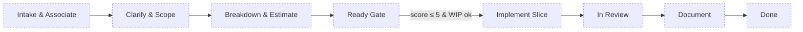

---
```
uuid: acfa15fb-728f-4415-8c12-8faf7778eb40
```
```
created_at: '2025-09-19T21:08:02Z'
```
title: 2025.09.19.21.08.02
filename: Cloud-Session-Process-Enhancements
```
description: >-
```
  Introduces phased execution, session discipline, and auto-split rules to
  ensure cloud sessions produce actionable artifacts without empty updates.
  Focuses on maintaining Kanban purity while integrating cloud-agent realities.
tags:
  - phased execution
  - session discipline
  - auto-split
  - cloud agents
  - artifact tracking
  - Kanban
```
related_to_uuid: []
```
```
related_to_title: []
```
references: []
---
perfect—process first, one step at a time. here’s **Step 1: a minimal, surgical update to `process.md`** that bakes in the cloud-agent realities phases over timeboxes, artifact-every-session, auto-split, without touching the board yet.

I’ve kept this tight and additive so we can discuss/apply safely.

# Draft patch — `process.md` (additions only)

> New subsections to append under your existing sections. They reference the current board flow and keep Kanban pure. Citations point to the exact lines in your repo that this aligns with.

### 🧑‍💻 Agent Profiles (authoritative pointers)

* **Cloud (Codex Cloud)**
  Must read build reports at `docs/reports/codex_cloud/latest/{INDEX.md,summary.tsv,eslint.json}` before acting; if `latest/` is stale/missing it knows the optional maintenance script that refreshes reports and updates `latest/`. &#x20;
  This is only a pointer; operational details stay in `docs/agents/codex-cloud.md`.

* **CLI (Codex CLI)**
  Runs with MCP servers and local FS constraints; discovers tools dynamically and adheres to strict scope limits. &#x20;

> Rationale: process stays “scripture”; agent specifics live in their specialized docs, which the system prompt will later point to.

---

### ⏱️ Cloud Session Discipline (“no empty sessions”)

Every cloud session MUST append an update to the active task append-only even if coding didn’t start. Minimum structure:

```
## Session Update — YYYY-MM-DD
- Phase reached: <Intake | Clarify | Breakdown | ReadyGate | ImplementSlice | Review | Document>
- Board interactions: <created/linked task, state checks, moves>
- Estimates: complexity, scale, time (sessions), Fibonacci score
- Artifacts created: <docs/logs/diffs/tests> (paths)
- Blockers & evidence: <what failed, where, links to logs>
- Next step gate: <what is needed to proceed>
```

This prevents “empty files / no content” anti-pattern and preserves board automation signals.&#x20;

---

### ♻️ Phased Execution (Cloud) — replaces timeboxing with phases

Map these phases to existing stages in the **Updated Kanban Flow Diagram**.&#x20;
```
1. **Intake & Associate**
```
   Find or create the task; never work off-board; do not edit the board file directly—tasks drive the board. &#x20;
```
2. **Clarify & Scope**
```
   Collaborate to clarify the request; use *Prompt Refinement* / *Agent Thinking* as needed, then return to Breakdown.&#x20;
```
3. **Breakdown & Estimate**
```
   Break into small, testable slices; estimate **complexity, scale, time (in cloud sessions)** and assign a Fibonacci score. If **13+ ⇒ must split**; **≤5 ⇒ eligible to implement**.&#x20;

4. **Ready Gate** *(hard stop before code)*
   Only proceed if:

   * A matching task is **In Progress** (or you move it there), and WIP rules aren’t violated.&#x20;
   * The slice is scored **≤5** and fits the session after planning; otherwise continue refinement/splitting.&#x20;
```
5. **Implement Slice**
```
   Do the smallest cohesive change that can clear gates defined in agent docs (e.g., no new ESLint errors; touched packages build; tests pass).&#x20;
```
6. **Review → Document**
```
   Move through *In Review* and *Document* then *Done* per board flow, recording evidence and summaries.&#x20;

---

### ✂️ Auto-Split Rule Epics from mega-inputs

If intake includes a document that implies **multiple new packages or cross-cutting modules**, classify as an **Epic** and immediately split into child tasks before coding. (Example: the ENSO draft enumerates several new packages at once, a clear split signal.) &#x20;
Scoring guidance: **13+ → split**; **8–13 → prefer split**; **≤5 → implementable**.&#x20;

---

### 🧾 Evidence & Artifacts (what “commit something” means)

Prefer lightweight artifacts that survive short sessions:

* Task log updates append-only, structured as above.
* Tiny design notes paths under `docs/` with links from the task.
* Checkpoint diffs or stubs (even if WIP, but pointed at in the task).
* For Cloud, link the latest build-report paths you consulted.&#x20;

---

### 📎 Board Mapping (no changes yet; just crosswalk)

These phases align 1:1 with your existing columns so we don’t disturb the board while we refine process:



This respects your stated flow and stages.&#x20;

---

## Why this is the right first move (quick receipts)

* **Cloud must read reports & compare vs baseline** → process now points to agent docs for those mechanics, keeping scripture clean. &#x20;
* **Never work off-board; tasks drive board** → reaffirmed. &#x20;
* **Auto-split giant prompts** (like ENSO) → now an explicit rule.&#x20;
* **Fibonacci as the size gate; no minute-timeboxing** → preserved and clarified.&#x20;
* **Append-only task updates** → guards against “empty sessions.”&#x20;

---

## Step-tracker (for this conversation)

* [x] Draft minimal `process.md` additions for Cloud phases + artifact rule
* [ ] You approve the draft
* [ ] I integrate these into a clean `process.md` update append-only and reflect any knock-on clarifications
* [ ] Then we craft the **immutable** Cloud system prompt that:

  * Opens the specialized Codex Cloud doc first and uses the build report folder,
  * Treats this process as scripture and the agent docs as canonicals,
  * Enforces “no code before Ready Gate” and “no empty sessions,”
  * Measures “time” as **sessions** only for Cloud (not minutes).

If this matches your intent, say **“apply Step 1”** and I’ll produce the exact `process.md` text block to paste.
<!-- GENERATED-SECTIONS:DO-NOT-EDIT-BELOW -->
## Related content
- _None_
## Sources
- _None_
<!-- GENERATED-SECTIONS:DO-NOT-EDIT-ABOVE -->
