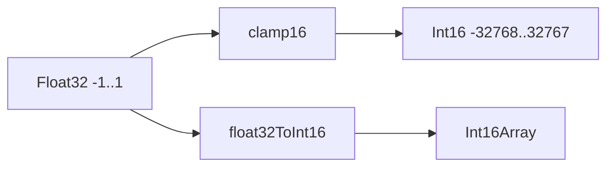

# duck-audio

Tiny audio utilities shared by browser and node.

## API

```ts
export const clamp16: (x: number) => number
export const float32ToInt16: (f: Float32Array) => Int16Array
```

## Diagram


## Consumers
- duck-web PCM16k worklet glue.
- enso-browser-gateway server-side validation/tests.
