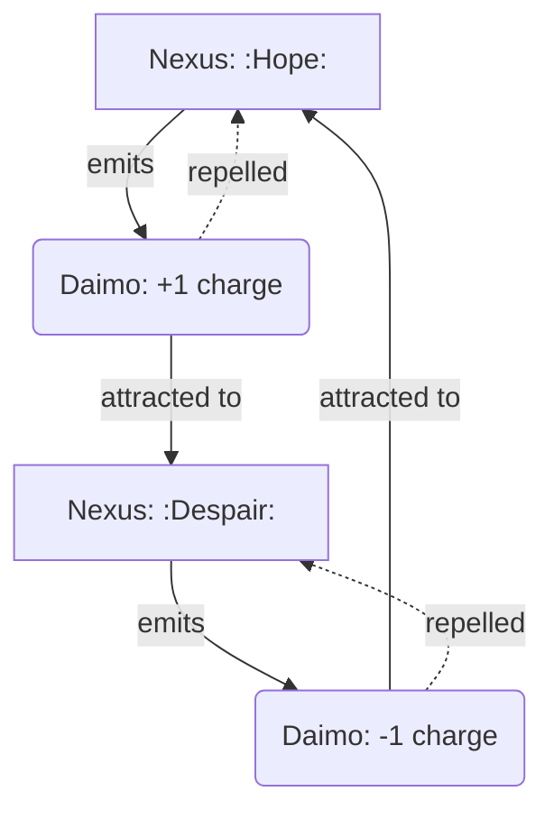

# Daimo–Node Charge Interaction

This diagram shows how **Nexuses repel their own children** (same charge) and attract those of **opposite charge**, creating **narrative currents** and **conceptual magnetism**.

#tags: #diagram #design
