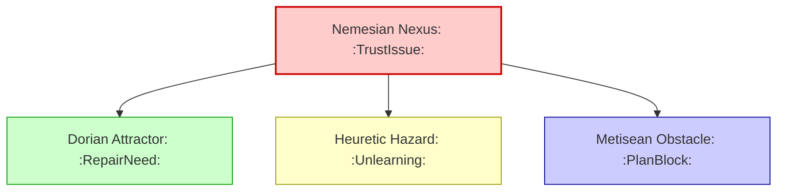

# Multi-Circuit Node Propagation

This diagram illustrates how **one symbolic conflict** creates **ripples across multiple circuits**, each materializing in a different node type.

#tags: #diagram #design
