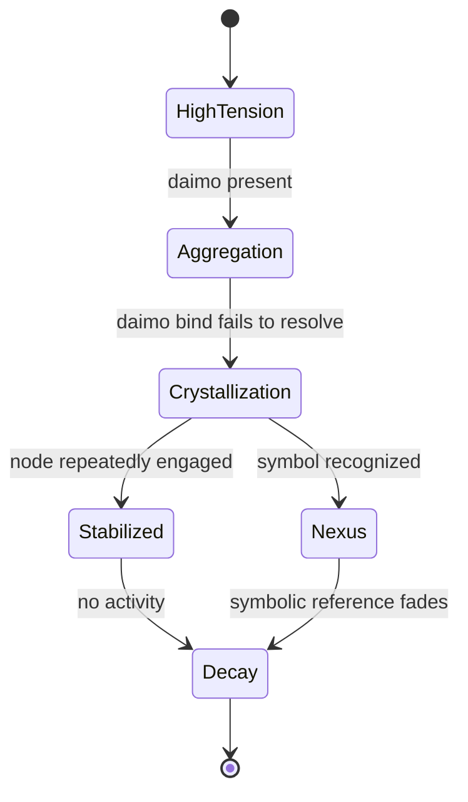

# Node Growth and Death Conditions

```mermaid
stateDiagram-v2
    [*] --> HighTension
    HighTension --> Aggregation : daimo present
    Aggregation --> Crystallization : daimo bind fails to resolve
    Crystallization --> Stabilized : node repeatedly engaged
    Crystallization --> Nexus : symbol recognized
    Stabilized --> Decay : no activity
    Nexus --> Decay : symbolic reference fades
    Decay --> [*]
```

This simplified lifecycle focuses on the **grow/decay logic** for field nodes.

#tags: #diagram #design
