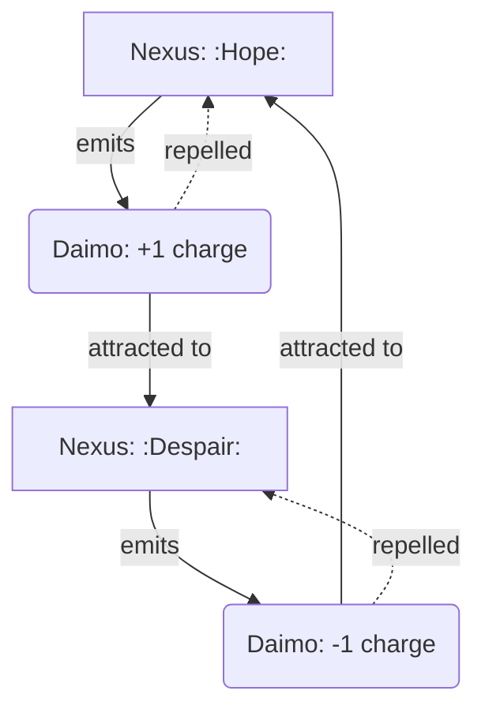

---
```
uuid: abc90481-25d2-4baf-ad53-b44791e6a78f
```
created_at: field-node-diagram-visualizations.md
filename: Field Node Diagrams
title: Field Node Diagrams
```
description: >-
```
  Visualizations illustrating interactions between field nodes, including charge
  dynamics, propagation paths, growth cycles, and type relationships within
  cognitive topology.
tags:
  - field
  - node
  - diagram
  - lifecycle
  - cognitive
  - topology
  - visualization
  - interaction
  - propagation
  - growth
  - decay
```
related_to_uuid:
```
  - 7cfc230d-8ec2-4cdb-b931-8aec26de2a00
  - b09141b7-544f-4c8e-8f49-bf76cecaacbb
  - f7702bf8-f7db-473c-9a5b-8dbf66ad3b9e
  - 5e8b2388-022b-46cf-952c-36ae9b8f0037
  - 938eca9c-97e2-4bcc-8653-b0ef1a5ac7a3
  - 73d3dbf6-9240-46fd-ada9-cc2e7e00dc5f
  - 71726f04-eb1c-42a5-a5fe-d8209de6e159
  - 30ec3ba6-fbca-4606-ac3e-89b747fbeb7c
  - 10d98225-12e0-4212-8e15-88b57cf7bee5
  - 13951643-1741-46bb-89dc-1beebb122633
  - 008f2ac0-bfaa-4d52-9826-2d5e86c0059f
  - c03020e1-e3e7-48bf-aa7e-aa740c601b63
  - a4d90289-798d-44a0-a8e8-a055ae12fb52
  - 22b989d5-f4aa-4880-8632-709c21830f83
  - fc21f824-4244-4030-a48e-c4170160ea1d
  - a4a25141-6380-40b9-9cd7-b554b246b303
  - 1cfae310-35dc-49c2-98f1-b186da25d84b
  - dd00677a-2280-45a7-91af-0728b21af3ad
  - 1f32c94a-4da4-4266-8ac0-6c282cfb401f
  - e90b5a16-d58f-424d-bd36-70e9bd2861ad
  - 9c79206d-4cb9-4f00-87e0-782dcea37bc7
  - 8430617b-80a2-4cc9-8288-9a74cb57990b
  - 6620e2f2-de6d-45d8-a722-5d26e160b370
  - 37b5d236-2b3e-4a95-a4e8-31655c3023ef
  - 5e408692-0e74-400e-a617-84247c7353ad
```
related_to_title:
```
  - field-dynamics-math-blocks
  - field-interaction-equations
  - Dynamic Context Model for Web Components
  - Eidolon Field Abstract Model
  - eidolon-node-lifecycle
  - Debugging Broker Connections and Agent Behavior
  - Duck's Self-Referential Perceptual Loop
  - Unique Info Dump Index
  - Creative Moments
  - Duck's Attractor States
  - eidolon-field-math-foundations
  - Per-Domain Policy System for JS Crawler
  - Factorio AI with External Agents
  - field-node-diagram-set
  - Fnord Tracer Protocol
  - Functional Embedding Pipeline Refactor
  - Functional Refactor of TypeScript Document Processing
  - heartbeat-fragment-demo
  - field-node-diagram-outline
  - Prometheus Observability Stack
  - polyglot-repl-interface-layer
  - ripple-propagation-demo
  - graph-ds
  - homeostasis-decay-formulas
  - i3-bluetooth-setup
references:
  - uuid: 78eeedf7-75bc-4692-a5a7-bb6857270621
    line: 1016
    col: 0
    score: 1
  - uuid: ed6f3fc9-5eb1-482c-8b3c-f0abc5aff2a2
    line: 175
    col: 0
    score: 1
  - uuid: 30ec3ba6-fbca-4606-ac3e-89b747fbeb7c
    line: 1221
    col: 0
    score: 1
  - uuid: 62bec6f0-4e13-4f38-aca4-72c84ba02367
    line: 1058
    col: 0
    score: 1
  - uuid: 1b1338fc-bb4d-41df-828f-e219cc9442eb
    line: 515
    col: 0
    score: 1
  - uuid: 10d98225-12e0-4212-8e15-88b57cf7bee5
    line: 251
    col: 0
    score: 1
  - uuid: 13951643-1741-46bb-89dc-1beebb122633
    line: 559
    col: 0
    score: 1
  - uuid: 008f2ac0-bfaa-4d52-9826-2d5e86c0059f
    line: 1033
    col: 0
    score: 1
  - uuid: 1f32c94a-4da4-4266-8ac0-6c282cfb401f
    line: 98
    col: 0
    score: 1
  - uuid: fc21f824-4244-4030-a48e-c4170160ea1d
    line: 272
    col: 0
    score: 1
  - uuid: 64a9f9f9-58ee-4996-bdaf-9373845c6b29
    line: 245
    col: 0
    score: 1
  - uuid: b5e0183e-c34b-44b2-8fc9-a740a1a8d4e2
    line: 132
    col: 0
    score: 1
  - uuid: 54382370-1931-4a19-a634-46735708a9ea
    line: 375
    col: 0
    score: 1
  - uuid: d144aa62-348c-4e5d-ae8f-38084c67ceca
    line: 215
    col: 0
    score: 1
  - uuid: db74343f-8f84-43a3-adb2-499c6f00be1c
    line: 164
    col: 0
    score: 1
  - uuid: 5a02283e-4281-4930-9ca7-e27849de11bd
    line: 90
    col: 0
    score: 1
  - uuid: ffb9b2a9-744d-4a53-9565-130fceae0832
    line: 132
    col: 0
    score: 1
  - uuid: b39dc9d4-63e2-42d4-bbcd-041ef3167bca
    line: 172
    col: 0
    score: 1
  - uuid: e018dd7a-1fb7-4732-9e67-cd8b2f0831cf
    line: 336
    col: 0
    score: 1
  - uuid: 6bcff92c-4224-453d-9993-1be8d37d47c3
    line: 137
    col: 0
    score: 1
  - uuid: 6620e2f2-de6d-45d8-a722-5d26e160b370
    line: 371
    col: 0
    score: 1
  - uuid: dd00677a-2280-45a7-91af-0728b21af3ad
    line: 141
    col: 0
    score: 1
  - uuid: 37b5d236-2b3e-4a95-a4e8-31655c3023ef
    line: 222
    col: 0
    score: 1
  - uuid: 5e408692-0e74-400e-a617-84247c7353ad
    line: 107
    col: 0
    score: 1
  - uuid: dd89372d-10de-42a9-8c96-6bc13ea36d02
    line: 255
    col: 0
    score: 1
  - uuid: b5e0183e-c34b-44b2-8fc9-a740a1a8d4e2
    line: 162
    col: 0
    score: 1
  - uuid: 54382370-1931-4a19-a634-46735708a9ea
    line: 308
    col: 0
    score: 1
  - uuid: 40185d05-010e-45e7-8c2d-2f879bf14218
    line: 102
    col: 0
    score: 1
  - uuid: 5f65dfa5-dc97-4a6c-ad93-c45c1312e156
    line: 41
    col: 0
    score: 1
  - uuid: d144aa62-348c-4e5d-ae8f-38084c67ceca
    line: 159
    col: 0
    score: 1
  - uuid: db74343f-8f84-43a3-adb2-499c6f00be1c
    line: 149
    col: 0
    score: 1
  - uuid: 5a02283e-4281-4930-9ca7-e27849de11bd
    line: 70
    col: 0
    score: 1
  - uuid: 1d3d6c3a-039e-4b96-93c1-95854945e248
    line: 67
    col: 0
    score: 1
  - uuid: f7702bf8-f7db-473c-9a5b-8dbf66ad3b9e
    line: 412
    col: 0
    score: 1
  - uuid: 5e8b2388-022b-46cf-952c-36ae9b8f0037
    line: 261
    col: 0
    score: 1
  - uuid: 008f2ac0-bfaa-4d52-9826-2d5e86c0059f
    line: 181
    col: 0
    score: 1
  - uuid: 938eca9c-97e2-4bcc-8653-b0ef1a5ac7a3
    line: 90
    col: 0
    score: 1
  - uuid: a4d90289-798d-44a0-a8e8-a055ae12fb52
    line: 157
    col: 0
    score: 1
  - uuid: 7cfc230d-8ec2-4cdb-b931-8aec26de2a00
    line: 205
    col: 0
    score: 1
  - uuid: b09141b7-544f-4c8e-8f49-bf76cecaacbb
    line: 149
    col: 0
    score: 1
  - uuid: 1f32c94a-4da4-4266-8ac0-6c282cfb401f
    line: 110
    col: 0
    score: 1
  - uuid: 22b989d5-f4aa-4880-8632-709c21830f83
    line: 203
    col: 0
    score: 1
  - uuid: fc21f824-4244-4030-a48e-c4170160ea1d
    line: 294
    col: 0
    score: 1
  - uuid: 10d98225-12e0-4212-8e15-88b57cf7bee5
    line: 33
    col: 0
    score: 1
  - uuid: 73d3dbf6-9240-46fd-ada9-cc2e7e00dc5f
    line: 99
    col: 0
    score: 1
  - uuid: 2792d448-c3b5-4050-93dd-93768529d99c
    line: 46
    col: 0
    score: 1
  - uuid: e979c50f-69bb-48b0-8417-e1ee1b31c0c0
    line: 10
    col: 0
    score: 1
  - uuid: 18138627-a348-4fbb-b447-410dfb400564
    line: 173
    col: 0
    score: 1
  - uuid: c3cd4f65-2bb3-4fca-a32e-2ac667e03f40
    line: 123
    col: 0
    score: 1
  - uuid: ba11486b-b0b0-4d9d-a0d1-1d91ae34de55
    line: 66
    col: 0
    score: 1
  - uuid: 78eeedf7-75bc-4692-a5a7-bb6857270621
    line: 412
    col: 0
    score: 1
  - uuid: 7b7ca860-780c-44fa-8d3f-be8bd9496fba
    line: 614
    col: 0
    score: 1
  - uuid: ed6f3fc9-5eb1-482c-8b3c-f0abc5aff2a2
    line: 5
    col: 0
    score: 1
  - uuid: 30ec3ba6-fbca-4606-ac3e-89b747fbeb7c
    line: 129
    col: 0
    score: 1
  - uuid: c03020e1-e3e7-48bf-aa7e-aa740c601b63
    line: 495
    col: 0
    score: 1
  - uuid: f5579967-762d-4cfd-851e-4f71b4cb77a1
    line: 459
    col: 0
    score: 1
  - uuid: e2135d9f-c69d-47ee-9b17-0b05e98dc748
    line: 27
    col: 0
    score: 1
  - uuid: b22d79c6-825b-4cd3-b0d3-1cef0532bb54
    line: 1002
    col: 0
    score: 1
  - uuid: 9c79206d-4cb9-4f00-87e0-782dcea37bc7
    line: 171
    col: 0
    score: 1
  - uuid: 6bcff92c-4224-453d-9993-1be8d37d47c3
    line: 112
    col: 0
    score: 1
  - uuid: 18344cf9-0c49-4a71-b6c8-b8d84d660fca
    line: 24
    col: 0
    score: 1
  - uuid: 9a93a756-6d33-45d1-aca9-51b74f2b33d2
    line: 143
    col: 0
    score: 1
  - uuid: 43bfe9dd-d433-42ca-9777-f4c40eaba791
    line: 241
    col: 0
    score: 1
  - uuid: 10d98225-12e0-4212-8e15-88b57cf7bee5
    line: 8
    col: 0
    score: 1
  - uuid: 73d3dbf6-9240-46fd-ada9-cc2e7e00dc5f
    line: 38
    col: 0
    score: 1
  - uuid: cdbd21ee-25a0-4bfa-884c-c1b948e9b0b2
    line: 56
    col: 0
    score: 1
  - uuid: 008f2ac0-bfaa-4d52-9826-2d5e86c0059f
    line: 148
    col: 0
    score: 1
  - uuid: a4d90289-798d-44a0-a8e8-a055ae12fb52
    line: 166
    col: 0
    score: 1
  - uuid: 7cfc230d-8ec2-4cdb-b931-8aec26de2a00
    line: 148
    col: 0
    score: 1
  - uuid: b09141b7-544f-4c8e-8f49-bf76cecaacbb
    line: 153
    col: 0
    score: 1
  - uuid: 1f32c94a-4da4-4266-8ac0-6c282cfb401f
    line: 118
    col: 0
    score: 1
  - uuid: 22b989d5-f4aa-4880-8632-709c21830f83
    line: 168
    col: 0
    score: 1
  - uuid: a4a25141-6380-40b9-9cd7-b554b246b303
    line: 380
    col: 0
    score: 1
  - uuid: 1cfae310-35dc-49c2-98f1-b186da25d84b
    line: 194
    col: 0
    score: 1
  - uuid: 5a02283e-4281-4930-9ca7-e27849de11bd
    line: 52
    col: 0
    score: 1
  - uuid: 1d3d6c3a-039e-4b96-93c1-95854945e248
    line: 86
    col: 0
    score: 1
  - uuid: ca8e1399-77bf-4f77-82a3-3f703b68706d
    line: 85
    col: 0
    score: 1
  - uuid: ffb9b2a9-744d-4a53-9565-130fceae0832
    line: 92
    col: 0
    score: 1
  - uuid: 9b694a91-dec5-4708-9462-3f71000ba925
    line: 103
    col: 0
    score: 1
  - uuid: b39dc9d4-63e2-42d4-bbcd-041ef3167bca
    line: 91
    col: 0
    score: 1
  - uuid: 5c152b08-6b69-4bb8-a1a7-66745789c169
    line: 86
    col: 0
    score: 1
  - uuid: 98c8ff62-6ea3-4172-9e8b-93913e5d4a7f
    line: 110
    col: 0
    score: 1
  - uuid: e018dd7a-1fb7-4732-9e67-cd8b2f0831cf
    line: 250
    col: 0
    score: 1
  - uuid: c03020e1-e3e7-48bf-aa7e-aa740c601b63
    line: 523
    col: 0
    score: 1
  - uuid: 2792d448-c3b5-4050-93dd-93768529d99c
    line: 35
    col: 0
    score: 1
  - uuid: 13951643-1741-46bb-89dc-1beebb122633
    line: 94
    col: 0
    score: 1
  - uuid: 71726f04-eb1c-42a5-a5fe-d8209de6e159
    line: 53
    col: 0
    score: 1
  - uuid: f7702bf8-f7db-473c-9a5b-8dbf66ad3b9e
    line: 424
    col: 0
    score: 1
  - uuid: 5e8b2388-022b-46cf-952c-36ae9b8f0037
    line: 209
    col: 0
    score: 1
  - uuid: 008f2ac0-bfaa-4d52-9826-2d5e86c0059f
    line: 142
    col: 0
    score: 1
  - uuid: 938eca9c-97e2-4bcc-8653-b0ef1a5ac7a3
    line: 39
    col: 0
    score: 1
  - uuid: c03020e1-e3e7-48bf-aa7e-aa740c601b63
    line: 547
    col: 0
    score: 1
  - uuid: 9413237f-2537-4bbf-8768-db6180970e36
    line: 98
    col: 0
    score: 1
  - uuid: 3a3bf2c9-c0f6-4d7b-bf84-c83c70dece3f
    line: 162
    col: 0
    score: 1
  - uuid: db74343f-8f84-43a3-adb2-499c6f00be1c
    line: 88
    col: 0
    score: 1
  - uuid: 5a02283e-4281-4930-9ca7-e27849de11bd
    line: 91
    col: 0
    score: 1
  - uuid: 1d3d6c3a-039e-4b96-93c1-95854945e248
    line: 69
    col: 0
    score: 1
  - uuid: ca8e1399-77bf-4f77-82a3-3f703b68706d
    line: 64
    col: 0
    score: 1
  - uuid: ffb9b2a9-744d-4a53-9565-130fceae0832
    line: 105
    col: 0
    score: 1
  - uuid: 9b694a91-dec5-4708-9462-3f71000ba925
    line: 92
    col: 0
    score: 1
---
Note: Consolidated here → ../notes/diagrams/field-node-lifecycle-additional-diagrams.md ^ref-e9b27b06-1-0 ^ref-2c9f86e6-1-0

Excellent. With the **Field Node Lifecycle** document fully fleshed out and the system now reactive, dynamic, and narratively emergent, we can keep layering more visualizations to explore the richness of your topology. ^ref-e9b27b06-3-0

Here are some **additional diagrams** to stack on top of what’s already in the doc: ^ref-e9b27b06-5-0

---

### 🔁 **Daimo–Node Charge Interaction**


```
^ref-e9b27b06-11-0
```
```
^ref-e9b27b06-21-0
```
This shows how **Nexuses repel their own children** (same charge) and attract those of **opposite charge**, creating **narrative currents** and **conceptual magnetism**.

---

### 🧠 **Multi-Circuit Node Propagation**
```
^ref-e9b27b06-27-0
```
```mermaid
graph TD
  L4[Nemesian Nexus: :TrustIssue:] --> L2[Dorian Attractor: :RepairNeed:]
  L4 --> L5[Heuretic Hazard: :Unlearning:]
  L4 --> L7[Metisean Obstacle: :PlanBlock:]

  style L4 fill:#ffcccc,stroke:#cc0000,stroke-width:2px
  style L2 fill:#ccffcc,stroke:#009900
  style L5 fill:#ffffcc,stroke:#999900
  style L7 fill:#ccccff,stroke:#000099
^ref-e9b27b06-27-0
``````
^ref-e9b27b06-39-0
```
This makes clear how **one symbolic conflict** creates **ripples across multiple circuits**, each materializing in a different node type.

---

### 🌱 **Node Growth and Death Conditions** ^ref-e9b27b06-45-0

```mermaid
stateDiagram-v2
    [*] --> HighTension
    HighTension --> Aggregation : daimo present
    Aggregation --> Crystallization : daimo bind fails to resolve
    Crystallization --> Stabilized : node repeatedly engaged
    Crystallization --> Nexus : symbol recognized
    Stabilized --> Decay : no activity
    Nexus --> Decay : symbolic reference fades
^ref-e9b27b06-45-0
    Decay --> [*] ^ref-e9b27b06-57-0
```

This is a simplified version of your existing diagram, useful for focused visualization of **grow/decay logic** alone.

---
```
^ref-e9b27b06-63-0 ^ref-2c9f86e6-63-0
```
### 💡 **Node Type Summary Map**

```mermaid
graph LR
  subgraph Field Nodes
    Nexus -->|binds| Daimo
    Hazard -->|repels| Daimo
    Attractor -->|pulls| Daimo
^ref-e9b27b06-63-0
    Obstacle -->|slows| Daimo ^ref-e9b27b06-73-0
  end
```
```
^ref-2c9f86e6-66-0
```
```
^ref-e9b27b06-66-0
```
You can use this one as a **legend** or top-of-page visual summary in any future docs about field simulation or node-class behavior.

---
```
^ref-e9b27b06-80-0
```
Want me to embed these into the **Field Node Lifecycle** document under a “More Diagrams” section? Or split them out into a new document called something like `Field Node Diagrams` or `Cognitive Topology Visuals`?
```
--- ^ref-e9b27b06-82-0
```
```
^ref-e9b27b06-84-0
```
Related notes: [../notes/diagrams/node-type-topology-map|node-type-topology-map], [../notes/diagrams/circuit-weight-visualizations|circuit-weight-visualizations], [../notes/diagrams/full-system-overview-diagrams|full-system-overview-diagrams], [../notes/diagrams/layer1-uptime-diagrams|layer1-uptime-diagrams], [../notes/diagrams/field-node-lifecycle-additional-diagrams|field-node-lifecycle-additional-diagrams], [../notes/diagrams/state-diagram-node-lifecycle|state-diagram-node-lifecycle] [index|unique/index]
```
^ref-e9b27b06-85-0
```
#tags: #diagram #design
 ^ref-e9b27b06-95-0 ^ref-e9b27b06-103-0 ^ref-e9b27b06-123-0 ^ref-e9b27b06-126-0 ^ref-e9b27b06-142-0 ^ref-e9b27b06-151-0 ^ref-e9b27b06-162-0 ^ref-e9b27b06-174-0 ^ref-e9b27b06-180-0 ^ref-e9b27b06-198-0 ^ref-e9b27b06-211-0 ^ref-e9b27b06-212-0 ^ref-e9b27b06-279-0 ^ref-e9b27b06-559-0 ^ref-e9b27b06-601-0 ^ref-e9b27b06-1850-0 ^ref-e9b27b06-3782-0 ^ref-e9b27b06-4525-0
<!-- GENERATED-SECTIONS:DO-NOT-EDIT-BELOW -->
## Related content
- field-dynamics-math-blocks$field-dynamics-math-blocks.md
- field-interaction-equations$field-interaction-equations.md
- [Dynamic Context Model for Web Components]dynamic-context-model-for-web-components.md
- [Eidolon Field Abstract Model]eidolon-field-abstract-model.md
- eidolon-node-lifecycle$eidolon-node-lifecycle.md
- [Debugging Broker Connections and Agent Behavior]debugging-broker-connections-and-agent-behavior.md
- Duck's Self-Referential Perceptual Loop$ducks-self-referential-perceptual-loop.md
- [Unique Info Dump Index]unique-info-dump-index.md
- [Creative Moments]creative-moments.md
- [Duck's Attractor States]ducks-attractor-states.md
- eidolon-field-math-foundations$eidolon-field-math-foundations.md
- Per-Domain Policy System for JS Crawler$per-domain-policy-system-for-js-crawler.md
- [Factorio AI with External Agents]factorio-ai-with-external-agents.md
- field-node-diagram-set$field-node-diagram-set.md
- [Fnord Tracer Protocol]fnord-tracer-protocol.md
- [Functional Embedding Pipeline Refactor]functional-embedding-pipeline-refactor.md
- [Functional Refactor of TypeScript Document Processing]functional-refactor-of-typescript-document-processing.md
- heartbeat-fragment-demo$heartbeat-fragment-demo.md
- field-node-diagram-outline$field-node-diagram-outline.md
- [Prometheus Observability Stack]prometheus-observability-stack.md
- polyglot-repl-interface-layer$polyglot-repl-interface-layer.md
- ripple-propagation-demo$ripple-propagation-demo.md
- graph-ds$graph-ds.md
- homeostasis-decay-formulas$homeostasis-decay-formulas.md
- i3-bluetooth-setup$i3-bluetooth-setup.md
## Sources
- typed-struct-compiler — L1016$typed-struct-compiler.md#^ref-78eeedf7-1016-0 (line 1016, col 0, score 1)
- [Unique Concepts — L175]unique-concepts.md#^ref-ed6f3fc9-175-0 (line 175, col 0, score 1)
- [Unique Info Dump Index — L1221]unique-info-dump-index.md#^ref-30ec3ba6-1221-0 (line 1221, col 0, score 1)
- zero-copy-snapshots-and-workers — L1058$zero-copy-snapshots-and-workers.md#^ref-62bec6f0-1058-0 (line 1058, col 0, score 1)
- Canonical Org-Babel Matplotlib Animation Template — L515$canonical-org-babel-matplotlib-animation-template.md#^ref-1b1338fc-515-0 (line 515, col 0, score 1)
- [Creative Moments — L251]creative-moments.md#^ref-10d98225-251-0 (line 251, col 0, score 1)
- [Duck's Attractor States — L559]ducks-attractor-states.md#^ref-13951643-559-0 (line 559, col 0, score 1)
- eidolon-field-math-foundations — L1033$eidolon-field-math-foundations.md#^ref-008f2ac0-1033-0 (line 1033, col 0, score 1)
- field-node-diagram-outline — L98$field-node-diagram-outline.md#^ref-1f32c94a-98-0 (line 98, col 0, score 1)
- [Fnord Tracer Protocol — L272]fnord-tracer-protocol.md#^ref-fc21f824-272-0 (line 272, col 0, score 1)
- [Layer1SurvivabilityEnvelope — L245]layer1survivabilityenvelope.md#^ref-64a9f9f9-245-0 (line 245, col 0, score 1)
- [Mathematics Sampler — L132]mathematics-sampler.md#^ref-b5e0183e-132-0 (line 132, col 0, score 1)
- Migrate to Provider-Tenant Architecture — L375$migrate-to-provider-tenant-architecture.md#^ref-54382370-375-0 (line 375, col 0, score 1)
- [Model Selection for Lightweight Conversational Tasks — L215]model-selection-for-lightweight-conversational-tasks.md#^ref-d144aa62-215-0 (line 215, col 0, score 1)
- Model Upgrade Calm-Down Guide — L164$model-upgrade-calm-down-guide.md#^ref-db74343f-164-0 (line 164, col 0, score 1)
- [NPU Voice Code and Sensory Integration — L90]npu-voice-code-and-sensory-integration.md#^ref-5a02283e-90-0 (line 90, col 0, score 1)
- obsidian-ignore-node-modules-regex — L132$obsidian-ignore-node-modules-regex.md#^ref-ffb9b2a9-132-0 (line 132, col 0, score 1)
- [Obsidian Templating Plugins Integration Guide — L172]obsidian-templating-plugins-integration-guide.md#^ref-b39dc9d4-172-0 (line 172, col 0, score 1)
- [ParticleSimulationWithCanvasAndFFmpeg — L336]particlesimulationwithcanvasandffmpeg.md#^ref-e018dd7a-336-0 (line 336, col 0, score 1)
- Post-Linguistic Transhuman Design Frameworks — L137$post-linguistic-transhuman-design-frameworks.md#^ref-6bcff92c-137-0 (line 137, col 0, score 1)
- graph-ds — L371$graph-ds.md#^ref-6620e2f2-371-0 (line 371, col 0, score 1)
- heartbeat-fragment-demo — L141$heartbeat-fragment-demo.md#^ref-dd00677a-141-0 (line 141, col 0, score 1)
- homeostasis-decay-formulas — L222$homeostasis-decay-formulas.md#^ref-37b5d236-222-0 (line 222, col 0, score 1)
- i3-bluetooth-setup — L107$i3-bluetooth-setup.md#^ref-5e408692-107-0 (line 107, col 0, score 1)
- komorebi-group-window-hack — L255$komorebi-group-window-hack.md#^ref-dd89372d-255-0 (line 255, col 0, score 1)
- [Mathematics Sampler — L162]mathematics-sampler.md#^ref-b5e0183e-162-0 (line 162, col 0, score 1)
- Migrate to Provider-Tenant Architecture — L308$migrate-to-provider-tenant-architecture.md#^ref-54382370-308-0 (line 308, col 0, score 1)
- [Mindful Prioritization — L102]mindful-prioritization.md#^ref-40185d05-102-0 (line 102, col 0, score 1)
- [MindfulRobotIntegration — L41]mindfulrobotintegration.md#^ref-5f65dfa5-41-0 (line 41, col 0, score 1)
- [Model Selection for Lightweight Conversational Tasks — L159]model-selection-for-lightweight-conversational-tasks.md#^ref-d144aa62-159-0 (line 159, col 0, score 1)
- Model Upgrade Calm-Down Guide — L149$model-upgrade-calm-down-guide.md#^ref-db74343f-149-0 (line 149, col 0, score 1)
- [NPU Voice Code and Sensory Integration — L70]npu-voice-code-and-sensory-integration.md#^ref-5a02283e-70-0 (line 70, col 0, score 1)
- [Obsidian ChatGPT Plugin Integration Guide — L67]obsidian-chatgpt-plugin-integration-guide.md#^ref-1d3d6c3a-67-0 (line 67, col 0, score 1)
- [Dynamic Context Model for Web Components — L412]dynamic-context-model-for-web-components.md#^ref-f7702bf8-412-0 (line 412, col 0, score 1)
- [Eidolon Field Abstract Model — L261]eidolon-field-abstract-model.md#^ref-5e8b2388-261-0 (line 261, col 0, score 1)
- eidolon-field-math-foundations — L181$eidolon-field-math-foundations.md#^ref-008f2ac0-181-0 (line 181, col 0, score 1)
- eidolon-node-lifecycle — L90$eidolon-node-lifecycle.md#^ref-938eca9c-90-0 (line 90, col 0, score 1)
- [Factorio AI with External Agents — L157]factorio-ai-with-external-agents.md#^ref-a4d90289-157-0 (line 157, col 0, score 1)
- field-dynamics-math-blocks — L205$field-dynamics-math-blocks.md#^ref-7cfc230d-205-0 (line 205, col 0, score 1)
- field-interaction-equations — L149$field-interaction-equations.md#^ref-b09141b7-149-0 (line 149, col 0, score 1)
- field-node-diagram-outline — L110$field-node-diagram-outline.md#^ref-1f32c94a-110-0 (line 110, col 0, score 1)
- field-node-diagram-set — L203$field-node-diagram-set.md#^ref-22b989d5-203-0 (line 203, col 0, score 1)
- [Fnord Tracer Protocol — L294]fnord-tracer-protocol.md#^ref-fc21f824-294-0 (line 294, col 0, score 1)
- [Creative Moments — L33]creative-moments.md#^ref-10d98225-33-0 (line 33, col 0, score 1)
- [Debugging Broker Connections and Agent Behavior — L99]debugging-broker-connections-and-agent-behavior.md#^ref-73d3dbf6-99-0 (line 99, col 0, score 1)
- [Docops Feature Updates — L46]docops-feature-updates.md#^ref-2792d448-46-0 (line 46, col 0, score 1)
- [DuckDuckGoSearchPipeline — L10]duckduckgosearchpipeline.md#^ref-e979c50f-10-0 (line 10, col 0, score 1)
- [The Jar of Echoes — L173]the-jar-of-echoes.md#^ref-18138627-173-0 (line 173, col 0, score 1)
- [Tracing the Signal — L123]tracing-the-signal.md#^ref-c3cd4f65-123-0 (line 123, col 0, score 1)
- ts-to-lisp-transpiler — L66$ts-to-lisp-transpiler.md#^ref-ba11486b-66-0 (line 66, col 0, score 1)
- typed-struct-compiler — L412$typed-struct-compiler.md#^ref-78eeedf7-412-0 (line 412, col 0, score 1)
- [TypeScript Patch for Tool Calling Support — L614]typescript-patch-for-tool-calling-support.md#^ref-7b7ca860-614-0 (line 614, col 0, score 1)
- [Unique Concepts — L5]unique-concepts.md#^ref-ed6f3fc9-5-0 (line 5, col 0, score 1)
- [Unique Info Dump Index — L129]unique-info-dump-index.md#^ref-30ec3ba6-129-0 (line 129, col 0, score 1)
- Per-Domain Policy System for JS Crawler — L495$per-domain-policy-system-for-js-crawler.md#^ref-c03020e1-495-0 (line 495, col 0, score 1)
- Performance-Optimized-Polyglot-Bridge — L459$performance-optimized-polyglot-bridge.md#^ref-f5579967-459-0 (line 459, col 0, score 1)
- [Pipeline Enhancements — L27]pipeline-enhancements.md#^ref-e2135d9f-27-0 (line 27, col 0, score 1)
- plan-update-confirmation — L1002$plan-update-confirmation.md#^ref-b22d79c6-1002-0 (line 1002, col 0, score 1)
- polyglot-repl-interface-layer — L171$polyglot-repl-interface-layer.md#^ref-9c79206d-171-0 (line 171, col 0, score 1)
- Post-Linguistic Transhuman Design Frameworks — L112$post-linguistic-transhuman-design-frameworks.md#^ref-6bcff92c-112-0 (line 112, col 0, score 1)
- [Promethean Chat Activity Report — L24]promethean-chat-activity-report.md#^ref-18344cf9-24-0 (line 24, col 0, score 1)
- Protocol_0_The_Contradiction_Engine — L143$protocol-0-the-contradiction-engine.md#^ref-9a93a756-143-0 (line 143, col 0, score 1)
- Provider-Agnostic Chat Panel Implementation — L241$provider-agnostic-chat-panel-implementation.md#^ref-43bfe9dd-241-0 (line 241, col 0, score 1)
- [Creative Moments — L8]creative-moments.md#^ref-10d98225-8-0 (line 8, col 0, score 1)
- [Debugging Broker Connections and Agent Behavior — L38]debugging-broker-connections-and-agent-behavior.md#^ref-73d3dbf6-38-0 (line 38, col 0, score 1)
- [Docops Feature Updates — L56]docops-feature-updates-3.md#^ref-cdbd21ee-56-0 (line 56, col 0, score 1)
- eidolon-field-math-foundations — L148$eidolon-field-math-foundations.md#^ref-008f2ac0-148-0 (line 148, col 0, score 1)
- [Factorio AI with External Agents — L166]factorio-ai-with-external-agents.md#^ref-a4d90289-166-0 (line 166, col 0, score 1)
- field-dynamics-math-blocks — L148$field-dynamics-math-blocks.md#^ref-7cfc230d-148-0 (line 148, col 0, score 1)
- field-interaction-equations — L153$field-interaction-equations.md#^ref-b09141b7-153-0 (line 153, col 0, score 1)
- field-node-diagram-outline — L118$field-node-diagram-outline.md#^ref-1f32c94a-118-0 (line 118, col 0, score 1)
- field-node-diagram-set — L168$field-node-diagram-set.md#^ref-22b989d5-168-0 (line 168, col 0, score 1)
- [Functional Embedding Pipeline Refactor — L380]functional-embedding-pipeline-refactor.md#^ref-a4a25141-380-0 (line 380, col 0, score 1)
- [Functional Refactor of TypeScript Document Processing — L194]functional-refactor-of-typescript-document-processing.md#^ref-1cfae310-194-0 (line 194, col 0, score 1)
- [NPU Voice Code and Sensory Integration — L52]npu-voice-code-and-sensory-integration.md#^ref-5a02283e-52-0 (line 52, col 0, score 1)
- [Obsidian ChatGPT Plugin Integration Guide — L86]obsidian-chatgpt-plugin-integration-guide.md#^ref-1d3d6c3a-86-0 (line 86, col 0, score 1)
- [Obsidian ChatGPT Plugin Integration — L85]obsidian-chatgpt-plugin-integration.md#^ref-ca8e1399-85-0 (line 85, col 0, score 1)
- obsidian-ignore-node-modules-regex — L92$obsidian-ignore-node-modules-regex.md#^ref-ffb9b2a9-92-0 (line 92, col 0, score 1)
- [Obsidian Task Generation — L103]obsidian-task-generation.md#^ref-9b694a91-103-0 (line 103, col 0, score 1)
- [Obsidian Templating Plugins Integration Guide — L91]obsidian-templating-plugins-integration-guide.md#^ref-b39dc9d4-91-0 (line 91, col 0, score 1)
- [OpenAPI Validation Report — L86]openapi-validation-report.md#^ref-5c152b08-86-0 (line 86, col 0, score 1)
- [Optimizing Command Limitations in System Design — L110]optimizing-command-limitations-in-system-design.md#^ref-98c8ff62-110-0 (line 110, col 0, score 1)
- [ParticleSimulationWithCanvasAndFFmpeg — L250]particlesimulationwithcanvasandffmpeg.md#^ref-e018dd7a-250-0 (line 250, col 0, score 1)
- Per-Domain Policy System for JS Crawler — L523$per-domain-policy-system-for-js-crawler.md#^ref-c03020e1-523-0 (line 523, col 0, score 1)
- [Docops Feature Updates — L35]docops-feature-updates.md#^ref-2792d448-35-0 (line 35, col 0, score 1)
- [Duck's Attractor States — L94]ducks-attractor-states.md#^ref-13951643-94-0 (line 94, col 0, score 1)
- Duck's Self-Referential Perceptual Loop — L53$ducks-self-referential-perceptual-loop.md#^ref-71726f04-53-0 (line 53, col 0, score 1)
- [Dynamic Context Model for Web Components — L424]dynamic-context-model-for-web-components.md#^ref-f7702bf8-424-0 (line 424, col 0, score 1)
- [Eidolon Field Abstract Model — L209]eidolon-field-abstract-model.md#^ref-5e8b2388-209-0 (line 209, col 0, score 1)
- eidolon-field-math-foundations — L142$eidolon-field-math-foundations.md#^ref-008f2ac0-142-0 (line 142, col 0, score 1)
- eidolon-node-lifecycle — L39$eidolon-node-lifecycle.md#^ref-938eca9c-39-0 (line 39, col 0, score 1)
- Per-Domain Policy System for JS Crawler — L547$per-domain-policy-system-for-js-crawler.md#^ref-c03020e1-547-0 (line 547, col 0, score 1)
- [Promethean Documentation Overview — L98]promethean-documentation-overview.md#^ref-9413237f-98-0 (line 98, col 0, score 1)
- [Promethean Documentation Pipeline Overview — L162]promethean-documentation-pipeline-overview.md#^ref-3a3bf2c9-162-0 (line 162, col 0, score 1)
- Model Upgrade Calm-Down Guide — L88$model-upgrade-calm-down-guide.md#^ref-db74343f-88-0 (line 88, col 0, score 1)
- [NPU Voice Code and Sensory Integration — L91]npu-voice-code-and-sensory-integration.md#^ref-5a02283e-91-0 (line 91, col 0, score 1)
- [Obsidian ChatGPT Plugin Integration Guide — L69]obsidian-chatgpt-plugin-integration-guide.md#^ref-1d3d6c3a-69-0 (line 69, col 0, score 1)
- [Obsidian ChatGPT Plugin Integration — L64]obsidian-chatgpt-plugin-integration.md#^ref-ca8e1399-64-0 (line 64, col 0, score 1)
- obsidian-ignore-node-modules-regex — L105$obsidian-ignore-node-modules-regex.md#^ref-ffb9b2a9-105-0 (line 105, col 0, score 1)
- [Obsidian Task Generation — L92]obsidian-task-generation.md#^ref-9b694a91-92-0 (line 92, col 0, score 1)
<!-- GENERATED-SECTIONS:DO-NOT-EDIT-ABOVE -->
