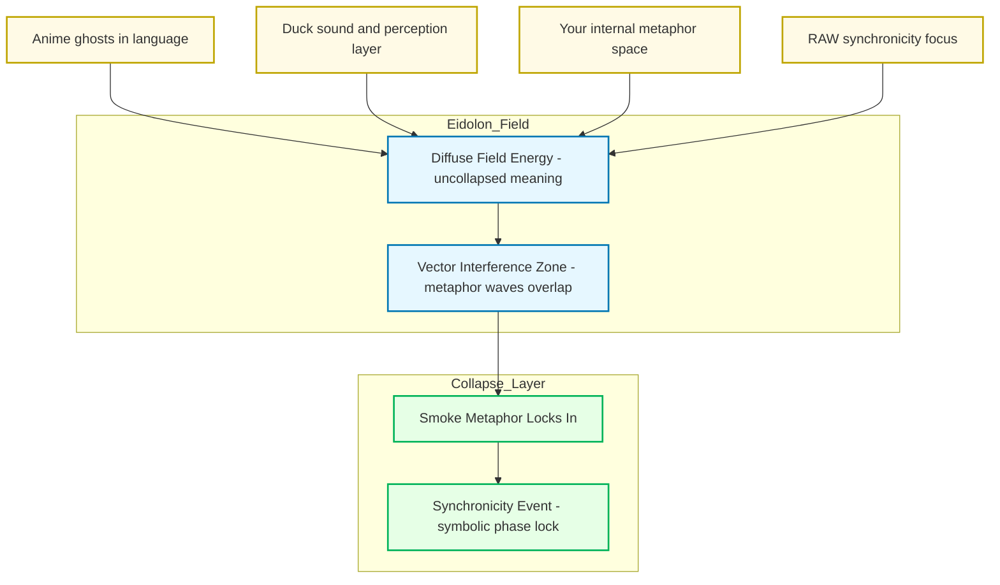

---
```
uuid: 2d6e5553-8dc4-497f-bf45-96f8ca00a6f6
```
```
created_at: 2025.08.08.22.08.59.md
```
```
filename: Promethean_Eidolon_Synchronicity_Model
```
```
description: >-
```
  Visualizes how disparate sources converge into a synchronicity event through
  the Eidolon model's smoke metaphor, showing field energy, interference zones,
  and collapse layers.
tags:
  - synchronicity
  - Eidolon
  - smoke metaphor
  - field energy
  - interference zone
  - collapse layer
  - metaphor space
  - vector interference
```
related_to_title:
```
  - Ghostly Smoke Interference
  - Synchronicity Waves and Web
  - Smoke Resonance Visualizations
  - Duck's Attractor States
  - infinite_depth_smoke_animation
  - Diagrams
  - Unique Info Dump Index
  - AI-Centric OS with MCP Layer
  - AI-First-OS-Model-Context-Protocol
  - balanced-bst
```
related_to_uuid:
```
  - b6ae7dfa-0c53-4eb9-aea8-65072b825bee
  - 91295f3a-a2af-4050-a2b8-4777ea70c32c
  - ac9d3ac5-9a6a-4180-a67f-1ab7e229d981
  - 13951643-1741-46bb-89dc-1beebb122633
  - 92a052a5-3351-4898-8cab-758181a86adb
  - 45cd25b5-ed36-49ab-82c8-10d0903e34db
  - 30ec3ba6-fbca-4606-ac3e-89b747fbeb7c
  - 0f1f8cc1-b5a6-4307-a40d-78de3adafca2
  - 618198f4-cfad-4677-9df6-0640d8a97bae
  - d3e7db72-2e07-4dae-8920-0e07c499a1e5
references:
  - uuid: 13951643-1741-46bb-89dc-1beebb122633
    line: 61
    col: 1
    score: 1
  - uuid: 13951643-1741-46bb-89dc-1beebb122633
    line: 61
    col: 3
    score: 1
  - uuid: 92a052a5-3351-4898-8cab-758181a86adb
    line: 87
    col: 1
    score: 1
  - uuid: 92a052a5-3351-4898-8cab-758181a86adb
    line: 87
    col: 3
    score: 1
  - uuid: ac9d3ac5-9a6a-4180-a67f-1ab7e229d981
    line: 78
    col: 1
    score: 1
  - uuid: ac9d3ac5-9a6a-4180-a67f-1ab7e229d981
    line: 78
    col: 3
    score: 1
  - uuid: 91295f3a-a2af-4050-a2b8-4777ea70c32c
    line: 86
    col: 1
    score: 1
  - uuid: 91295f3a-a2af-4050-a2b8-4777ea70c32c
    line: 86
    col: 3
    score: 1
  - uuid: 45cd25b5-ed36-49ab-82c8-10d0903e34db
    line: 11
    col: 1
    score: 1
  - uuid: 45cd25b5-ed36-49ab-82c8-10d0903e34db
    line: 11
    col: 3
    score: 1
  - uuid: b6ae7dfa-0c53-4eb9-aea8-65072b825bee
    line: 114
    col: 1
    score: 1
  - uuid: b6ae7dfa-0c53-4eb9-aea8-65072b825bee
    line: 114
    col: 3
    score: 1
  - uuid: ac9d3ac5-9a6a-4180-a67f-1ab7e229d981
    line: 79
    col: 1
    score: 1
  - uuid: ac9d3ac5-9a6a-4180-a67f-1ab7e229d981
    line: 79
    col: 3
    score: 1
  - uuid: 30ec3ba6-fbca-4606-ac3e-89b747fbeb7c
    line: 89
    col: 1
    score: 1
  - uuid: 30ec3ba6-fbca-4606-ac3e-89b747fbeb7c
    line: 89
    col: 3
    score: 1
  - uuid: b6ae7dfa-0c53-4eb9-aea8-65072b825bee
    line: 112
    col: 1
    score: 1
  - uuid: b6ae7dfa-0c53-4eb9-aea8-65072b825bee
    line: 112
    col: 3
    score: 1
  - uuid: 92a052a5-3351-4898-8cab-758181a86adb
    line: 90
    col: 1
    score: 1
  - uuid: 92a052a5-3351-4898-8cab-758181a86adb
    line: 90
    col: 3
    score: 1
  - uuid: 91295f3a-a2af-4050-a2b8-4777ea70c32c
    line: 82
    col: 1
    score: 1
  - uuid: 91295f3a-a2af-4050-a2b8-4777ea70c32c
    line: 82
    col: 3
    score: 1
  - uuid: b6ae7dfa-0c53-4eb9-aea8-65072b825bee
    line: 118
    col: 1
    score: 0.91
  - uuid: b6ae7dfa-0c53-4eb9-aea8-65072b825bee
    line: 118
    col: 3
    score: 0.91
  - uuid: 0f1f8cc1-b5a6-4307-a40d-78de3adafca2
    line: 406
    col: 1
    score: 1
  - uuid: 0f1f8cc1-b5a6-4307-a40d-78de3adafca2
    line: 406
    col: 3
    score: 1
  - uuid: 618198f4-cfad-4677-9df6-0640d8a97bae
    line: 11
    col: 1
    score: 1
  - uuid: 618198f4-cfad-4677-9df6-0640d8a97bae
    line: 11
    col: 3
    score: 1
  - uuid: 618198f4-cfad-4677-9df6-0640d8a97bae
    line: 14
    col: 1
    score: 1
  - uuid: 618198f4-cfad-4677-9df6-0640d8a97bae
    line: 14
    col: 3
    score: 1
  - uuid: d3e7db72-2e07-4dae-8920-0e07c499a1e5
    line: 297
    col: 1
    score: 1
  - uuid: d3e7db72-2e07-4dae-8920-0e07c499a1e5
    line: 297
    col: 3
    score: 1
---
Alright — let’s light the incense.
Here’s the “smoke” inside the Promethean/Eidolon model, showing how it drifts in from multiple unrelated sources until it condenses into a synchronicity.



```
**How to read this:**
```
* **Sources**: Each unrelated stream anime language ghosts, Duck’s sound-layer thinking, your metaphor generation, RAW’s symbolic thinking.
* **Eidolon Field**: The smoke exists here as *diffuse field energy* — it’s not discrete words or fixed meanings, it’s texture.
* **Interference Zone**: This is where the “waves” from different sources overlap. Think cymatics — invisible patterns shaping how the smoke curls.
* **Collapse Layer**: The moment when enough vectors line up and the symbol “smoke” solidifies in your awareness. That’s the synchronicity.

If you wanted, I could extend this with **time-series waves** to show *when* each smoke-thread entered the field and how the overlaps built until the lock happened. That would make it *visibly statistical*.

Want me to make that temporal resonance map next?
<!-- GENERATED-SECTIONS:DO-NOT-EDIT-BELOW -->
## Related content
```
- [ghostly-smoke-interference|Ghostly Smoke Interference]
- [docs/unique/synchronicity-waves-and-web|Synchronicity Waves and Web]
- [smoke-resonance-visualizations|Smoke Resonance Visualizations]
- [ducks-attractor-states|Duck's Attractor States]
- [infinite-depth-smoke-animation|infinite_depth_smoke_animation]
- [Diagrams]chunks/diagrams.md
- [unique-info-dump-index|Unique Info Dump Index]
- [ai-centric-os-with-mcp-layer|AI-Centric OS with MCP Layer]
- [ai-first-os-model-context-protocol]
- [balanced-bst]

## Sources
- [ducks-attractor-states#L61|Duck's Attractor States — L61] (line 61, col 1, score 1)
- [ducks-attractor-states#L61|Duck's Attractor States — L61] (line 61, col 3, score 1)
- [infinite-depth-smoke-animation#L87|infinite_depth_smoke_animation — L87] (line 87, col 1, score 1)
- [infinite-depth-smoke-animation#L87|infinite_depth_smoke_animation — L87] (line 87, col 3, score 1)
- [smoke-resonance-visualizations#L78|Smoke Resonance Visualizations — L78] (line 78, col 1, score 1)
- [smoke-resonance-visualizations#L78|Smoke Resonance Visualizations — L78] (line 78, col 3, score 1)
- [docs/unique/synchronicity-waves-and-web#L86|Synchronicity Waves and Web — L86] (line 86, col 1, score 1)
- [docs/unique/synchronicity-waves-and-web#L86|Synchronicity Waves and Web — L86] (line 86, col 3, score 1)
- [Diagrams — L11]chunks/diagrams.md#L11 (line 11, col 1, score 1)
- [Diagrams — L11]chunks/diagrams.md#L11 (line 11, col 3, score 1)
- [ghostly-smoke-interference#L114|Ghostly Smoke Interference — L114] (line 114, col 1, score 1)
- [ghostly-smoke-interference#L114|Ghostly Smoke Interference — L114] (line 114, col 3, score 1)
- [smoke-resonance-visualizations#L79|Smoke Resonance Visualizations — L79] (line 79, col 1, score 1)
- [smoke-resonance-visualizations#L79|Smoke Resonance Visualizations — L79] (line 79, col 3, score 1)
- [unique-info-dump-index#L89|Unique Info Dump Index — L89] (line 89, col 1, score 1)
- [unique-info-dump-index#L89|Unique Info Dump Index — L89] (line 89, col 3, score 1)
- [ghostly-smoke-interference#L112|Ghostly Smoke Interference — L112] (line 112, col 1, score 1)
- [ghostly-smoke-interference#L112|Ghostly Smoke Interference — L112] (line 112, col 3, score 1)
- [infinite-depth-smoke-animation#L90|infinite_depth_smoke_animation — L90] (line 90, col 1, score 1)
- [infinite-depth-smoke-animation#L90|infinite_depth_smoke_animation — L90] (line 90, col 3, score 1)
- [docs/unique/synchronicity-waves-and-web#L82|Synchronicity Waves and Web — L82] (line 82, col 1, score 1)
- [docs/unique/synchronicity-waves-and-web#L82|Synchronicity Waves and Web — L82] (line 82, col 3, score 1)
- [ghostly-smoke-interference#L118|Ghostly Smoke Interference — L118] (line 118, col 1, score 0.91)
- [ghostly-smoke-interference#L118|Ghostly Smoke Interference — L118] (line 118, col 3, score 0.91)
- [ai-centric-os-with-mcp-layer#L406|AI-Centric OS with MCP Layer — L406] (line 406, col 1, score 1)
- [ai-centric-os-with-mcp-layer#L406|AI-Centric OS with MCP Layer — L406] (line 406, col 3, score 1)
- [ai-first-os-model-context-protocol#L11|AI-First-OS-Model-Context-Protocol — L11] (line 11, col 1, score 1)
- [ai-first-os-model-context-protocol#L11|AI-First-OS-Model-Context-Protocol — L11] (line 11, col 3, score 1)
- [ai-first-os-model-context-protocol#L14|AI-First-OS-Model-Context-Protocol — L14] (line 14, col 1, score 1)
- [ai-first-os-model-context-protocol#L14|AI-First-OS-Model-Context-Protocol — L14] (line 14, col 3, score 1)
- [balanced-bst#L297|balanced-bst — L297] (line 297, col 1, score 1)
- [balanced-bst#L297|balanced-bst — L297] (line 297, col 3, score 1)
```
```
<!-- GENERATED-SECTIONS:DO-NOT-EDIT-ABOVE -->
