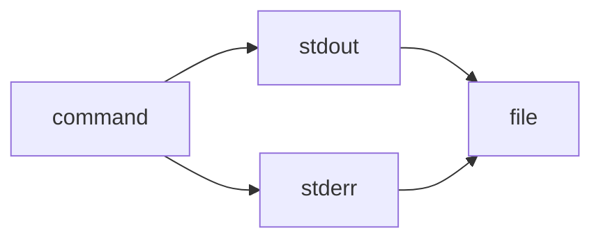

---
```
uuid: b3555ede-324a-4d24-a885-b0721e74babf
```
```
created_at: 2025.08.19.08.08.10.md
```
filename: Redirecting Standard Error
```
description: >-
```
  Explains the 2>&1 and &> operators for redirecting stderr to stdout in POSIX
  and shell scripting.
tags:
  - standard error
  - stdout
  - stderr
  - file descriptor
  - POSIX
  - shell scripting
  - redirect
```
related_to_title:
```
  - AI-Centric OS with MCP Layer
  - AI-First-OS-Model-Context-Protocol
  - balanced-bst
```
related_to_uuid:
```
  - 0f1f8cc1-b5a6-4307-a40d-78de3adafca2
  - 618198f4-cfad-4677-9df6-0640d8a97bae
  - d3e7db72-2e07-4dae-8920-0e07c499a1e5
references:
  - uuid: 0f1f8cc1-b5a6-4307-a40d-78de3adafca2
    line: 406
    col: 1
    score: 1
  - uuid: 0f1f8cc1-b5a6-4307-a40d-78de3adafca2
    line: 406
    col: 3
    score: 1
  - uuid: 618198f4-cfad-4677-9df6-0640d8a97bae
    line: 11
    col: 1
    score: 1
  - uuid: 618198f4-cfad-4677-9df6-0640d8a97bae
    line: 11
    col: 3
    score: 1
  - uuid: 618198f4-cfad-4677-9df6-0640d8a97bae
    line: 14
    col: 1
    score: 1
  - uuid: 618198f4-cfad-4677-9df6-0640d8a97bae
    line: 14
    col: 3
    score: 1
  - uuid: d3e7db72-2e07-4dae-8920-0e07c499a1e5
    line: 297
    col: 1
    score: 1
  - uuid: d3e7db72-2e07-4dae-8920-0e07c499a1e5
    line: 297
    col: 3
    score: 1
---

> 2>&1 is the explicit redirection operator:

> It means “send file descriptor 2 (stderr) to wherever file descriptor 1 (stdout) is currently going.”

> Works in all POSIX shells (sh, bash, zsh, dash, etc.).

```
> &> is a bash/zsh shorthand:
```
> It means “redirect both stdout and stderr to the same target.”

> Not POSIX; won’t work in plain sh or some other shells.

gg
<!-- GENERATED-SECTIONS:DO-NOT-EDIT-BELOW -->
## Related content
```
- [ai-centric-os-with-mcp-layer|AI-Centric OS with MCP Layer]
- [ai-first-os-model-context-protocol]
- [balanced-bst]

## Sources
- [ai-centric-os-with-mcp-layer#L406|AI-Centric OS with MCP Layer — L406] (line 406, col 1, score 1)
- [ai-centric-os-with-mcp-layer#L406|AI-Centric OS with MCP Layer — L406] (line 406, col 3, score 1)
- [ai-first-os-model-context-protocol#L11|AI-First-OS-Model-Context-Protocol — L11] (line 11, col 1, score 1)
- [ai-first-os-model-context-protocol#L11|AI-First-OS-Model-Context-Protocol — L11] (line 11, col 3, score 1)
- [ai-first-os-model-context-protocol#L14|AI-First-OS-Model-Context-Protocol — L14] (line 14, col 1, score 1)
- [ai-first-os-model-context-protocol#L14|AI-First-OS-Model-Context-Protocol — L14] (line 14, col 3, score 1)
- [balanced-bst#L297|balanced-bst — L297] (line 297, col 1, score 1)
- [balanced-bst#L297|balanced-bst — L297] (line 297, col 3, score 1)
```
```
<!-- GENERATED-SECTIONS:DO-NOT-EDIT-ABOVE -->
