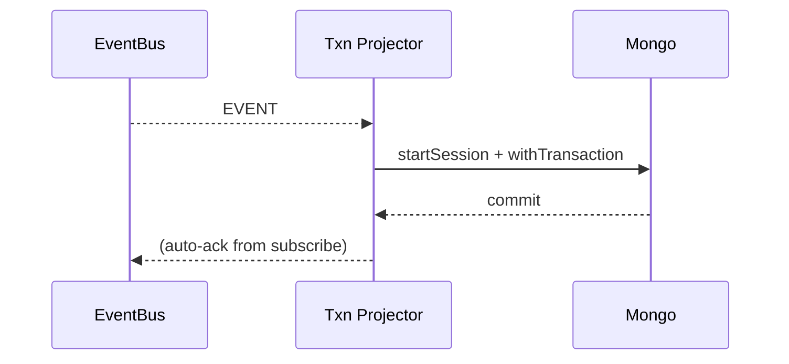

---
```
uuid: 509e1cd5-367c-4a9d-a61b-cef2e85d42ce
```
```
created_at: 2025.08.08.20.08.83.md
```
filename: State Snapshots API and Transactional Projector
```
description: >-
```
  Implements HTTP-based state snapshots with ETags for versioning and a
  transactional projector for atomic multi-collection updates. Includes
  time-travel queries and a dev harness for end-to-end testing.
tags:
  - state
  - snapshots
  - api
  - transactional
  - projector
  - time-travel
  - dev
  - harness
```
related_to_title:
```
  - prom-lib-rate-limiters-and-replay-api
  - schema-evolution-workflow
  - WebSocket Gateway Implementation
  - Services
  - Unique Info Dump Index
  - Mongo Outbox Implementation
  - Stateful Partitions and Rebalancing
  - Event Bus MVP
  - Promethean Event Bus MVP v0.1
  - archetype-ecs
  - aionian-circuit-math
  - Diagrams
  - DSL
  - Event Bus Projections Architecture
  - Chroma Toolkit Consolidation Plan
  - 'Agent Tasks: Persistence Migration to DualStore'
  - ecs-offload-workers
  - observability-infrastructure-setup
  - Migrate to Provider-Tenant Architecture
  - Cross-Language Runtime Polymorphism
  - ecs-scheduler-and-prefabs
  - zero-copy-snapshots-and-workers
  - obsidian-ignore-node-modules-regex
  - sibilant-metacompiler-overview
```
related_to_uuid:
```
  - aee4718b-9f8b-4635-a0c1-ef61c9bea8f1
  - d8059b6a-c1ec-487d-8e0b-3ce33d6b4d06
  - e811123d-5841-4e52-bf8c-978f26db4230
  - 75ea4a6a-8270-488d-9d37-799c288e5f70
  - 30ec3ba6-fbca-4606-ac3e-89b747fbeb7c
  - 9c1acd1e-c6a4-4a49-a66f-6da8b1bc9333
  - 4330e8f0-5f46-4235-918b-39b6b93fa561
  - 534fe91d-e87d-4cc7-b0e7-8b6833353d9b
  - fe7193a2-a5f7-4b3c-bea0-bd028815fc2c
  - 8f4c1e86-1236-4936-84ca-6ed7082af6b7
  - f2d83a77-7f86-4c56-8538-1350167a0c6c
  - 45cd25b5-ed36-49ab-82c8-10d0903e34db
  - e87bc036-1570-419e-a558-f45b9c0db698
  - cf6b9b17-bb91-4219-aa5c-172cba02b2da
  - 5020e892-8f18-443a-b707-6d0f3efcfe22
  - 93d2ba51-8689-49ee-94e2-296092e48058
  - 6498b9d7-bd35-4bd3-89fb-af1c415c3cd1
  - b4e64f8c-4dc9-4941-a877-646c5ada068e
  - 54382370-1931-4a19-a634-46735708a9ea
  - c34c36a6-80c9-4b44-a200-6448543b1b33
  - c62a1815-c43b-4a3b-88e6-d7fa008a155e
  - 62bec6f0-4e13-4f38-aca4-72c84ba02367
  - ffb9b2a9-744d-4a53-9565-130fceae0832
  - 61d4086b-4adf-4e94-95e4-95a249cd1b53
references:
  - uuid: 75ea4a6a-8270-488d-9d37-799c288e5f70
    line: 6
    col: 1
    score: 0.85
  - uuid: 75ea4a6a-8270-488d-9d37-799c288e5f70
    line: 6
    col: 3
    score: 0.85
  - uuid: 30ec3ba6-fbca-4606-ac3e-89b747fbeb7c
    line: 40
    col: 1
    score: 0.85
  - uuid: 30ec3ba6-fbca-4606-ac3e-89b747fbeb7c
    line: 40
    col: 3
    score: 0.85
  - uuid: aee4718b-9f8b-4635-a0c1-ef61c9bea8f1
    line: 90
    col: 1
    score: 0.88
  - uuid: d8059b6a-c1ec-487d-8e0b-3ce33d6b4d06
    line: 130
    col: 1
    score: 0.88
  - uuid: d8059b6a-c1ec-487d-8e0b-3ce33d6b4d06
    line: 222
    col: 1
    score: 0.88
  - uuid: e811123d-5841-4e52-bf8c-978f26db4230
    line: 318
    col: 1
    score: 0.86
  - uuid: 93d2ba51-8689-49ee-94e2-296092e48058
    line: 136
    col: 1
    score: 1
  - uuid: 93d2ba51-8689-49ee-94e2-296092e48058
    line: 136
    col: 3
    score: 1
  - uuid: 5020e892-8f18-443a-b707-6d0f3efcfe22
    line: 166
    col: 1
    score: 1
  - uuid: 5020e892-8f18-443a-b707-6d0f3efcfe22
    line: 166
    col: 3
    score: 1
  - uuid: 534fe91d-e87d-4cc7-b0e7-8b6833353d9b
    line: 551
    col: 1
    score: 1
  - uuid: 534fe91d-e87d-4cc7-b0e7-8b6833353d9b
    line: 551
    col: 3
    score: 1
  - uuid: 54382370-1931-4a19-a634-46735708a9ea
    line: 284
    col: 1
    score: 1
  - uuid: 54382370-1931-4a19-a634-46735708a9ea
    line: 284
    col: 3
    score: 1
  - uuid: 75ea4a6a-8270-488d-9d37-799c288e5f70
    line: 12
    col: 1
    score: 1
  - uuid: 75ea4a6a-8270-488d-9d37-799c288e5f70
    line: 12
    col: 3
    score: 1
  - uuid: c34c36a6-80c9-4b44-a200-6448543b1b33
    line: 211
    col: 1
    score: 1
  - uuid: c34c36a6-80c9-4b44-a200-6448543b1b33
    line: 211
    col: 3
    score: 1
  - uuid: 534fe91d-e87d-4cc7-b0e7-8b6833353d9b
    line: 550
    col: 1
    score: 1
  - uuid: 534fe91d-e87d-4cc7-b0e7-8b6833353d9b
    line: 550
    col: 3
    score: 1
  - uuid: 9c1acd1e-c6a4-4a49-a66f-6da8b1bc9333
    line: 554
    col: 1
    score: 1
  - uuid: 9c1acd1e-c6a4-4a49-a66f-6da8b1bc9333
    line: 554
    col: 3
    score: 1
  - uuid: 6498b9d7-bd35-4bd3-89fb-af1c415c3cd1
    line: 465
    col: 1
    score: 1
  - uuid: 6498b9d7-bd35-4bd3-89fb-af1c415c3cd1
    line: 465
    col: 3
    score: 1
  - uuid: 534fe91d-e87d-4cc7-b0e7-8b6833353d9b
    line: 548
    col: 1
    score: 1
  - uuid: 534fe91d-e87d-4cc7-b0e7-8b6833353d9b
    line: 548
    col: 3
    score: 1
  - uuid: 9c1acd1e-c6a4-4a49-a66f-6da8b1bc9333
    line: 551
    col: 1
    score: 1
  - uuid: 9c1acd1e-c6a4-4a49-a66f-6da8b1bc9333
    line: 551
    col: 3
    score: 1
  - uuid: fe7193a2-a5f7-4b3c-bea0-bd028815fc2c
    line: 883
    col: 1
    score: 1
  - uuid: fe7193a2-a5f7-4b3c-bea0-bd028815fc2c
    line: 883
    col: 3
    score: 1
  - uuid: 9c1acd1e-c6a4-4a49-a66f-6da8b1bc9333
    line: 557
    col: 1
    score: 1
  - uuid: 9c1acd1e-c6a4-4a49-a66f-6da8b1bc9333
    line: 557
    col: 3
    score: 1
  - uuid: d8059b6a-c1ec-487d-8e0b-3ce33d6b4d06
    line: 486
    col: 1
    score: 1
  - uuid: d8059b6a-c1ec-487d-8e0b-3ce33d6b4d06
    line: 486
    col: 3
    score: 1
  - uuid: 4330e8f0-5f46-4235-918b-39b6b93fa561
    line: 533
    col: 1
    score: 1
  - uuid: 4330e8f0-5f46-4235-918b-39b6b93fa561
    line: 533
    col: 3
    score: 1
  - uuid: 30ec3ba6-fbca-4606-ac3e-89b747fbeb7c
    line: 68
    col: 1
    score: 1
  - uuid: 30ec3ba6-fbca-4606-ac3e-89b747fbeb7c
    line: 68
    col: 3
    score: 1
  - uuid: f2d83a77-7f86-4c56-8538-1350167a0c6c
    line: 158
    col: 1
    score: 1
  - uuid: f2d83a77-7f86-4c56-8538-1350167a0c6c
    line: 158
    col: 3
    score: 1
  - uuid: 8f4c1e86-1236-4936-84ca-6ed7082af6b7
    line: 457
    col: 1
    score: 1
  - uuid: 8f4c1e86-1236-4936-84ca-6ed7082af6b7
    line: 457
    col: 3
    score: 1
  - uuid: 45cd25b5-ed36-49ab-82c8-10d0903e34db
    line: 9
    col: 1
    score: 1
  - uuid: 45cd25b5-ed36-49ab-82c8-10d0903e34db
    line: 9
    col: 3
    score: 1
  - uuid: e87bc036-1570-419e-a558-f45b9c0db698
    line: 10
    col: 1
    score: 1
  - uuid: e87bc036-1570-419e-a558-f45b9c0db698
    line: 10
    col: 3
    score: 1
  - uuid: 75ea4a6a-8270-488d-9d37-799c288e5f70
    line: 13
    col: 1
    score: 1
  - uuid: 75ea4a6a-8270-488d-9d37-799c288e5f70
    line: 13
    col: 3
    score: 1
  - uuid: 6498b9d7-bd35-4bd3-89fb-af1c415c3cd1
    line: 467
    col: 1
    score: 1
  - uuid: 6498b9d7-bd35-4bd3-89fb-af1c415c3cd1
    line: 467
    col: 3
    score: 1
  - uuid: 534fe91d-e87d-4cc7-b0e7-8b6833353d9b
    line: 549
    col: 1
    score: 1
  - uuid: 534fe91d-e87d-4cc7-b0e7-8b6833353d9b
    line: 549
    col: 3
    score: 1
  - uuid: b4e64f8c-4dc9-4941-a877-646c5ada068e
    line: 364
    col: 1
    score: 1
  - uuid: b4e64f8c-4dc9-4941-a877-646c5ada068e
    line: 364
    col: 3
    score: 1
  - uuid: 75ea4a6a-8270-488d-9d37-799c288e5f70
    line: 14
    col: 1
    score: 1
  - uuid: 75ea4a6a-8270-488d-9d37-799c288e5f70
    line: 14
    col: 3
    score: 1
  - uuid: 534fe91d-e87d-4cc7-b0e7-8b6833353d9b
    line: 553
    col: 1
    score: 1
  - uuid: 534fe91d-e87d-4cc7-b0e7-8b6833353d9b
    line: 553
    col: 3
    score: 1
  - uuid: 9c1acd1e-c6a4-4a49-a66f-6da8b1bc9333
    line: 559
    col: 1
    score: 1
  - uuid: 9c1acd1e-c6a4-4a49-a66f-6da8b1bc9333
    line: 559
    col: 3
    score: 1
  - uuid: aee4718b-9f8b-4635-a0c1-ef61c9bea8f1
    line: 388
    col: 1
    score: 1
  - uuid: aee4718b-9f8b-4635-a0c1-ef61c9bea8f1
    line: 388
    col: 3
    score: 1
  - uuid: 9c1acd1e-c6a4-4a49-a66f-6da8b1bc9333
    line: 552
    col: 1
    score: 1
  - uuid: 9c1acd1e-c6a4-4a49-a66f-6da8b1bc9333
    line: 552
    col: 3
    score: 1
  - uuid: aee4718b-9f8b-4635-a0c1-ef61c9bea8f1
    line: 386
    col: 1
    score: 1
  - uuid: aee4718b-9f8b-4635-a0c1-ef61c9bea8f1
    line: 386
    col: 3
    score: 1
  - uuid: fe7193a2-a5f7-4b3c-bea0-bd028815fc2c
    line: 881
    col: 1
    score: 1
  - uuid: fe7193a2-a5f7-4b3c-bea0-bd028815fc2c
    line: 881
    col: 3
    score: 1
  - uuid: d8059b6a-c1ec-487d-8e0b-3ce33d6b4d06
    line: 485
    col: 1
    score: 1
  - uuid: d8059b6a-c1ec-487d-8e0b-3ce33d6b4d06
    line: 485
    col: 3
    score: 1
  - uuid: 93d2ba51-8689-49ee-94e2-296092e48058
    line: 137
    col: 1
    score: 1
  - uuid: 93d2ba51-8689-49ee-94e2-296092e48058
    line: 137
    col: 3
    score: 1
  - uuid: 5020e892-8f18-443a-b707-6d0f3efcfe22
    line: 175
    col: 1
    score: 1
  - uuid: 5020e892-8f18-443a-b707-6d0f3efcfe22
    line: 175
    col: 3
    score: 1
  - uuid: 534fe91d-e87d-4cc7-b0e7-8b6833353d9b
    line: 547
    col: 1
    score: 1
  - uuid: 534fe91d-e87d-4cc7-b0e7-8b6833353d9b
    line: 547
    col: 3
    score: 1
  - uuid: cf6b9b17-bb91-4219-aa5c-172cba02b2da
    line: 150
    col: 1
    score: 1
  - uuid: cf6b9b17-bb91-4219-aa5c-172cba02b2da
    line: 150
    col: 3
    score: 1
  - uuid: 30ec3ba6-fbca-4606-ac3e-89b747fbeb7c
    line: 158
    col: 1
    score: 0.97
  - uuid: 30ec3ba6-fbca-4606-ac3e-89b747fbeb7c
    line: 158
    col: 3
    score: 0.97
  - uuid: 30ec3ba6-fbca-4606-ac3e-89b747fbeb7c
    line: 159
    col: 1
    score: 0.96
  - uuid: 30ec3ba6-fbca-4606-ac3e-89b747fbeb7c
    line: 159
    col: 3
    score: 0.96
  - uuid: 30ec3ba6-fbca-4606-ac3e-89b747fbeb7c
    line: 156
    col: 1
    score: 0.95
  - uuid: 30ec3ba6-fbca-4606-ac3e-89b747fbeb7c
    line: 156
    col: 3
    score: 0.95
  - uuid: 30ec3ba6-fbca-4606-ac3e-89b747fbeb7c
    line: 157
    col: 1
    score: 0.94
  - uuid: 30ec3ba6-fbca-4606-ac3e-89b747fbeb7c
    line: 157
    col: 3
    score: 0.94
  - uuid: 30ec3ba6-fbca-4606-ac3e-89b747fbeb7c
    line: 155
    col: 1
    score: 0.95
  - uuid: 30ec3ba6-fbca-4606-ac3e-89b747fbeb7c
    line: 155
    col: 3
    score: 0.95
  - uuid: 30ec3ba6-fbca-4606-ac3e-89b747fbeb7c
    line: 153
    col: 1
    score: 0.95
  - uuid: 30ec3ba6-fbca-4606-ac3e-89b747fbeb7c
    line: 153
    col: 3
    score: 0.95
  - uuid: c62a1815-c43b-4a3b-88e6-d7fa008a155e
    line: 403
    col: 1
    score: 0.98
  - uuid: c62a1815-c43b-4a3b-88e6-d7fa008a155e
    line: 403
    col: 3
    score: 0.98
  - uuid: 62bec6f0-4e13-4f38-aca4-72c84ba02367
    line: 371
    col: 1
    score: 0.98
  - uuid: 62bec6f0-4e13-4f38-aca4-72c84ba02367
    line: 371
    col: 3
    score: 0.98
  - uuid: ffb9b2a9-744d-4a53-9565-130fceae0832
    line: 57
    col: 1
    score: 0.98
  - uuid: ffb9b2a9-744d-4a53-9565-130fceae0832
    line: 57
    col: 3
    score: 0.98
  - uuid: c62a1815-c43b-4a3b-88e6-d7fa008a155e
    line: 404
    col: 1
    score: 0.98
  - uuid: c62a1815-c43b-4a3b-88e6-d7fa008a155e
    line: 404
    col: 3
    score: 0.98
  - uuid: 62bec6f0-4e13-4f38-aca4-72c84ba02367
    line: 372
    col: 1
    score: 0.99
  - uuid: 62bec6f0-4e13-4f38-aca4-72c84ba02367
    line: 372
    col: 3
    score: 0.99
  - uuid: ffb9b2a9-744d-4a53-9565-130fceae0832
    line: 58
    col: 1
    score: 0.99
  - uuid: ffb9b2a9-744d-4a53-9565-130fceae0832
    line: 58
    col: 3
    score: 0.99
  - uuid: 61d4086b-4adf-4e94-95e4-95a249cd1b53
    line: 100
    col: 1
    score: 0.98
  - uuid: 61d4086b-4adf-4e94-95e4-95a249cd1b53
    line: 100
    col: 3
    score: 0.98
  - uuid: 534fe91d-e87d-4cc7-b0e7-8b6833353d9b
    line: 559
    col: 1
    score: 0.99
  - uuid: 534fe91d-e87d-4cc7-b0e7-8b6833353d9b
    line: 559
    col: 3
    score: 0.99
  - uuid: d8059b6a-c1ec-487d-8e0b-3ce33d6b4d06
    line: 494
    col: 1
    score: 0.99
  - uuid: d8059b6a-c1ec-487d-8e0b-3ce33d6b4d06
    line: 494
    col: 3
    score: 0.99
  - uuid: fe7193a2-a5f7-4b3c-bea0-bd028815fc2c
    line: 906
    col: 1
    score: 0.99
  - uuid: fe7193a2-a5f7-4b3c-bea0-bd028815fc2c
    line: 906
    col: 3
    score: 0.99
  - uuid: 534fe91d-e87d-4cc7-b0e7-8b6833353d9b
    line: 558
    col: 1
    score: 0.99
  - uuid: 534fe91d-e87d-4cc7-b0e7-8b6833353d9b
    line: 558
    col: 3
    score: 0.99
  - uuid: 534fe91d-e87d-4cc7-b0e7-8b6833353d9b
    line: 564
    col: 1
    score: 0.99
  - uuid: 534fe91d-e87d-4cc7-b0e7-8b6833353d9b
    line: 564
    col: 3
    score: 0.99
  - uuid: 4330e8f0-5f46-4235-918b-39b6b93fa561
    line: 542
    col: 1
    score: 0.99
  - uuid: 4330e8f0-5f46-4235-918b-39b6b93fa561
    line: 542
    col: 3
    score: 0.99
  - uuid: 4330e8f0-5f46-4235-918b-39b6b93fa561
    line: 544
    col: 1
    score: 0.98
  - uuid: 4330e8f0-5f46-4235-918b-39b6b93fa561
    line: 544
    col: 3
    score: 0.98
  - uuid: 4330e8f0-5f46-4235-918b-39b6b93fa561
    line: 543
    col: 1
    score: 0.98
  - uuid: 4330e8f0-5f46-4235-918b-39b6b93fa561
    line: 543
    col: 3
    score: 0.98
  - uuid: 534fe91d-e87d-4cc7-b0e7-8b6833353d9b
    line: 561
    col: 1
    score: 1
  - uuid: 534fe91d-e87d-4cc7-b0e7-8b6833353d9b
    line: 561
    col: 3
    score: 1
  - uuid: 534fe91d-e87d-4cc7-b0e7-8b6833353d9b
    line: 562
    col: 1
    score: 0.99
  - uuid: 534fe91d-e87d-4cc7-b0e7-8b6833353d9b
    line: 562
    col: 3
    score: 0.99
  - uuid: 9c1acd1e-c6a4-4a49-a66f-6da8b1bc9333
    line: 566
    col: 1
    score: 0.99
  - uuid: 9c1acd1e-c6a4-4a49-a66f-6da8b1bc9333
    line: 566
    col: 3
    score: 0.99
  - uuid: fe7193a2-a5f7-4b3c-bea0-bd028815fc2c
    line: 914
    col: 1
    score: 0.99
  - uuid: fe7193a2-a5f7-4b3c-bea0-bd028815fc2c
    line: 914
    col: 3
    score: 0.99
---
Note: Consolidated here → ../notes/services/state-snapshots-transactional-projector-timetravel-devharness.md

Alright, **Part 7**: **State Snapshots API**, **Transactional Projector**, **Time-Travel queries**, and a tiny **Dev Harness** for end-to-end tests. Paste ’em under `shared/js/prom-lib/` plus one `tests/` file.

---

# State Snapshots API (HTTP with ETags)

```ts
// shared/js/prom-lib/snapshots/api.ts
import express from "express";
import type { Db } from "mongodb";
import crypto from "crypto";

export interface SnapshotApiOptions {
  collection: string;              // e.g., "processes.snapshot"
  keyField?: string;               // default "_key"
  bodyLimit?: string;              // default "200kb"
  maxAgeSeconds?: number;          // default 5 (client cache)
}

function etagOf(doc: any) {
  const s = JSON.stringify(doc);
  return '"' + crypto.createHash("sha1").update(s).digest("hex") + '"';
}

export function startSnapshotApi(db: Db, port = 8091, opts: SnapshotApiOptions) {
  const app = express();
  app.set("etag", false);
  app.use(express.json({ limit: opts.bodyLimit ?? "200kb" }));

  const coll = db.collection(opts.collection);
  const keyField = opts.keyField ?? "_key";
  const cacheCtl = `public, max-age={opts.maxAgeSeconds ?? 5}`;

  // GET /snap/:key
  app.get("/snap/:key", async (req, res) => {
    const key = req.params.key;
    const doc = await coll.findOne({ [keyField]: key });
    if (!doc) return res.status(404).json({ error: "not_found" });

    const etag = etagOf({ ...doc, _id: undefined });
    if (req.headers["if-none-match"] === etag) {
      return res.status(304).end();
    }
    res.setHeader("ETag", etag);
    res.setHeader("Cache-Control", cacheCtl);
    res.json(doc);
  });

  // GET /list?offset=0&limit=100&status=alive
  app.get("/list", async (req, res) => {
    const limit = Math.min(Number(req.query.limit ?? 100), 1000);
    const offset = Number(req.query.offset ?? 0);
    const q: any = {};
    // simple filters
    for (const k of Object.keys(req.query)) {
      if (["limit","offset"].includes(k)) continue;
      q[k] = req.query[k];
    }
    const cursor = coll.find(q).sort({ _ts: -1 }).skip(offset).limit(limit);
    const items = await cursor.toArray();
    res.setHeader("Cache-Control", "no-store");
    res.json({ offset, limit, count: items.length, items });
  });

  // HEAD /snap/:key (for cheap freshness checks)
  app.head("/snap/:key", async (req, res) => {
    const key = req.params.key;
    const doc = await coll.findOne({ [keyField]: key }, { projection: { _id: 0, _ts: 1 } });
    if (!doc) return res.status(404).end();
    const etag = etagOf(doc);
    if (req.headers["if-none-match"] === etag) return res.status(304).end();
    res.setHeader("ETag", etag);
    res.setHeader("Cache-Control", cacheCtl);
    res.status(200).end();
  });

  return app.listen(port, () => console.log(`[snapshot-api] on :{port} ({opts.collection})`));
}
```

**Indexes you want on the snapshot collection:**

* `{ _key: 1 } unique`
* Optional filter fields (e.g., `{ status: 1 }`)
* `{ _ts: -1 }`

---

# Transactional Projector multi-collection, atomic

```ts
// shared/js/prom-lib/projectors/transactional.ts
import type { Db, ClientSession } from "mongodb";
import type { EventBus, EventRecord } from "../event/types";

export interface TxnProjectorOpts<E=any> {
  topic: string;
  group: string;
  handler: (e: EventRecord<E>, db: Db, s: ClientSession) => Promise<void>;
  from?: "earliest" | "latest";
  retries?: number;
}

export async function startTransactionalProjector<E=any>(bus: EventBus, db: Db, opts: TxnProjectorOpts<E>) {
  const from = opts.from ?? "earliest";
  const retries = opts.retries ?? 3;

  return bus.subscribe(opts.topic, opts.group, async (e) => {
    for (let i=0; i<=retries; i++) {
      const s = db.client.startSession();
      try {
        await s.withTransaction(async () => {
          await opts.handler(e, db, s);
        }, { writeConcern: { w: "majority" } });
        // success → exit retry loop
        return;
      } catch (err) {
        if (i === retries) throw err;
        await new Promise(r => setTimeout(r, 100 * (i+1)));
      } finally {
        await s.endSession();
      }
    }
  }, { from, manualAck: false, batchSize: 200 });
}
```

**Usage example process state → processes + stats:**

```ts
// services/js/projectors/process.txn.ts
import { startTransactionalProjector } from "../../shared/js/prom-lib/projectors/transactional";
import { MongoEventBus } from "../../shared/js/prom-lib/event/mongo";

export async function startProcessTxnProjector(bus: MongoEventBus, db: any) {
  await startTransactionalProjector(bus, db, {
    topic: "process.state",
    group: "processes.txn",
    async handler(e, db, s) {
      const p = e.payload as any;
      // Collection A: upsert processes
      await db.collection("processes").updateOne(
        { _key: p.processId },
        { set: { ...p, _key: p.processId, _ts: e.ts } },
        { upsert: true, session: s }
      );
      // Collection B: aggregate a simple host counter (idempotent upsert)
      await db.collection("host_stats").updateOne(
        { _key: p.host },
        { setOnInsert: { _key: p.host }, inc: { seen: 1 }, set: { last_ts: e.ts } },
        { upsert: true, session: s }
      );
    },
  });
}
```
```
**Mermaid (ack-after-commit):**
```


---

# Time-Travel Query Helper (reconstruct state at T)

Works with compaction topics latest-by-key + periodic snapshots.

```ts
// shared/js/prom-lib/timetravel/reconstruct.ts
import type { MongoEventStore } from "../event/mongo";
import type { EventRecord } from "../event/types";

export interface ReconstructOpts<T=any> {
  topic: string;                // e.g., "process.state"
  snapshotTopic?: string;       // e.g., "process.state.snapshot" (optional)
  key: string;                  // entity key
  atTs: number;                 // target timestamp (epoch ms)
  apply: (prev: T | null, e: EventRecord<T>) => T | null; // reducer: apply event->state
  // fetchSnapshot: override to load nearest <= atTs (if not using events-only)
  fetchSnapshot?: (key: string, upTo: number) => Promise<{ state: T | null, ts: number } | null>;
}

export async function reconstructAt<T=any>(store: MongoEventStore, opts: ReconstructOpts<T>) {
  let baseState: T | null = null;
  let baseTs = 0;

  // optional snapshot as baseline
  if (opts.fetchSnapshot) {
    const snap = await opts.fetchSnapshot(opts.key, opts.atTs);
    if (snap) { baseState = snap.state; baseTs = snap.ts; }
  }

  // scan events after baseline up to atTs
  const events = await store.scan(opts.topic, { ts: baseTs, limit: 1_000_000 });
  for (const e of events) {
    if (e.ts > opts.atTs) break;
    if (e.key !== opts.key) continue;
    baseState = opts.apply(baseState, e as EventRecord<T>);
    baseTs = e.ts;
  }
  return { state: baseState, ts: baseTs };
}
```

**Example reducer (process.state is full upsert):**

```ts
// shared/js/prom-lib/timetravel/examples.ts
import { reconstructAt } from "./reconstruct";
import { MongoEventStore } from "../event/mongo";

export async function processAt(store: MongoEventStore, processId: string, atTs: number) {
  return reconstructAt(store, {
    topic: "process.state",
    key: processId,
    atTs,
    apply: (_prev, e) => e.payload as any
  });
}
```
```
**Mermaid:**
```
```mermaid
flowchart LR
  Snap[Snapshot <= T] --> Base
  Base -->|scan events (Base.ts..T)| Reduce
  Reduce --> State[State@T]
```

> If you don’t have snapshots, set `fetchSnapshot` to `null` and it’ll reconstruct purely from events (longer scans).

---

# Dev Harness spin in-memory bus + fake services

```ts
// shared/js/prom-lib/dev/harness.ts
import { InMemoryEventBus } from "../event/memory";
import { startWSGateway } from "../ws/server";
import { startHttpPublisher } from "../http/publish";
import { startProcessProjector } from "../examples/process/projector";

export interface Harness {
  bus: InMemoryEventBus;
  stop(): Promise<void>;
}

export async function startHarness({ wsPort = 9090, httpPort = 9091 } = {}): Promise<Harness> {
  const bus = new InMemoryEventBus();

  const wss = startWSGateway(bus, wsPort, { auth: async () => ({ ok: true }) });
  const http = startHttpPublisher(bus, httpPort);
  const stopProj = await startProcessProjector(bus);

  return {
    bus,
    async stop() {
      await new Promise(r => (http as any).close(r));
      wss.close();
      stopProj();
    }
  };
}
```
```
**Integration test (Jest)**
```
```ts
// tests/dev.harness.int.test.ts
import { startHarness } from "../shared/js/prom-lib/dev/harness";

test("harness end-to-end", async () => {
  const h = await startHarness({ wsPort: 9190, httpPort: 9191 });

  // publish a heartbeat and wait a tick
  await h.bus.publish("heartbeat.received", { pid: 1, name: "stt", host: "local", cpu_pct: 1, mem_mb: 2 });
  await new Promise(r => setTimeout(r, 50));

  // ensure projector emitted process.state
  const cur = await h.bus.getCursor("process.state", "process-projector"); // from projector group
  expect(cur).toBeTruthy();

  await h.stop();
}, 10_000);
```

---

# Sibilant sprinkles (pseudo)

```lisp
; shared/sibilant/prom/snapshots.sib (pseudo)
(defn start-snapshot-api [db port coll]
  (startSnapshotApi db port {:collection coll}))

; transactional projector macro-ish feel
(defmacro def-txn-projector [topic group & body]
  `(startTransactionalProjector bus db {:topic ~topic :group ~group :handler (fn [e db s] ~@body)}))
```

---

# Kanban adds

* [ ] Expose **Snapshot API** for `processes` (collection `processes`)
* [ ] Add `process.txn` projector to upsert `processes` + `host_stats` atomically
* [ ] Implement `timetravel.processAt(processId, T)` in a small CLI for debugging
* [ ] Add `dev.harness.int.test.ts` to CI integration stage
* [ ] Document ETag semantics and cache headers for `/snap/:key`

---

Want **Part 8** next? I can deliver:

* **Multi-tenant topics** namespace + policy isolation,
* **SLO monitor** (lag, ack time, error rate with alarms),
* **Bulk replayer** topic→topic with filter/map,
* and **JS/Hy generators** to autowire schemas/topics → typed clients + validators.
<!-- GENERATED-SECTIONS:DO-NOT-EDIT-BELOW -->
## Related content
- [prom-lib-rate-limiters-and-replay-api]
- [schema-evolution-workflow]
- [websocket-gateway-implementation|WebSocket Gateway Implementation]
- [Services]chunks/services.md
- [unique-info-dump-index|Unique Info Dump Index]
- [mongo-outbox-implementation|Mongo Outbox Implementation]
- [stateful-partitions-and-rebalancing|Stateful Partitions and Rebalancing]
- [docs/unique/event-bus-mvp|Event Bus MVP]
- [Promethean Event Bus MVP v0.1]promethean-event-bus-mvp-v0-1.md
- [docs/unique/archetype-ecs|archetype-ecs]
- [docs/unique/aionian-circuit-math|aionian-circuit-math]
- [Diagrams]chunks/diagrams.md
- [DSL]chunks/dsl.md
- [event-bus-projections-architecture|Event Bus Projections Architecture]
- [chroma-toolkit-consolidation-plan|Chroma Toolkit Consolidation Plan]
- [docs/unique/agent-tasks-persistence-migration-to-dualstore|Agent Tasks: Persistence Migration to DualStore]
- [docs/unique/ecs-offload-workers|ecs-offload-workers]
- [observability-infrastructure-setup]
- [migrate-to-provider-tenant-architecture|Migrate to Provider-Tenant Architecture]
- [cross-language-runtime-polymorphism|Cross-Language Runtime Polymorphism]
- [ecs-scheduler-and-prefabs]
- [docs/unique/zero-copy-snapshots-and-workers|zero-copy-snapshots-and-workers]
- [docs/unique/obsidian-ignore-node-modules-regex|obsidian-ignore-node-modules-regex]
- [sibilant-metacompiler-overview]

## Sources
- [Services — L6]chunks/services.md#L6 (line 6, col 1, score 0.85)
- [Services — L6]chunks/services.md#L6 (line 6, col 3, score 0.85)
- [unique-info-dump-index#L40|Unique Info Dump Index — L40] (line 40, col 1, score 0.85)
- [unique-info-dump-index#L40|Unique Info Dump Index — L40] (line 40, col 3, score 0.85)
- [prom-lib-rate-limiters-and-replay-api#L90|prom-lib-rate-limiters-and-replay-api — L90] (line 90, col 1, score 0.88)
- [schema-evolution-workflow#L130|schema-evolution-workflow — L130] (line 130, col 1, score 0.88)
- [schema-evolution-workflow#L222|schema-evolution-workflow — L222] (line 222, col 1, score 0.88)
- [websocket-gateway-implementation#L318|WebSocket Gateway Implementation — L318] (line 318, col 1, score 0.86)
- [docs/unique/agent-tasks-persistence-migration-to-dualstore#L136|Agent Tasks: Persistence Migration to DualStore — L136] (line 136, col 1, score 1)
- [docs/unique/agent-tasks-persistence-migration-to-dualstore#L136|Agent Tasks: Persistence Migration to DualStore — L136] (line 136, col 3, score 1)
- [chroma-toolkit-consolidation-plan#L166|Chroma Toolkit Consolidation Plan — L166] (line 166, col 1, score 1)
- [chroma-toolkit-consolidation-plan#L166|Chroma Toolkit Consolidation Plan — L166] (line 166, col 3, score 1)
- [docs/unique/event-bus-mvp#L551|Event Bus MVP — L551] (line 551, col 1, score 1)
- [docs/unique/event-bus-mvp#L551|Event Bus MVP — L551] (line 551, col 3, score 1)
- [migrate-to-provider-tenant-architecture#L284|Migrate to Provider-Tenant Architecture — L284] (line 284, col 1, score 1)
- [migrate-to-provider-tenant-architecture#L284|Migrate to Provider-Tenant Architecture — L284] (line 284, col 3, score 1)
- [Services — L12]chunks/services.md#L12 (line 12, col 1, score 1)
- [Services — L12]chunks/services.md#L12 (line 12, col 3, score 1)
- [cross-language-runtime-polymorphism#L211|Cross-Language Runtime Polymorphism — L211] (line 211, col 1, score 1)
- [cross-language-runtime-polymorphism#L211|Cross-Language Runtime Polymorphism — L211] (line 211, col 3, score 1)
- [docs/unique/event-bus-mvp#L550|Event Bus MVP — L550] (line 550, col 1, score 1)
- [docs/unique/event-bus-mvp#L550|Event Bus MVP — L550] (line 550, col 3, score 1)
- [mongo-outbox-implementation#L554|Mongo Outbox Implementation — L554] (line 554, col 1, score 1)
- [mongo-outbox-implementation#L554|Mongo Outbox Implementation — L554] (line 554, col 3, score 1)
- [docs/unique/ecs-offload-workers#L465|ecs-offload-workers — L465] (line 465, col 1, score 1)
- [docs/unique/ecs-offload-workers#L465|ecs-offload-workers — L465] (line 465, col 3, score 1)
- [docs/unique/event-bus-mvp#L548|Event Bus MVP — L548] (line 548, col 1, score 1)
- [docs/unique/event-bus-mvp#L548|Event Bus MVP — L548] (line 548, col 3, score 1)
- [mongo-outbox-implementation#L551|Mongo Outbox Implementation — L551] (line 551, col 1, score 1)
- [mongo-outbox-implementation#L551|Mongo Outbox Implementation — L551] (line 551, col 3, score 1)
- [Promethean Event Bus MVP v0.1 — L883]promethean-event-bus-mvp-v0-1.md#L883 (line 883, col 1, score 1)
- [Promethean Event Bus MVP v0.1 — L883]promethean-event-bus-mvp-v0-1.md#L883 (line 883, col 3, score 1)
- [mongo-outbox-implementation#L557|Mongo Outbox Implementation — L557] (line 557, col 1, score 1)
- [mongo-outbox-implementation#L557|Mongo Outbox Implementation — L557] (line 557, col 3, score 1)
- [schema-evolution-workflow#L486|schema-evolution-workflow — L486] (line 486, col 1, score 1)
- [schema-evolution-workflow#L486|schema-evolution-workflow — L486] (line 486, col 3, score 1)
- [stateful-partitions-and-rebalancing#L533|Stateful Partitions and Rebalancing — L533] (line 533, col 1, score 1)
- [stateful-partitions-and-rebalancing#L533|Stateful Partitions and Rebalancing — L533] (line 533, col 3, score 1)
- [unique-info-dump-index#L68|Unique Info Dump Index — L68] (line 68, col 1, score 1)
- [unique-info-dump-index#L68|Unique Info Dump Index — L68] (line 68, col 3, score 1)
- [docs/unique/aionian-circuit-math#L158|aionian-circuit-math — L158] (line 158, col 1, score 1)
- [docs/unique/aionian-circuit-math#L158|aionian-circuit-math — L158] (line 158, col 3, score 1)
- [docs/unique/archetype-ecs#L457|archetype-ecs — L457] (line 457, col 1, score 1)
- [docs/unique/archetype-ecs#L457|archetype-ecs — L457] (line 457, col 3, score 1)
- [Diagrams — L9]chunks/diagrams.md#L9 (line 9, col 1, score 1)
- [Diagrams — L9]chunks/diagrams.md#L9 (line 9, col 3, score 1)
- [DSL — L10]chunks/dsl.md#L10 (line 10, col 1, score 1)
- [DSL — L10]chunks/dsl.md#L10 (line 10, col 3, score 1)
- [Services — L13]chunks/services.md#L13 (line 13, col 1, score 1)
- [Services — L13]chunks/services.md#L13 (line 13, col 3, score 1)
- [docs/unique/ecs-offload-workers#L467|ecs-offload-workers — L467] (line 467, col 1, score 1)
- [docs/unique/ecs-offload-workers#L467|ecs-offload-workers — L467] (line 467, col 3, score 1)
- [docs/unique/event-bus-mvp#L549|Event Bus MVP — L549] (line 549, col 1, score 1)
- [docs/unique/event-bus-mvp#L549|Event Bus MVP — L549] (line 549, col 3, score 1)
- [observability-infrastructure-setup#L364|observability-infrastructure-setup — L364] (line 364, col 1, score 1)
- [observability-infrastructure-setup#L364|observability-infrastructure-setup — L364] (line 364, col 3, score 1)
- [Services — L14]chunks/services.md#L14 (line 14, col 1, score 1)
- [Services — L14]chunks/services.md#L14 (line 14, col 3, score 1)
- [docs/unique/event-bus-mvp#L553|Event Bus MVP — L553] (line 553, col 1, score 1)
- [docs/unique/event-bus-mvp#L553|Event Bus MVP — L553] (line 553, col 3, score 1)
- [mongo-outbox-implementation#L559|Mongo Outbox Implementation — L559] (line 559, col 1, score 1)
- [mongo-outbox-implementation#L559|Mongo Outbox Implementation — L559] (line 559, col 3, score 1)
- [prom-lib-rate-limiters-and-replay-api#L388|prom-lib-rate-limiters-and-replay-api — L388] (line 388, col 1, score 1)
- [prom-lib-rate-limiters-and-replay-api#L388|prom-lib-rate-limiters-and-replay-api — L388] (line 388, col 3, score 1)
- [mongo-outbox-implementation#L552|Mongo Outbox Implementation — L552] (line 552, col 1, score 1)
- [mongo-outbox-implementation#L552|Mongo Outbox Implementation — L552] (line 552, col 3, score 1)
- [prom-lib-rate-limiters-and-replay-api#L386|prom-lib-rate-limiters-and-replay-api — L386] (line 386, col 1, score 1)
- [prom-lib-rate-limiters-and-replay-api#L386|prom-lib-rate-limiters-and-replay-api — L386] (line 386, col 3, score 1)
- [Promethean Event Bus MVP v0.1 — L881]promethean-event-bus-mvp-v0-1.md#L881 (line 881, col 1, score 1)
- [Promethean Event Bus MVP v0.1 — L881]promethean-event-bus-mvp-v0-1.md#L881 (line 881, col 3, score 1)
- [schema-evolution-workflow#L485|schema-evolution-workflow — L485] (line 485, col 1, score 1)
- [schema-evolution-workflow#L485|schema-evolution-workflow — L485] (line 485, col 3, score 1)
- [docs/unique/agent-tasks-persistence-migration-to-dualstore#L137|Agent Tasks: Persistence Migration to DualStore — L137] (line 137, col 1, score 1)
- [docs/unique/agent-tasks-persistence-migration-to-dualstore#L137|Agent Tasks: Persistence Migration to DualStore — L137] (line 137, col 3, score 1)
- [chroma-toolkit-consolidation-plan#L175|Chroma Toolkit Consolidation Plan — L175] (line 175, col 1, score 1)
- [chroma-toolkit-consolidation-plan#L175|Chroma Toolkit Consolidation Plan — L175] (line 175, col 3, score 1)
- [docs/unique/event-bus-mvp#L547|Event Bus MVP — L547] (line 547, col 1, score 1)
- [docs/unique/event-bus-mvp#L547|Event Bus MVP — L547] (line 547, col 3, score 1)
- [event-bus-projections-architecture#L150|Event Bus Projections Architecture — L150] (line 150, col 1, score 1)
- [event-bus-projections-architecture#L150|Event Bus Projections Architecture — L150] (line 150, col 3, score 1)
- [unique-info-dump-index#L158|Unique Info Dump Index — L158] (line 158, col 1, score 0.97)
- [unique-info-dump-index#L158|Unique Info Dump Index — L158] (line 158, col 3, score 0.97)
- [unique-info-dump-index#L159|Unique Info Dump Index — L159] (line 159, col 1, score 0.96)
- [unique-info-dump-index#L159|Unique Info Dump Index — L159] (line 159, col 3, score 0.96)
- [unique-info-dump-index#L156|Unique Info Dump Index — L156] (line 156, col 1, score 0.95)
- [unique-info-dump-index#L156|Unique Info Dump Index — L156] (line 156, col 3, score 0.95)
- [unique-info-dump-index#L157|Unique Info Dump Index — L157] (line 157, col 1, score 0.94)
- [unique-info-dump-index#L157|Unique Info Dump Index — L157] (line 157, col 3, score 0.94)
- [unique-info-dump-index#L155|Unique Info Dump Index — L155] (line 155, col 1, score 0.95)
- [unique-info-dump-index#L155|Unique Info Dump Index — L155] (line 155, col 3, score 0.95)
- [unique-info-dump-index#L153|Unique Info Dump Index — L153] (line 153, col 1, score 0.95)
- [unique-info-dump-index#L153|Unique Info Dump Index — L153] (line 153, col 3, score 0.95)
- [ecs-scheduler-and-prefabs#L403|ecs-scheduler-and-prefabs — L403] (line 403, col 1, score 0.98)
- [ecs-scheduler-and-prefabs#L403|ecs-scheduler-and-prefabs — L403] (line 403, col 3, score 0.98)
- [docs/unique/zero-copy-snapshots-and-workers#L371|zero-copy-snapshots-and-workers — L371] (line 371, col 1, score 0.98)
- [docs/unique/zero-copy-snapshots-and-workers#L371|zero-copy-snapshots-and-workers — L371] (line 371, col 3, score 0.98)
- [docs/unique/obsidian-ignore-node-modules-regex#L57|obsidian-ignore-node-modules-regex — L57] (line 57, col 1, score 0.98)
- [docs/unique/obsidian-ignore-node-modules-regex#L57|obsidian-ignore-node-modules-regex — L57] (line 57, col 3, score 0.98)
- [ecs-scheduler-and-prefabs#L404|ecs-scheduler-and-prefabs — L404] (line 404, col 1, score 0.98)
- [ecs-scheduler-and-prefabs#L404|ecs-scheduler-and-prefabs — L404] (line 404, col 3, score 0.98)
- [docs/unique/zero-copy-snapshots-and-workers#L372|zero-copy-snapshots-and-workers — L372] (line 372, col 1, score 0.99)
- [docs/unique/zero-copy-snapshots-and-workers#L372|zero-copy-snapshots-and-workers — L372] (line 372, col 3, score 0.99)
- [docs/unique/obsidian-ignore-node-modules-regex#L58|obsidian-ignore-node-modules-regex — L58] (line 58, col 1, score 0.99)
- [docs/unique/obsidian-ignore-node-modules-regex#L58|obsidian-ignore-node-modules-regex — L58] (line 58, col 3, score 0.99)
- [sibilant-metacompiler-overview#L100|sibilant-metacompiler-overview — L100] (line 100, col 1, score 0.98)
- [sibilant-metacompiler-overview#L100|sibilant-metacompiler-overview — L100] (line 100, col 3, score 0.98)
- [docs/unique/event-bus-mvp#L559|Event Bus MVP — L559] (line 559, col 1, score 0.99)
- [docs/unique/event-bus-mvp#L559|Event Bus MVP — L559] (line 559, col 3, score 0.99)
- [schema-evolution-workflow#L494|schema-evolution-workflow — L494] (line 494, col 1, score 0.99)
- [schema-evolution-workflow#L494|schema-evolution-workflow — L494] (line 494, col 3, score 0.99)
- [Promethean Event Bus MVP v0.1 — L906]promethean-event-bus-mvp-v0-1.md#L906 (line 906, col 1, score 0.99)
- [Promethean Event Bus MVP v0.1 — L906]promethean-event-bus-mvp-v0-1.md#L906 (line 906, col 3, score 0.99)
- [docs/unique/event-bus-mvp#L558|Event Bus MVP — L558] (line 558, col 1, score 0.99)
- [docs/unique/event-bus-mvp#L558|Event Bus MVP — L558] (line 558, col 3, score 0.99)
- [docs/unique/event-bus-mvp#L564|Event Bus MVP — L564] (line 564, col 1, score 0.99)
- [docs/unique/event-bus-mvp#L564|Event Bus MVP — L564] (line 564, col 3, score 0.99)
- [stateful-partitions-and-rebalancing#L542|Stateful Partitions and Rebalancing — L542] (line 542, col 1, score 0.99)
- [stateful-partitions-and-rebalancing#L542|Stateful Partitions and Rebalancing — L542] (line 542, col 3, score 0.99)
- [stateful-partitions-and-rebalancing#L544|Stateful Partitions and Rebalancing — L544] (line 544, col 1, score 0.98)
- [stateful-partitions-and-rebalancing#L544|Stateful Partitions and Rebalancing — L544] (line 544, col 3, score 0.98)
- [stateful-partitions-and-rebalancing#L543|Stateful Partitions and Rebalancing — L543] (line 543, col 1, score 0.98)
- [stateful-partitions-and-rebalancing#L543|Stateful Partitions and Rebalancing — L543] (line 543, col 3, score 0.98)
- [docs/unique/event-bus-mvp#L561|Event Bus MVP — L561] (line 561, col 1, score 1)
- [docs/unique/event-bus-mvp#L561|Event Bus MVP — L561] (line 561, col 3, score 1)
- [docs/unique/event-bus-mvp#L562|Event Bus MVP — L562] (line 562, col 1, score 0.99)
- [docs/unique/event-bus-mvp#L562|Event Bus MVP — L562] (line 562, col 3, score 0.99)
- [mongo-outbox-implementation#L566|Mongo Outbox Implementation — L566] (line 566, col 1, score 0.99)
- [mongo-outbox-implementation#L566|Mongo Outbox Implementation — L566] (line 566, col 3, score 0.99)
- [Promethean Event Bus MVP v0.1 — L914]promethean-event-bus-mvp-v0-1.md#L914 (line 914, col 1, score 0.99)
- [Promethean Event Bus MVP v0.1 — L914]promethean-event-bus-mvp-v0-1.md#L914 (line 914, col 3, score 0.99)
<!-- GENERATED-SECTIONS:DO-NOT-EDIT-ABOVE -->
