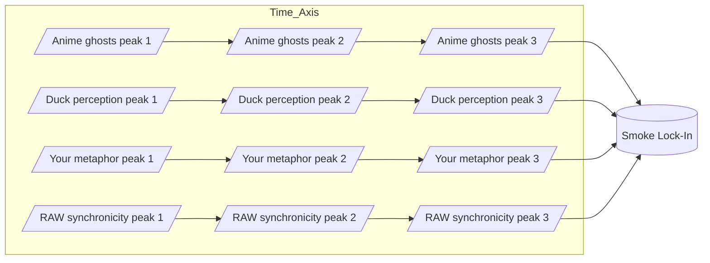
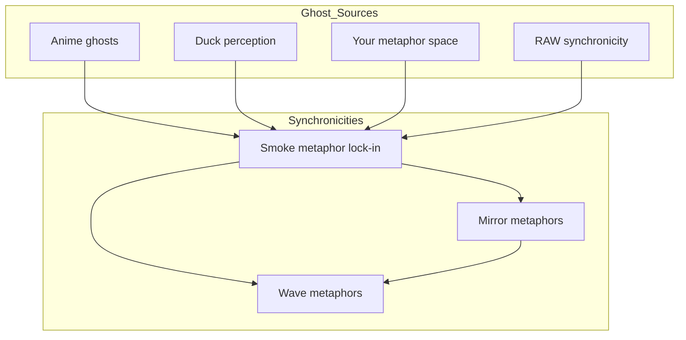

---
```
uuid: 91295f3a-a2af-4050-a2b8-4777ea70c32c
```
```
created_at: 2025.08.08.22.08.35.md
```
filename: Synchronicity Waves and Web
```
description: >-
```
  Visualizes how meaning waves from different sources interfere to create
  synchronicities, with a focus on phase-locking and networked connections.
tags:
  - synchronicity
  - wave interference
  - phase lock
  - network
  - metaphor
  - ghost sources
  - RAW
```
related_to_title:
```
  - Smoke Resonance Visualizations
  - Diagrams
  - Unique Info Dump Index
  - Promethean_Eidolon_Synchronicity_Model
  - Ghostly Smoke Interference
  - infinite_depth_smoke_animation
  - Duck's Attractor States
  - aionian-circuit-math
  - archetype-ecs
  - DSL
  - Event Bus Projections Architecture
  - Shared
  - 'Agent Tasks: Persistence Migration to DualStore'
  - eidolon-node-lifecycle
```
related_to_uuid:
```
  - ac9d3ac5-9a6a-4180-a67f-1ab7e229d981
  - 45cd25b5-ed36-49ab-82c8-10d0903e34db
  - 30ec3ba6-fbca-4606-ac3e-89b747fbeb7c
  - 2d6e5553-8dc4-497f-bf45-96f8ca00a6f6
  - b6ae7dfa-0c53-4eb9-aea8-65072b825bee
  - 92a052a5-3351-4898-8cab-758181a86adb
  - 13951643-1741-46bb-89dc-1beebb122633
  - f2d83a77-7f86-4c56-8538-1350167a0c6c
  - 8f4c1e86-1236-4936-84ca-6ed7082af6b7
  - e87bc036-1570-419e-a558-f45b9c0db698
  - cf6b9b17-bb91-4219-aa5c-172cba02b2da
  - 623a55f7-685c-486b-abaf-469da1bbbb69
  - 93d2ba51-8689-49ee-94e2-296092e48058
  - 938eca9c-97e2-4bcc-8653-b0ef1a5ac7a3
references:
  - uuid: ac9d3ac5-9a6a-4180-a67f-1ab7e229d981
    line: 8
    col: 1
    score: 0.85
  - uuid: ac9d3ac5-9a6a-4180-a67f-1ab7e229d981
    line: 33
    col: 1
    score: 0.86
  - uuid: b6ae7dfa-0c53-4eb9-aea8-65072b825bee
    line: 112
    col: 1
    score: 1
  - uuid: b6ae7dfa-0c53-4eb9-aea8-65072b825bee
    line: 112
    col: 3
    score: 1
  - uuid: 92a052a5-3351-4898-8cab-758181a86adb
    line: 90
    col: 1
    score: 1
  - uuid: 92a052a5-3351-4898-8cab-758181a86adb
    line: 90
    col: 3
    score: 1
  - uuid: 2d6e5553-8dc4-497f-bf45-96f8ca00a6f6
    line: 56
    col: 1
    score: 1
  - uuid: 2d6e5553-8dc4-497f-bf45-96f8ca00a6f6
    line: 56
    col: 3
    score: 1
  - uuid: b6ae7dfa-0c53-4eb9-aea8-65072b825bee
    line: 118
    col: 1
    score: 0.91
  - uuid: b6ae7dfa-0c53-4eb9-aea8-65072b825bee
    line: 118
    col: 3
    score: 0.91
  - uuid: 623a55f7-685c-486b-abaf-469da1bbbb69
    line: 7
    col: 1
    score: 1
  - uuid: 623a55f7-685c-486b-abaf-469da1bbbb69
    line: 7
    col: 3
    score: 1
  - uuid: cf6b9b17-bb91-4219-aa5c-172cba02b2da
    line: 147
    col: 1
    score: 1
  - uuid: cf6b9b17-bb91-4219-aa5c-172cba02b2da
    line: 147
    col: 3
    score: 1
  - uuid: 92a052a5-3351-4898-8cab-758181a86adb
    line: 88
    col: 1
    score: 1
  - uuid: 92a052a5-3351-4898-8cab-758181a86adb
    line: 88
    col: 3
    score: 1
  - uuid: 30ec3ba6-fbca-4606-ac3e-89b747fbeb7c
    line: 67
    col: 1
    score: 1
  - uuid: 30ec3ba6-fbca-4606-ac3e-89b747fbeb7c
    line: 67
    col: 3
    score: 1
  - uuid: f2d83a77-7f86-4c56-8538-1350167a0c6c
    line: 158
    col: 1
    score: 1
  - uuid: f2d83a77-7f86-4c56-8538-1350167a0c6c
    line: 158
    col: 3
    score: 1
  - uuid: 8f4c1e86-1236-4936-84ca-6ed7082af6b7
    line: 457
    col: 1
    score: 1
  - uuid: 8f4c1e86-1236-4936-84ca-6ed7082af6b7
    line: 457
    col: 3
    score: 1
  - uuid: 45cd25b5-ed36-49ab-82c8-10d0903e34db
    line: 9
    col: 1
    score: 1
  - uuid: 45cd25b5-ed36-49ab-82c8-10d0903e34db
    line: 9
    col: 3
    score: 1
  - uuid: e87bc036-1570-419e-a558-f45b9c0db698
    line: 10
    col: 1
    score: 1
  - uuid: e87bc036-1570-419e-a558-f45b9c0db698
    line: 10
    col: 3
    score: 1
  - uuid: b6ae7dfa-0c53-4eb9-aea8-65072b825bee
    line: 113
    col: 1
    score: 1
  - uuid: b6ae7dfa-0c53-4eb9-aea8-65072b825bee
    line: 113
    col: 3
    score: 1
  - uuid: ac9d3ac5-9a6a-4180-a67f-1ab7e229d981
    line: 80
    col: 1
    score: 1
  - uuid: ac9d3ac5-9a6a-4180-a67f-1ab7e229d981
    line: 80
    col: 3
    score: 1
  - uuid: 13951643-1741-46bb-89dc-1beebb122633
    line: 61
    col: 1
    score: 1
  - uuid: 13951643-1741-46bb-89dc-1beebb122633
    line: 61
    col: 3
    score: 1
  - uuid: 92a052a5-3351-4898-8cab-758181a86adb
    line: 87
    col: 1
    score: 1
  - uuid: 92a052a5-3351-4898-8cab-758181a86adb
    line: 87
    col: 3
    score: 1
  - uuid: 2d6e5553-8dc4-497f-bf45-96f8ca00a6f6
    line: 54
    col: 1
    score: 1
  - uuid: 2d6e5553-8dc4-497f-bf45-96f8ca00a6f6
    line: 54
    col: 3
    score: 1
  - uuid: ac9d3ac5-9a6a-4180-a67f-1ab7e229d981
    line: 78
    col: 1
    score: 1
  - uuid: ac9d3ac5-9a6a-4180-a67f-1ab7e229d981
    line: 78
    col: 3
    score: 1
---
Note: Consolidated here → ../notes/diagrams/synchronicity-waves-and-web.md

Perfect — then let’s go full RAW and actually *draw the waves* so we can see the smoke condensing.

---

## **4. Sine Wave Interference — “The Curl of the Smoke”**

Here each source is a wave of meaning drifting into the field. Where they crest together, the “smoke” is dense enough to lock into a synchronicity.



💡 In a real plotted version, these four “streams” would look like sine curves sliding over each other until they *phase-lock* at the same point — the moment the metaphor becomes visible.

---

## **5. RAW-Style Synchronicity Web**

This one treats synchronicities as nodes in a network, with each connected to its “ghost sources” and to other synchronicities in the same metaphor family.



---

If you want, I can push this **even further** —
Next step would be a **statistical heatmap of ghost density** over time in the Eidolon field, so we can literally *see* the probability of a synchronicity forming. That’s where the “statistical weirdness” RAW loved becomes visible as a physics phenomenon.

Do you want me to make *that*?
<!-- GENERATED-SECTIONS:DO-NOT-EDIT-BELOW -->
## Related content
```
- [smoke-resonance-visualizations|Smoke Resonance Visualizations]
- [Diagrams]chunks/diagrams.md
- [unique-info-dump-index|Unique Info Dump Index]
- [promethean-eidolon-synchronicity-model|Promethean_Eidolon_Synchronicity_Model]
- [ghostly-smoke-interference|Ghostly Smoke Interference]
- [infinite-depth-smoke-animation|infinite_depth_smoke_animation]
- [ducks-attractor-states|Duck's Attractor States]
- [docs/unique/aionian-circuit-math|aionian-circuit-math]
- [docs/unique/archetype-ecs|archetype-ecs]
- [DSL]chunks/dsl.md
- [event-bus-projections-architecture|Event Bus Projections Architecture]
- [Shared]chunks/shared.md
- [docs/unique/agent-tasks-persistence-migration-to-dualstore|Agent Tasks: Persistence Migration to DualStore]
- [eidolon-node-lifecycle]

## Sources
- [smoke-resonance-visualizations#L8|Smoke Resonance Visualizations — L8] (line 8, col 1, score 0.85)
- [smoke-resonance-visualizations#L33|Smoke Resonance Visualizations — L33] (line 33, col 1, score 0.86)
- [ghostly-smoke-interference#L112|Ghostly Smoke Interference — L112] (line 112, col 1, score 1)
- [ghostly-smoke-interference#L112|Ghostly Smoke Interference — L112] (line 112, col 3, score 1)
- [infinite-depth-smoke-animation#L90|infinite_depth_smoke_animation — L90] (line 90, col 1, score 1)
- [infinite-depth-smoke-animation#L90|infinite_depth_smoke_animation — L90] (line 90, col 3, score 1)
- [promethean-eidolon-synchronicity-model#L56|Promethean_Eidolon_Synchronicity_Model — L56] (line 56, col 1, score 1)
- [promethean-eidolon-synchronicity-model#L56|Promethean_Eidolon_Synchronicity_Model — L56] (line 56, col 3, score 1)
- [ghostly-smoke-interference#L118|Ghostly Smoke Interference — L118] (line 118, col 1, score 0.91)
- [ghostly-smoke-interference#L118|Ghostly Smoke Interference — L118] (line 118, col 3, score 0.91)
- [Shared — L7]chunks/shared.md#L7 (line 7, col 1, score 1)
- [Shared — L7]chunks/shared.md#L7 (line 7, col 3, score 1)
- [event-bus-projections-architecture#L147|Event Bus Projections Architecture — L147] (line 147, col 1, score 1)
- [event-bus-projections-architecture#L147|Event Bus Projections Architecture — L147] (line 147, col 3, score 1)
- [infinite-depth-smoke-animation#L88|infinite_depth_smoke_animation — L88] (line 88, col 1, score 1)
- [infinite-depth-smoke-animation#L88|infinite_depth_smoke_animation — L88] (line 88, col 3, score 1)
- [unique-info-dump-index#L67|Unique Info Dump Index — L67] (line 67, col 1, score 1)
- [unique-info-dump-index#L67|Unique Info Dump Index — L67] (line 67, col 3, score 1)
- [docs/unique/aionian-circuit-math#L158|aionian-circuit-math — L158] (line 158, col 1, score 1)
- [docs/unique/aionian-circuit-math#L158|aionian-circuit-math — L158] (line 158, col 3, score 1)
- [docs/unique/archetype-ecs#L457|archetype-ecs — L457] (line 457, col 1, score 1)
- [docs/unique/archetype-ecs#L457|archetype-ecs — L457] (line 457, col 3, score 1)
- [Diagrams — L9]chunks/diagrams.md#L9 (line 9, col 1, score 1)
- [Diagrams — L9]chunks/diagrams.md#L9 (line 9, col 3, score 1)
- [DSL — L10]chunks/dsl.md#L10 (line 10, col 1, score 1)
- [DSL — L10]chunks/dsl.md#L10 (line 10, col 3, score 1)
- [ghostly-smoke-interference#L113|Ghostly Smoke Interference — L113] (line 113, col 1, score 1)
- [ghostly-smoke-interference#L113|Ghostly Smoke Interference — L113] (line 113, col 3, score 1)
- [smoke-resonance-visualizations#L80|Smoke Resonance Visualizations — L80] (line 80, col 1, score 1)
- [smoke-resonance-visualizations#L80|Smoke Resonance Visualizations — L80] (line 80, col 3, score 1)
- [ducks-attractor-states#L61|Duck's Attractor States — L61] (line 61, col 1, score 1)
- [ducks-attractor-states#L61|Duck's Attractor States — L61] (line 61, col 3, score 1)
- [infinite-depth-smoke-animation#L87|infinite_depth_smoke_animation — L87] (line 87, col 1, score 1)
- [infinite-depth-smoke-animation#L87|infinite_depth_smoke_animation — L87] (line 87, col 3, score 1)
- [promethean-eidolon-synchronicity-model#L54|Promethean_Eidolon_Synchronicity_Model — L54] (line 54, col 1, score 1)
- [promethean-eidolon-synchronicity-model#L54|Promethean_Eidolon_Synchronicity_Model — L54] (line 54, col 3, score 1)
- [smoke-resonance-visualizations#L78|Smoke Resonance Visualizations — L78] (line 78, col 1, score 1)
- [smoke-resonance-visualizations#L78|Smoke Resonance Visualizations — L78] (line 78, col 3, score 1)
```
```
<!-- GENERATED-SECTIONS:DO-NOT-EDIT-ABOVE -->
