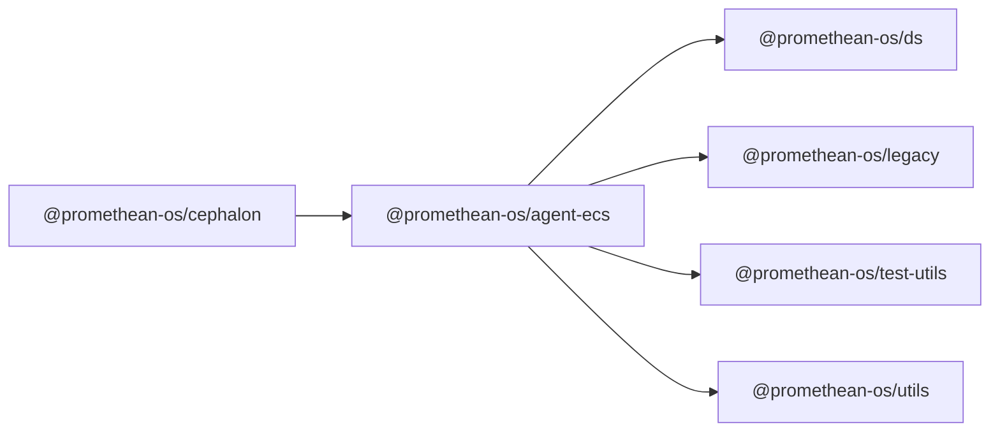

```
<!-- SYMPKG:PKG:BEGIN -->
```
# @promethean-os/agent-ecs
```
**Folder:** `packages/agent-ecs`
```
```
**Version:** `0.0.1`
```
```
**Domain:** `_root`
```

## Dependencies
- @promethean-os/ds$../ds/README.md
- @promethean-os/legacy$../legacy/README.md
- @promethean-os/test-utils$../test-utils/README.md
- @promethean-os/utils$../utils/README.md
## Dependents
- @promethean-os/cephalon$../cephalon/README.md
```
<!-- SYMPKG:PKG:END -->
```