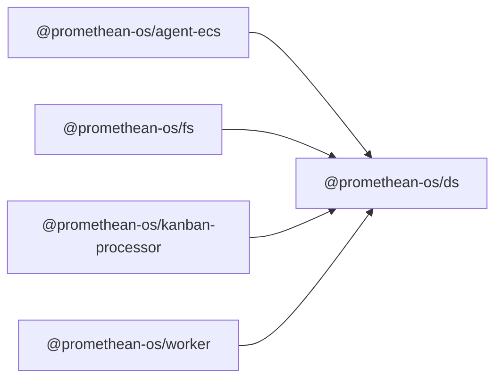

```
<!-- SYMPKG:PKG:BEGIN -->
```
# @promethean-os/ds
```
**Folder:** `packages/ds`
```
```
**Version:** `0.0.1`
```
```
**Domain:** `_root`
```

## Dependencies
- _None_
## Dependents
- @promethean-os/agent-ecs$../agent-ecs/README.md
- @promethean-os/fs$../fs/README.md
- @promethean-os/kanban-processor$../kanban-processor/README.md
- @promethean-os/worker$../worker/README.md
```
<!-- SYMPKG:PKG:END -->
```