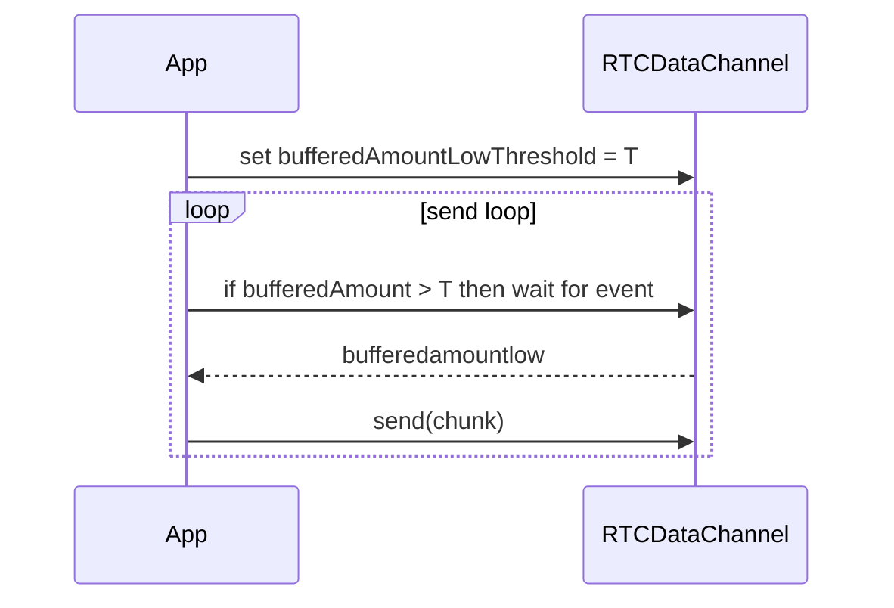

# duck-web — Throttled DataChannel Sender

Status: 🔧 under fix in PR #1445.

Backpressure-aware `RTCDataChannel` sender that waits on `bufferedamountlow` before sending more.

## Diagram

## Notes
- Default threshold ~1 MiB (`1<<20`); make configurable.
- Pure factory returns an async function; ignore sends if channel not open.

## Related
- Voice forwarder frames pipeline.
