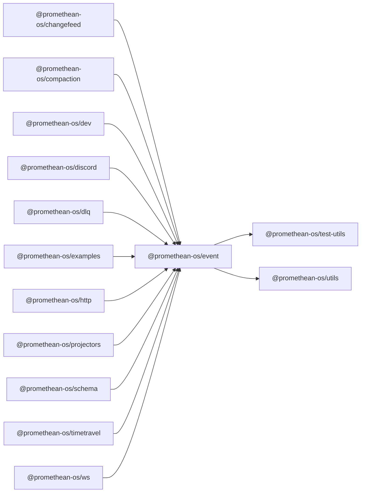

```
<!-- SYMPKG:PKG:BEGIN -->
```
# @promethean-os/event
```
**Folder:** `packages/event`
```
```
**Version:** `0.0.1`
```
```
**Domain:** `_root`
```

## Dependencies
- @promethean-os/test-utils$../test-utils/README.md
- @promethean-os/utils$../utils/README.md
## Dependents
- @promethean-os/changefeed$../changefeed/README.md
- @promethean-os/compaction$../compaction/README.md
- @promethean-os/dev$../dev/README.md
- @promethean-os/discord$../discord/README.md
- @promethean-os/dlq$../dlq/README.md
- @promethean-os/examples$../examples/README.md
- @promethean-os/http$../http/README.md
- @promethean-os/projectors$../projectors/README.md
- @promethean-os/schema$../schema/README.md
- @promethean-os/timetravel$../timetravel/README.md
- @promethean-os/ws$../ws/README.md
```
<!-- SYMPKG:PKG:END -->
```