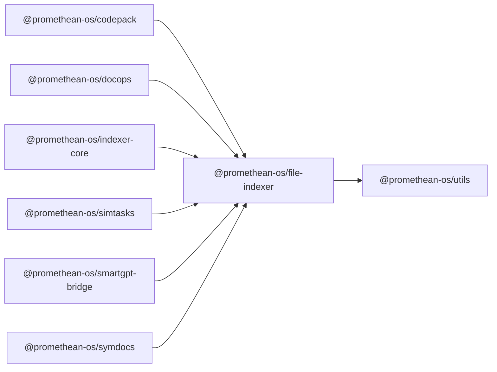

```
<!-- SYMPKG:PKG:BEGIN -->
```
# @promethean-os/file-indexer
```
**Folder:** `packages/file-indexer`
```
```
**Version:** `0.0.1`
```
```
**Domain:** `_root`
```

## Dependencies
- @promethean-os/utils$../utils/README.md
## Dependents
- @promethean-os/codepack$../codepack/README.md
- @promethean-os/docops$../docops/README.md
- @promethean-os/indexer-core$../indexer-core/README.md
- @promethean-os/simtasks$../simtask/README.md
- @promethean-os/smartgpt-bridge$../smartgpt-bridge/README.md
- @promethean-os/symdocs$../symdocs/README.md
```
<!-- SYMPKG:PKG:END -->
```