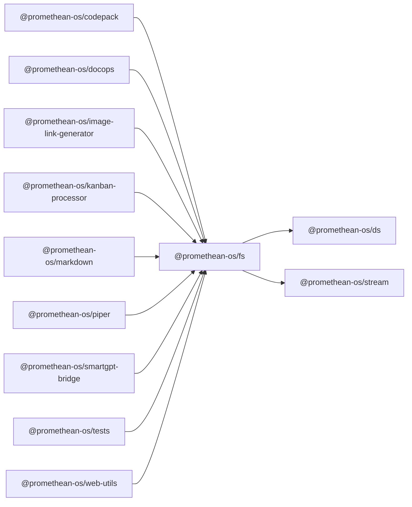

```
<!-- SYMPKG:PKG:BEGIN -->
```
# @promethean-os/fs
```
**Folder:** `packages/fs`
```
```
**Version:** `0.0.1`
```
```
**Domain:** `_root`
```

## Dependencies
- @promethean-os/ds$../ds/README.md
- @promethean-os/stream$../stream/README.md
## Dependents
- @promethean-os/codepack$../codepack/README.md
- @promethean-os/docops$../docops/README.md
- @promethean-os/image-link-generator$../image-link-generator/README.md
- @promethean-os/kanban-processor$../kanban-processor/README.md
- @promethean-os/markdown$../markdown/README.md
- @promethean-os/piper$../piper/README.md
- @promethean-os/smartgpt-bridge$../smartgpt-bridge/README.md
- @promethean-os/tests$../tests/README.md
- @promethean-os/web-utils$../web-utils/README.md
```
<!-- SYMPKG:PKG:END -->
```