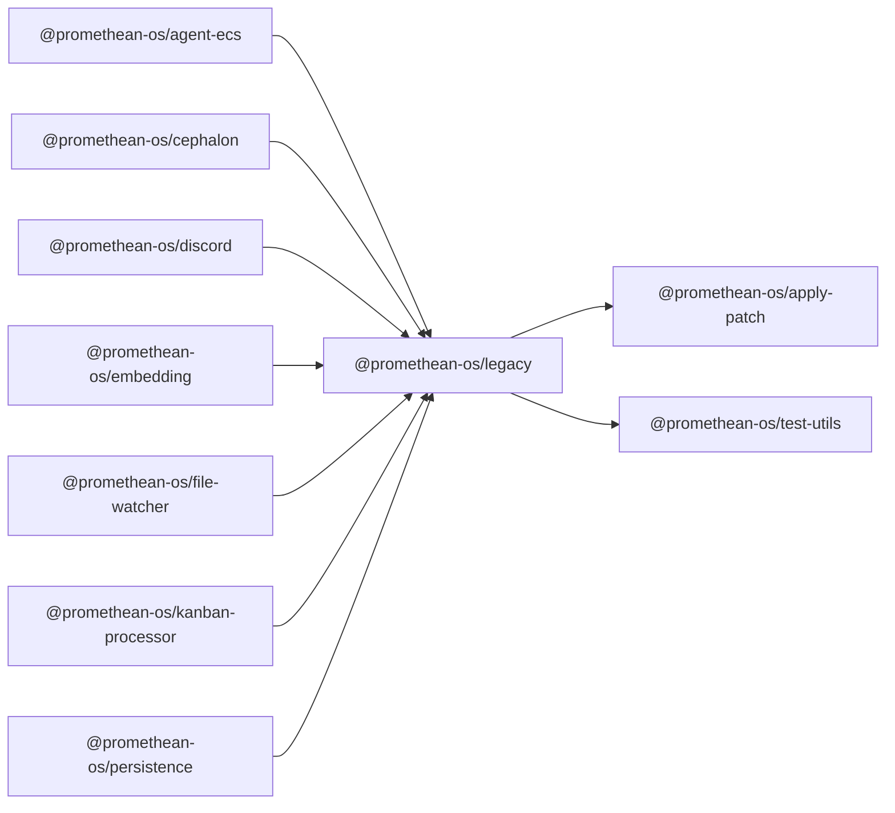

```
<!-- SYMPKG:PKG:BEGIN -->
```
# @promethean-os/legacy
```
**Folder:** `packages/legacy`
```
```
**Version:** `0.0.0`
```
```
**Domain:** `_root`
```

## Dependencies
- @promethean-os/apply-patch$../apply-patch/README.md
- @promethean-os/test-utils$../test-utils/README.md
## Dependents
- @promethean-os/agent-ecs$../agent-ecs/README.md
- @promethean-os/cephalon$../cephalon/README.md
- @promethean-os/discord$../discord/README.md
- @promethean-os/embedding$../embedding/README.md
- @promethean-os/file-watcher$../file-watcher/README.md
- @promethean-os/kanban-processor$../kanban-processor/README.md
- @promethean-os/persistence$../persistence/README.md
```
<!-- SYMPKG:PKG:END -->
```