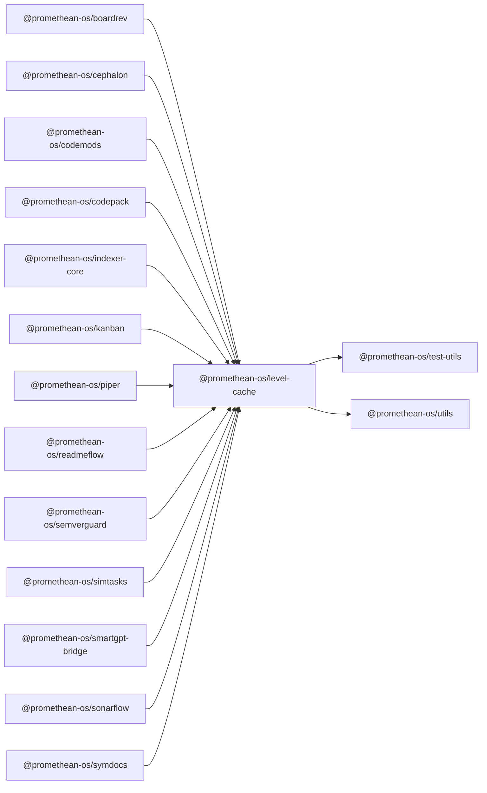

```
<!-- SYMPKG:PKG:BEGIN -->
```
# @promethean-os/level-cache
```
**Folder:** `packages/level-cache`
```
```
**Version:** `0.1.0`
```
```
**Domain:** `_root`
```

## Dependencies
- @promethean-os/test-utils$../test-utils/README.md
- @promethean-os/utils$../utils/README.md
## Dependents
- @promethean-os/boardrev$../boardrev/README.md
- @promethean-os/cephalon$../cephalon/README.md
- @promethean-os/codemods$../codemods/README.md
- @promethean-os/codepack$../codepack/README.md
- @promethean-os/indexer-core$../indexer-core/README.md
- @promethean-os/kanban$../kanban/README.md
- @promethean-os/piper$../piper/README.md
- @promethean-os/readmeflow$../readmeflow/README.md
- @promethean-os/semverguard$../semverguard/README.md
- @promethean-os/simtasks$../simtask/README.md
- @promethean-os/smartgpt-bridge$../smartgpt-bridge/README.md
- @promethean-os/sonarflow$../sonarflow/README.md
- @promethean-os/symdocs$../symdocs/README.md
```
<!-- SYMPKG:PKG:END -->
```