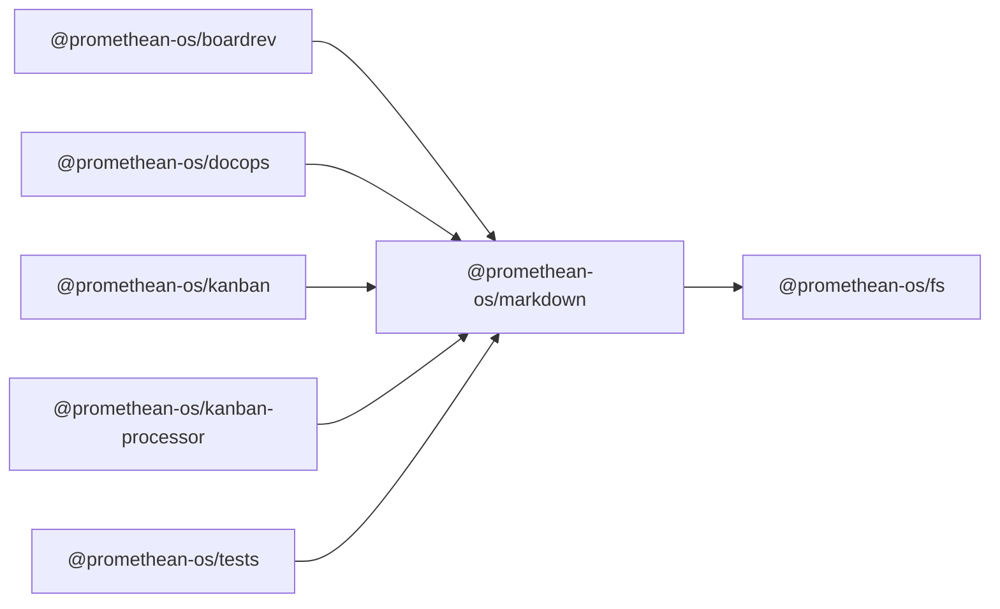

```
<!-- SYMPKG:PKG:BEGIN -->
```
# @promethean-os/markdown
```
**Folder:** `packages/markdown`
```
```
**Version:** `0.0.1`
```
```
**Domain:** `_root`
```

## Dependencies
- @promethean-os/fs$../fs/README.md
## Dependents
- @promethean-os/boardrev$../boardrev/README.md
- @promethean-os/docops$../docops/README.md
- @promethean-os/kanban$../kanban/README.md
- @promethean-os/kanban-processor$../kanban-processor/README.md
- @promethean-os/tests$../tests/README.md
```
<!-- SYMPKG:PKG:END -->
```