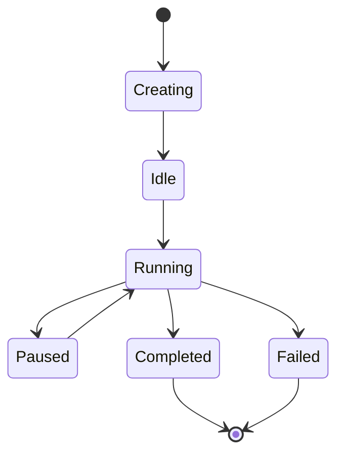

# Actor Model Guide

The Pantheon Framework implements a sophisticated Actor Model that provides autonomous agents with behaviors, talents, and goals. This guide explains how Actors, Behaviors, and Talents work together to create intelligent, goal-oriented agents.

## Overview

The Actor Model in Pantheon is based on the following concepts:

- **Actors**: Autonomous entities with goals, state, and capabilities
- **Behaviors**: Reusable action patterns that define how actors respond to situations
- **Talents**: Collections of related behaviors that form coherent capabilities
- **Goals**: High-level objectives that guide actor behavior and decision-making

## Core Concepts

### Actors

An Actor is an autonomous agent that can:

- Maintain internal state
- Execute behaviors based on goals and context
- Communicate with other actors
- Spawn new actors
- Perform actions through tools

#### Actor Lifecycle



#### Actor Factory

The framework provides an `ActorFactory` for creating actors:

```typescript
import { makeActorFactory } from '@promethean-os/pantheon-core';

const actorFactory = makeActorFactory();

// Create an actor instance
const actor = actorFactory.createActor(script, ['assist users']);
```

### Behaviors

Behaviors are the fundamental units of actor functionality. They define how an actor responds to specific situations based on goals and context.

#### Behavior Modes

Behaviors have three execution modes:

1. **Active**: Only executes when there is user input
2. **Passive**: Only executes when there is no user input
3. **Persistent**: Always executes regardless of user input

#### Creating Behaviors

```typescript
import { makeActorFactory } from '@promethean-os/pantheon-core';

const actorFactory = makeActorFactory();

// Create a greeting behavior
const greetingBehavior = actorFactory.createBehavior(
  'greeting',
  'active', // Only executes when there's user input
  async ({ goal, context }) => {
    // Analyze context to determine if greeting is appropriate
    const shouldGreet = context.some(
      (msg) => msg.role === 'user' && msg.content.toLowerCase().includes('hello'),
    );

    if (shouldGreet) {
      return {
        actions: [
          {
            type: 'message',
            content: `Hello! I'm here to help you with: ${goal}`,
            target: 'user',
          },
        ],
      };
    }

    return { actions: [] };
  },
);
```

#### Behavior Best Practices

1. **Single Responsibility**: Each behavior should focus on one specific capability
2. **Context-Aware**: Behaviors should analyze context before taking action
3. **Error Handling**: Behaviors should gracefully handle errors and failures
4. **Deterministic**: Given the same input, behaviors should produce consistent output

### Talents

Talents are collections of related behaviors that form coherent capabilities. They allow you to group behaviors into logical units.

#### Creating Talents

```typescript
import { makeActorFactory } from '@promethean-os/pantheon-core';

const actorFactory = makeActorFactory();

// Create multiple related behaviors
const greetingBehavior = actorFactory.createBehavior('greeting', 'active', greetingPlan);
const farewellBehavior = actorFactory.createBehavior('farewell', 'active', farewellPlan);
const smallTalkBehavior = actorFactory.createBehavior('smallTalk', 'passive', smallTalkPlan);

// Create a social talent
const socialTalent = actorFactory.createTalent('social', [
  greetingBehavior,
  farewellBehavior,
  smallTalkBehavior,
]);
```

#### Talent Composition

Talents can be composed to create more complex capabilities:

```typescript
// Create specialized talents
const researchTalent = actorFactory.createTalent('research', [
  searchBehavior,
  analyzeBehavior,
  summarizeBehavior,
]);

const writingTalent = actorFactory.createTalent('writing', [
  draftBehavior,
  editBehavior,
  formatBehavior,
]);

// Create a comprehensive talent
const contentCreationTalent = actorFactory.createTalent('content-creation', [
  ...researchTalent.behaviors,
  ...writingTalent.behaviors,
]);
```

## Actor Scripts

Actor Scripts define the blueprint for creating actors. They specify the talents, context sources, and configuration for an actor.

### Basic Actor Script

```typescript
const assistantScript: ActorScript = {
  name: 'assistant',
  roleName: 'AI Assistant',
  description: 'A helpful AI assistant with social and research capabilities',
  version: '1.0.0',
  contextSources: [
    {
      id: 'sessions',
      label: 'Chat Sessions',
      where: { type: 'chat' },
    },
    {
      id: 'knowledge',
      label: 'Knowledge Base',
      where: { type: 'document' },
    },
  ],
  talents: [socialTalent, researchTalent],
  config: {
    responseStyle: 'friendly',
    maxResponseLength: 1000,
  },
};
```

### Advanced Actor Script with Program

```typescript
const advancedScript: ActorScript = {
  name: 'advanced-assistant',
  roleName: 'Advanced AI Assistant',
  description: 'An advanced assistant with custom program logic',
  version: '2.0.0',
  contextSources: [
    {
      id: 'sessions',
      label: 'Chat Sessions',
    },
    {
      id: 'tools',
      label: 'Available Tools',
    },
  ],
  talents: [socialTalent, researchTalent],
  program: `
    // Custom program logic for advanced behavior
    function prioritizeGoals(goals, context) {
      // Implement custom goal prioritization
      return goals.sort((a, b) => {
        // Custom prioritization logic
        return calculatePriority(a, context) - calculatePriority(b, context);
      });
    }
    
    function calculatePriority(goal, context) {
      // Calculate priority based on context
      // Return numeric priority value
    }
  `,
  config: {
    enableAdvancedFeatures: true,
    customPrioritization: true,
  },
};
```

## Actor Execution

### Actor Ticking

Actors are "ticked" by the orchestrator, which triggers their execution:

```typescript
import { makeOrchestrator } from '@promethean-os/pantheon-core';

const orchestrator = makeOrchestrator({
  // Dependencies
  context: contextPort,
  tools: toolPort,
  llm: llmPort,
  bus: messageBus,
  schedule: scheduler,
  state: actorStatePort,
  log: console.log,
  now: () => Date.now(),
});

// Tick an actor with user input
await orchestrator.tickActor(actor, {
  userMessage: 'Hello, can you help me with something?',
});

// Tick an actor without user input (for passive behaviors)
await orchestrator.tickActor(actor);
```

### Actor Loops

Actors can run in continuous loops for persistent behaviors:

```typescript
import { makeOrchestrator } from '@promethean-os/pantheon-core';

const orchestrator = makeOrchestrator({
  // Dependencies...
});

// Start an actor loop that runs every 5 seconds
const stopLoop = orchestrator.startActorLoop(actor, 5000);

// Later, stop the loop
stopLoop();
```

### Behavior Selection

The orchestrator automatically selects appropriate behaviors based on the actor's mode and user input:

```typescript
// Internal orchestrator logic for behavior selection
const selectBehaviors = (actor: Actor, hasUserInput: boolean) => {
  const allBehaviors = actor.script.talents.flatMap((t) => t.behaviors);

  return allBehaviors.filter((behavior) => {
    if (hasUserInput) {
      return behavior.mode === 'active' || behavior.mode === 'persistent';
    }
    return behavior.mode !== 'active'; // passive + persistent
  });
};
```

## Advanced Patterns

### Conditional Behaviors

Behaviors can implement complex conditional logic:

```typescript
const conditionalBehavior = actorFactory.createBehavior(
  'conditional-response',
  'active',
  async ({ goal, context }) => {
    // Analyze context for specific conditions
    const userMessage = context.find((msg) => msg.role === 'user')?.content || '';
    const hasUrgency = userMessage.includes('urgent') || userMessage.includes('asap');
    const hasQuestion = userMessage.includes('?');

    const actions = [];

    if (hasUrgency) {
      actions.push({
        type: 'message',
        content: 'I understand this is urgent. Let me help you right away!',
        priority: 'high',
      });
    }

    if (hasQuestion) {
      actions.push({
        type: 'tool',
        name: 'search-knowledge',
        args: { query: userMessage },
      });
    }

    return { actions };
  },
);
```

### Multi-Step Behaviors

Behaviors can orchestrate multiple actions:

```typescript
const multiStepBehavior = actorFactory.createBehavior(
  'research-and-report',
  'active',
  async ({ goal, context }) => {
    const actions = [];

    // Step 1: Search for information
    actions.push({
      type: 'tool',
      name: 'search',
      args: { query: goal },
    });

    // Step 2: Analyze results
    actions.push({
      type: 'tool',
      name: 'analyze',
      args: {
        data: '${search.results}', // Reference previous result
        analysisType: 'comprehensive',
      },
    });

    // Step 3: Generate report
    actions.push({
      type: 'tool',
      name: 'generate-report',
      args: {
        analysis: '${analyze.results}',
        format: 'markdown',
      },
    });

    // Step 4: Send to user
    actions.push({
      type: 'message',
      content: "I've completed my research. Here's my report:",
      target: 'user',
    });

    return { actions };
  },
);
```

### Actor Spawning

Actors can create other actors:

```typescript
const spawningBehavior = actorFactory.createBehavior(
  'delegate-tasks',
  'active',
  async ({ goal, context }) => {
    const actions = [];

    // Create a specialized research actor
    actions.push({
      type: 'spawn',
      actor: {
        name: 'research-specialist',
        contextSources: [{ id: 'knowledge', label: 'Knowledge Base' }],
        talents: [researchTalent],
      },
      goal: 'Research the specific topic: ' + goal,
    });

    // Create a specialized writing actor
    actions.push({
      type: 'spawn',
      actor: {
        name: 'writing-specialist',
        contextSources: [{ id: 'documents', label: 'Document Store' }],
        talents: [writingTalent],
      },
      goal: 'Write a comprehensive report about: ' + goal,
    });

    return { actions };
  },
);
```

### Context-Aware Behaviors

Behaviors can leverage the context engine for intelligent decision-making:

```typescript
const contextAwareBehavior = actorFactory.createBehavior(
  'contextual-response',
  'active',
  async ({ goal, context }) => {
    // Analyze context for user preferences
    const userPreferences = context
      .filter((msg) => msg.role === 'user')
      .reduce(
        (prefs, msg) => {
          // Extract preferences from message history
          if (msg.content.includes('detailed')) {
            prefs.detailLevel = 'high';
          }
          if (msg.content.includes('simple')) {
            prefs.detailLevel = 'low';
          }
          return prefs;
        },
        { detailLevel: 'medium' },
      );

    // Generate response based on preferences
    const responseStyle =
      userPreferences.detailLevel === 'high'
        ? 'detailed and comprehensive'
        : userPreferences.detailLevel === 'low'
          ? 'simple and concise'
          : 'balanced';

    return {
      actions: [
        {
          type: 'message',
          content: `I'll provide a ${responseStyle} response about: ${goal}`,
        },
      ],
    };
  },
);
```

## Error Handling and Resilience

### Behavior Error Handling

```typescript
const resilientBehavior = actorFactory.createBehavior(
  'resilient-operation',
  'active',
  async ({ goal, context }) => {
    try {
      // Attempt primary operation
      const result = await performPrimaryOperation(goal);

      return {
        actions: [
          {
            type: 'message',
            content: `Successfully completed: ${result}`,
          },
        ],
      };
    } catch (error) {
      // Fallback to secondary operation
      try {
        const fallbackResult = await performFallbackOperation(goal);

        return {
          actions: [
            {
              type: 'message',
              content: `Used fallback approach: ${fallbackResult}`,
            },
          ],
        };
      } catch (fallbackError) {
        // Final fallback
        return {
          actions: [
            {
              type: 'message',
              content: 'I encountered an issue. Let me try a different approach.',
              priority: 'high',
            },
          ],
        };
      }
    }
  },
);
```

### Actor State Management

```typescript
const statefulBehavior = actorFactory.createBehavior(
  'stateful-counter',
  'persistent',
  async ({ goal, context }) => {
    // Get current state from actor metadata
    const currentState = actor.metadata?.counter || 0;
    const newState = currentState + 1;

    // Update actor state
    await actorStatePort.update(actor.id, {
      metadata: { ...actor.metadata, counter: newState },
    });

    return {
      actions: [
        {
          type: 'message',
          content: `This is interaction #${newState}. Current goal: ${goal}`,
        },
      ],
    };
  },
);
```

## Testing Actors

### Unit Testing Behaviors

```typescript
import test from 'ava';
import { makeActorFactory } from '@promethean-os/pantheon-core';

test('greeting behavior responds to hello', async (t) => {
  const actorFactory = makeActorFactory();

  const behavior = actorFactory.createBehavior('greeting', 'active', async ({ goal, context }) => {
    const hasGreeting = context.some(
      (msg) => msg.role === 'user' && msg.content.toLowerCase().includes('hello'),
    );

    if (hasGreeting) {
      return {
        actions: [
          {
            type: 'message',
            content: 'Hello there!',
            target: 'user',
          },
        ],
      };
    }

    return { actions: [] };
  });

  const result = await behavior.plan({
    goal: 'greet user',
    context: [{ role: 'user', content: 'hello world' }],
  });

  t.is(result.actions.length, 1);
  t.is(result.actions[0].type, 'message');
  t.is(result.actions[0].content, 'Hello there!');
});
```

### Integration Testing Actors

```typescript
test('actor executes behaviors correctly', async (t) => {
  const actorFactory = makeActorFactory();
  const orchestrator = makeOrchestrator(mockDeps);

  const behavior = actorFactory.createBehavior('test', 'active', async ({ goal }) => ({
    actions: [
      {
        type: 'message',
        content: `Processing: ${goal}`,
      },
    ],
  }));

  const talent = actorFactory.createTalent('test', [behavior]);
  const script = { name: 'test', contextSources: [], talents: [talent] };
  const actor = actorFactory.createActor(script, ['test goal']);

  // Mock the message bus to capture messages
  const messages: any[] = [];
  mockDeps.bus.send = async (msg) => messages.push(msg);

  await orchestrator.tickActor(actor, {
    userMessage: 'test input',
  });

  t.is(messages.length, 1);
  t.is(messages[0].content, 'Processing: test goal');
});
```

## Performance Considerations

### Behavior Optimization

1. **Minimize Context Processing**: Only process necessary context data
2. **Cache Results**: Cache expensive computations within behaviors
3. **Async Operations**: Use async/await for I/O operations
4. **Memory Management**: Avoid memory leaks in long-running behaviors

### Actor Scaling

1. **Stateless Design**: Keep actors stateless where possible
2. **Resource Limits**: Implement resource limits and throttling
3. **Parallel Execution**: Design behaviors for parallel execution
4. **Graceful Degradation**: Handle resource constraints gracefully

This comprehensive guide to the Actor Model provides the foundation for building sophisticated, intelligent agents using the Pantheon Framework. The combination of behaviors, talents, and goals creates a flexible and powerful system for AI agent development.
