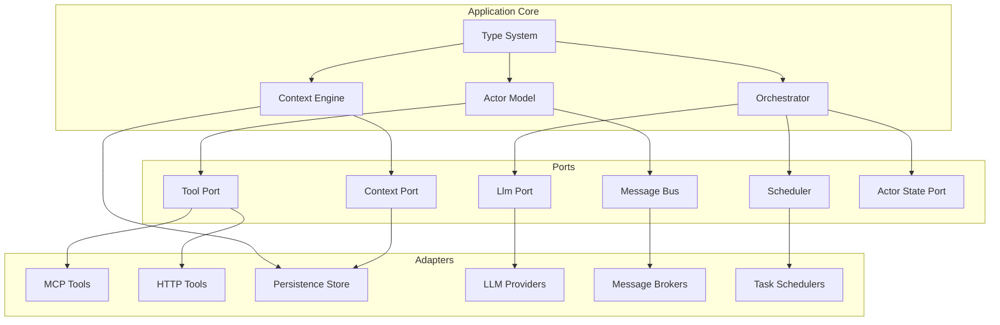
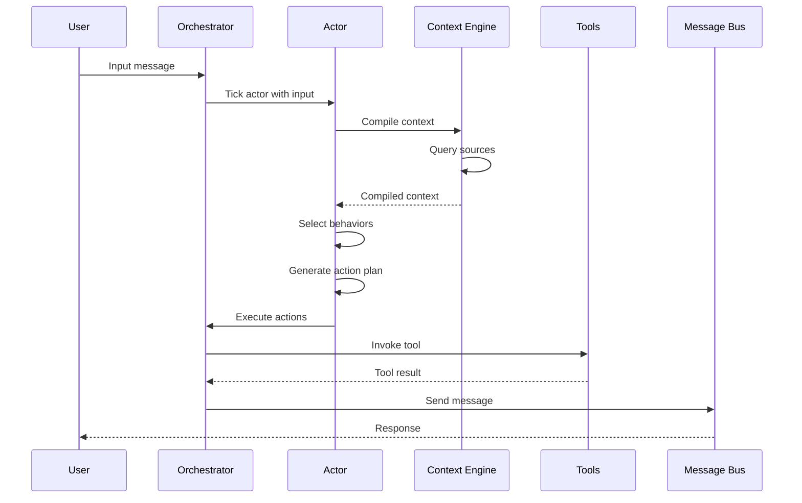
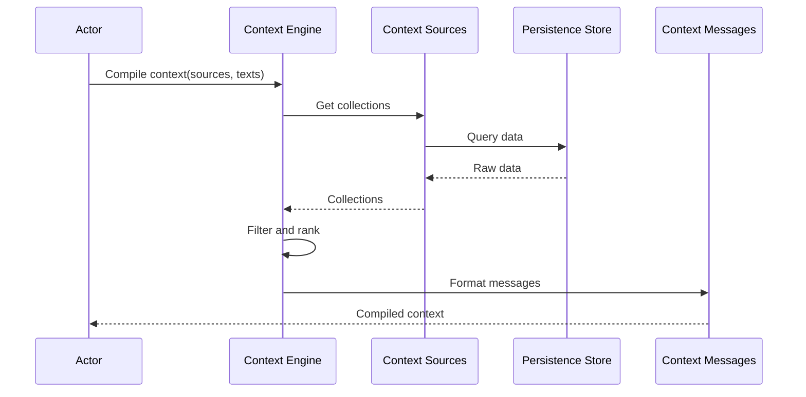

# Architecture Overview

## High-Level System Design

The Pantheon Framework is built on a foundation of functional programming principles and hexagonal architecture, designed to provide a robust, testable, and maintainable foundation for AI agent management.

### Core Design Principles

1. **Functional Core**: All business logic is implemented as pure functions with immutable data structures
2. **Dependency Injection**: External dependencies are injected through well-defined ports
3. **Actor Model**: Agents are autonomous entities with behaviors, talents, and goals
4. **Context-Aware**: Dynamic context compilation from multiple sources
5. **Cross-Platform**: Support for multiple runtime environments and protocols

### System Architecture



## Hexagonal Architecture

### Port Definitions

The framework defines several key ports that abstract external dependencies:

#### ContextPort

```typescript
export type ContextPort = {
  compile: (opts: {
    texts?: readonly string[];
    sources: readonly ContextSource[];
    recentLimit?: number;
    queryLimit?: number;
    limit?: number;
  }) => Promise<Message[]>;
};
```

**Purpose**: Provides dynamic context compilation from multiple sources
**Adapters**: Persistence store, external APIs, file systems

#### ToolPort

```typescript
export type ToolPort = {
  register: (tool: ToolSpec) => void;
  invoke: (name: string, args: Record<string, unknown>) => Promise<unknown>;
};
```

**Purpose**: Manages tool registration and execution
**Adapters**: MCP servers, HTTP APIs, local functions

#### LlmPort

```typescript
export type LlmPort = {
  complete: (
    messages: Message[],
    opts?: { model?: string; temperature?: number },
  ) => Promise<Message>;
};
```

**Purpose**: Abstracts language model interactions
**Adapters**: OpenAI, Anthropic, local models

#### MessageBus

```typescript
export type MessageBus = {
  send: (msg: { from: string; to: string; content: string }) => Promise<void>;
  subscribe: (handler: (msg: { from: string; to: string; content: string }) => void) => () => void;
};
```

**Purpose**: Handles inter-agent communication
**Adapters**: WebSocket, AMQP, HTTP

#### Scheduler

```typescript
export type Scheduler = {
  every: (ms: number, f: () => Promise<void>) => () => void;
  once: (ms: number, f: () => Promise<void>) => void;
};
```

**Purpose**: Manages scheduled tasks and periodic execution
**Adapters**: Node.js timers, external schedulers

#### ActorStatePort

```typescript
export type ActorStatePort = {
  spawn: (script: ActorScript, goal: string) => Promise<Actor>;
  list: () => Promise<Actor[]>;
  get: (id: string) => Promise<Actor | null>;
  update: (id: string, updates: Partial<Actor>) => Promise<Actor>;
};
```

**Purpose**: Manages actor lifecycle and state persistence
**Adapters**: In-memory, database, distributed storage

### Component Relationships

#### Actor Model ↔ Context Engine

Actors depend on the Context Engine to compile relevant information from various sources. The Context Engine provides a unified view of context data, filtering and ranking information based on relevance.

#### Actor Model ↔ Orchestrator

The Orchestrator coordinates actor execution, managing their lifecycle and handling action execution. Actors delegate action execution to the Orchestrator, which routes actions through appropriate ports.

#### Context Engine ↔ Persistence

The Context Engine relies on persistence adapters to store and retrieve context data. This separation allows for different storage backends (MongoDB, LevelDB, etc.) without changing the core logic.

#### Orchestrator ↔ Tool System

The Orchestrator uses the Tool Port to execute external tools. This abstraction allows actors to invoke tools without knowing their implementation details.

## Data Flow

### Actor Execution Flow



### Context Compilation Flow



## Key Design Decisions

### 1. Functional Core with Imperative Shell

- **Core Logic**: Pure functions, immutable data, no side effects
- **Shell Layer**: Handles I/O, state management, and external interactions
- **Benefits**: Testability, predictability, easier reasoning

### 2. Actor Model with Behaviors and Talents

- **Actors**: Autonomous entities with goals and state
- **Behaviors**: Reusable action patterns with execution modes
- **Talents**: Collections of related behaviors forming capabilities
- **Benefits**: Modularity, reusability, clear separation of concerns

### 3. Dynamic Context Engine

- **Multi-Source**: Context from various data sources
- **Semantic Filtering**: Intelligent relevance-based filtering
- **Real-time Compilation**: On-demand context assembly
- **Benefits**: Flexibility, adaptability, performance optimization

### 4. Hexagonal Architecture

- **Port Abstractions**: Well-defined interfaces for external dependencies
- **Adapter Pattern**: Implementation details separated from core logic
- **Benefits**: Testability, flexibility, easier integration

### 5. Type-First Development

- **Comprehensive Types**: 747 lines of well-documented interfaces
- **Type Safety**: Compile-time validation of all operations
- **Benefits**: Developer experience, reduced runtime errors

## Performance Considerations

### Context Caching

- Intelligent caching of compiled contexts
- TTL-based expiration
- Memory-efficient storage strategies

### Actor Scheduling

- Configurable execution intervals
- Priority-based scheduling
- Resource management and throttling

### Tool Execution

- Asynchronous tool invocation
- Timeout handling and retries
- Result caching and optimization

## Scalability Architecture

### Horizontal Scaling

- Stateless actor design where possible
- Distributed message bus support
- Shared-nothing architecture for components

### Vertical Scaling

- Efficient memory usage patterns
- CPU-optimized context compilation
- Connection pooling for external services

### Fault Tolerance

- Graceful degradation on service failures
- Circuit breaker patterns for external calls
- Retry mechanisms with exponential backoff

This architecture provides a solid foundation for building scalable, maintainable, and extensible AI agent systems while adhering to functional programming principles and modern software engineering best practices.
