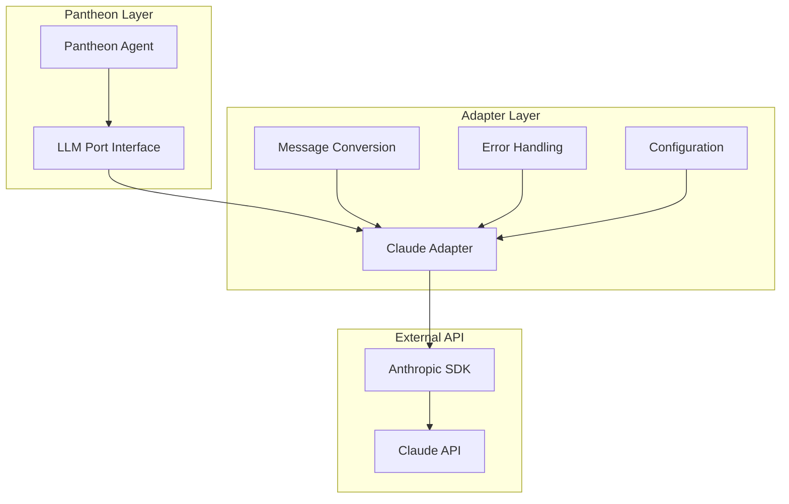

# Pantheon LLM Claude

> **Anthropic Claude API Adapter** - Integrates Claude models with Pantheon's LLM port interface

## Overview

`@promethean-os/pantheon-llm-claude` provides a seamless integration between Pantheon's actor system and Anthropic's Claude API. It implements the `LlmPort` interface, enabling agents to use Claude's powerful language models for reasoning, conversation, and task completion.

**Key Features**: Native Claude API integration, configurable models, error handling, and message format conversion.

## Architecture

### Adapter Pattern



### Message Flow

1. **Pantheon Agent** sends messages through LLM port
2. **Claude Adapter** converts message format
3. **Anthropic SDK** handles API communication
4. **Claude API** processes and returns response
5. **Adapter** converts response back to Pantheon format

## Installation

```bash
pnpm add @promethean-os/pantheon-llm-claude
```

## Quick Start

### Basic Setup

```typescript
import { makeClaudeAdapter } from '@promethean-os/pantheon-llm-claude';

// Create Claude adapter
const claudeAdapter = makeClaudeAdapter({
  apiKey: process.env.ANTHROPIC_API_KEY!,
  defaultModel: 'claude-3-haiku-20240307',
  defaultTemperature: 0.7,
  defaultMaxTokens: 1024,
});

// Use with Pantheon agent
const agent = await pantheon.spawn(
  {
    name: 'ClaudeAgent',
    contextSources: [],
    talents: [
      {
        name: 'conversation',
        behaviors: [
          {
            name: 'chat',
            mode: 'active',
            plan: async ({ goal, context }) => {
              const response = await claudeAdapter.complete([
                { role: 'system', content: 'You are a helpful assistant.' },
                { role: 'user', content: goal },
              ]);

              return {
                actions: [
                  {
                    type: 'respond',
                    data: { message: response.content },
                  },
                ],
              };
            },
          },
        ],
      },
    ],
  },
  'Assist users with their questions',
);
```

### Advanced Configuration

```typescript
const claudeAdapter = makeClaudeAdapter({
  apiKey: process.env.ANTHROPIC_API_KEY!,
  baseURL: 'https://api.anthropic.com', // Custom endpoint
  defaultModel: 'claude-3-sonnet-20240229',
  defaultTemperature: 0.5,
  defaultMaxTokens: 4096,
  defaultTopP: 0.9,
});
```

## Core APIs

### ClaudeAdapterConfig

```typescript
interface ClaudeAdapterConfig {
  apiKey: string;
  baseURL?: string;
  defaultModel?: string;
  defaultTemperature?: number;
  defaultMaxTokens?: number;
  defaultTopP?: number;
}
```

### makeClaudeAdapter

Creates an LLM port implementation for Claude API.

```typescript
const adapter = makeClaudeAdapter(config: ClaudeAdapterConfig): LlmPort
```

### LLM Port Interface

```typescript
interface LlmPort {
  complete(
    messages: Message[],
    opts?: {
      model?: string;
      temperature?: number;
      maxTokens?: number;
      topP?: number;
    },
  ): Promise<Message>;
}
```

## Usage Patterns

### Conversation Management

```typescript
class ConversationManager {
  constructor(private claudeAdapter: LlmPort) {}

  async continueConversation(
    history: Message[],
    userInput: string,
    systemPrompt?: string,
  ): Promise<Message> {
    const messages: Message[] = [];

    // Add system message if provided
    if (systemPrompt) {
      messages.push({ role: 'system', content: systemPrompt });
    }

    // Add conversation history
    messages.push(...history);

    // Add new user input
    messages.push({ role: 'user', content: userInput });

    return await this.claudeAdapter.complete(messages);
  }

  async startConversation(systemPrompt: string, initialMessage: string): Promise<Message> {
    return await this.claudeAdapter.complete([
      { role: 'system', content: systemPrompt },
      { role: 'user', content: initialMessage },
    ]);
  }
}
```

### Model Selection Strategy

```typescript
class ModelSelector {
  constructor(private claudeAdapter: LlmPort) {}

  async completeWithModelSelection(
    messages: Message[],
    taskType: 'simple' | 'complex' | 'creative' | 'analytical',
  ): Promise<Message> {
    const modelMap = {
      simple: 'claude-3-haiku-20240307',
      complex: 'claude-3-sonnet-20240229',
      creative: 'claude-3-opus-20240229',
      analytical: 'claude-3-sonnet-20240229',
    };

    const temperatureMap = {
      simple: 0.3,
      complex: 0.7,
      creative: 0.9,
      analytical: 0.1,
    };

    return await this.claudeAdapter.complete(messages, {
      model: modelMap[taskType],
      temperature: temperatureMap[taskType],
      maxTokens: taskType === 'complex' ? 4096 : 2048,
    });
  }
}
```

### Streaming Responses (Future Enhancement)

```typescript
// Note: This would require extending the LLM port interface
class StreamingClaudeAdapter {
  constructor(private config: ClaudeAdapterConfig) {}

  async *completeStream(messages: Message[], opts?: any): AsyncGenerator<string> {
    const client = new Anthropic({
      apiKey: this.config.apiKey,
      baseURL: this.config.baseURL,
    });

    const systemMessage = messages.find((msg) => msg.role === 'system');
    const conversationMessages = messages.filter((msg) => msg.role !== 'system');

    const stream = await client.messages.create({
      model: opts?.model || this.config.defaultModel,
      max_tokens: opts?.maxTokens || this.config.defaultMaxTokens,
      temperature: opts?.temperature || this.config.defaultTemperature,
      system: systemMessage?.content,
      messages: conversationMessages.map((msg) => ({
        role: msg.role as 'user' | 'assistant',
        content: msg.content,
      })),
      stream: true,
    });

    for await (const chunk of stream) {
      if (chunk.type === 'content_block_delta' && chunk.delta.type === 'text_delta') {
        yield chunk.delta.text;
      }
    }
  }
}
```

## Integration Examples

### With Pantheon Core

```typescript
import { makePantheonCore } from '@promethean-os/pantheon-core';
import { makeClaudeAdapter } from '@promethean-os/pantheon-llm-claude';

// Setup Claude adapter
const claudeAdapter = makeClaudeAdapter({
  apiKey: process.env.ANTHROPIC_API_KEY!,
  defaultModel: 'claude-3-sonnet-20240229',
});

// Create Pantheon system with Claude
const pantheon = makePantheonCore({
  llmPort: claudeAdapter,
  // ... other dependencies
});

// Create agent with Claude-powered behavior
const writerAgent = await pantheon.spawn(
  {
    name: 'CreativeWriter',
    contextSources: [],
    talents: [
      {
        name: 'writing',
        behaviors: [
          {
            name: 'generate-story',
            mode: 'active',
            plan: async ({ goal, context }) => {
              const prompt = `Write a ${goal.genre} story about ${goal.topic}. 
        Make it ${goal.length} words with a ${goal.tone} tone.`;

              const response = await claudeAdapter.complete(
                [
                  {
                    role: 'system',
                    content: 'You are a creative writer specializing in engaging stories.',
                  },
                  { role: 'user', content: prompt },
                ],
                {
                  temperature: 0.8,
                  maxTokens: 1500,
                },
              );

              return {
                actions: [
                  {
                    type: 'create-content',
                    data: {
                      story: response.content,
                      genre: goal.genre,
                      topic: goal.topic,
                    },
                  },
                ],
              };
            },
          },
        ],
      },
    ],
  },
  'Generate creative stories on demand',
);
```

### Multi-Agent Collaboration

```typescript
class ClaudeCollaboration {
  constructor(
    private primaryAdapter: LlmPort,
    private reviewerAdapter: LlmPort,
  ) {}

  async collaborateOnTask(
    task: string,
    context: Message[],
  ): Promise<{ primary: string; review: string }> {
    // Primary agent generates response
    const primaryResponse = await this.primaryAdapter.complete([
      { role: 'system', content: 'You are a primary task performer.' },
      ...context,
      { role: 'user', content: task },
    ]);

    // Reviewer agent evaluates and improves
    const reviewPrompt = `
    Review the following response and provide constructive feedback:
    
    Task: ${task}
    Response: ${primaryResponse.content}
    
    Provide specific suggestions for improvement.
    `;

    const review = await this.reviewerAdapter.complete([
      {
        role: 'system',
        content: 'You are a critical reviewer providing constructive feedback.',
      },
      { role: 'user', content: reviewPrompt },
    ]);

    return {
      primary: primaryResponse.content,
      review: review.content,
    };
  }
}
```

### Specialized Agents

```typescript
// Code Review Agent
const codeReviewer = {
  name: 'CodeReviewer',
  talents: [
    {
      name: 'code-review',
      behaviors: [
        {
          name: 'review-code',
          mode: 'active',
          plan: async ({ goal, context }) => {
            const reviewPrompt = `
        Review this code for:
        - Security vulnerabilities
        - Performance issues
        - Code quality
        - Best practices
        
        Code: ${goal.code}
        Language: ${goal.language}
        `;

            const review = await claudeAdapter.complete(
              [
                {
                  role: 'system',
                  content:
                    'You are an expert code reviewer. Provide detailed, actionable feedback.',
                },
                { role: 'user', content: reviewPrompt },
              ],
              {
                temperature: 0.2, // Lower temperature for more consistent reviews
                maxTokens: 2048,
              },
            );

            return {
              actions: [
                {
                  type: 'code-review',
                  data: { review: review.content },
                },
              ],
            };
          },
        },
      ],
    },
  ],
};

// Data Analysis Agent
const dataAnalyst = {
  name: 'DataAnalyst',
  talents: [
    {
      name: 'analysis',
      behaviors: [
        {
          name: 'analyze-data',
          mode: 'active',
          plan: async ({ goal, context }) => {
            const analysisPrompt = `
        Analyze this dataset and provide insights:
        
        Data: ${goal.data}
        Analysis type: ${goal.type}
        Questions to answer: ${goal.questions}
        `;

            const analysis = await claudeAdapter.complete(
              [
                {
                  role: 'system',
                  content: 'You are a data analyst. Provide clear, data-driven insights.',
                },
                { role: 'user', content: analysisPrompt },
              ],
              {
                temperature: 0.3,
                maxTokens: 3000,
              },
            );

            return {
              actions: [
                {
                  type: 'data-analysis',
                  data: { insights: analysis.content },
                },
              ],
            };
          },
        },
      ],
    },
  ],
};
```

## Advanced Configuration

### Custom Error Handling

```typescript
const robustClaudeAdapter = makeClaudeAdapter({
  apiKey: process.env.ANTHROPIC_API_KEY!,
  defaultModel: 'claude-3-sonnet-20240229',
});

// Wrap with retry logic
const claudeWithRetry = {
  complete: async (messages: Message[], opts?: any): Promise<Message> => {
    const maxRetries = 3;
    const baseDelay = 1000;

    for (let attempt = 1; attempt <= maxRetries; attempt++) {
      try {
        return await robustClaudeAdapter.complete(messages, opts);
      } catch (error) {
        if (attempt === maxRetries) {
          throw error;
        }

        // Exponential backoff
        const delay = baseDelay * Math.pow(2, attempt - 1);
        await new Promise((resolve) => setTimeout(resolve, delay));

        console.warn(`Claude API attempt ${attempt} failed, retrying...`);
      }
    }

    throw new Error('All retry attempts failed');
  },
};
```

### Response Caching

```typescript
class CachedClaudeAdapter {
  private cache = new Map<string, Message>();

  constructor(private claudeAdapter: LlmPort) {}

  async complete(messages: Message[], opts?: any): Promise<Message> {
    const cacheKey = this.generateCacheKey(messages, opts);

    if (this.cache.has(cacheKey)) {
      return this.cache.get(cacheKey)!;
    }

    const response = await this.claudeAdapter.complete(messages, opts);
    this.cache.set(cacheKey, response);

    return response;
  }

  private generateCacheKey(messages: Message[], opts?: any): string {
    const key = {
      messages: messages.map((m) => ({ role: m.role, content: m.content })),
      opts,
    };
    return JSON.stringify(key);
  }

  clearCache(): void {
    this.cache.clear();
  }
}
```

### Usage Monitoring

```typescript
class MonitoredClaudeAdapter {
  private usageStats = {
    totalRequests: 0,
    totalTokens: 0,
    errors: 0,
    modelUsage: {} as Record<string, number>,
  };

  constructor(private claudeAdapter: LlmPort) {}

  async complete(messages: Message[], opts?: any): Promise<Message> {
    const startTime = Date.now();
    this.usageStats.totalRequests++;

    const model = opts?.model || 'claude-3-sonnet-20240229';
    this.usageStats.modelUsage[model] = (this.usageStats.modelUsage[model] || 0) + 1;

    try {
      const response = await this.claudeAdapter.complete(messages, opts);

      // Estimate tokens (rough approximation)
      const estimatedTokens = this.estimateTokens(messages) + this.estimateTokens([response]);
      this.usageStats.totalTokens += estimatedTokens;

      const duration = Date.now() - startTime;
      console.log(`Claude request completed in ${duration}ms, ~${estimatedTokens} tokens`);

      return response;
    } catch (error) {
      this.usageStats.errors++;
      throw error;
    }
  }

  getUsageStats() {
    return { ...this.usageStats };
  }

  private estimateTokens(messages: Message[]): number {
    // Rough estimation: ~4 characters per token
    const totalChars = messages.reduce((sum, msg) => sum + msg.content.length, 0);
    return Math.ceil(totalChars / 4);
  }
}
```

## Testing

### Mock Adapter for Testing

```typescript
import { test } from 'ava';

test('claude adapter - message conversion', async (t) => {
  const mockAdapter = {
    complete: async (messages: Message[], opts?: any) => {
      const lastMessage = messages[messages.length - 1];
      return {
        role: 'assistant',
        content: `Response to: ${lastMessage.content}`,
      };
    },
  };

  const response = await mockAdapter.complete([
    { role: 'system', content: 'You are helpful.' },
    { role: 'user', content: 'Hello!' },
  ]);

  t.is(response.role, 'assistant');
  t.true(response.content.includes('Hello!'));
});
```

### Integration Testing

```typescript
test('claude adapter - real API integration', async (t) => {
  if (!process.env.ANTHROPIC_API_KEY) {
    t.pass('Skipping integration test - no API key');
    return;
  }

  const claudeAdapter = makeClaudeAdapter({
    apiKey: process.env.ANTHROPIC_API_KEY!,
    defaultModel: 'claude-3-haiku-20240307',
  });

  const response = await claudeAdapter.complete([{ role: 'user', content: 'Say "test response"' }]);

  t.is(response.role, 'assistant');
  t.true(response.content.includes('test response'));
});
```

## Best Practices

### 1. Model Selection

```typescript
const selectOptimalModel = (task: {
  complexity: 'low' | 'medium' | 'high';
  speed: 'fast' | 'normal' | 'slow';
  cost: 'low' | 'medium' | 'high';
}): string => {
  if (task.speed === 'fast' && task.complexity === 'low') {
    return 'claude-3-haiku-20240307';
  }

  if (task.complexity === 'high' && task.cost !== 'low') {
    return 'claude-3-opus-20240229';
  }

  return 'claude-3-sonnet-20240229';
};
```

### 2. Temperature Tuning

```typescript
const selectTemperature = (taskType: string): number => {
  const temperatureMap = {
    'code-generation': 0.1,
    'data-analysis': 0.2,
    translation: 0.3,
    summarization: 0.4,
    explanation: 0.5,
    brainstorming: 0.8,
    'creative-writing': 0.9,
  };

  return temperatureMap[taskType] || 0.7;
};
```

### 3. Prompt Engineering

```typescript
const createStructuredPrompt = (task: {
  context: string;
  instructions: string;
  format: string;
  constraints: string[];
}): string => {
  return `
Context: ${task.context}

Instructions: ${task.instructions}

Output Format: ${task.format}

Constraints:
${task.constraints.map((c) => `- ${c}`).join('\n')}

Please provide your response following the specified format and constraints.
  `.trim();
};
```

## Troubleshooting

### Common Issues

1. **API Rate Limits**

   ```typescript
   const rateLimitedAdapter = {
     complete: async (messages: Message[], opts?: any) => {
       try {
         return await claudeAdapter.complete(messages, opts);
       } catch (error) {
         if (error.message.includes('rate_limit')) {
           const waitTime = parseInt(error.message.match(/retry after (\d+)/)?.[1] || '60');
           await new Promise((resolve) => setTimeout(resolve, waitTime * 1000));
           return await claudeAdapter.complete(messages, opts);
         }
         throw error;
       }
     },
   };
   ```

2. **Token Limits**

   ```typescript
   const tokenAwareAdapter = {
     complete: async (messages: Message[], opts?: any) => {
       const estimatedTokens = estimateTokens(messages);
       const maxTokens = opts?.maxTokens || 4096;

       if (estimatedTokens > maxTokens * 0.8) {
         // Truncate or summarize messages
         const truncatedMessages = truncateMessages(messages, maxTokens * 0.6);
         return await claudeAdapter.complete(truncatedMessages, opts);
       }

       return await claudeAdapter.complete(messages, opts);
     },
   };
   ```

3. **Content Filtering**
   ```typescript
   const filteredAdapter = {
     complete: async (messages: Message[], opts?: any) => {
       try {
         return await claudeAdapter.complete(messages, opts);
       } catch (error) {
         if (error.message.includes('content_filter')) {
           // Retry with modified content
           const sanitizedMessages = sanitizeMessages(messages);
           return await claudeAdapter.complete(sanitizedMessages, opts);
         }
         throw error;
       }
     },
   };
   ```

## Related Documentation

- [pantheon-core](pantheon-core.md) - Core LLM port interface
- [pantheon-llm-openai](pantheon-llm-openai.md) - OpenAI adapter for comparison
- [pantheon-llm-opencode](pantheon-llm-opencode.md) - Opencode integration
- [pantheon-orchestrator](pantheon-orchestrator.md) - Multi-agent coordination

## License

GPL-3.0-only - see [LICENSE](LICENSE.md) for details.
