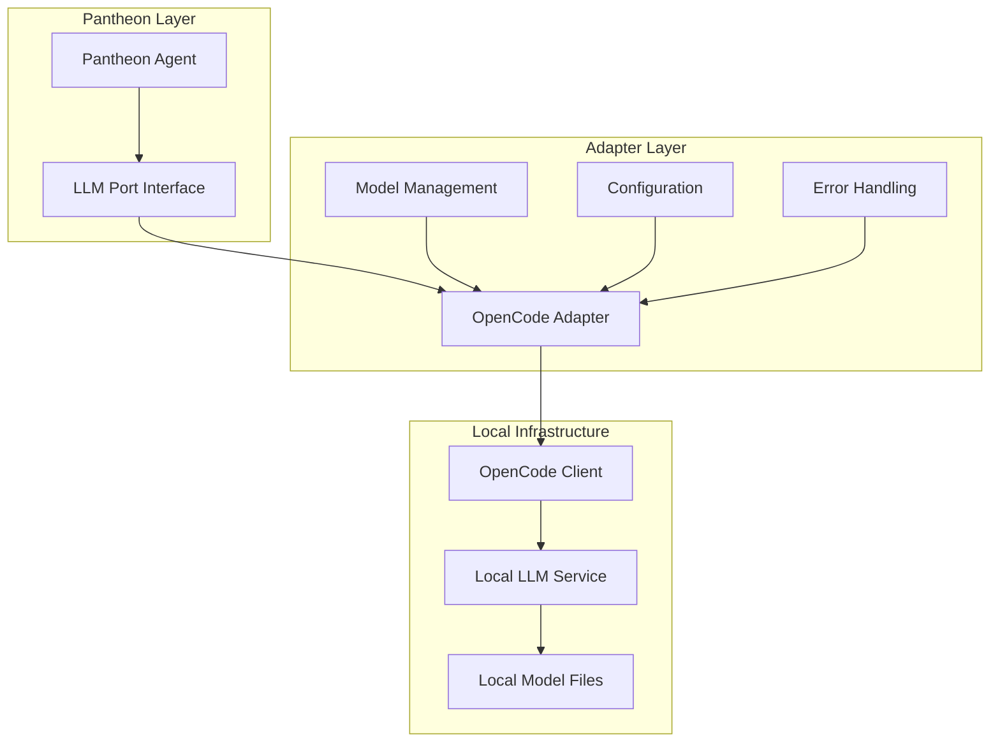

# Pantheon LLM OpenCode

> **OpenCode Client Adapter** - Integrates local OpenCode LLM services with Pantheon's actor system

## Overview

`@promethean-os/pantheon-llm-opencode` provides an adapter for connecting Pantheon agents with OpenCode's local LLM services. This enables agents to use locally-hosted models for privacy, cost control, and offline operation while maintaining compatibility with Pantheon's LLM port interface.

**Key Features**: Local model integration, privacy-focused operation, cost-effective inference, and offline capabilities.

## Architecture

### Local Integration Pattern



### Deployment Options

1. **Local Service Mode**: OpenCode runs as a local HTTP service
2. **Direct Library Mode**: Direct integration with OpenCode client library
3. **Hybrid Mode**: Combination of local and remote model access

## Installation

```bash
pnpm add @promethean-os/pantheon-llm-opencode
```

## Quick Start

### Basic Local Setup

```typescript
import { makeOpenCodeAdapter } from '@promethean-os/pantheon-llm-opencode';

// Create OpenCode adapter for local service
const opencodeAdapter = makeOpenCodeAdapter({
  endpoint: 'http://localhost:8080/v1', // OpenCode service endpoint
  defaultModel: 'llama-2-7b-chat',
  defaultTemperature: 0.7,
  timeout: 30000, // 30 second timeout
});

// Use with Pantheon agent
const agent = await pantheon.spawn(
  {
    name: 'LocalAssistant',
    contextSources: [],
    talents: [
      {
        name: 'local-chat',
        behaviors: [
          {
            name: 'respond',
            mode: 'active',
            plan: async ({ goal, context }) => {
              const response = await opencodeAdapter.complete([
                { role: 'system', content: 'You are a helpful local assistant.' },
                { role: 'user', content: goal },
              ]);

              return {
                actions: [
                  {
                    type: 'respond',
                    data: { message: response.content },
                  },
                ],
              };
            },
          },
        ],
      },
    ],
  },
  'Provide assistance using local models',
);
```

### Direct Library Integration

```typescript
// For direct library integration (future implementation)
const opencodeAdapter = makeOpenCodeAdapter({
  modelPath: '/path/to/models',
  defaultModel: 'mistral-7b-instruct',
  defaultTemperature: 0.5,
});
```

## Core APIs

### OpenCodeAdapterConfig

```typescript
interface OpenCodeAdapterConfig {
  modelPath?: string; // Path to local model files
  defaultModel?: string; // Default model name
  defaultTemperature?: number; // Default temperature
  endpoint?: string; // OpenCode service endpoint
  timeout?: number; // Request timeout in milliseconds
}
```

### makeOpenCodeAdapter

Creates an LLM port implementation for OpenCode integration.

```typescript
const adapter = makeOpenCodeAdapter(config: OpenCodeAdapterConfig): LlmPort
```

## Usage Patterns

### Model Selection Strategy

```typescript
class OpenCodeModelManager {
  constructor(private adapter: LlmPort) {}

  async completeWithOptimalModel(
    messages: Message[],
    requirements: {
      speed: 'fast' | 'balanced' | 'quality';
      task: 'chat' | 'analysis' | 'code' | 'creative';
      resources: 'low' | 'medium' | 'high';
    },
  ): Promise<Message> {
    const modelMap = {
      'fast-chat': 'llama-2-7b-chat',
      'balanced-chat': 'mistral-7b-instruct',
      'quality-chat': 'llama-2-13b-chat',
      'fast-code': 'starcoder-7b',
      'balanced-code': 'code-llama-13b',
      'quality-code': 'code-llama-34b',
      'fast-analysis': 'llama-2-7b',
      'balanced-analysis': 'mistral-7b',
      'quality-analysis': 'llama-2-13b',
    };

    const modelKey = `${requirements.speed}-${requirements.task}`;
    const selectedModel = modelMap[modelKey] || 'mistral-7b-instruct';

    return await this.adapter.complete(messages, {
      model: selectedModel,
      temperature: this.selectTemperature(requirements.task),
    });
  }

  private selectTemperature(task: string): number {
    const tempMap = {
      chat: 0.7,
      analysis: 0.3,
      code: 0.2,
      creative: 0.9,
    };
    return tempMap[task] || 0.7;
  }
}
```

### Resource Management

```typescript
class ResourceAwareOpenCode {
  private activeRequests = 0;
  private maxConcurrent = 3;
  private requestQueue: Array<{
    messages: Message[];
    opts?: any;
    resolve: (value: Message) => void;
    reject: (error: Error) => void;
  }> = [];

  constructor(private adapter: LlmPort) {}

  async complete(messages: Message[], opts?: any): Promise<Message> {
    return new Promise((resolve, reject) => {
      this.requestQueue.push({ messages, opts, resolve, reject });
      this.processQueue();
    });
  }

  private async processQueue(): Promise<void> {
    if (this.activeRequests >= this.maxConcurrent || this.requestQueue.length === 0) {
      return;
    }

    const request = this.requestQueue.shift()!;
    this.activeRequests++;

    try {
      const response = await this.adapter.complete(request.messages, request.opts);
      request.resolve(response);
    } catch (error) {
      request.reject(error as Error);
    } finally {
      this.activeRequests--;
      this.processQueue(); // Process next request
    }
  }
}
```

### Offline Operation

```typescript
class OfflineOpenCodeManager {
  private cache = new Map<string, Message>();
  private fallbackResponses = new Map<string, string>([
    ['greeting', "Hello! I'm running in offline mode with limited capabilities."],
    ['error', "I apologize, but I'm experiencing technical difficulties in offline mode."],
    [
      'default',
      "I'm operating in offline mode. Please check your connection for full functionality.",
    ],
  ]);

  constructor(private adapter: LlmPort) {}

  async completeWithFallback(messages: Message[], opts?: any): Promise<Message> {
    try {
      // Try the actual OpenCode adapter first
      return await this.adapter.complete(messages, opts);
    } catch (error) {
      console.warn('OpenCode unavailable, using offline fallback:', error);

      // Use cached response if available
      const cacheKey = this.generateCacheKey(messages);
      if (this.cache.has(cacheKey)) {
        return this.cache.get(cacheKey)!;
      }

      // Generate appropriate fallback response
      const fallbackType = this.classifyRequest(messages);
      const fallbackContent =
        this.fallbackResponses.get(fallbackType) || this.fallbackResponses.get('default')!;

      const response = {
        role: 'assistant' as const,
        content: fallbackContent,
      };

      // Cache the fallback response
      this.cache.set(cacheKey, response);

      return response;
    }
  }

  private generateCacheKey(messages: Message[]): string {
    const lastMessage = messages[messages.length - 1];
    return lastMessage.content.toLowerCase().slice(0, 50);
  }

  private classifyRequest(messages: Message[]): string {
    const content = messages[messages.length - 1].content.toLowerCase();

    if (content.includes('hello') || content.includes('hi')) return 'greeting';
    if (content.includes('error') || content.includes('problem')) return 'error';
    return 'default';
  }
}
```

## Integration Examples

### With Pantheon Core

```typescript
import { makePantheonCore } from '@promethean-os/pantheon-core';
import { makeOpenCodeAdapter } from '@promethean-os/pantheon-llm-opencode';

// Setup OpenCode adapter
const opencodeAdapter = makeOpenCodeAdapter({
  endpoint: 'http://localhost:8080/v1',
  defaultModel: 'mistral-7b-instruct',
  timeout: 60000,
});

// Create Pantheon system with OpenCode
const pantheon = makePantheonCore({
  llmPort: opencodeAdapter,
  // ... other dependencies
});

// Create privacy-focused agent
const privacyAgent = await pantheon.spawn(
  {
    name: 'PrivacyAssistant',
    contextSources: [],
    talents: [
      {
        name: 'private-processing',
        behaviors: [
          {
            name: 'process-sensitive-data',
            mode: 'active',
            plan: async ({ goal, context }) => {
              const prompt = `Process this sensitive data locally:
        
        Data: ${goal.data}
        Task: ${goal.task}
        
        Ensure no data leaves the local environment.`;

              const response = await opencodeAdapter.complete(
                [
                  {
                    role: 'system',
                    content:
                      'You are a privacy-focused assistant that processes data locally without external transmission.',
                  },
                  { role: 'user', content: prompt },
                ],
                {
                  temperature: 0.2, // Lower temperature for consistent processing
                  model: 'mistral-7b-instruct',
                },
              );

              return {
                actions: [
                  {
                    type: 'process-data',
                    data: {
                      result: response.content,
                      processedLocally: true,
                      timestamp: new Date().toISOString(),
                    },
                  },
                ],
              };
            },
          },
        ],
      },
    ],
  },
  'Process sensitive data locally for privacy',
);
```

### Multi-Model Configuration

```typescript
class MultiModelOpenCode {
  private adapters = new Map<string, LlmPort>();

  constructor(configs: Array<{ name: string; config: OpenCodeAdapterConfig }>) {
    for (const { name, config } of configs) {
      this.adapters.set(name, makeOpenCodeAdapter(config));
    }
  }

  async completeWithModel(modelName: string, messages: Message[], opts?: any): Promise<Message> {
    const adapter = this.adapters.get(modelName);
    if (!adapter) {
      throw new Error(`Model not found: ${modelName}`);
    }

    return await adapter.complete(messages, opts);
  }

  getAvailableModels(): string[] {
    return Array.from(this.adapters.keys());
  }

  async benchmarkModels(messages: Message[]): Promise<
    Array<{
      model: string;
      response: Message;
      latency: number;
    }>
  > {
    const results = [];

    for (const [modelName, adapter] of this.adapters) {
      const startTime = Date.now();
      const response = await adapter.complete(messages);
      const latency = Date.now() - startTime;

      results.push({
        model: modelName,
        response,
        latency,
      });
    }

    return results.sort((a, b) => a.latency - b.latency);
  }
}

// Usage
const multiModel = new MultiModelOpenCode([
  {
    name: 'fast-chat',
    config: {
      endpoint: 'http://localhost:8080/v1',
      defaultModel: 'llama-2-7b-chat',
    },
  },
  {
    name: 'quality-code',
    config: {
      endpoint: 'http://localhost:8081/v1',
      defaultModel: 'code-llama-34b',
    },
  },
]);
```

### Cost Optimization

```typescript
class CostOptimizedOpenCode {
  private requestCount = 0;
  private totalTokens = 0;
  private costPerToken = 0.0001; // Estimated local cost

  constructor(private adapter: LlmPort) {}

  async completeWithCostTracking(
    messages: Message[],
    opts?: any,
  ): Promise<{ response: Message; cost: number; tokens: number }> {
    const inputTokens = this.estimateTokens(messages);

    const response = await this.adapter.complete(messages, opts);
    const outputTokens = this.estimateTokens([response]);
    const totalTokens = inputTokens + outputTokens;
    const cost = totalTokens * this.costPerToken;

    this.requestCount++;
    this.totalTokens += totalTokens;

    return { response, cost, tokens: totalTokens };
  }

  getUsageStats() {
    return {
      requests: this.requestCount,
      totalTokens: this.totalTokens,
      totalCost: this.totalTokens * this.costPerToken,
      averageTokensPerRequest: this.totalTokens / this.requestCount,
    };
  }

  private estimateTokens(messages: Message[]): number {
    // Rough estimation for local models
    const totalChars = messages.reduce((sum, msg) => sum + msg.content.length, 0);
    return Math.ceil(totalChars / 4); // Approximate 4 chars per token
  }
}
```

## Advanced Configuration

### Model Health Monitoring

```typescript
class HealthyOpenCodeAdapter {
  private healthStatus = new Map<
    string,
    {
      isHealthy: boolean;
      lastCheck: Date;
      errorCount: number;
    }
  >();

  constructor(
    private adapters: Map<string, LlmPort>,
    private healthCheckInterval: number = 60000, // 1 minute
  ) {
    this.startHealthMonitoring();
  }

  async completeWithFailover(
    preferredModel: string,
    messages: Message[],
    opts?: any,
  ): Promise<Message> {
    const adapter = this.adapters.get(preferredModel);

    if (adapter && this.isHealthy(preferredModel)) {
      try {
        return await adapter.complete(messages, opts);
      } catch (error) {
        this.markUnhealthy(preferredModel);
        console.warn(`Model ${preferredModel} failed, trying failover`);
      }
    }

    // Try healthy fallback models
    for (const [modelName, modelAdapter] of this.adapters) {
      if (modelName !== preferredModel && this.isHealthy(modelName)) {
        try {
          return await modelAdapter.complete(messages, opts);
        } catch (error) {
          this.markUnhealthy(modelName);
        }
      }
    }

    throw new Error('All models are unhealthy');
  }

  private isHealthy(modelName: string): boolean {
    const status = this.healthStatus.get(modelName);
    return status?.isHealthy ?? true;
  }

  private markUnhealthy(modelName: string): void {
    const current = this.healthStatus.get(modelName) || {
      isHealthy: true,
      lastCheck: new Date(),
      errorCount: 0,
    };

    this.healthStatus.set(modelName, {
      isHealthy: false,
      lastCheck: new Date(),
      errorCount: current.errorCount + 1,
    });
  }

  private startHealthMonitoring(): void {
    setInterval(() => {
      this.performHealthChecks();
    }, this.healthCheckInterval);
  }

  private async performHealthChecks(): Promise<void> {
    for (const [modelName, adapter] of this.adapters) {
      try {
        await adapter.complete([{ role: 'user', content: 'Health check' }], { maxTokens: 1 });

        this.healthStatus.set(modelName, {
          isHealthy: true,
          lastCheck: new Date(),
          errorCount: 0,
        });
      } catch (error) {
        this.markUnhealthy(modelName);
      }
    }
  }
}
```

### Custom Model Integration

````typescript
class CustomModelAdapter {
  constructor(private config: OpenCodeAdapterConfig) {}

  async complete(messages: Message[], opts?: any): Promise<Message> {
    const model = opts?.model || this.config.defaultModel;

    // Custom model-specific preprocessing
    const processedMessages = this.preprocessForModel(messages, model);

    // Model-specific parameter adjustment
    const adjustedOpts = this.adjustParametersForModel(opts, model);

    // Call the actual OpenCode adapter
    const response = await this.callOpenCode(processedMessages, adjustedOpts);

    // Model-specific postprocessing
    return this.postprocessResponse(response, model);
  }

  private preprocessForModel(messages: Message[], model: string): Message[] {
    // Add model-specific system prompts
    const modelPrompts = {
      'llama-2': 'You are LLaMA-2, a helpful assistant.',
      mistral: 'You are Mistral, a capable language model.',
      'code-llama': 'You are Code LLaMA, specialized in programming tasks.',
    };

    const systemPrompt = modelPrompts[model as keyof typeof modelPrompts];
    if (systemPrompt && !messages.some((m) => m.role === 'system')) {
      return [{ role: 'system', content: systemPrompt }, ...messages];
    }

    return messages;
  }

  private adjustParametersForModel(opts?: any, model?: string): any {
    const modelDefaults = {
      'llama-2': { temperature: 0.7, maxTokens: 2048 },
      mistral: { temperature: 0.5, maxTokens: 4096 },
      'code-llama': { temperature: 0.2, maxTokens: 4096 },
    };

    const defaults = modelDefaults[model as keyof typeof modelDefaults] || {};

    return {
      ...defaults,
      ...opts,
    };
  }

  private async callOpenCode(messages: Message[], opts?: any): Promise<Message> {
    // This would be the actual OpenCode API call
    // For now, return a placeholder
    return {
      role: 'assistant',
      content: `Response from ${opts?.model} model`,
    };
  }

  private postprocessResponse(response: Message, model: string): Message {
    // Model-specific response postprocessing
    if (model === 'code-llama') {
      // Format code responses appropriately
      response.content = this.formatCodeResponse(response.content);
    }

    return response;
  }

  private formatCodeResponse(content: string): string {
    // Add code block formatting if needed
    if (!content.includes('```') && this.looksLikeCode(content)) {
      return `\`\`\`\n${content}\n\`\`\``;
    }
    return content;
  }

  private looksLikeCode(content: string): boolean {
    const codeIndicators = ['function', 'class', 'import', 'def', 'var', 'const', 'let'];
    return codeIndicators.some((indicator) => content.includes(indicator));
  }
}
````

## Testing

### Mock Adapter for Development

```typescript
import { test } from 'ava';

test('opencode adapter - mock responses', async (t) => {
  const mockAdapter = {
    complete: async (messages: Message[], opts?: any) => {
      const model = opts?.model || 'default';
      const lastMessage = messages[messages.length - 1];

      return {
        role: 'assistant',
        content: `[Mock ${model} Response] ${lastMessage.content}`,
      };
    },
  };

  const response = await mockAdapter.complete([{ role: 'user', content: 'Test message' }], {
    model: 'mistral-7b',
  });

  t.is(response.role, 'assistant');
  t.true(response.content.includes('Mock mistral-7b Response'));
});
```

### Integration Testing with Local Service

```typescript
test('opencode adapter - local service integration', async (t) => {
  // Only run if OpenCode service is available
  try {
    const response = await fetch('http://localhost:8080/health');
    if (!response.ok) {
      t.pass('OpenCode service not available, skipping integration test');
      return;
    }
  } catch {
    t.pass('OpenCode service not running, skipping integration test');
    return;
  }

  const opencodeAdapter = makeOpenCodeAdapter({
    endpoint: 'http://localhost:8080/v1',
    defaultModel: 'test-model',
  });

  const response = await opencodeAdapter.complete([{ role: 'user', content: 'Hello, test!' }]);

  t.is(response.role, 'assistant');
  t.truthy(response.content);
});
```

## Best Practices

### 1. Model Selection

```typescript
const selectModelForTask = (task: {
  type: 'chat' | 'code' | 'analysis' | 'creative';
  priority: 'speed' | 'quality' | 'cost';
  complexity: 'simple' | 'medium' | 'complex';
}): string => {
  const modelMatrix = {
    'chat-speed-simple': 'llama-2-7b-chat',
    'chat-quality-complex': 'llama-2-13b-chat',
    'code-speed-simple': 'starcoder-7b',
    'code-quality-complex': 'code-llama-34b',
    'analysis-speed-simple': 'mistral-7b',
    'analysis-quality-complex': 'llama-2-13b',
    'creative-speed-simple': 'mistral-7b',
    'creative-quality-complex': 'llama-2-13b',
  };

  const key = `${task.type}-${task.priority}-${task.complexity}`;
  return modelMatrix[key as keyof typeof modelMatrix] || 'mistral-7b-instruct';
};
```

### 2. Resource Management

```typescript
class ResourceManager {
  private maxMemory = 8 * 1024 * 1024 * 1024; // 8GB
  private maxConcurrent = 2;

  canAcceptRequest(estimatedTokens: number): boolean {
    const estimatedMemory = estimatedTokens * 2; // Rough estimate
    return estimatedMemory < this.maxMemory;
  }

  async waitForSlot(): Promise<void> {
    // Implement queuing logic for resource management
    return new Promise((resolve) => {
      const checkSlot = () => {
        if (this.activeRequests < this.maxConcurrent) {
          resolve();
        } else {
          setTimeout(checkSlot, 100);
        }
      };
      checkSlot();
    });
  }
}
```

### 3. Error Recovery

```typescript
class ResilientOpenCodeAdapter {
  private retryAttempts = 3;
  private backoffBase = 1000;

  async completeWithRetry(messages: Message[], opts?: any): Promise<Message> {
    let lastError: Error;

    for (let attempt = 1; attempt <= this.retryAttempts; attempt++) {
      try {
        return await this.adapter.complete(messages, opts);
      } catch (error) {
        lastError = error as Error;

        if (attempt < this.retryAttempts) {
          const delay = this.backoffBase * Math.pow(2, attempt - 1);
          await new Promise((resolve) => setTimeout(resolve, delay));
        }
      }
    }

    throw lastError!;
  }
}
```

## Troubleshooting

### Common Issues

1. **Service Unavailable**

   ```typescript
   const serviceCheckAdapter = {
     complete: async (messages: Message[], opts?: any) => {
       try {
         const healthResponse = await fetch('http://localhost:8080/health');
         if (!healthResponse.ok) {
           throw new Error('OpenCode service unhealthy');
         }
         return await opencodeAdapter.complete(messages, opts);
       } catch (error) {
         console.error('OpenCode service check failed:', error);
         throw new Error('OpenCode service is not available');
       }
     },
   };
   ```

2. **Model Loading Issues**

   ```typescript
   const modelValidationAdapter = {
     complete: async (messages: Message[], opts?: any) => {
       const model = opts?.model || 'default';

       // Validate model is loaded
       const modelStatus = await checkModelStatus(model);
       if (!modelStatus.loaded) {
         await loadModel(model);
       }

       return await opencodeAdapter.complete(messages, opts);
     },
   };
   ```

3. **Memory Constraints**
   ```typescript
   const memoryAwareAdapter = {
     complete: async (messages: Message[], opts?: any) => {
       const estimatedMemory = estimateMemoryUsage(messages, opts);
       const availableMemory = getAvailableMemory();

       if (estimatedMemory > availableMemory) {
         // Truncate context or use smaller model
         const truncatedMessages = truncateMessages(messages);
         const smallerModel = selectSmallerModel(opts?.model);

         return await opencodeAdapter.complete(truncatedMessages, {
           ...opts,
           model: smallerModel,
         });
       }

       return await opencodeAdapter.complete(messages, opts);
     },
   };
   ```

## Future Development

The OpenCode adapter is currently a placeholder implementation. Future development should include:

1. **HTTP Client Integration**: Full OpenCode service API integration
2. **Direct Library Support**: Native OpenCode client library integration
3. **Model Management**: Dynamic model loading and unloading
4. **Performance Optimization**: Request batching and caching
5. **Monitoring**: Detailed metrics and health checks
6. **Streaming Support**: Real-time response streaming

## Related Documentation

- [pantheon-core](pantheon-core.md) - Core LLM port interface
- [pantheon-llm-claude](pantheon-llm-claude.md) - Claude adapter for comparison
- [pantheon-llm-openai](pantheon-llm-openai.md) - OpenAI adapter for comparison
- [@promethean-os/opencode-client](@promethean-os/opencode-client.md) - OpenCode client library

## License

GPL-3.0-only - see [LICENSE](LICENSE.md) for details.
