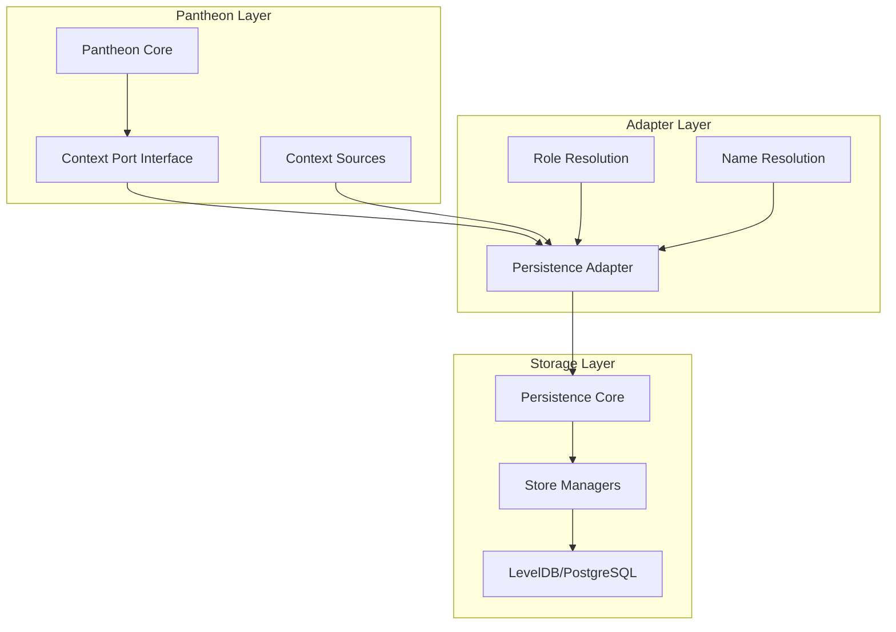

# Pantheon Persistence

> **Pantheon Context Port Adapter** - Bridges Pantheon's context system with the underlying persistence layer

## Overview

`@promethean-os/pantheon-persistence` serves as an adapter that connects Pantheon's context port interface with the core persistence system. It provides the bridge between Pantheon's actor model and the underlying data storage, enabling seamless context management for agents.

**Key Role**: Translates Pantheon's `ContextSource` specifications into actual store managers and provides role/name resolution for conversation context compilation.

## Architecture

### Adapter Pattern



### Data Flow

1. **Pantheon Core** requests context collections for specific sources
2. **Persistence Adapter** maps sources to store managers
3. **Store Managers** provide access to actual data storage
4. **Role/Name Resolution** formats metadata for conversation compilation

## Installation

```bash
pnpm add @promethean-os/pantheon-persistence
```

## Quick Start

### Basic Adapter Setup

```typescript
import { makePantheonPersistenceAdapter } from '@promethean-os/pantheon-persistence';
import { getStoreManagers } from '@promethean-os/persistence';

// Create the adapter
const adapter = makePantheonPersistenceAdapter({
  getStoreManagers: async () => {
    const managers = await getStoreManagers();
    return managers;
  },
});

// Use with Pantheon core
const pantheonSystem = makePantheonCore({
  contextPort: adapter,
  // ... other dependencies
});
```

### Advanced Configuration

```typescript
const adapter = makePantheonPersistenceAdapter({
  getStoreManagers: async () => {
    const managers = await getStoreManagers();
    return managers.filter((manager) =>
      ['conversations', 'documents', 'knowledge'].includes(manager.name),
    );
  },

  // Custom role resolution
  resolveRole: (meta) => {
    if (meta?.source === 'api') return 'user';
    if (meta?.source === 'agent') return 'assistant';
    if (meta?.system) return 'system';
    return 'user';
  },

  // Custom name resolution
  resolveName: (meta) => {
    if (meta?.user?.displayName) return meta.user.displayName;
    if (meta?.agent?.name) return meta.agent.name;
    if (meta?.system?.component) return meta.system.component;
    return 'Unknown';
  },

  // Custom time formatting
  formatTime: (ms) => {
    const date = new Date(ms);
    return date.toLocaleString('en-US', {
      year: 'numeric',
      month: 'short',
      day: 'numeric',
      hour: '2-digit',
      minute: '2-digit',
    });
  },
});
```

## Core APIs

### PersistenceAdapterDeps

```typescript
interface PersistenceAdapterDeps {
  getStoreManagers: () => Promise<DualStoreManager[]>;
  resolveRole?: (meta?: any) => 'system' | 'user' | 'assistant';
  resolveName?: (meta?: any) => string;
  formatTime?: (ms: number) => string;
}
```

### makePantheonPersistenceAdapter

Creates a ContextPort implementation that bridges Pantheon with the persistence layer.

```typescript
const adapter = makePantheonPersistenceAdapter(deps: PersistenceAdapterDeps): ContextPort
```

## Usage Patterns

### Context Source Mapping

```typescript
// Define context sources in Pantheon
const contextSources = [
  { id: 'conversations', label: 'Chat History' },
  { id: 'documents', label: 'Document Store' },
  { id: 'knowledge', label: 'Knowledge Base', where: { type: 'faq' } },
];

// Adapter maps these to actual store managers
const collections = await adapter.getCollectionsFor(contextSources);
// Returns: [ConversationManager, DocumentManager, KnowledgeManager]
```

### Role Resolution Strategies

```typescript
// Strategy 1: Metadata-based
const roleResolver = (meta) => {
  switch (meta?.type) {
    case 'human':
      return 'user';
    case 'ai':
      return 'assistant';
    case 'system':
      return 'system';
    default:
      return 'user';
  }
};

// Strategy 2: Source-based
const sourceResolver = (meta) => {
  if (meta?.source?.startsWith('user-')) return 'user';
  if (meta?.source?.startsWith('agent-')) return 'assistant';
  if (meta?.source?.startsWith('system-')) return 'system';
  return 'user';
};

// Strategy 3: Permission-based
const permissionResolver = (meta) => {
  if (meta?.permissions?.includes('admin')) return 'system';
  if (meta?.permissions?.includes('write')) return 'assistant';
  return 'user';
};
```

### Name Resolution Patterns

```typescript
// Pattern 1: Hierarchical names
const hierarchicalResolver = (meta) => {
  const parts = [meta?.organization, meta?.team, meta?.user?.displayName].filter(Boolean);

  return parts.join(' / ') || 'Unknown User';
};

// Pattern 2: Functional names
const functionalResolver = (meta) => {
  if (meta?.function) return meta.function;
  if (meta?.role) return `${meta.role} Agent`;
  if (meta?.service) return `${meta.service} Service`;
  return meta?.id || 'Unknown';
};

// Pattern 3: Contextual names
const contextualResolver = (meta) => {
  const context = meta?.context || 'general';
  const identifier = meta?.name || meta?.id || 'anonymous';
  return `${identifier} (${context})`;
};
```

### Time Formatting Options

```typescript
// Option 1: ISO format
const isoFormatter = (ms) => new Date(ms).toISOString();

// Option 2: Relative time
const relativeFormatter = (ms) => {
  const now = Date.now();
  const diff = now - ms;

  if (diff < 60000) return 'just now';
  if (diff < 3600000) return `${Math.floor(diff / 60000)}m ago`;
  if (diff < 86400000) return `${Math.floor(diff / 3600000)}h ago`;
  return new Date(ms).toLocaleDateString();
};

// Option 3: Custom format
const customFormatter = (ms) => {
  const date = new Date(ms);
  return date.toLocaleString('en-US', {
    month: 'short',
    day: 'numeric',
    hour: '2-digit',
    minute: '2-digit',
    second: '2-digit',
  });
};
```

## Integration Examples

### With Pantheon Core

```typescript
import { makePantheonCore } from '@promethean-os/pantheon-core';
import { makePantheonPersistenceAdapter } from '@promethean-os/pantheon-persistence';

// Setup persistence adapter
const persistenceAdapter = makePantheonPersistenceAdapter({
  getStoreManagers: async () => {
    const { getStoreManagers } = await import('@promethean-os/persistence');
    return await getStoreManagers();
  },
  resolveRole: (meta) => meta?.role || 'user',
  resolveName: (meta) => meta?.displayName || 'Anonymous',
  formatTime: (ms) => new Date(ms).toLocaleString(),
});

// Create Pantheon system
const pantheon = makePantheonCore({
  contextPort: persistenceAdapter,
  // ... other dependencies
});

// Use in agent script
const agentScript = {
  name: 'ContextAwareAgent',
  contextSources: [
    { id: 'conversations', label: 'Chat History' },
    { id: 'documents', label: 'Relevant Documents' },
  ],
  talents: [
    {
      name: 'context-analysis',
      behaviors: [
        {
          name: 'analyze-context',
          mode: 'active',
          plan: async ({ goal, context }) => {
            // Context is automatically compiled by the adapter
            const chatHistory = context.find((c) => c.source === 'conversations');
            const documents = context.find((c) => c.source === 'documents');

            return {
              actions: [
                {
                  type: 'analysis',
                  data: {
                    hasHistory: chatHistory?.messages?.length > 0,
                    documentCount: documents?.items?.length || 0,
                  },
                },
              ],
            };
          },
        },
      ],
    },
  ],
};
```

### With Multiple Store Types

```typescript
const multiStoreAdapter = makePantheonPersistenceAdapter({
  getStoreManagers: async () => {
    const managers = await getStoreManagers();

    // Filter and categorize stores
    return {
      conversations: managers.find((m) => m.name === 'conversations'),
      documents: managers.find((m) => m.name === 'documents'),
      knowledge: managers.find((m) => m.name === 'knowledge'),
      cache: managers.find((m) => m.name === 'cache'),
    };
  },

  resolveRole: (meta) => {
    // Different role resolution for different stores
    if (meta?.store === 'conversations') {
      return meta?.senderRole || 'user';
    }
    if (meta?.store === 'documents') {
      return meta?.authorRole || 'system';
    }
    return 'user';
  },
});
```

## Advanced Configuration

### Dynamic Store Selection

```typescript
const dynamicAdapter = makePantheonPersistenceAdapter({
  getStoreManagers: async (contextSources) => {
    const allManagers = await getStoreManagers();

    // Select managers based on context requirements
    return contextSources.map((source) => {
      const manager = allManagers.find((m) => m.name === source.id);

      if (!manager) {
        throw new Error(`Store manager not found: ${source.id}`);
      }

      // Apply filters if specified
      if (source.where) {
        return manager.withFilter(source.where);
      }

      return manager;
    });
  },
});
```

### Conditional Resolution

````typescript
const conditionalAdapter = makePantheonPersistenceAdapter({
  getStoreManagers: async () => getStoreManagers(),

  resolveRole: (meta) => {
    // Complex role resolution logic
    if (meta?.system?.critical) return 'system';
    if (meta?.user?.admin) return 'system';
    if (meta?.agent?.capabilities?.includes('analysis')) return 'assistant';
    if (meta?.external?.api) return 'user';

    // Default based on content
    if (meta?.content?.startsWith('```')) return 'assistant';
    return 'user';
  },

  resolveName: (meta) => {
    // Priority-based name resolution
    return (
      meta?.customName ||
      meta?.user?.profile?.displayName ||
      meta?.agent?.name ||
      meta?.service?.name ||
      meta?.id ||
      'Unknown'
    );
  },
});
````

### Performance Optimization

```typescript
const optimizedAdapter = makePantheonPersistenceAdapter({
  getStoreManagers: async () => {
    // Cache store managers
    if (!cachedManagers) {
      cachedManagers = await getStoreManagers();
    }
    return cachedManagers;
  },

  resolveRole: memoize((meta) => {
    // Memoized role resolution
    return meta?.role || detectRoleFromContent(meta);
  }),

  resolveName: memoize((meta) => {
    // Memoized name resolution
    return formatName(meta);
  }),

  formatTime: (ms) => {
    // Optimized time formatting
    return timeCache.get(ms) || timeCache.set(ms, formatTimestamp(ms));
  },
});
```

## Testing

### Mock Adapter for Testing

```typescript
import { test } from 'ava';

test('persistence adapter - context mapping', async (t) => {
  const mockStoreManagers = [
    { name: 'conversations', type: 'conversation' },
    { name: 'documents', type: 'document' },
  ];

  const adapter = makePantheonPersistenceAdapter({
    getStoreManagers: async () => mockStoreManagers,
    resolveRole: (meta) => meta?.role || 'user',
    resolveName: (meta) => meta?.name || 'Test User',
  });

  const contextSources = [
    { id: 'conversations', label: 'Chat' },
    { id: 'documents', label: 'Docs' },
  ];

  const collections = await adapter.getCollectionsFor(contextSources);

  t.is(collections.length, 2);
  t.is(collections[0].name, 'conversations');
  t.is(collections[1].name, 'documents');
});
```

### Integration Testing

```typescript
test('full integration - pantheon with persistence', async (t) => {
  // Setup real persistence
  const { getStoreManagers } = await import('@promethean-os/persistence');
  const managers = await getStoreManagers();

  // Create adapter
  const adapter = makePantheonPersistenceAdapter({
    getStoreManagers: async () => managers,
  });

  // Create Pantheon system
  const pantheon = makePantheonCore({
    contextPort: adapter,
  });

  // Test context compilation
  const context = await pantheon.compileContext([{ id: 'conversations', label: 'Chat' }]);

  t.truthy(context);
  t.true(context.length > 0);
});
```

## Best Practices

### 1. Store Manager Organization

```typescript
// Organize stores by domain
const domainStores = {
  communication: ['conversations', 'messages', 'notifications'],
  content: ['documents', 'media', 'templates'],
  knowledge: ['knowledge-base', 'faq', 'guides'],
  system: ['logs', 'metrics', 'config'],
};

const getDomainStores = async (domain: string) => {
  const allManagers = await getStoreManagers();
  const storeNames = domainStores[domain] || [];

  return allManagers.filter((manager) => storeNames.includes(manager.name));
};
```

### 2. Role Resolution Consistency

```typescript
// Create consistent role resolution across adapters
const createRoleResolver = (config: RoleConfig) => (meta?: any) => {
  // Apply rules in order
  for (const rule of config.rules) {
    const result = rule(meta);
    if (result !== undefined) return result;
  }

  return config.defaultRole;
};

const roleConfig = {
  rules: [
    (meta) => meta?.explicitRole,
    (meta) => meta?.system && 'system',
    (meta) => meta?.agent && 'assistant',
    (meta) => meta?.user && 'user',
  ],
  defaultRole: 'user',
};
```

### 3. Error Handling

```typescript
const robustAdapter = makePantheonPersistenceAdapter({
  getStoreManagers: async () => {
    try {
      return await getStoreManagers();
    } catch (error) {
      console.error('Failed to get store managers:', error);
      return []; // Return empty array as fallback
    }
  },

  resolveRole: (meta) => {
    try {
      return meta?.role || detectRole(meta) || 'user';
    } catch (error) {
      console.warn('Role resolution failed:', error);
      return 'user';
    }
  },
});
```

## Troubleshooting

### Common Issues

1. **Store Manager Not Found**

   ```typescript
   // Add validation
   const adapter = makePantheonPersistenceAdapter({
     getStoreManagers: async (sources) => {
       const managers = await getStoreManagers();
       const available = managers.map((m) => m.name);
       const requested = sources.map((s) => s.id);
       const missing = requested.filter((id) => !available.includes(id));

       if (missing.length > 0) {
         console.warn(`Missing stores: ${missing.join(', ')}`);
       }

       return managers.filter((m) => requested.includes(m.name));
     },
   });
   ```

2. **Role Resolution Ambiguity**

   ```typescript
   // Add logging for debugging
   const debugAdapter = makePantheonPersistenceAdapter({
     resolveRole: (meta) => {
       const role = determineRole(meta);
       console.debug(`Role resolution:`, { meta, role });
       return role;
     },
   });
   ```

3. **Performance Issues**
   ```typescript
   // Add caching and monitoring
   const cachedAdapter = makePantheonPersistenceAdapter({
     getStoreManagers: cached(getStoreManagers, { ttl: 60000 }),
     resolveRole: memoize(resolveRole),
     resolveName: memoize(resolveName),
   });
   ```

## Related Documentation

- [pantheon-core](pantheon-core.md) - Core context port interface
- [pantheon-state](pantheon-state.md) - Agent state management
- [@promethean-os/persistence](@promethean-os/persistence.md) - Core persistence system
- [pantheon-protocol](pantheon-protocol.md) - Message transport layer

## License

GPL-3.0-only - see [LICENSE](LICENSE.md) for details.
