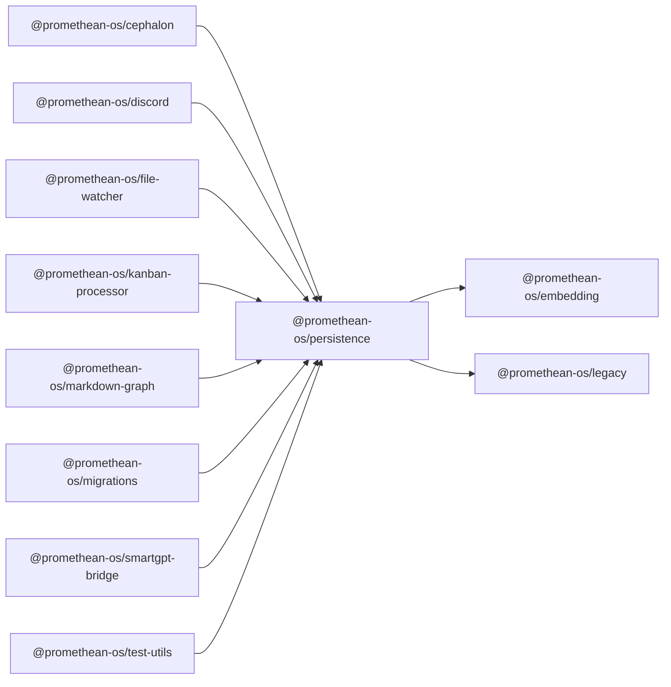

```
<!-- SYMPKG:PKG:BEGIN -->
```
# @promethean-os/persistence
```
**Folder:** `packages/persistence`
```
```
**Version:** `0.0.1`
```
```
**Domain:** `_root`
```

## Dependencies
- @promethean-os/embedding$../embedding/README.md
- @promethean-os/legacy$../legacy/README.md
## Dependents
- @promethean-os/cephalon$../cephalon/README.md
- @promethean-os/discord$../discord/README.md
- @promethean-os/file-watcher$../file-watcher/README.md
- @promethean-os/kanban-processor$../kanban-processor/README.md
- @promethean-os/markdown-graph$../markdown-graph/README.md
- @promethean-os/migrations$../migrations/README.md
- @promethean-os/smartgpt-bridge$../smartgpt-bridge/README.md
- @promethean-os/test-utils$../test-utils/README.md
```
<!-- SYMPKG:PKG:END -->
```