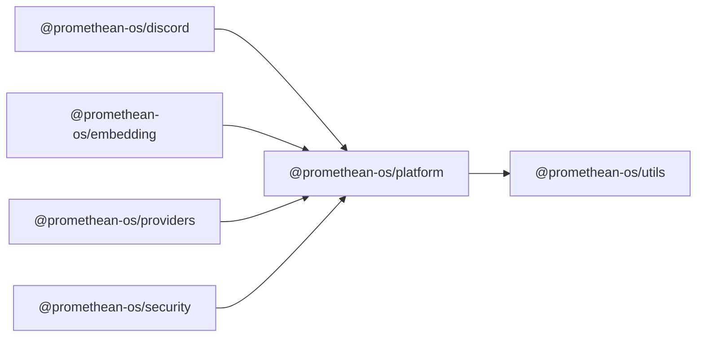

```
<!-- SYMPKG:PKG:BEGIN -->
```
# @promethean-os/platform
```
**Folder:** `packages/platform`
```
```
**Version:** `0.0.1`
```
```
**Domain:** `_root`
```

## Dependencies
- @promethean-os/utils$../utils/README.md
## Dependents
- @promethean-os/discord$../discord/README.md
- @promethean-os/embedding$../embedding/README.md
- @promethean-os/providers$../providers/README.md
- @promethean-os/security$../security/README.md
```
<!-- SYMPKG:PKG:END -->
```