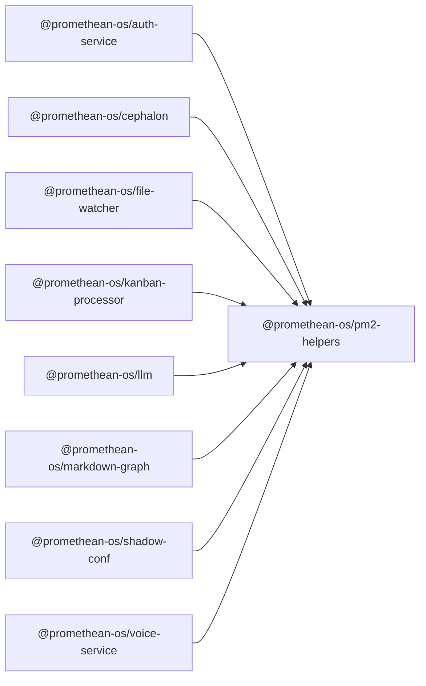

```
<!-- SYMPKG:PKG:BEGIN -->
```
# @promethean-os/pm2-helpers
```
**Folder:** `packages/pm2-helpers`
```
```
**Version:** `0.0.0`
```
```
**Domain:** `_root`
```

## Dependencies
- _None_
## Dependents
- @promethean-os/auth-service$../auth-service/README.md
- @promethean-os/cephalon$../cephalon/README.md
- @promethean-os/file-watcher$../file-watcher/README.md
- @promethean-os/kanban-processor$../kanban-processor/README.md
- @promethean-os/llm$../llm/README.md
- @promethean-os/markdown-graph$../markdown-graph/README.md
- @promethean-os/shadow-conf$../shadow-conf/README.md
- @promethean-os/voice-service$../voice/README.md
```
<!-- SYMPKG:PKG:END -->
```