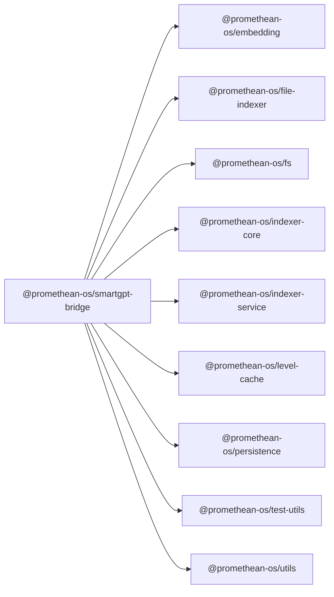

```
<!-- SYMPKG:PKG:BEGIN -->
```
# @promethean-os/smartgpt-bridge
```
**Folder:** `packages/smartgpt-bridge`
```
```
**Version:** `1.0.0`
```
```
**Domain:** `_root`
```

## Dependencies
- @promethean-os/embedding$../embedding/README.md
- @promethean-os/file-indexer$../file-indexer/README.md
- @promethean-os/fs$../fs/README.md
- @promethean-os/indexer-core$../indexer-core/README.md
- @promethean-os/indexer-service$../indexer-service/README.md
- @promethean-os/level-cache$../level-cache/README.md
- @promethean-os/persistence$../persistence/README.md
- @promethean-os/test-utils$../test-utils/README.md
- @promethean-os/utils$../utils/README.md
## Dependents
- _None_
```
<!-- SYMPKG:PKG:END -->
```