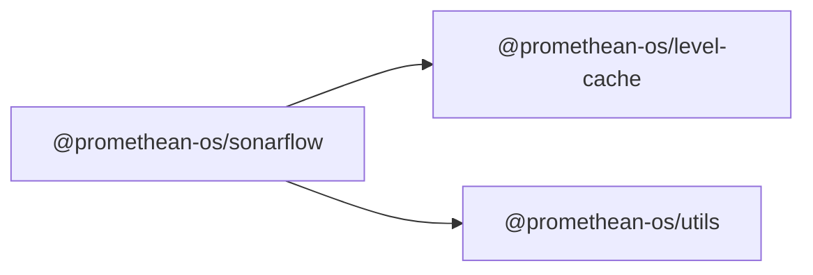

```
<!-- SYMPKG:PKG:BEGIN -->
```
# @promethean-os/sonarflow
```
**Folder:** `packages/sonarflow`
```
```
**Version:** `0.1.0`
```
```
**Domain:** `_root`
```

## Dependencies
- @promethean-os/level-cache$../level-cache/README.md
- @promethean-os/utils$../utils/README.md
## Dependents
- _None_
```
<!-- SYMPKG:PKG:END -->
```