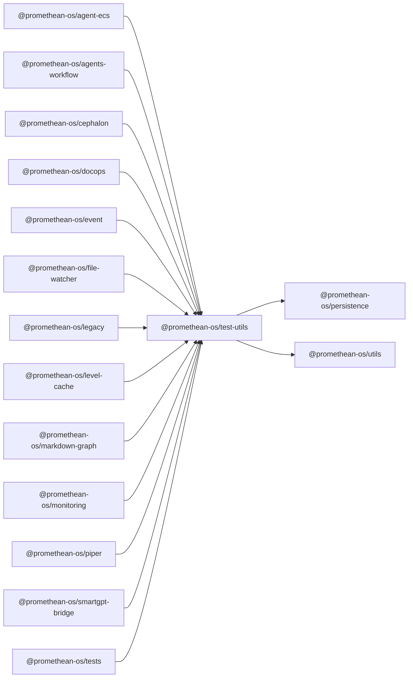

```
<!-- SYMPKG:PKG:BEGIN -->
```
# @promethean-os/test-utils
```
**Folder:** `packages/test-utils`
```
```
**Version:** `0.0.1`
```
```
**Domain:** `_root`
```

## Dependencies
- @promethean-os/persistence$../persistence/README.md
- @promethean-os/utils$../utils/README.md
## Dependents
- @promethean-os/agent-ecs$../agent-ecs/README.md
- @promethean-os/agents-workflow$../agents-workflow/README.md
- @promethean-os/cephalon$../cephalon/README.md
- @promethean-os/docops$../docops/README.md
- @promethean-os/event$../event/README.md
- @promethean-os/file-watcher$../file-watcher/README.md
- @promethean-os/legacy$../legacy/README.md
- @promethean-os/level-cache$../level-cache/README.md
- @promethean-os/markdown-graph$../markdown-graph/README.md
- @promethean-os/monitoring$../monitoring/README.md
- @promethean-os/piper$../piper/README.md
- @promethean-os/smartgpt-bridge$../smartgpt-bridge/README.md
- @promethean-os/tests$../tests/README.md
```
<!-- SYMPKG:PKG:END -->
```