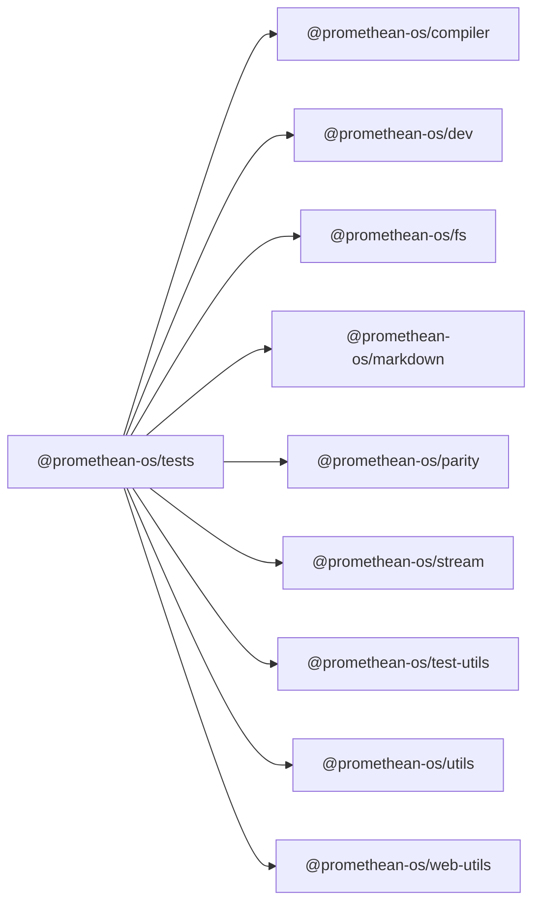

```
<!-- SYMPKG:PKG:BEGIN -->
```
# @promethean-os/tests
```
**Folder:** `packages/tests`
```
```
**Version:** `0.0.1`
```
```
**Domain:** `_root`
```

## Dependencies
- @promethean-os/compiler$../compiler/README.md
- @promethean-os/dev$../dev/README.md
- @promethean-os/fs$../fs/README.md
- @promethean-os/markdown$../markdown/README.md
- @promethean-os/parity$../parity/README.md
- @promethean-os/stream$../stream/README.md
- @promethean-os/test-utils$../test-utils/README.md
- @promethean-os/utils$../utils/README.md
- @promethean-os/web-utils$../web-utils/README.md
## Dependents
- _None_
```
<!-- SYMPKG:PKG:END -->
```