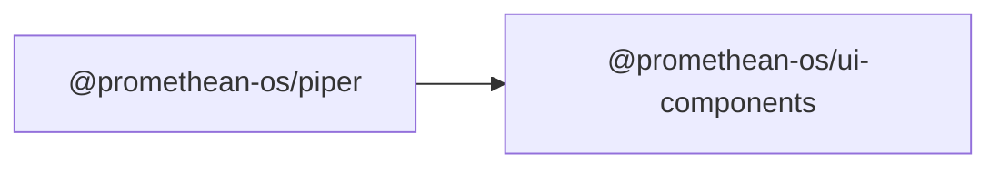

```
<!-- SYMPKG:PKG:BEGIN -->
```
# @promethean-os/ui-components
```
**Folder:** `packages/ui-components`
```
```
**Version:** `0.0.0`
```
```
**Domain:** `_root`
```

## Dependencies
- _None_
## Dependents
- @promethean-os/piper$../piper/README.md
```
<!-- SYMPKG:PKG:END -->
```