```
<!-- SYMPKG:PKG:BEGIN -->
```
# @promethean-os/utils
```
**Folder:** `packages/utils`
```
```
**Version:** `0.0.1`
```
```
**Domain:** `_root`
```

```mermaid
graph LR
  A["@promethean-os/utils"]
  R1["@promethean-os/agent-ecs"]
  R2["@promethean-os/boardrev"]
  R3["@promethean-os/buildfix"]
  R4["@promethean-os/cephalon"]
  R5["@promethean-os/changefeed"]
  R6["@promethean-os/codemods"]
  R7["@promethean-os/codepack"]
  R8["@promethean-os/compaction"]
  R9["@promethean-os/cookbookflow"]
  R10["@promethean-os/docops"]
  R11["@promethean-os/embedding"]
  R12["@promethean-os/event"]
  R13["@promethean-os/file-indexer"]
  R14["@promethean-os/file-watcher"]
  R15["@promethean-os/indexer-core"]
  R16["@promethean-os/indexer-service"]
  R17["@promethean-os/kanban"]
  R18["@promethean-os/level-cache"]
  R19["@promethean-os/llm"]
  R20["@promethean-os/openai-server"]
  R21["@promethean-os/piper"]
  R22["@promethean-os/platform"]
  R23["@promethean-os/projectors"]
  R24["@promethean-os/readmeflow"]
  R25["@promethean-os/semverguard"]
  R26["@promethean-os/simtasks"]
  R27["@promethean-os/smartgpt-bridge"]
  R28["@promethean-os/snapshots"]
  R29["@promethean-os/sonarflow"]
  R30["@promethean-os/symdocs"]
  R31["@promethean-os/test-utils"]
  R32["@promethean-os/testgap"]
  R33["@promethean-os/tests"]
  R34["@promethean-os/voice-service"]
  R1["@promethean-os/agent-ecs"] --> A
  R2["@promethean-os/boardrev"] --> A
  R3["@promethean-os/buildfix"] --> A
  R4["@promethean-os/cephalon"] --> A
  R5["@promethean-os/changefeed"] --> A
  R6["@promethean-os/codemods"] --> A
  R7["@promethean-os/codepack"] --> A
  R8["@promethean-os/compaction"] --> A
  R9["@promethean-os/cookbookflow"] --> A
  R10["@promethean-os/docops"] --> A
  R11["@promethean-os/embedding"] --> A
  R12["@promethean-os/event"] --> A
  R13["@promethean-os/file-indexer"] --> A
  R14["@promethean-os/file-watcher"] --> A
  R15["@promethean-os/indexer-core"] --> A
  R16["@promethean-os/indexer-service"] --> A
  R17["@promethean-os/kanban"] --> A
  R18["@promethean-os/level-cache"] --> A
  R19["@promethean-os/llm"] --> A
  R20["@promethean-os/openai-server"] --> A
  R21["@promethean-os/piper"] --> A
  R22["@promethean-os/platform"] --> A
  R23["@promethean-os/projectors"] --> A
  R24["@promethean-os/readmeflow"] --> A
  R25["@promethean-os/semverguard"] --> A
  R26["@promethean-os/simtasks"] --> A
  R27["@promethean-os/smartgpt-bridge"] --> A
  R28["@promethean-os/snapshots"] --> A
  R29["@promethean-os/sonarflow"] --> A
  R30["@promethean-os/symdocs"] --> A
  R31["@promethean-os/test-utils"] --> A
  R32["@promethean-os/testgap"] --> A
  R33["@promethean-os/tests"] --> A
  R34["@promethean-os/voice-service"] --> A
  click R1 "../agent-ecs/README.md" "@promethean-os/agent-ecs"
  click R2 "../boardrev/README.md" "@promethean-os/boardrev"
  click R3 "../buildfix/README.md" "@promethean-os/buildfix"
  click R4 "../cephalon/README.md" "@promethean-os/cephalon"
  click R5 "../changefeed/README.md" "@promethean-os/changefeed"
  click R6 "../codemods/README.md" "@promethean-os/codemods"
  click R7 "../codepack/README.md" "@promethean-os/codepack"
  click R8 "../compaction/README.md" "@promethean-os/compaction"
  click R9 "../cookbookflow/README.md" "@promethean-os/cookbookflow"
  click R10 "../docops/README.md" "@promethean-os/docops"
  click R11 "../embedding/README.md" "@promethean-os/embedding"
  click R12 "../event/README.md" "@promethean-os/event"
  click R13 "../file-indexer/README.md" "@promethean-os/file-indexer"
  click R14 "../file-watcher/README.md" "@promethean-os/file-watcher"
  click R15 "../indexer-core/README.md" "@promethean-os/indexer-core"
  click R16 "../indexer-service/README.md" "@promethean-os/indexer-service"
  click R17 "../kanban/README.md" "@promethean-os/kanban"
  click R18 "../level-cache/README.md" "@promethean-os/level-cache"
  click R19 "../llm/README.md" "@promethean-os/llm"
  click R20 "../openai-server/README.md" "@promethean-os/openai-server"
  click R21 "../piper/README.md" "@promethean-os/piper"
  click R22 "../platform/README.md" "@promethean-os/platform"
  click R23 "../projectors/README.md" "@promethean-os/projectors"
  click R24 "../readmeflow/README.md" "@promethean-os/readmeflow"
  click R25 "../semverguard/README.md" "@promethean-os/semverguard"
  click R26 "../simtask/README.md" "@promethean-os/simtasks"
  click R27 "../smartgpt-bridge/README.md" "@promethean-os/smartgpt-bridge"
  click R28 "../snapshots/README.md" "@promethean-os/snapshots"
  click R29 "../sonarflow/README.md" "@promethean-os/sonarflow"
  click R30 "../symdocs/README.md" "@promethean-os/symdocs"
  click R31 "../test-utils/README.md" "@promethean-os/test-utils"
  click R32 "../testgap/README.md" "@promethean-os/testgap"
  click R33 "../tests/README.md" "@promethean-os/tests"
  click R34 "../voice/README.md" "@promethean-os/voice-service"
```

## Dependencies
- _None_
## Dependents
- @promethean-os/agent-ecs$../agent-ecs/README.md
- @promethean-os/boardrev$../boardrev/README.md
- @promethean-os/buildfix$../buildfix/README.md
- @promethean-os/cephalon$../cephalon/README.md
- @promethean-os/changefeed$../changefeed/README.md
- @promethean-os/codemods$../codemods/README.md
- @promethean-os/codepack$../codepack/README.md
- @promethean-os/compaction$../compaction/README.md
- @promethean-os/cookbookflow$../cookbookflow/README.md
- @promethean-os/docops$../docops/README.md
- @promethean-os/embedding$../embedding/README.md
- @promethean-os/event$../event/README.md
- @promethean-os/file-indexer$../file-indexer/README.md
- @promethean-os/file-watcher$../file-watcher/README.md
- @promethean-os/indexer-core$../indexer-core/README.md
- @promethean-os/indexer-service$../indexer-service/README.md
- @promethean-os/kanban$../kanban/README.md
- @promethean-os/level-cache$../level-cache/README.md
- @promethean-os/llm$../llm/README.md
- @promethean-os/openai-server$../openai-server/README.md
- @promethean-os/piper$../piper/README.md
- @promethean-os/platform$../platform/README.md
- @promethean-os/projectors$../projectors/README.md
- @promethean-os/readmeflow$../readmeflow/README.md
- @promethean-os/semverguard$../semverguard/README.md
- @promethean-os/simtasks$../simtask/README.md
- @promethean-os/smartgpt-bridge$../smartgpt-bridge/README.md
- @promethean-os/snapshots$../snapshots/README.md
- @promethean-os/sonarflow$../sonarflow/README.md
- @promethean-os/symdocs$../symdocs/README.md
- @promethean-os/test-utils$../test-utils/README.md
- @promethean-os/testgap$../testgap/README.md
- @promethean-os/tests$../tests/README.md
- @promethean-os/voice-service$../voice/README.md
```
<!-- SYMPKG:PKG:END -->
```