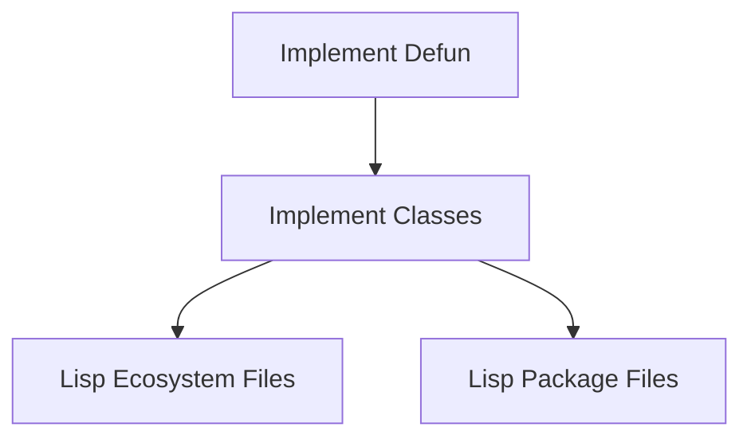
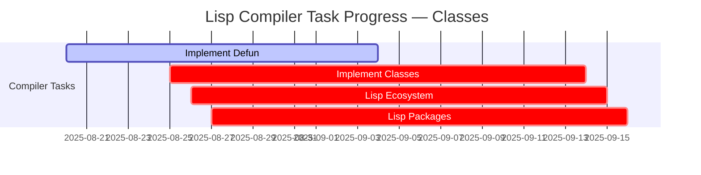

# 🔗 Lisp Compiler — `defclass` Dependency Graph

This diagram shows how the `defclass` task relates to other compiler/lisp tasks.

---

## 🌱 Current Dependencies

---

## 📊 Progress Heatmap

Legend:
- ✅ done = complete
- 🔄 active = in progress
- ⚠️ crit = blocked / not started

---

## 📝 Notes
- **Classes** are blocked until `defun` exists.
- Once implemented, they unlock **ecosystem and package-level abstractions**.
- They form the basis for object-oriented patterns in Promethean Lisp.

---

> 🌍 This task sits at the heart of bringing **object-oriented structures** to the Lisp compiler, completing the functional + OO duality.