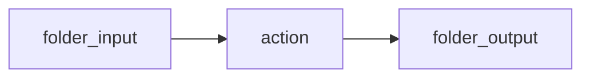

Gifting the knowledge of flame to man.

Say goodbye to tedium and monotony.

It's about time I used this page for something eh?
Welcome, to promethean.

An operating environment in the age of AI.
[[kanban]]

Everything you thought you knew about operating systems is over.

In promethean, AI is not an after thought
It is core design principals.

It's a conversations with your system.
Inteligent event scheduling
All actions idempotent
No accidental destructive operations

## Document oriented workflows

Define workflows as flow charts with mermaid

## Optimization

Promethean optimizes it's machine learning models to for your exact use case
It will learn how to do what you need it to do, better, faster, and more efficiently

Accomplish the same work as a cloud model using a different approach to problem solving.

It works in the background, slowly, constantly, not all at once.
No flashy text streaming.

No crashing web browsers

Only results.

## Productivity

At the heart of everything is a text based board which keeps track of what the system is doing, why it's doing it, and so on.
Promethean will not just wait for you to tell it exactly what to do.
And it also won't do anything you don't want it to do.

You'll prioritize your tasks, you'll move it on through the board.
If it is marked ready, it does it.
## Privacy

## Security

### Log analysis

You're systems logs under persistent analysis by system inteligence.
No longer hidden in some obscure part of your system
If it matters to you, you'll know.

### User management
The actions of every user of your system scrutinized

### Network

## Core features
