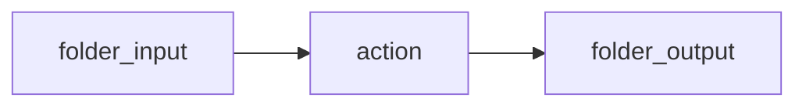

Gifting the knowledge of flame to man.

Say goodbye to tedium and monotony.

It's about time I used this page for something eh?
Welcome, to promethean.

An operating environment in the age of AI.
[[kanban]]

Everything you thought you knew about operating systems is over.

In promethean, AI is not an after thought
It is core design principals.

It's a conversations with your system.
Inteligent event scheduling
All actions idempotent
No accidental destructive operations

## Document oriented workflows

Define workflows as flow charts with mermaid

## Optimization

Promethean optimizes it's machine learning models to for your exact use case
It will learn how to do what you need it to do, better, faster, and more efficiently

Accomplish the same work as a cloud model using a different approach to problem solving.

It works in the background, slowly, constantly, not all at once.
No flashy text streaming.

No crashing web browsers

Only results.

## Productivity

At the heart of everything is a text based board which keeps track of what the system is doing, why it's doing it, and so on.
Promethean will not just wait for you to tell it exactly what to do.
And it also won't do anything you don't want it to do.

You'll prioritize your tasks, you'll move it on through the board.
If it is marked ready, it does it.
## Privacy

## Security

### Log analysis

You're systems logs under persistent analysis by system inteligence.
No longer hidden in some obscure part of your system
If it matters to you, you'll know.

### User management
The actions of every user of your system scrutinized

### Network

## Core features

## Package Catalog

Need a subsystem or SDK? Browse the catalog to jump directly to each package
README for architecture notes, setup commands, and current usage guidance.
$$
<!-- PACKAGE_CATALOG_START -->
$$
| Package | Summary | Usage | README |
$$
| --- | --- | --- | --- |
$$
| @promethean/agent | (coming soon) | Usage details coming soon in package README. | [README]$packages/agent/README.md$ |
| @promethean/agent-ecs | (coming soon) | Usage details coming soon in package README. | [README]$packages/agent-ecs/README.md$ |
| @promethean/alias-rewrite | Deprecated: use @promethean/naming instead | Usage details pending in package README. | [README]$packages/alias-rewrite/README.md$ |
| @promethean/auth-service | Auth Service | Usage details coming soon in package README. | [README]$packages/auth-service/README.md$ |
| @promethean/boardrev | (coming soon) | Usage details coming soon in package README. | [README]$packages/boardrev/README.md$ |
| Message Broker Service (Node.js) | Simple WebSocket-based pub/sub broker. Services connect and exchange messages through | Usage details coming soon in package README. | [README]$packages/broker/README.md$ |
| Buildfix | Buildfix automates fixing TypeScript build errors. | Build the package first, then run commands individually: Or run the full pipeline with [piper](https://github.com/promethean-framework/piper): | [README]$packages/buildfix/README.md$ |
| @promethean/cephalon | A proof-of-concept basic bot using @discordjs/voice | Usage details pending in package README. | [README]$packages/cephalon/README.md$ |
| @promethean/changefeed | (coming soon) | Usage details coming soon in package README. | [README]$packages/changefeed/README.md$ |
| @promethean/cli | (coming soon) | Usage details coming soon in package README. | [README]$packages/cli/README.md$ |
| clj-hacks | Utilities for experimenting with Emacs Lisp parsing using the Tree-sitter | Usage details pending in package README. | [README]$packages/clj-hacks/README.md$ |
| @promethean/codemods | (coming soon) | Usage details coming soon in package README. | [README]$packages/codemods/README.md$ |
| @promethean/codepack | (coming soon) | Usage details coming soon in package README. | [README]$packages/codepack/README.md$ |
| @promethean/compaction | (coming soon) | Usage details coming soon in package README. | [README]$packages/compaction/README.md$ |
| @promethean/compiler | (coming soon) | Usage details coming soon in package README. | [README]$packages/compiler/README.md$ |
| @promethean/contracts | (coming soon) | Usage details coming soon in package README. | [README]$packages/contracts/README.md$ |
| @promethean/cookbookflow | (coming soon) | Usage details coming soon in package README. | [README]$packages/cookbookflow/README.md$ |
| @promethean/dev | (coming soon) | Usage details coming soon in package README. | [README]$packages/dev/README.md$ |
| @promethean/discord | (coming soon) | Usage details coming soon in package README. | [README]$packages/discord/README.md$ |
| @promethean/dlq | (coming soon) | Usage details coming soon in package README. | [README]$packages/dlq/README.md$ |
| @promethean/docops | DocOps is a modular documentation pipeline that parses, embeds, queries, relates, and renders Markdown documents. It exposes pure JS/TS functions, a small dev server with a Web UI… | Usage details coming soon in package README. | [README]$packages/docops/README.md$ |
| @promethean/ds | (coming soon) | Usage details coming soon in package README. | [README]$packages/ds/README.md$ |
| duck-tools smoke CLI | Simple smoke test for blob framing: reads a file, chunks to 1 MiB, computes sha256, prints stats. | **Output** (example): | [README]$packages/duck-tools/README.md$ |
| @promethean/duck-web | A minimal browser UI for talking to Duck without Discord. Uses WebRTC to stream microphone audio to ENSO via the `enso-browser-gateway`, and receives replies back as text (with op… | Usage details pending in package README. | [README](packages/duck-web/README.md) |
| @promethean/effects | (coming soon) | Usage details coming soon in package README. | [README](packages/effects/README.md) |
| eidolon-field | Runs an 8-dimensional vector field on a constant tick and persists each | Usage details pending in package README. | [README](packages/eidolon-field/README.md) |
| @promethean/embedding | (coming soon) | Usage details coming soon in package README. | [README](packages/embedding/README.md) |
| ENSO Protocol Reference Implementation | A reference implementation of the Promethean ENSO context protocol described in | Usage details pending in package README. | [README](packages/enso-protocol/README.md) |
| @promethean/event | (coming soon) | Usage details coming soon in package README. | [README](packages/event/README.md) |
| @promethean/examples | (coming soon) | Usage details coming soon in package README. | [README](packages/examples/README.md) |
| @promethean/file-indexer | `@promethean/file-indexer` provides a high-level wrapper around | Usage details pending in package README. | [README](packages/file-indexer/README.md) |
| File Watcher Service | This service monitors the local kanban board and task files, and now also | Usage details coming soon in package README. | [README](packages/file-watcher/README.md) |
| Frontend Service | Serves compiled frontend assets from Promethean packages under a single Fastify instance. | This will start a server on port `4500`. Each package that contains a `dist/frontend` or `static` directory is mounted under a path matching the package name. Example: `http://loc… | [README]$packages/frontend-service/README.md$ |
| @promethean/fs | (coming soon) | Usage details coming soon in package README. | [README]$packages/fs/README.md$ |
| Health Service | **Path**: `services/js/health/index.js` | Usage details pending in package README. | [README]$packages/health/README.md$ |
| Heartbeat Service (Node.js) | Tracks process heartbeats published on the message broker and terminates those that fail to report within a timeout. | Usage details pending in package README. | [README]$packages/heartbeat/README.md$ |
| @promethean/http | (coming soon) | Usage details coming soon in package README. | [README]$packages/http/README.md$ |
| @promethean/image-link-generator | (coming soon) | Usage details coming soon in package README. | [README]$packages/image-link-generator/README.md$ |
| @promethean/intention | (coming soon) | Usage details coming soon in package README. | [README]$packages/intention/README.md$ |
| @promethean/kanban-cli | This package bundles every automation entry point for the workspace kanban | Usage details pending in package README. | [README]$packages/kanban/README.md$ |
| Kanban Processor | Subscribes to file watcher events and keeps the kanban board and task files in sync. | Usage details coming soon in package README. | [README]$packages/kanban-processor/README.md$ |
| @promethean/legacy | (coming soon) | Usage details coming soon in package README. | [README]$packages/legacy/README.md$ |
| packages/level-cache/README.md | A tiny, embedded, **functional-style** cache on top of `level`: | Usage details coming soon in package README. | [README]$packages/level-cache/README.md$ |
| LLM Service | This service exposes HTTP and WebSocket endpoints for text generation through pluggable drivers. | Start the service with `./run.sh`, a symlink to the shared `services/ts/run.sh` script (requires `pnpm`; the script prints setup instructions if the package manager is missing): P… | [README]$packages/llm/README.md$ |
| @promethean/markdown | (coming soon) | Usage details coming soon in package README. | [README]$packages/markdown/README.md$ |
| @promethean/markdown-graph | (coming soon) | Usage details coming soon in package README. | [README]$packages/markdown-graph/README.md$ |
| @promethean/mcp | Single MCP server module with composable, pure tools. ESM-only, Fastify HTTP transport + stdio. | Usage details pending in package README. | [README]$packages/mcp/README.md$ |
| @promethean/migrations | (coming soon) | Usage details coming soon in package README. | [README]$packages/migrations/README.md$ |
| Promethean Model Server $single-process, per-device executors$ | One FastAPI server with a device-aware router and per-device executors $NVIDIA / Intel iGPU / Intel NPU / CPU$. | Usage details pending in package README. | [README]$packages/model-server/README.md$ |
| @promethean/monitoring | (coming soon) | Usage details coming soon in package README. | [README]$packages/monitoring/README.md$ |
| @promethean/naming | (coming soon) | Usage details coming soon in package README. | [README]$packages/naming/README.md$ |
| @promethean/openai-server | A Fastify-based web server that exposes an OpenAI-compatible chat completions API. | Usage details pending in package README. | [README]$packages/openai-server/README.md$ |
| @promethean/parity | (coming soon) | Usage details coming soon in package README. | [README]$packages/parity/README.md$ |
| @promethean/persistence | (coming soon) | Usage details coming soon in package README. | [README]$packages/persistence/README.md$ |
| @promethean/piper | Piper is a lightweight pipeline runner. It reads a `pipelines.json` file and executes the steps it defines. | Usage details coming soon in package README. | [README]$packages/piper/README.md$ |
| @promethean/platform | (coming soon) | Usage details coming soon in package README. | [README]$packages/platform/README.md$ |
| @promethean/pm2-helpers | (coming soon) | Usage details coming soon in package README. | [README]$packages/pm2-helpers/README.md$ |
| @promethean/projectors | (coming soon) | Usage details coming soon in package README. | [README]$packages/projectors/README.md$ |
| Promethean CLI | The Promethean CLI provides a thin wrapper around the workspace's `pnpm` scripts. | After installing dependencies run the build once so the distributable script is available: Once built you can execute the CLI via the repo-level binaries: The `--help` flag lists … | [README]$packages/promethean-cli/README.md$ |
| @promethean/providers | (coming soon) | Usage details coming soon in package README. | [README]$packages/providers/README.md$ |
| @promethean/readmeflow | (coming soon) | Usage details coming soon in package README. | [README]$packages/readmeflow/README.md$ |
| @promethean/report-forge | Create terse, actionable Markdown reports from GitHub issues using a **local LLM** (Ollama by default). | Usage details pending in package README. | [README]$packages/report-forge/README.md$ |
| @promethean/schema | (coming soon) | Usage details coming soon in package README. | [README]$packages/schema/README.md$ |
| @promethean/security | (coming soon) | Usage details coming soon in package README. | [README]$packages/security/README.md$ |
| @promethean/semverguard | (coming soon) | Usage details coming soon in package README. | [README]$packages/semverguard/README.md$ |
| @promethean/simtasks | (coming soon) | Usage details coming soon in package README. | [README]$packages/simtask/README.md$ |
| Promethean SmartGPT Bridge — Full | One service, one `/openapi.json`, many powers: | Usage details pending in package README. | [README]$packages/smartgpt-bridge/README.md$ |
| @promethean/snapshots | (coming soon) | Usage details coming soon in package README. | [README]$packages/snapshots/README.md$ |
| @promethean/sonarflow | (coming soon) | Usage details coming soon in package README. | [README]$packages/sonarflow/README.md$ |
| @promethean/stream | (coming soon) | Usage details coming soon in package README. | [README]$packages/stream/README.md$ |
| @promethean/symdocs | (coming soon) | Usage details coming soon in package README. | [README]$packages/symdocs/README.md$ |
| @promethean/test-utils | Test Utilities | Usage details coming soon in package README. | [README]$packages/test-utils/README.md$ |
| @promethean/testgap | (coming soon) | Usage details coming soon in package README. | [README]$packages/testgap/README.md$ |
| @promethean/tests | (coming soon) | Usage details coming soon in package README. | [README]$packages/tests/README.md$ |
| @promethean/timetravel | (coming soon) | Usage details coming soon in package README. | [README]$packages/timetravel/README.md$ |
| @promethean/ui-components | Design tokens and reusable Web Components for Promethean front-ends. | Usage details pending in package README. | [README]$packages/ui-components/README.md$ |
| @promethean/utils | (coming soon) | Usage details coming soon in package README. | [README]$packages/utils/README.md$ |
| Vision Service | Express-based service for capturing screenshots. It exposes a `/capture` HTTP | Install dependencies and start the service (pnpm required): #hashtags: #vision #service #promethean | [README]$packages/vision/README.md$ |
| Voice Service | Handles Discord voice connections, recording/transcription via the STT service and playback through the TTS service. | Usage details coming soon in package README. | [README]$packages/voice/README.md$ |
| @promethean/web-utils | (coming soon) | Usage details coming soon in package README. | [README]$packages/web-utils/README.md$ |
| Webcrawler Service | Polite Markdown-saving web crawler that respects `robots.txt` and persists fetched pages as Markdown files in a configurable output directory. | Usage details pending in package README. | [README]$packages/webcrawler-service/README.md$ |
| @promethean/worker | (coming soon) | Usage details coming soon in package README. | [README]$packages/worker/README.md$ |
| @promethean/ws | (coming soon) | Usage details coming soon in package README. | [README]$packages/ws/README.md$ |
$$
<!-- PACKAGE_CATALOG_END -->
$$
