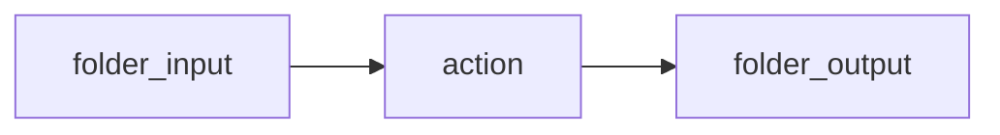

# Gifting the knowledge of flame to man.

Say goodbye to tedium and monotony.
Welcome, to Promethean.

Everything you thought you knew about operating systems is over.

In Promethean, AI is not an after thought
It is core design principals.

It's a conversations with your system.
Intelligent event scheduling
All actions idempotent

[[kanban]]
[[generated]]

## Document oriented workflows

Define workflows as flow charts with mermaid


```mermaid
flowchart LR
folder_input --> action --> folder_output
```

## Optimization

Promethean optimizes it's machine learning models to for your exact use case
It will learn how to do what you need it to do, better, faster, and more efficiently

Accomplish the same work as a cloud model using a different approach to problem solving.

It works in the background, slowly, constantly, not all at once.
No flashy text streaming.

No crashing web browsers

Only results.

## Productivity

At the heart of everything is a text based board which keeps track of what the system is doing, why it's doing it, and so on.
Promethean will not just wait for you to tell it exactly what to do.
And it also won't do anything you don't want it to do.

You'll prioritize your tasks, you'll move it on through the board.
If it is marked ready, it does it.

## Privacy

## Security

### Log analysis

You're systems logs under persistent analysis by system inteligence.
No longer hidden in some obscure part of your system
If it matters to you, you'll know.

### User management

The actions of every user of your system scrutinized

### Network

## Core features

## Dataview quickviews

- Recent agile pipelines

```dataview
LIST
FROM "docs/agile/pipelines"
SORT file.mtime DESC
LIMIT 5
```

- Recently touched docs

```dataview
LIST
FROM "docs"
SORT file.mtime DESC
LIMIT 10
```

- Agile tasks by status (frontmatter `status`)

```dataview
TABLE status AS "Status", length(rows) AS "Count"
FROM "docs/agile/tasks"
WHERE status
GROUP BY status
SORT status
```

- Tasks by priority

```dataview
TABLE priority AS "Priority", length(rows) AS "Count"
FROM "docs/agile/tasks"
WHERE priority
GROUP BY priority
SORT priority
```


## Package Catalog

Need a subsystem or SDK? Browse the catalog to jump directly to each package README for architecture notes, setup commands, and current usage guidance.

<!-- PACKAGE_CATALOG_START -->

| Package                                   | Summary                                                                                        | Usage       | README                                            |
| ----------------------------------------- | ---------------------------------------------------------------------------------------------- | ----------- | ------------------------------------------------- |
| @promethean-os/agent                      | Coming soon.                                                                                   | See README. | [README](docs/dev/packages/agent/README.md)                |
| @promethean-os/agent-ecs                  | Coming soon.                                                                                   | See README. | [README](docs/dev/packages/agent-ecs/README.md)            |
| @promethean-os/alias-rewrite              | **Deprecated** — use `@promethean-os/naming`.                                                  | N/A         | [README](docs/dev/packages/alias-rewrite/README.md)        |
| @promethean-os/auth-service               | Authentication service.                                                                        | See README. | [README](docs/dev/packages/auth-service/README.md)         |
| @promethean-os/boardrev                   | Coming soon.                                                                                   | See README. | [README](docs/dev/packages/boardrev/README.md)             |
| Message Broker Service (Node.js)          | WebSocket-based pub/sub broker.                                                                | See README. | [README](packages/broker/README.md)               |
| Buildfix                                  | Automates fixing TypeScript build errors.                                                      | See README. | [README](docs/dev/packages/buildfix/README.md)             |
| @promethean-os/cephalon                   | Discord bot using `@discordjs/voice`.                                                          | See README. | [README](docs/dev/packages/cephalon/README.md)             |
| @promethean-os/changefeed                 | Coming soon.                                                                                   | See README. | [README](docs/dev/packages/changefeed/README.md)           |
| @promethean-os/cli                        | Coming soon.                                                                                   | See README. | [README](docs/dev/packages/cli/README.md)                  |
| clj-hacks                                 | Tree-sitter experiments for Emacs Lisp parsing.                                                | See README. | [README](packages/clj-hacks/README.md)            |
| @promethean-os/codemods                   | Coming soon.                                                                                   | See README. | [README](docs/dev/packages/codemods/README.md)             |
| @promethean-os/codepack                   | Coming soon.                                                                                   | See README. | [README](docs/dev/packages/codepack/README.md)             |
| @promethean-os/compaction                 | Coming soon.                                                                                   | See README. | [README](docs/dev/packages/compaction/README.md)           |
| @promethean-os/compiler                   | Coming soon.                                                                                   | See README. | [README](docs/dev/packages/compiler/README.md)             |
| @promethean-os/contracts                  | Coming soon.                                                                                   | See README. | [README](docs/dev/packages/contracts/README.md)            |
| @promethean-os/cookbookflow               | Coming soon.                                                                                   | See README. | [README](docs/dev/packages/cookbookflow/README.md)         |
| @promethean-os/dev                        | Coming soon.                                                                                   | See README. | [README](docs/dev/packages/dev/README.md)                  |
| @promethean-os/discord                    | Coming soon.                                                                                   | See README. | [README](packages/discord/README.md)              |
| @promethean-os/dlq                        | Coming soon.                                                                                   | See README. | [README](docs/dev/packages/dlq/README.md)                  |
| @promethean-os/docops                     | Modular docs pipeline: parse, embed, relate, render Markdown; JS/TS API + small dev server/UI. | See README. | [README](docs/dev/packages/docops/README.md)               |
| @promethean-os/ds                         | Coming soon.                                                                                   | See README. | [README](packages/ds/README.md)                   |
| duck-tools (Smoke CLI)                    | Blob framing smoke test (1 MiB chunks, sha256, stats).                                         | See README. | [README](docs/dev/packages/duck-tools/README.md)           |
| @promethean-os/duck-web                   | Minimal browser UI for Duck via WebRTC + `enso-browser-gateway`.                               | See README. | [README](docs/dev/packages/duck-web/README.md)             |
| @promethean-os/effects                    | Coming soon.                                                                                   | See README. | [README](packages/effects/README.md)              |
| eidolon-field                             | 8-dimensional vector field runner with persistent ticks.                                       | See README. | [README](packages/eidolon-field/README.md)        |
| @promethean-os/embedding                  | Coming soon.                                                                                   | See README. | [README](packages/embedding/README.md)            |
| ENSO Protocol Reference Implementation    | Reference implementation of the Promethean ENSO context protocol.                              | See README. | [README](docs/dev/packages/enso-protocol/README.md)        |
| @promethean-os/event                      | Coming soon.                                                                                   | See README. | [README](packages/event/README.md)                |
| @promethean-os/examples                   | Coming soon.                                                                                   | See README. | [README](docs/dev/packages/examples/README.md)             |
| @promethean-os/file-indexer               | High-level wrapper for file indexing utilities.                                                | See README. | [README](packages/file-indexer/README.md)         |
| File Watcher Service                      | Monitors local kanban and task files; emits events.                                            | See README. | [README](docs/dev/packages/file-watcher/README.md)         |
| Frontend Service                          | Serves compiled front-end assets under one Fastify instance.                                   | See README. | [README](docs/dev/packages/frontend-service/README.md)     |
| @promethean-os/fs                         | Coming soon.                                                                                   | See README. | [README](packages/fs/README.md)                   |
| Health Service                            | Health check endpoint.                                                                         | See README. | [README](packages/health/README.md)               |
| Heartbeat Service (Node.js)               | Tracks process heartbeats; terminates stalled processes.                                       | See README. | [README](packages/heartbeat/README.md)            |
| @promethean-os/http                       | Coming soon.                                                                                   | See README. | [README](packages/http/README.md)                 |
| @promethean-os/image-link-generator       | Coming soon.                                                                                   | See README. | [README](docs/dev/packages/image-link-generator/README.md) |
| @promethean-os/intention                  | Coming soon.                                                                                   | See README. | [README](docs/dev/packages/intention/README.md)            |
| @promethean-os/kanban-cli                 | Bundles automation entry points for workspace kanban.                                          | See README. | [README](docs/dev/packages/kanban/README.md)               |
| Kanban Processor                          | Keeps kanban board and task files in sync from watcher events.                                 | See README. | [README](docs/dev/packages/kanban-processor/README.md)     |
| @promethean-os/legacy                     | Coming soon.                                                                                   | See README. | [README](packages/legacy/README.md)               |
| @promethean-os/level-cache                | Tiny embedded functional cache on top of `level`.                                              | See README. | [README](packages/level-cache/README.md)          |
| LLM Service                               | HTTP/WebSocket service for text generation via pluggable drivers.                              | See README. | [README](docs/dev/packages/llm/README.md)                  |
| @promethean-os/markdown                   | Coming soon.                                                                                   | See README. | [README](packages/markdown/README.md)             |
| @promethean-os/markdown-graph             | Coming soon.                                                                                   | See README. | [README](docs/dev/packages/markdown-graph/README.md)       |
| @promethean-os/mcp                        | Single MCP server with composable tools; ESM, Fastify HTTP + stdio.                            | See README. | [README](docs/dev/packages/mcp/README.md)                  |
| @promethean-os/migrations                 | Coming soon.                                                                                   | See README. | [README](packages/migrations/README.md)           |
| Model Server (single-process, per-device) | FastAPI server; device-aware router with per-device executors (NVIDIA/iGPU/NPU/CPU).           | See README. | [README](packages/model-server/README.md)         |
| @promethean-os/monitoring                 | Coming soon.                                                                                   | See README. | [README](docs/dev/packages/monitoring/README.md)           |
| @promethean-os/naming                     | Coming soon.                                                                                   | See README. | [README](docs/dev/packages/naming/README.md)               |
| @promethean-os/openai-server              | Fastify server exposing OpenAI-compatible Chat Completions API.                                | See README. | [README](docs/dev/packages/openai-server/README.md)        |
| @promethean-os/parity                     | Coming soon.                                                                                   | See README. | [README](docs/dev/packages/parity/README.md)               |
| @promethean-os/persistence                | Coming soon.                                                                                   | See README. | [README](packages/persistence/README.md)          |
| @promethean-os/piper                      | Lightweight pipeline runner executing `pipelines.json`.                                        | See README. | [README](docs/dev/packages/piper/README.md)                |
| @promethean-os/platform                   | Coming soon.                                                                                   | See README. | [README](packages/platform/README.md)             |
| @promethean-os/pm2-helpers                | Coming soon.                                                                                   | See README. | [README](packages/pm2-helpers/README.md)          |
| @promethean-os/projectors                 | Coming soon.                                                                                   | See README. | [README](docs/dev/packages/projectors/README.md)           |
| Promethean CLI                            | Thin wrapper around workspace `pnpm` scripts.                                                  | See README. | [README](packages/promethean-cli/README.md)       |
| @promethean-os/providers                  | Coming soon.                                                                                   | See README. | [README](packages/providers/README.md)            |
| @promethean-os/readmeflow                 | Coming soon.                                                                                   | See README. | [README](docs/dev/packages/readmeflow/README.md)           |
| @promethean-os/report-forge               | Create terse, actionable Markdown reports from GitHub issues via local LLM.                    | See README. | [README](packages/report-forge/README.md)         |
| @promethean-os/schema                     | Coming soon.                                                                                   | See README. | [README](docs/dev/packages/schema/README.md)               |
| @promethean-os/security                   | Coming soon.                                                                                   | See README. | [README](packages/security/README.md)             |
| @promethean-os/semverguard                | Coming soon.                                                                                   | See README. | [README](docs/dev/packages/semverguard/README.md)          |
| @promethean-os/simtasks                   | Coming soon.                                                                                   | See README. | [README](packages/simtasks/README.md)             |
| Promethean SmartGPT Bridge — Full         | One service, one `/openapi.json`, many powers.                                                 | See README. | [README](docs/dev/packages/smartgpt-bridge/README.md)      |
| @promethean-os/snapshots                  | Coming soon.                                                                                   | See README. | [README](docs/dev/packages/snapshots/README.md)            |
| @promethean-os/sonarflow                  | Coming soon.                                                                                   | See README. | [README](docs/dev/packages/sonarflow/README.md)            |
| @promethean-os/stream                     | Coming soon.                                                                                   | See README. | [README](docs/dev/packages/stream/README.md)               |
| @promethean-os/symdocs                    | Coming soon.                                                                                   | See README. | [README](docs/dev/packages/symdocs/README.md)              |
| @promethean-os/test-utils                 | Test utilities.                                                                                | See README. | [README](packages/test-utils/README.md)           |
| @promethean-os/testgap                    | Coming soon.                                                                                   | See README. | [README](docs/dev/packages/testgap/README.md)              |
| @promethean-os/tests                      | Coming soon.                                                                                   | See README. | [README](docs/dev/packages/tests/README.md)                |
| @promethean-os/timetravel                 | Coming soon.                                                                                   | See README. | [README](docs/dev/packages/timetravel/README.md)           |
| @promethean-os/ui-components              | Design tokens and reusable web components.                                                     | See README. | [README](docs/dev/packages/ui-components/README.md)        |
| @promethean-os/utils                      | Coming soon.                                                                                   | See README. | [README](packages/utils/README.md)                |
| Vision Service                            | Express service to capture screenshots via `/capture`.                                         | See README. | [README](packages/vision/README.md)               |
| Voice Service                             | Discord voice I/O; records/transcribes (STT) and plays back (TTS).                             | See README. | [README](docs/dev/packages/voice/README.md)                |
| @promethean-os/web-utils                  | Coming soon.                                                                                   | See README. | [README](docs/dev/packages/web-utils/README.md)            |
| Webcrawler Service                        | Polite Markdown-saving crawler respecting `robots.txt`.                                        | See README. | [README](docs/dev/packages/webcrawler-service/README.md)   |
| @promethean-os/worker                     | Coming soon.                                                                                   | See README. | [README](docs/dev/packages/worker/README.md)               |
| @promethean-os/ws                         | Coming soon.                                                                                   | See README. | [README](docs/dev/packages/ws/README.md)                   |

<!-- PACKAGE_CATALOG_END -->

