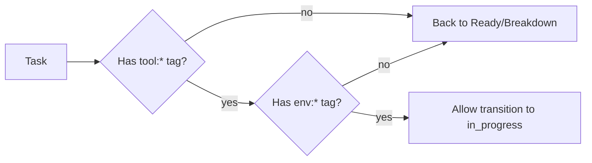
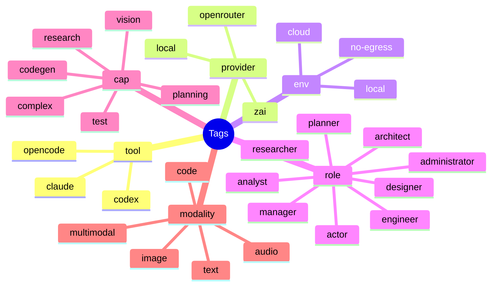
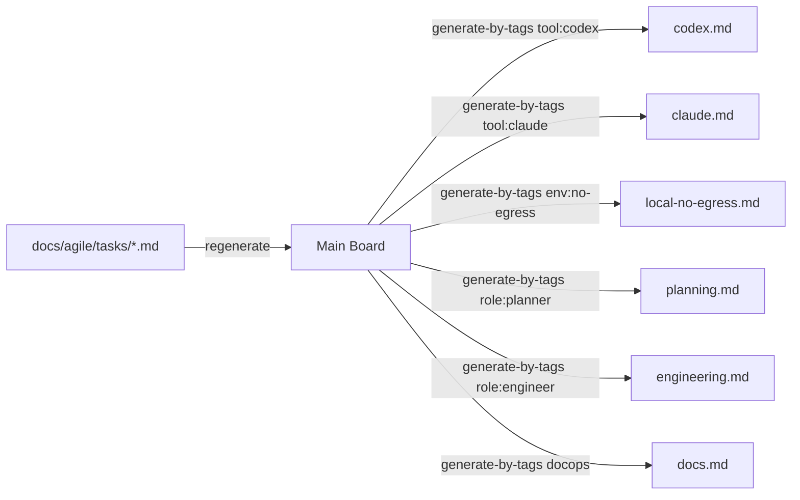

# Board Planning Canvas

> Live workspace for Kanban refinement, agent routing, and WIP remediation.
> Source of truth remains: `docs/agile/boards/generated.md`.

---

## 1) System Snapshot

**WIP targets**
- accepted=21, breakdown=13, ready=55, todo=25, in_progress=13, testing=8, review=8, document=8, blocked=3, done=500, rejected=20 (icebox/incoming=9999)

**Current hotspots**
- breakdown: 26/13 (+13)
- ready: 103/55 (+48)
- todo: 29/25 (+4)

---

## 2) Process Gate (to enter `in_progress`)



---

## 3) Tools-as-Roles Tagging (taxonomy)



---

## 4) Views (filtered boards)

- `views/codex.md` ← `tool:codex`
- `views/claude.md` ← `tool:claude`
- `views/local-no-egress.md` ← `env:no-egress`
- `views/planning.md` ← `role:planner`
- `views/engineering.md` ← `role:engineer`
- `views/docs.md` ← `docops`



---

## 5) Next Moves (iterative, ≤5 per pass)

- **Materialize Tags → labels** (so views fill):
  - script: `packages/kanban/src/scripts/materialize-tags.ts`
  - effect: mirror `Tags:` line tokens into frontmatter `labels` (idempotent)
- **Create stubs** for board-only violators (≤5) to unblock FSM moves.
- **Rebalance** in order: breakdown → ready → todo (use `update-status`).
- **Regen + enforce** each pass: `pnpm kanban regenerate && pnpm kanban enforce-wip-limits`.

---

## 6) Command Palette (copy/paste)

```bash
# Fix safety hook name and regenerate
sed -i 's/"inprogress"/"in_progress"/' docs/agile/rules/kanban-transitions.clj
pnpm kanban regenerate
pnpm kanban enforce-wip-limits --report

# Generate views (after materialization)
pnpm kanban generate-by-tags "tool:codex" --kanban docs/agile/boards/views/codex.md
pnpm kanban generate-by-tags "tool:claude" --kanban docs/agile/boards/views/claude.md
pnpm kanban generate-by-tags "env:no-egress" --kanban docs/agile/boards/views/local-no-egress.md

# First stub batch location
mkdir -p docs/agile/tasks/imported
```

---

## 7) Scratch

- Notes:
  - Use single-task updates to avoid Node OOM on `--content`
  - Add `trace:<uuid>` for stable referencing

