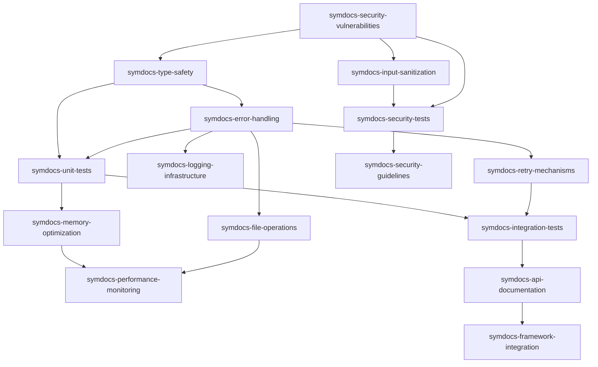

# @promethean/symdocs Security & Performance Overhaul Epic

## Epic Overview

**Title:** @promethean/symdocs Security & Performance Overhaul  
**Priority:** P0  
**Estimated Story Points:** 73  
**Timeline:** 4-5 weeks  
**Package:** @promethean/symdocs

### Description

Comprehensive security hardening, performance optimization, and testing infrastructure implementation for the @promethean/symdocs package based on code review findings. This epic addresses critical security vulnerabilities, eliminates unsafe type usage, implements robust error handling, establishes comprehensive testing, and optimizes performance for large datasets.

### Success Criteria

- [ ] All critical security vulnerabilities resolved and security tests passing
- [ ] Comprehensive test coverage >80% with automated test suite
- [ ] Performance optimized for large datasets with memory management
- [ ] Robust error handling with proper logging and recovery
- [ ] Type safety improved with elimination of unsafe any types
- [ ] Complete documentation with security guidelines and API reference
- [ ] Integration with Promethean Framework standards and tooling

### Definition of Done

**Task Level:**

- [ ] All acceptance criteria met
- [ ] Code reviewed and security-approved
- [ ] Tests passing with >80% coverage
- [ ] Documentation updated
- [ ] Security scan clean
- [ ] Performance benchmarks met

**Epic Level:**

- [ ] All phases completed
- [ ] Integration tests passing
- [ ] Production deployment ready
- [ ] Security audit passed
- [ ] Performance metrics validated
- [ ] Framework compliance achieved

## Critical Issues Identified

1. **Path traversal vulnerability in 01-scan.ts:76** - Critical security risk
2. **Command injection risks from unsanitized inputs** - Critical security risk
3. **LLM prompt injection potential** - Critical security risk
4. **Unsafe any types throughout codebase** - Type safety and maintainability
5. **Minimal test coverage (only one test file)** - Quality and reliability

## Phases and Timeline

### Phase 1: Critical Security Hardening (Week 1)

**Focus:** Address P0 security vulnerabilities and establish secure foundations  
**Story Points:** 21

**Tasks:**

- symdocs-security-vulnerabilities (8 points)
- symdocs-input-sanitization (5 points)
- symdocs-type-safety (8 points)

### Phase 2: Error Handling & Reliability (Week 1-2)

**Focus:** Implement robust error handling and retry mechanisms  
**Story Points:** 18

**Tasks:**

- symdocs-error-handling (8 points)
- symdocs-retry-mechanisms (5 points)
- symdocs-logging-infrastructure (5 points)

### Phase 3: Testing Infrastructure (Week 2-3)

**Focus:** Build comprehensive test suite and security testing  
**Story Points:** 21

**Tasks:**

- symdocs-unit-tests (8 points)
- symdocs-integration-tests (8 points)
- symdocs-security-tests (5 points)

### Phase 4: Performance Optimization (Week 3-4)

**Focus:** Optimize performance and memory usage  
**Story Points:** 13

**Tasks:**

- symdocs-memory-optimization (5 points)
- symdocs-file-operations (5 points)
- symdocs-performance-monitoring (3 points)

### Phase 5: Documentation & Validation (Week 4-5)

**Focus:** Complete documentation and final validation  
**Story Points:** 0

**Tasks:**

- symdocs-api-documentation (3 points)
- symdocs-security-guidelines (2 points)
- symdocs-framework-integration (0 points)

## Task Breakdown

### Critical Priority Tasks (P0)

#### 1. Fix Critical Security Vulnerabilities

**UUID:** symdocs-security-vulnerabilities  
**Story Points:** 8  
**Priority:** P0

**Description:** Eliminate path traversal, command injection, and LLM prompt injection vulnerabilities

**Acceptance Criteria:**

- [ ] Path traversal vulnerability in 01-scan.ts:76 is resolved with proper path validation
- [ ] Command injection risks eliminated through input sanitization and parameterized commands
- [ ] LLM prompt injection prevented through input validation and output encoding
- [ ] Security tests cover all identified vulnerability scenarios
- [ ] Static analysis tools show no security issues
- [ ] Security audit passes all checks

**Subtasks:**

- **Fix path traversal vulnerability** (3 points): Implement secure path validation and sanitization in 01-scan.ts:76
- **Prevent command injection** (3 points): Replace unsafe command execution with parameterized alternatives
- **Mitigate LLM prompt injection** (2 points): Add input validation and output encoding for LLM interactions

#### 2. Implement Comprehensive Input Sanitization

**UUID:** symdocs-input-sanitization  
**Story Points:** 5  
**Priority:** P0

**Description:** Create centralized input validation and sanitization system for all user inputs

**Acceptance Criteria:**

- [ ] All user inputs are validated and sanitized before processing
- [ ] Centralized validation system with configurable rules
- [ ] Input length limits and character restrictions enforced
- [ ] Sanitization library integrated throughout codebase
- [ ] Security tests validate sanitization effectiveness
- [ ] No unsanitized inputs reach critical operations

**Subtasks:**

- **Create input validation framework** (2 points): Build reusable input validation and sanitization system
- **Integrate sanitization throughout codebase** (2 points): Apply validation to all user input points
- **Add sanitization tests** (1 point): Test validation rules and edge cases

#### 3. Eliminate Unsafe Any Types

**UUID:** symdocs-type-safety  
**Story Points:** 8  
**Priority:** P0

**Description:** Replace all unsafe any types with proper TypeScript types and interfaces

**Acceptance Criteria:**

- [ ] All any types replaced with specific TypeScript types
- [ ] Type interfaces defined for all data structures
- [ ] Type safety enforced throughout codebase
- [ ] TypeScript compilation with strict mode passes
- [ ] No type errors or warnings
- [ ] Code completion and IntelliSense fully functional

**Subtasks:**

- **Define type interfaces** (3 points): Create TypeScript interfaces for all data structures
- **Replace any types in core modules** (3 points): Update 01-scan.ts and other core files with proper types
- **Enable strict TypeScript mode** (2 points): Configure and validate strict type checking

### High Priority Tasks (P1)

#### 4. Implement Robust Error Handling

**UUID:** symdocs-error-handling  
**Story Points:** 8  
**Priority:** P1

**Description:** Replace generic error handling with specific, actionable error management

**Acceptance Criteria:**

- [ ] Specific error types for different failure scenarios
- [ ] Consistent error handling patterns throughout codebase
- [ ] Graceful degradation for non-critical failures
- [ ] Error messages provide actionable context
- [ ] Error recovery mechanisms where appropriate
- [ ] Comprehensive error handling tests

**Subtasks:**

- **Define error type hierarchy** (3 points): Create specific error classes for different scenarios
- **Implement consistent error patterns** (3 points): Apply error handling throughout codebase
- **Add error recovery mechanisms** (2 points): Implement graceful degradation and recovery

#### 5. Add Retry Mechanisms for External Dependencies

**UUID:** symdocs-retry-mechanisms  
**Story Points:** 5  
**Priority:** P1

**Description:** Implement exponential backoff and retry logic for external service calls

**Acceptance Criteria:**

- [ ] Exponential backoff retry mechanism implemented
- [ ] Configurable retry limits and timeouts
- [ ] Circuit breaker pattern for failing services
- [ ] Retry state properly managed and tracked
- [ ] Comprehensive retry testing
- [ ] Monitoring and alerting for retry failures

**Subtasks:**

- **Implement retry framework** (2 points): Build configurable retry mechanism with backoff
- **Add circuit breaker pattern** (2 points): Implement circuit breaker for external dependencies
- **Add retry monitoring** (1 point): Track and alert on retry patterns

#### 6. Build Comprehensive Logging Infrastructure

**UUID:** symdocs-logging-infrastructure  
**Story Points:** 5  
**Priority:** P1

**Description:** Implement structured logging with proper levels and context

**Acceptance Criteria:**

- [ ] Structured logging with consistent format
- [ ] Multiple log levels (debug, info, warn, error)
- [ ] Contextual information included in logs
- [ ] Log rotation and management
- [ ] Security event logging
- [ ] Performance impact minimal and measurable

**Subtasks:**

- **Implement structured logging** (2 points): Add logging framework with context and levels
- **Add security event logging** (2 points): Log security-relevant events and violations
- **Configure log management** (1 point): Set up rotation, filtering, and management

### Medium Priority Tasks (P1-P2)

#### 7. Build Comprehensive Unit Test Suite

**UUID:** symdocs-unit-tests  
**Story Points:** 8  
**Priority:** P1

**Description:** Create unit tests for all core functionality with >80% coverage

**Acceptance Criteria:**

- [ ] Unit test coverage exceeds 80% of codebase
- [ ] All public functions have unit tests
- [ ] Edge cases and error conditions tested
- [ ] Test suite runs quickly and reliably
- [ ] Mocking implemented for external dependencies
- [ ] Continuous integration runs tests automatically

**Subtasks:**

- **Test core scanning functionality** (3 points): Unit tests for 01-scan.ts and core scanning logic
- **Test utility functions** (2 points): Tests for helper functions and utilities
- **Add edge case testing** (3 points): Test error conditions and boundary cases

#### 8. Implement Integration Test Suite

**UUID:** symdocs-integration-tests  
**Story Points:** 8  
**Priority:** P1

**Description:** Create end-to-end integration tests for complete workflows

**Acceptance Criteria:**

- [ ] End-to-end workflow testing
- [ ] Integration with external services tested
- [ ] Database integration tested
- [ ] File system operations tested
- [ ] Performance benchmarks included
- [ ] Test environment isolation and cleanup

**Subtasks:**

- **Test complete scanning workflows** (3 points): Integration tests for full document scanning process
- **Test external service integration** (3 points): Test LLM and other external service interactions
- **Add performance benchmarks** (2 points): Include performance testing in integration suite

#### 9. Create Security Test Suite

**UUID:** symdocs-security-tests  
**Story Points:** 5  
**Priority:** P1

**Description:** Implement comprehensive security testing including vulnerability scanning

**Acceptance Criteria:**

- [ ] Security vulnerability scanning automated
- [ ] Input validation security tests
- [ ] Authentication and authorization tests
- [ ] Data sanitization validation
- [ ] Security regression tests
- [ ] OWASP security guidelines compliance

**Subtasks:**

- **Implement vulnerability scanning** (2 points): Automated security vulnerability detection
- **Add input security tests** (2 points): Test input validation and sanitization security
- **Security regression suite** (1 point): Prevent security regressions

#### 10. Optimize Memory Usage for Large Datasets

**UUID:** symdocs-memory-optimization  
**Story Points:** 5  
**Priority:** P2

**Description:** Implement memory-efficient processing for large document sets

**Acceptance Criteria:**

- [ ] Memory usage bounded and predictable
- [ ] Streaming processing for large files
- [ ] Memory leaks eliminated
- [ ] Garbage collection optimization
- [ ] Memory monitoring and alerting
- [ ] Performance tested with large datasets

**Subtasks:**

- **Implement streaming processing** (2 points): Process large files without loading entirely into memory
- **Optimize garbage collection** (2 points): Minimize memory retention and improve GC efficiency
- **Add memory monitoring** (1 point): Track and alert on memory usage patterns

#### 11. Optimize File Operations

**UUID:** symdocs-file-operations  
**Story Points:** 5  
**Priority:** P2

**Description:** Improve efficiency and safety of file system operations

**Acceptance Criteria:**

- [ ] Efficient file traversal algorithms
- [ ] Concurrent file processing where safe
- [ ] File handle management optimized
- [ ] Temporary file cleanup implemented
- [ ] File operation error handling robust
- [ ] Performance benchmarks meet targets

**Subtasks:**

- **Optimize file traversal** (2 points): Improve directory scanning efficiency
- **Implement concurrent processing** (2 points): Safe parallel file operations
- **Add file management** (1 point): Proper handle cleanup and temp file management

#### 12. Add Performance Monitoring and Metrics

**UUID:** symdocs-performance-monitoring  
**Story Points:** 3  
**Priority:** P2

**Description:** Implement comprehensive performance monitoring and alerting

**Acceptance Criteria:**

- [ ] Performance metrics collected
- [ ] Bottleneck identification automated
- [ ] Alerting for performance degradation
- [ ] Historical performance tracking
- [ ] Performance dashboards available
- [ ] Resource usage monitoring

**Subtasks:**

- **Implement metrics collection** (2 points): Collect performance and resource metrics
- **Add performance alerting** (1 point): Alert on performance degradation

### Low Priority Tasks (P2)

#### 13. Complete API Documentation

**UUID:** symdocs-api-documentation  
**Story Points:** 3  
**Priority:** P2

**Description:** Create comprehensive API documentation with examples

**Acceptance Criteria:**

- [ ] Complete API reference documentation
- [ ] Usage examples for all functions
- [ ] Type documentation included
- [ ] Error scenarios documented
- [ ] Performance characteristics documented
- [ ] Documentation automatically generated

**Subtasks:**

- **Generate API reference** (2 points): Auto-generate comprehensive API documentation
- **Add usage examples** (1 point): Provide practical examples for all APIs

#### 14. Create Security Guidelines Documentation

**UUID:** symdocs-security-guidelines  
**Story Points:** 2  
**Priority:** P2

**Description:** Document security best practices and guidelines

**Acceptance Criteria:**

- [ ] Security best practices documented
- [ ] Input validation guidelines
- [ ] Secure coding standards
- [ ] Security audit procedures
- [ ] Incident response procedures
- [ ] Security training materials

**Subtasks:**

- **Document security practices** (1 point): Create comprehensive security guidelines
- **Add audit procedures** (1 point): Document security audit processes

#### 15. Ensure Framework Compliance

**UUID:** symdocs-framework-integration  
**Story Points:** 0  
**Priority:** P2

**Description:** Validate and ensure compliance with Promethean Framework standards

**Acceptance Criteria:**

- [ ] Framework compliance validated
- [ ] Integration with framework tooling
- [ ] Standards and conventions followed
- [ ] Package metadata updated
- [ ] Build system integration
- [ ] Documentation standards met

**Subtasks:**

- **Validate framework compliance** (1 point): Ensure all framework standards are met
- **Update package metadata** (1 point): Update package.json and framework integration

## Dependencies

## Risk Mitigation

### Security Risks

- **Mitigation:** Immediate priority - address before any other work
- **Impact:** Could compromise system security and data integrity

### Performance Regression

- **Mitigation:** Monitor benchmarks throughout development
- **Impact:** Could degrade user experience and system efficiency

### Test Coverage

- **Mitigation:** Risk of regression - implement alongside development
- **Impact:** Could introduce new bugs and reduce reliability

### Framework Compliance

- **Mitigation:** Regular validation against standards
- **Impact:** Could prevent integration with framework tooling

### Memory Leaks

- **Mitigation:** Continuous monitoring during development
- **Impact:** Could cause system instability and crashes

## Quality Gates

### Security Gate

- All security fixes must pass security review before proceeding

### Performance Gate

- Performance benchmarks must meet or exceed baseline

### Coverage Gate

- Test coverage must exceed 80% before completion

### Compliance Gate

- Framework compliance validation required

### Documentation Gate

- Documentation must be complete and accurate

## Implementation Notes

### Story Point Estimation Rationale

- **1-2 points:** Simple fixes, well-understood requirements
- **3-5 points:** Moderate complexity, some research needed
- **8 points:** Significant work, multiple components, moderate uncertainty
- **13+ points:** Complex features requiring breakdown

### Priority Assignment

- **P0:** Security vulnerabilities, blocking issues
- **P1:** Core functionality, reliability, testing
- **P2:** Performance optimization, documentation
- **P3:** Nice-to-have features, enhancements

### Task Sizing Guidelines

Tasks are sized to be:

- Completable within a single sprint
- Independently testable
- Clearly defined with specific acceptance criteria
- Minimal dependencies on other tasks

## Next Steps

1. **Immediate Actions (Week 1):**

   - Begin Phase 1: Critical Security Hardening
   - Address path traversal vulnerability in 01-scan.ts:76
   - Implement input sanitization framework
   - Start type safety improvements

2. **Parallel Development:**

   - Set up testing infrastructure alongside security fixes
   - Begin error handling pattern design
   - Plan performance optimization strategies

3. **Continuous Integration:**

   - Set up automated security scanning
   - Configure test coverage reporting
   - Implement performance benchmarking

4. **Regular Reviews:**
   - Weekly security reviews
   - Bi-weekly performance assessments
   - End-of-phase validation checkpoints

---

**Epic Owner:** Security & Performance Team  
**Created:** 2025-10-15  
**Last Updated:** 2025-10-15  
**Status:** Planning Phase  
**Next Review:** 2025-10-22
