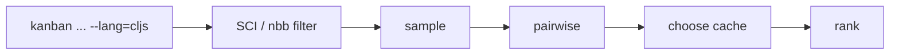

# Human and agent experience (quick recipes)

* **Quick start:**
  `pnpm kanban sample -f "status=Todo and priority>=2" -n 7 | pnpm kanban pairwise --session today --k 3`
* **Then:** record 3 choices with `pnpm kanban choose ...`, and:
  `pnpm kanban rank --session today --top 5`
* **Focus set via clusters:**
  `pnpm kanban cluster -f "status=Todo" --by labels --limit 6 | jq -r '.[0].tasks[]' | xargs -I{} pnpm kanban find {}`

---

# Mermaid (how these compose)

```mermaid
flowchart LR
  A[sample] -->|JSONL tasks| B[pairwise]
  B --> C[choose (session cache)]
  C --> D[rank]
  D -->|top-K| E{done?}
  E -- no --> B
  E -- yes --> F[shortlist ready]
  A --> G[explain]
  A --> H[cluster]
  A --> I[score]
```

---

If you want, I can generate these **exact files** under `packages/kanban/src` ready to drop in (no diffs, full files).

Short version: yes—letting folks write filters in tiny ClojureScript forms is a great fit. Use SCI (Small Clojure Interpreter) so you can safely eval CLJS in Node with an allowlist, no compile step, and first-class macros. You can do this two ways:

* **Easiest now:** shell out to **nbb** (which is just SCI packaged for Node scripting) when `--lang=cljs` is used. Fast startup, no build step, small artifact. Trade-off: it’s an interpreter, so heavy loops are slower and a few features (e.g. `deftype`) aren’t supported. ([GitHub][1])
* **Polish later:** embed **SCI** directly in your process or as a tiny shadow-cljs “node-library” bundle you import. SCI lets you whitelist symbols and JS libs, reuse an eval context across calls, and even fork contexts per session. ([GitHub][2])

# What this unlocks

* **Agent + human friendly:** plain s-exprs like `where (in status #{"Todo" "Doing"}) (>= priority 3) (has "agent" labels)`.
* **Zero compilation** for ad-hoc filters; you already use shadow-cljs, so graduating to a compiled node-library later is straightforward. $shadow-cljs.github.io[3]
* **Safety knobs:** allow/deny lists; only expose `clojure.core`, `clojure.string`, etc.; don’t expose `fs` unless explicitly requested; futures disabled by default. ([GitHub][2])

# Proposed UX

## CLI flags

* `--lang js|dsl|cljs` default `dsl` = your current mini-DSL
* `-F, --filter` string form **or** `--filter-file path.cljs`
* `--cljs-prelude path.cljs` optional macros/helpers
* Works on all new commands `sample`, `pairwise`, `rank`, etc.

## Examples

```bash
# same vibe, but CLJS:
pnpm kanban sample --lang cljs \
  -F '(where (in status #{"Todo" "Doing"}) (>= priority 3) (has "agent" labels))' -n 7

# full predicate:
pnpm kanban sample --lang cljs \
  -F '(fn [{:keys [status priority labels]}]
        (and (#{"Todo" "Doing"} status) (>= priority 3) (some #{"agent"} labels)))' -n 7

# from file (nice for quoting/macro use)
pnpm kanban sample --lang cljs --filter-file filters/todo_high.cljs -n 7
```

# Minimal CLJS prelude (you ship this)

```clojure
;; prelude.cljs
(ns kanban.prelude
  (:require [clojure.set :as set]
            [clojure.string :as str]))

(defmacro where
  "Sugar: (where (>= priority 3) (has \"agent\" labels))"
  [& clauses]
  `(fn [{:keys [status priority labels title] :as ~'t}]
     (and ~@clauses)))

(defn has [x coll] (some #{x} coll))
(defn in [x xs] (contains? (set xs) x))
```

*SCI supports macros; you can define them in the same file.* ([GitHub][1])

# Implementation plan

## Option A (now): call **nbb** as a subprocess

* Add `nbb` to the repo and call it when `--lang=cljs` is used.
* Pass tasks JSON on stdin and your filter code via `-e` or a temp `.cljs`.
* NBB evaluates via SCI; startup is quick and it can `require` npm libs if you allow it. ([GitHub][1])

Pseudo-TS inside your `packages/kanban`:

```ts
// runCljsFilter.ts
import { spawn } from "node:child_process";

export async function runCljsFilter(tasks: any[], code: string, preludePath?: string) {
  const expr = preludePath
    ? `(do (load-file "{preludePath}") (let [tasks (js/JSON.parse (slurp *in*))]
           (->> tasks (map #(js->clj % :keywordize-keys true))
                (filter {code})
                (map clj->js))))`
    : `(let [tasks (js/JSON.parse (slurp *in*))]
         (->> tasks (map #(js->clj % :keywordize-keys true))
              (filter {code})
              (map clj->js)))`;

  return new Promise<any[]>((resolve, reject) => {
    const p = spawn("node", ["node_modules/.bin/nbb", "-e", expr], { stdio: ["pipe", "pipe", "inherit"] });
    let out = "";
    p.stdout.on("data", (d) => (out += d));
    p.on("exit", (code) => (code === 0 ? resolve(JSON.parse(out)) : reject(new Error(`nbb exit {code}`))));
    p.stdin.write(JSON.stringify(tasks));
    p.stdin.end();
  });
}
```

**Why A first?** No bundling work, and you can iterate on the CLJS affordances immediately. NBB’s own README documents the SCI trade-offs and subset (e.g., no `deftype`), which are fine for filtering. ([GitHub][1])

## Option B (later): embed **SCI** directly

* Bundle SCI with shadow-cljs as a tiny “node-library” that exports `evalCljs(code, opts)`.
* In Node, create one SCI context at process start; **reuse/fork** it per `--session` to avoid re-parsing macros and keep things fast. ([GitHub][2])
* **Allowlist** only the symbols you need (or use `:deny` to block) and expose zero JS libs by default `:js-libs {}`, turning them on per flag if ever needed. ([GitHub][2])

Key SCI hooks you’ll use:

* `sci/eval-string*` with a **context** (stateful, reusable), plus `sci/fork` for isolation. ([GitHub][2])
* `:allow` / `:deny` to restrict callable symbols. ([GitHub][2])
* `:js-libs` if you *explicitly* want to expose e.g. `fs` default = don’t. ([GitHub][2])

# Safety profile (recommended defaults)

* **No JS libs exposed** `:js-libs {}`; no file/network access in filters. ([GitHub][2])
* **Allowlist** only: `and`, `or`, `not`, `=`, `>=`, `<=`, `re-find`, `some`, `contains?`, `set`, `str/*` helpers, your `where`/`has`/`in`.
* **Futures disabled** (SCI disables them unless an addon is installed). ([GitHub][2])
* **Context reuse** + **fork per session** for speed and isolation. ([GitHub][2])

# Performance notes

* Interpreters trade runtime speed for instant startup; that’s fine for filtering + sampling small sets. (NBB docs & the Babashka book both set expectations.) If you ever need to filter tens of thousands repeatedly, move “hot” predicates into compiled TypeScript or a shadow-cljs compiled function. ([GitHub][1])

# How it plugs into your new commands



* `sample`: apply CLJS predicate before weighted reservoir.
* `pairwise`, `compare`, `cluster`: each accepts `--lang=cljs -F '...'` to define the pool.
* Coaching lines remain the same; add one more if CLJS is used:
  *AGENT: Filter was evaluated with a sandboxed CLJS predicate. To adjust, pass a new `--filter` form or `--filter-file`.*

---

If you want, I can draft the `runCljsFilter` helper + wire `--lang=cljs` into `sample` so you can try this on your board today.

[1]: https://github.com/babashka/nbb "GitHub - babashka/nbb: Scripting in Clojure on Node.js using SCI"
[2]: https://github.com/babashka/sci "GitHub - babashka/sci: Configurable Clojure/Script interpreter suitable for scripting and Clojure DSLs"
[3]: https://shadow-cljs.github.io/docs/UsersGuide.html?utm_source=chatgpt.com "Shadow CLJS User's Guide"

Awesome — let’s wire CLJS filters in cleanly and keep it optional. Below is a drop-in plan + code you can paste into `packages/kanban` today. We’ll start with **nbb** (SCI on Node; zero compile) and leave a path to an embedded SCI later.

> Why nbb? It’s a tiny CLJS-on-Node interpreter with **fast startup**, **first-class macros**, and **no build step** because it runs on **SCI**; perfect for ad-hoc filtering. ([GitHub][1])
> Why SCI later? It gives you an **allowlisted** interpreter embedded in your process fine-grained control, reusable contexts. ([GitHub][2])
> If you compile a CLJS helper, `:node-library` is the shadow-cljs target you’ll want for an importable Node bundle. $shadow-cljs.github.io[3]

---

# 1) Minimal UX (all new cmds support this)

```
# Inline CLJS predicate
pnpm kanban sample --lang cljs \
  --filter '(fn [{:keys [status priority labels]}]
               (and (#{"Todo" "Doing"} status)
                    (>= priority 3)
                    (some #{"agent"} labels)))' -n 7

# With a tiny prelude of macros/helpers:
pnpm kanban sample --lang cljs \
  --cljs-prelude filters/prelude.cljs \
  --filter '(where (in status #{"Todo" "Doing"})
                   (>= priority 3)
                   (has "agent" labels))'
```

`--lang js|dsl|cljs` (default your existing DSL).
`--filter` or `--filter-file` works the same across commands.

---

# 2) Add deps

```json
// packages/kanban/package.json (add)
{
  "dependencies": {
    "nbb": "^1.2.0"
  }
}
```

No build changes; we just spawn the local `nbb` binary (SCI under the hood). ([npm][4])

---

# 3) New files safe, idempotent, cache-friendly

```
packages/kanban/
  src/lib/prioritize/cljs.ts         # nbb runner (now), SCI embed (later)
  src/lib/prioritize/filter-lang.ts  # dispatch: dsl|js|cljs -> predicate
  filters/prelude.cljs               # optional macros/helpers (repo data)
```

### `filters/prelude.cljs` (ship with repo)

```clojure
(ns kanban.prelude
  (:require [clojure.set :as set]
            [clojure.string :as str]))

(defmacro where
  "Sugar: (where (>= priority 3) (has \"agent\" labels))"
  [& clauses]
  `(fn [{:keys [status priority labels title] :as ~'t}]
     (and ~@clauses)))

(defn has [x coll] (some #{x} coll))
(defn in [x xs] (contains? (set xs) x))
(defn re? [pattern s] (boolean (re-find (re-pattern pattern) (or s ""))))
```

*Macros are supported in SCI/nbb; this keeps user filters tiny and expressive.* ([GitHub][1])

---

### `src/lib/prioritize/cljs.ts`

```ts
import { spawn } from "node:child_process";
import path from "node:path";
import { fileURLToPath } from "node:url";

type RunOpts = {
  code?: string;              // inline form
  file?: string;              // or a .cljs file path
  prelude?: string;           // optional prelude.cljs path
  cwd?: string;
  env?: Record<string, string>;
};

/**
 * Evaluate a CLJS predicate over tasks using nbb (SCI).
 * Returns the filtered tasks. No filesystem/network access is provided by us;
 * this runs in a short-lived child process.
 */
export async function runCljsFilter(tasks: unknown[], opts: RunOpts): Promise<unknown[]> {
  const bin = process.platform === "win32" ? "nbb.cmd" : "nbb";
  const localBinDir = path.join(process.cwd(), "node_modules", ".bin");
  const PATH = `{localBinDir}{path.delimiter}{process.env.PATH ?? ""}`;

  // Build an nbb expression that:
  // - loads prelude (optional)
  // - reads JSON from stdin
  // - converts to CLJS maps
  // - applies user predicate
  // - prints JSON array to stdout
  const loadPrelude = opts.prelude ? `(load-file "{opts.prelude.replace(/\\/g, "/")}")` : "";
  const predicateSrc = opts.code
    ? opts.code
    : opts.file
      ? `(do (load-file "{opts.file.replace(/\\/g, "/")}") filter)` // expect file to provide `filter`
      : "(fn [_] true)";

  const expr = `(do
    {loadPrelude}
    (require '[clojure.edn :as edn] '[cljs.core :as core])
    (let [input (js/JSON.parse (slurp *in*))
          tasks (map #(js->clj % :keywordize-keys true) input)
          pred  {predicateSrc}
          out   (->> tasks (filter pred) (map clj->js) (into-array))]
      (println (js/JSON.stringify out))) )`;

  return new Promise((resolve, reject) => {
    const child = spawn(bin, ["-e", expr], {
      cwd: opts.cwd ?? process.cwd(),
      stdio: ["pipe", "pipe", "pipe"],
      env: { ...process.env, ...opts.env, PATH },
    });

    let out = "";
    let err = "";
    child.stdout.on("data", d => (out += d));
    child.stderr.on("data", d => (err += d));
    child.on("error", reject);
    child.on("close", (code) => {
      if (code === 0) {
        try { resolve(JSON.parse(out)); }
        catch (e) { reject(new Error(`nbb JSON parse failed: {(e as Error).message}\nSTDERR:\n{err}`)); }
      } else {
        reject(new Error(`nbb exited {code}\n{err}`));
      }
    });

    child.stdin.write(JSON.stringify(tasks));
    child.stdin.end();
  });
}
```

> Notes: This doesn’t “hard sandbox” everything — nbb allows JS interop — but it is short-lived and only receives your task JSON on stdin. For stricter allowlists, embed SCI directly later allow/deny namespaces, reusable contexts. ([GitHub][2])

---

### `src/lib/prioritize/filter-lang.ts`

```ts
import { runCljsFilter } from "./cljs";
import type { Task } from "./types";
import { parseFilter as parseDSL } from "./filters"; // your existing tiny DSL

export type FilterOpts = {
  lang?: "dsl" | "js" | "cljs";
  filter?: string;
  filterFile?: string;
  cljsPrelude?: string;
};

export async function applyFilter(tasks: Task[], opts: FilterOpts): Promise<Task[]> {
  const lang = opts.lang ?? "dsl";

  if (lang === "cljs") {
    const out = await runCljsFilter(tasks, {
      code: opts.filter,
      file: opts.filterFile,
      prelude: opts.cljsPrelude,
    });
    return out as Task[];
  }

  if (lang === "js") {
    // Treat --filter as a JS predicate body: `(t) => t.priority >= 3`
    const fn = opts.filter
      ? (0, eval)(opts.filter) // safe-ish if you trust the caller; else ship a JS expr parser.
      : () => true;
    return tasks.filter(fn);
  }

  // default DSL
  const pred = parseDSL(opts.filter);
  return tasks.filter(pred);
}
```

---

# 4) Wire into one command (sample) to prove it works

```ts
// packages/kanban/src/cmds/prioritize/sample.ts
import { applyFilter } from "../../lib/prioritize/filter-lang";
import { readTasksJSONL, writeJSONL, coach } from "../../lib/prioritize/io";
import { weightedReservoir } from "../../lib/prioritize/sample";
import { RNG } from "../../lib/prioritize/rng";

export default async function cmd(argv: any) {
  const { filter: f, filterFile, lang, cljsPrelude, n=7, seed=42, format="jsonl" } = argv;
  const tasks = await readTasksJSONL(argv);
  const pool = await applyFilter(tasks, { lang, filter: f, filterFile, cljsPrelude });
  const rng = new RNG(seed);
  const weight = (t:any)=> 1 + (t.priority ?? 0);
  const picked = weightedReservoir(pool, n, weight, rng);
  await writeJSONL(picked, { format });
  coach("AGENT: Filtered with CLJS/DSL. Next: `kanban pairwise --session <name>` to compare two at a time.", argv);
}
```

CLI help snippet to add:

```
--lang js|dsl|cljs
--filter "<expr or CLJS form>"
--filter-file path.cljs
--cljs-prelude filters/prelude.cljs
```

---

# 5) Quick AVA test (tiny)

```ts
// packages/kanban/test/cljs-filter.spec.ts
import test from "ava";
import { runCljsFilter } from "../src/lib/prioritize/cljs";

const tasks = [
  { uuid: "1", status: "Todo", priority: 3, labels: ["agent"] },
  { uuid: "2", status: "Done", priority: 5, labels: ["infra"] }
];

test("filters with inline CLJS", async t => {
  const out = await runCljsFilter(tasks, {
    code: `(fn [{:keys [status priority labels]}]
             (and (#{"Todo"} status) (>= priority 3) (some #{"agent"} labels)))`
  });
  t.is((out as any[]).length, 1);
  t.is((out as any[])[0].uuid, "1");
});
```

---

# 6) Later: embedded SCI for stricter sandbox + speed

When you outgrow a subprocess, bundle a tiny CLJS “node-library” that exports an `eval-filter` function. Inside that bundle, configure SCI with **allowlists** and reuse a **context** (fork per session). This gives you: faster repeated evals, no child processes, and strict symbol control. ([GitHub][2])

Shadow-cljs docs for `:node-library` (export stable symbols): add `^:export` metadata for anything you need to call from Node. $shadow-cljs.github.io[3]

---

# 7) Tiny safety notes

* nbb is convenient but **not a true security boundary**; treat `--lang=cljs` as “trusted operator input”. For untrusted input, switch to embedded SCI with a deny/allow config. ([GitHub][2])
* Keep the CLJS filter **pure** no I/O, which aligns with agent determinism and makes results cacheable.

---

# 8) One more ergonomic example

```
# Ship a reusable filter file that defines (def filter …)
cat > filters/todo_high.cljs <<'EOF'
(ns filters.todo-high
  (:require [kanban.prelude :refer [has in where]]))
(def filter
  (where (in status #{"Todo" "Doing"})
         (>= priority 3)
         (has "agent" labels)))
EOF

pnpm kanban sample --lang cljs \
  --cljs-prelude filters/prelude.cljs \
  --filter-file filters/todo_high.cljs -n 7
```

---

## Mental model

```mermaid
flowchart LR
  A[CLI --lang=cljs] --> B[runCljsFilter (nbb/Sci)]
  B --> C[filtered tasks]
  C --> D[sample/pairwise/rank...]
```

If you want, I can also wire these flags into `pairwise`, `compare`, and `cluster` next so the whole prioritize loop speaks CLJS filters end-to-end.

[1]: https://github.com/babashka/nbb?utm_source=chatgpt.com "babashka/nbb: Scripting in Clojure on Node.js using SCI"
[2]: https://github.com/babashka/sci?utm_source=chatgpt.com "babashka/sci: Configurable Clojure/Script interpreter ..."
[3]: https://shadow-cljs.github.io/docs/UsersGuide.html?utm_source=chatgpt.com "Shadow CLJS User's Guide"
[4]: https://www.npmjs.com/package/nbb/v/0.3.4?utm_source=chatgpt.com "nbb"
<!-- GENERATED-SECTIONS:DO-NOT-EDIT-BELOW -->
## Related content
- _None_
## Sources
- _None_
<!-- GENERATED-SECTIONS:DO-NOT-EDIT-ABOVE -->


